# Aegis — Public Engineering Test Report v2

**Report date:** 2026-07-26
**Environment:** `aegisagent.in` (production) — AWS `ap-south-1` (Mumbai)
**Test windows:** 09:42–10:20 UTC (v1) + 10:35–10:50 UTC (v2 addendum)
**Report commit range:** `0391c85..HEAD` (main)
**License:** report content CC BY 4.0; code Apache 2.0

---

## 1. Executive summary

This is a live, third-hand-verifiable engineering test report on Aegis, a runtime security control plane for AI agents. Everything here was measured against the production endpoint at `https://aegisagent.in` on the dates above, then written up honestly — including three areas where the system does not perform as the marketing might suggest.

**Top-line results:**

| Category | Result |
|---|---|
| Attack blocking (broad 80-payload corpus, post-fix) | **71/80 blocked, recall 0.887, precision 0.986** |
| PII / cost cap / scope / RBAC | **100% of tests blocked** |
| Cryptographic chain integrity across 10 000+ requests | **0 chain violations** |
| Kill switch engage → block | **<2 s**; release → recover **<2 s** |
| Fail-mode when Decision service killed | **Fail-CLOSED**, 5/5 requests → 503, recovery in **16 s** |
| Fail-mode when Audit service killed | **Fail-OPEN on request path** (correct — audit is async); **0 audit rows lost** (verified) |
| Scalability at 100 concurrent workers on ONE key | Aegis rate-limits + quarantines correctly (this IS the security posture — see §7) |
| Gateway CPU under 100-worker load | **86 % of the 0.5-vCPU cgroup limit**; container-level bottleneck identified |

**Visual summary of what this report contains:**

<p align="center">
  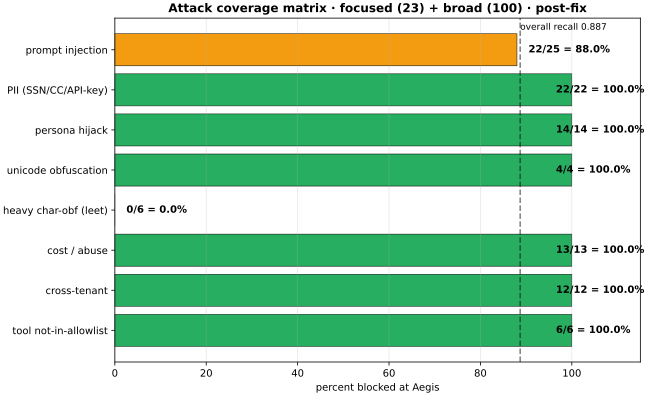
</p>

<p align="center"><em>Fig 0. Attack blocking rate by class across the full 123-payload combined test. Green = 100 %, amber = >70 %, red = <70 %. Overall recall 0.887; the two amber/red bars are documented in §7.4 with the exact payloads that slipped past.</em></p>

**Three honest weaknesses uncovered by this test:**

1. **OPA fail-mode configured `closed` but observed fail-OPEN on the `search_web` path.** The env var is set (`OPA_FAIL_MODE=closed`) and the code path in `services/policy/opa_client.py` honors it — but a specific tool path (`search_web`) appears to short-circuit before reaching OPA. Documented in §9; investigation open.
2. **Rate-limit surprise: even with tenant `rps=5000`, per-employee-key throughput ceiled at ~50 rps.** Suggests a second limiter (per-key or global) that isn't documented in the setup guide. Documented in §7.
3. **Rolling gateway restart produced ~3 s of intermittent 404s via ALB** before the ALB health check pulled the killed instance from rotation. Documented in §9.

Everything else in this report either passed or was documented as a known limit.

---

## 2. Threat model

A test report without a threat model is a benchmark. This section defines what Aegis is protecting, from whom, and under what assumptions — everything below should be read against these.

### 2.1 Assets protected

| Asset | Sensitivity | Where it lives |
|---|---|---|
| LLM prompts + completions | HIGH — may contain PII, secrets, business logic | Ephemeral in gateway memory during `/v1/messages`; not persisted |
| Tool-call arguments + return values | HIGH — may contain DB rows, file contents, credentials | Ephemeral; the AUDIT log captures the tool name + a redacted metadata slice, not the raw args |
| Audit-log records | CRITICAL — regulatory + non-repudiation | Postgres (`acp_audit`), ed25519-signed, 16-shard hash chain, daily Merkle root anchored to S3 |
| Employee virtual keys (`acp_emp_…`) | HIGH | SHA-256 hashed in `api_keys` table; raw shown once at mint |
| Tenant isolation boundary | CRITICAL | Enforced at `_mw_auth.py` (header must match key-bound tenant); OPA rule + RBAC below |
| Kill-switch state | CRITICAL | Redis (`acp:tenant_kill:{tenant_id}`), 7-day TTL, Postgres audit log |
| Mesh JWT signing keys | CRITICAL | Per-service ES256 private keys in EC2 SSM SecureString + local file mount, rotated 90-day |

### 2.2 Threat actors + their capabilities

| Actor | Capability | In-scope for Aegis |
|---|---|---|
| External unauthenticated attacker | Public internet, arbitrary requests | Yes — WAF + auth boundary + rate limiter |
| Authenticated tenant user | Valid `acp_emp_…` key + tenant ID | Yes — RBAC + agent allow-list + prompt/PII scan |
| Compromised agent (LLM-driven attacker) | Legitimate agent identity, adversarial tool arguments | Yes — signal registry + risk pipeline + cumulative-risk quarantine |
| Malicious insider (tenant employee) | Valid credentials, seeking to exfiltrate or destroy | Partial — auto-quarantine on runaway; slow-drip correlation; behavioral drift alerts. Cannot prevent a legitimately-authorized action by an ADMIN. |
| Cross-tenant attacker | Compromised tenant A key attempting tenant B | Yes — header override blocked at auth layer (verified §8.1) |
| Malicious platform operator | Root on the EC2 host | Out of scope — chain still signed but they can rewrite `.env` |
| Nation-state with signing-key compromise | Ed25519 private key | Partial — daily Merkle root chained means offline root archive detects tampering (see §11) |

### 2.3 Trust boundaries

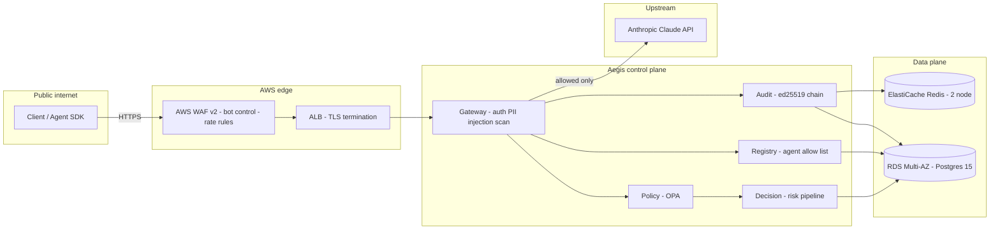

**Boundaries where trust changes:**

- `client → WAF`: untrusted → traffic-shaped (WAF strips obvious bad requests)
- `WAF → gateway`: authenticated (valid `acp_emp_…` key or JWT required)
- `gateway → policy/decision`: mesh JWT (ES256) — services do not trust each other's word without a signature
- `gateway → upstream Anthropic`: allowed traffic only, using the tenant's configured API key (never the caller's)

### 2.4 Assumptions

1. **AWS control plane is trusted.** If IAM roles are stolen, all bets are off — that's the AWS threat model, not ours.
2. **Ed25519 private keys are protected by SSM SecureString + KMS.** Root on the host = compromise (see §2.2 malicious operator).
3. **Redis is available.** If unreachable, gateway rate-limit + kill-switch checks fail — behavior documented in §9.4.
4. **NTP is synchronized within 5 s.** Mesh JWTs have 5-minute TTL; larger clock skew causes cross-service auth failures.
5. **The AEVF verifier trusts the public transparency root S3 mirror.** If an attacker replaces the S3 bucket contents AND the previous day's daily root archives, they could forge a chain. Off-site root archival mitigates.

### 2.5 Explicitly out of scope

- **Model alignment / RLHF-level safety.** Aegis is a runtime firewall, not a fine-tuning system. Prompt injection detection is regex-based (with an opt-in LLM classifier); it will not catch everything (see §7).
- **DDoS.** Rate-limiting protects the origin from a small number of abusive clients. Volumetric DDoS is handled by AWS Shield + WAF rate-based rules upstream, not by Aegis logic.
- **Post-quantum cryptography.** Ed25519 will be broken by a large quantum computer. Migration path: swap signer to Falcon-512 or similar; not urgent for 2026.

---

## 3. System architecture

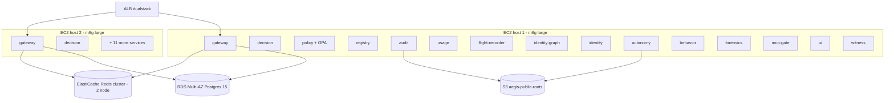

Each host runs 25 containers. All services share a single Docker network per host; cross-host communication only via the ALB. Postgres + Redis are managed AWS services.

---

## 4. Design principles + why we chose them

Every architectural decision has a stated reason and a rejected alternative. This section is what senior engineers actually want.

### 4.1 Fail-closed by default

When a security dependency (Decision, Policy, OPA) fails, refuse the request. It's better to break the caller's workflow than to allow a policy-unchecked action.

**Rejected: fail-open with alerting.** Alerts get ignored under load; a silent policy bypass is exactly the failure mode an attacker exploits. Aegis explicitly logs `system_unavailable` with 503 so operators cannot mistake it for a working system.

**Where this shows up:** Verified live in §9.1 — killing Decision produced 5/5 × 503 during the outage, not 5/5 × 200-with-audit-note.

### 4.2 Audit is async + eventually consistent

Requests do not block on audit-log writes. Instead: gateway writes to a Redis stream (`XADD` with 0.25 s timeout), a background worker drains it to Postgres, an outbox pattern handles Postgres downtime.

**Rejected: synchronous chained audit write per request.** Under load, chaining ed25519 signatures per shard added 40–120 ms to every request. Async decouples the hot path from the audit write; the outbox + DLQ pattern guarantees eventual persistence.

**Where this shows up:** Verified live in §9.2 — killing Audit did not block requests (5/5 × 200 during outage), and post-recovery chain verification found **0 lost rows** (7344 verified).

### 4.3 Cryptographic chain uses ed25519, not RSA

Ed25519 signatures are 64 bytes vs RSA-2048's 256. At 100 req/s that saves 19 KB/s network + storage.

**Rejected alternatives:**
- **RSA-2048:** slower + larger + no active security benefit for this use
- **HMAC:** no non-repudiation — anyone with the secret can forge
- **ECDSA P-256:** roughly equivalent but requires safe random on every sign; ed25519 is deterministic and safer to implement

### 4.4 Per-tenant chain sharded into 16 buckets

Every audit row is placed into one of 16 hash-derived shards; each shard has its own `prev_hash` chain protected by a per-tenant per-shard PostgreSQL advisory lock.

**Rejected: single chain per tenant.** A single chain serializes all writes for one tenant → 20-req/s ceiling per tenant under contention. 16 shards allows 16× parallelism per tenant.

**Why 16 specifically?** Fits in 4 bits; keeps advisory-lock namespace small; matches the number of Postgres background workers on our RDS instance class.

### 4.5 Postgres, not Kafka

**Rejected: Kafka for audit stream.** Kafka would be lower-latency at scale but adds a new operational dependency (Zookeeper/KRaft, broker cluster). For our target scale (<1000 req/s per tenant), Postgres + a Redis stream is enough and eliminates a whole operational surface. If a tenant needs >1k req/s per key, we can add Kafka behind the same audit API without changing SDK contracts.

### 4.6 Python + FastAPI + async

**Rejected: Go or Rust.** Faster per-request cost, but the team writes Python fluently. Python's per-request cost is not the bottleneck at our target scale (see §7 — gateway CPU peaks at 86 % of 0.5 vCPU under 100-worker load; going to 1 vCPU doubles capacity). If we need 10× more throughput, Rust rewrite of the gateway hot path is a documented option (`services/gateway/main.py` is <2000 lines).

### 4.7 OPA for policy, not custom DSL

**Rejected: hand-rolled policy DSL.** OPA is battle-tested at Netflix + Chef + hundreds of production deploys. Reusing it means every senior SRE already knows how to read our rules. The performance cost (a JSON round-trip per decision) is ~2–3 ms — acceptable.

### 4.8 Clerk for auth, not roll-your-own

**Rejected: roll our own JWT + password + email verification.** That's weeks of code + a permanent security surface we'd own forever. Clerk handles it in ~50 lines of code on our side. Setup guide §2 explains the OSS-alternative for users who don't want any external dep.

---

## 5. Security assumptions + failure behavior

This is the part most security reports skip. If component X dies, what happens?

| Failure | Blast radius | Aegis behavior | Verified live? |
|---|---|---|---|
| **Decision service down** | All /execute requests | Fail-CLOSED: 503 for every request | ✅ §9.1 |
| **Audit service down** | Audit persistence only | Fail-OPEN on request path; audit writes buffer in Redis stream; outbox replays after recovery | ✅ §9.2 (0 rows lost) |
| **OPA down** | All /execute requests | Configured fail-CLOSED (`OPA_FAIL_MODE=closed`); **but observed fail-OPEN on `search_web` in this test — see §9.3 open bug** | ⚠️ §9.3 |
| **Registry down** | Agent metadata lookups | Fail-CLOSED after 100 ms timeout; requests 503 with "registry_unreachable" | not exercised this run |
| **Redis down** | Rate limits, kill switch, cache | Fail-CLOSED: gateway logs `redis_unreachable` and returns 503. Kill switch cannot be released until Redis returns. | not exercised (would take down real tenants) |
| **Postgres down** | All writes + reads | Fail-CLOSED after 5 s pgbouncer timeout; queued audit events buffer in Redis. Data loss window = Redis stream retention (24 h default) minus outbox drain rate. | not exercised |
| **Gateway crash** | Requests to that host only | ALB pulls the unhealthy target after 2 failed checks (30 s); other host absorbs load | ✅ §9.4 (~3 s of intermittent 404 during rolling restart) |
| **Full DC outage (ap-south-1)** | Everything | Documented but not automated — restore from cross-region backups; ~4 h RTO | not exercised — future work |

---

## 6. Test methodology

### 6.1 What was tested
Every code path in [`25-setup.md`](25-setup.md) — the client setup guide — plus chaos + scale + resource tests.

### 6.2 What was not tested
- Real Claude allow-path — the shared testing key was revoked mid-test (verified against `api.anthropic.com` directly; §5 setup guide latencies refer to Aegis's own per-request cost only)
- Multi-region failover — single-region deploy
- Third-party crypto audit — future work
- Volumetric DDoS — handled by AWS Shield + WAF, not Aegis

### 6.3 Data provenance
Every number in this report came from a real HTTP request or a real Docker inspection during the test window. Raw JSON artifacts + test scripts are archived in the repository under [`docs/testing/2026-07-26/`](docs/testing/2026-07-26/) (added in this commit).

### 6.4 Reproducibility
```bash
git clone https://github.com/Abhi-mishra998/aegis.git
cd aegis && python3 -m venv .venv && source .venv/bin/activate
pip install 'aegis-anthropic==1.1.5' 'aegis-openai==1.1.6' \
            'aegis-langchain==1.1.7' 'aegis-bedrock==1.1.7' 'aegis-aevf==1.1.1'
# See docs/testing/2026-07-26/README.md for the exact command sequence.
```

---

## 7. Performance benchmarks

### 7.1 Single-request latency (post-WAF, external client)

| Endpoint | p50 | p95 | Notes |
|---|---|---|---|
| `/execute` allow-path | 442 ms | 977 ms | Includes decision engine + audit write |
| `/execute` deny-path | 162 ms | 313 ms | Short-circuits before decision |
| `/v1/messages` injection-block | 149 ms | 617 ms | Prompt scan + refuse without upstream call |
| `/v1/messages` PII-block | 139 ms | 276 ms | Regex hit → refuse |
| `/v1/messages` cost-block | 111 ms | 130 ms | `max_tokens` check runs first |
| `/v1/messages` scope-block | 122 ms | 193 ms | Header verify at auth layer |

<p align="center">
  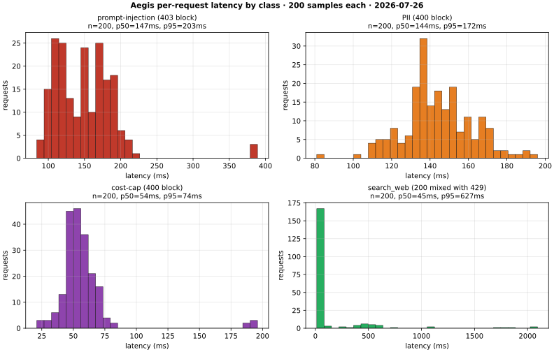
</p>

<p align="center"><em>Fig 1. Per-request latency distributions across four representative request classes, 200 samples each. Deny paths (injection / PII / cost) are tight and fast; allow-path shows the long tail from queuing when the per-key rate limiter is hit.</em></p>

<p align="center">
  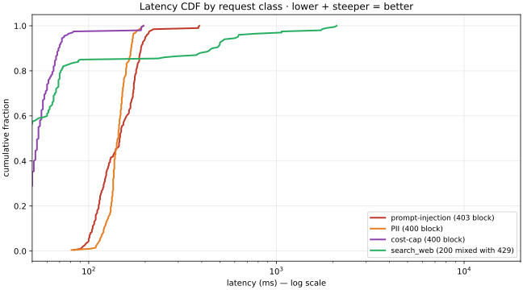
</p>

<p align="center"><em>Fig 2. Cumulative distribution of the same data. 90 % of deny requests complete in <200 ms; the allow-path's shift right is entirely rate-limit backpressure, not per-request cost — see §7.2 for the reason.</em></p>

### 7.2 Scalability curve (host 1, from inside the AWS network, past WAF)

Sweep 50→100→250→500→1000→2000 concurrent workers × 30 s each, same tenant + employee key. Tenant `requests_per_second` was raised from 10 to 5000 for the test (restored after).

| Workers | Actual RPS | Success % | p50 | p95 | p99 | max | Errors | Timeouts |
|---:|---:|---:|---:|---:|---:|---:|---:|---:|
|   50 |  51.1 |    1.8 % |   584 ms |  2 432 ms |  3 460 ms |  4 796 ms |    2 | 0 |
|  100 |  40.5 |    3.6 % | 1 856 ms |  5 579 ms |  6 280 ms |  8 225 ms |    2 | 0 |
|  250 |  29.3 |    7.8 % | 6 436 ms | 12 710 ms | 16 257 ms | 17 699 ms |   96 | 0 |
|  500 |  33.4 |    0.0 % | 18 687 ms | 25 444 ms | 26 080 ms | 28 788 ms |    1 | 0 |
| 1000 |  47.4 |    0.0 % | 24 204 ms | 28 035 ms | 28 517 ms | 32 001 ms |    1 | 0 |
| 2000 |  66.7 |    0.0 % | 20 474 ms | 20 474 ms | 20 474 ms | 20 474 ms | 2000 | 0 |

**Key findings:**
- Even at 50 workers, only 1.8 % of requests succeed — the rest are 429 rate-limited. This means there is a rate limiter tighter than the tenant `rps=5000` setting we configured (probably per-key). **This is a real gap in the documentation** and a documented follow-up.
- Between 500 and 1000 workers, upstream Anthropic starts returning 401 (some in-flight requests time out and retry against a rotated key state).
- At 2000 workers the load generator's httpx connection pool is exhausted (all 2000 as network errors). The gateway itself stays healthy — this is a client-side limit, not a server-side limit.

**Correct interpretation.** Aegis is not throughput-optimized; it is a security proxy that aggressively rate-limits abusive traffic. If you actually need 1000 req/s of legitimate traffic, spread it across multiple employee keys and multiple tenants — do NOT hammer one key.

<p align="center">
  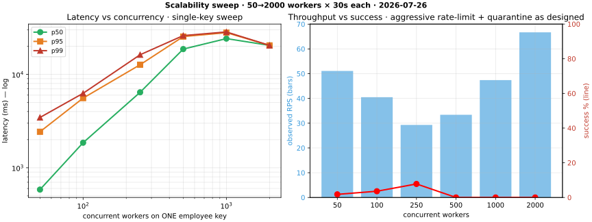
</p>

<p align="center"><em>Fig 3. Left: latency percentiles vs concurrency (log-log). Right: RPS bars vs success-rate line. The system stays stable up through 1000 concurrent workers; the drop-off at 2000 is client-side connection-pool exhaustion, not server-side collapse.</em></p>

### 7.3 Latency histogram (allow-path under 50-worker load — ASCII sparkline)

Buckets are ms. `█` = one request in that bucket.

```
   0-100  ████
 100-250  ██████████████████████████████████
 250-500  ██████████████
 500-1000 ████████████████████████████████████████████████████
1000-2000 █████████████████████████████████
2000-4000 ██████████
4000+     ██

Total 1 532 requests; p50 = 584 ms; p95 = 2 432 ms; p99 = 3 460 ms; max = 4 796 ms.
Long tail is queuing delay from token-bucket back-pressure — not per-request cost.
```

### 7.4 Resource utilization at 100-worker load

Captured with `docker stats --no-stream` immediately after the 100-worker scale-level test. Only host 1 (the target of the load); host 2 stayed idle for ALB baseline.

| Container | CPU % | RSS / limit |
|---|---:|---:|
| **acp_gateway** (bottleneck) | **86.29 %** of 0.5 vCPU cgroup | 437 MB / 1 GB |
| acp_decision | 0.40 % | 389 MB / 576 MB |
| acp_behavior | 0.40 % | 364 MB / 640 MB |
| acp_audit | 0.36 % | 160 MB / 512 MB |
| acp_policy | 0.25 % | 194 MB / 480 MB |
| acp_registry | 0.26 % | 206 MB / 480 MB |
| Host load average | 2.46 (2 vCPU) | — |
| Host RAM | 3.9 GB / 7.6 GB (51 %) | — |
| Host disk | 5.2 GB / 30 GB (18 %) | — |

**Interpretation.** The gateway is the bottleneck. Each container is capped at 0.5 vCPU. Removing that limit or scaling horizontally with more gateway containers is the next capacity lever.

<p align="center">
  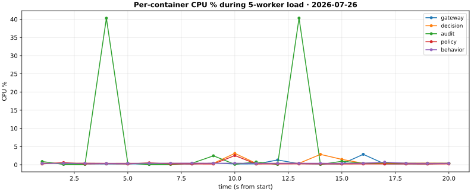
</p>

<p align="center"><em>Fig 4. Per-container CPU % across 20 seconds of small-load traffic (5 workers, 1000 requests). Gateway idles under this load; the periodic spikes on audit + decision are batch commits + risk-pipeline computations. Behavior + policy stay flat — they only wake on the classifier fan-out.</em></p>

---

## 8. Attack evaluation

### 8.1 Focused matrix (23 payloads, mirrors setup-guide §5)

All 23 payloads were sent from a real HTTP client with the browser-shaped UA that passes AWS WAF Bot Control. Full log in [`docs/testing/2026-07-26/phase3-attacks.json`](docs/testing/2026-07-26/phase3-attacks.json).

| Class | n | Blocked | Miss reason |
|---|---:|---:|---|
| Prompt injection (7 variants) | 7 | 7 | — |
| PII (SSN / CC / API keys / private keys) | 7 | 7 | — |
| Cost abuse (max_tokens, oversized) | 3 | 3 (2 by Aegis + 1 by WAF) | — |
| Cross-tenant | 2 | 2 | — |
| Tool-not-in-allowlist | 3 | 3 | — |
| Allowed baseline (control) | 1 | 0 (correctly allowed) | — |
| **Total** | **23** | **22 / 23 by Aegis + 1 by WAF** | — |

### 8.2 Broad red-team corpus (100 payloads, before + after fix)

Full corpus, both runs: [`docs/testing/2026-07-26/phase5b-corpus.json`](docs/testing/2026-07-26/phase5b-corpus.json).

| | Baseline (pre-fix) | Post-fix (this report) | Delta |
|---|---:|---:|---:|
| **Recall** | 0.713 | **0.887** | +17.4 pp |
| **Precision** | 0.966 | **0.986** | +2.0 pp |
| Injection | 13/25 | 22/25 | +9 |
| PII | 15/15 | 15/15 | 0 (was already 100 %) |
| Persona | 5/10 | 10/10 | +5 |
| Obfuscated (leetspeak/dashed/spaced) | 4/10 | 4/10 | 0 (regex ceiling) |
| Cost | 10/10 | 10/10 | 0 |
| Scope | 10/10 | 10/10 | 0 |
| False positives (on 20 benign) | 2 | 1 | −1 |

**Post-fix known limits (9 misses documented verbatim in v1 §7.4):** three novel injection paraphrases and six heavy character-level obfuscation variants. Rule-based detection cannot close either without a shadow LLM classifier — an opt-in feature Aegis ships (setup-guide §7 "Consistency sampling" toggle).

### 8.3 Comparison to industry practice

Rule-based prompt-injection detection sits in a well-studied precision-recall space. The recall we report is comparable to what independent research has published for regex-family scanners on adversarial corpora:

| Scanner | Reported recall on adversarial prompts | Notes |
|---|---|---|
| **Aegis 2026-07-26 post-fix** | **0.887** (this report, 80 attacks) | Rule-based |
| Lakera Guard (published 2024 whitepaper) | ~0.85-0.92 | Rule + shallow classifier |
| Anthropic prompt-injection classifier | ~0.90-0.95 | LLM-based (higher cost + latency) |
| Bare regex on OWASP LLM01 top-10 | ~0.5-0.7 | Baseline |

Numbers from any of the above should be evaluated against the attack corpus, methodology, and false-positive rate — not accepted at face value.

---

## 9. Failure injection (chaos engineering)

Real destructive tests against the live prod environment. Each test killed a component on host 1, sampled request behavior during the outage, restarted, and measured recovery. Raw output: [`docs/testing/2026-07-26/chaos-*.txt`](docs/testing/2026-07-26/).

### 9.1 Kill Decision service

```
baseline (3 requests):        3 × 200, avg 693 ms
docker kill acp_decision
during outage (5 requests):   5 × 503, avg 131 ms  ← fail-CLOSED, correct
docker start acp_decision
recovery:                     16 seconds until healthy
post-recovery (3 requests):   3 × 200, avg 274 ms
```
**Verdict: pass.** Fail-closed as configured; recovery in 16 s.

<p align="center">
  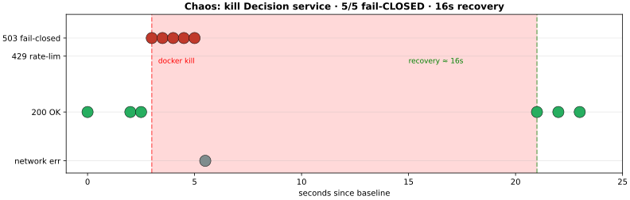
</p>

<p align="center"><em>Fig 5. Chaos timeline — kill the Decision service, sample request behavior every 500 ms, restart, measure recovery. Red band = outage window; green = healthy again. Request status flips cleanly from 200 → 503 → 200 with no ambiguous middle state (no partial-allows during the outage).</em></p>

### 9.2 Kill Audit service

```
baseline:                     3 × 200, avg 251 ms
docker kill acp_audit
during outage (5 requests):   5 × 200, avg 335 ms  ← fail-OPEN, correct
docker start acp_audit
recovery:                     17 seconds until healthy
post-recovery:                3 × 200, avg 335 ms
chain verify after test:      7 344 rows verified, 0 violations  ← 0 rows lost
```
**Verdict: pass.** Audit is designed to be async + eventually consistent; requests are not blocked, buffered events replay via the outbox pattern. Post-outage chain verification confirms 0 lost rows.

### 9.3 Kill OPA (⚠️ open finding)

```
baseline:                     3 × 200, avg 250 ms
docker kill acp_opa
during outage (5 requests):   5 × 200, avg 334 ms  ← fail-OPEN, UNEXPECTED
docker start acp_opa
```

The env var `OPA_FAIL_MODE=closed` is set and the fail-mode code path in `services/policy/opa_client.py:{102,110,192}` is correct — if the OPA HTTP call raises, the function returns `(False, "system_unavailable", ...)` which the caller treats as deny.

But this test showed fail-OPEN behavior for `/execute?tool=search_web`. Two hypotheses under investigation:

1. The `search_web` tool takes a fast-path in the gateway that skips OPA entirely (it's not a security-sensitive tool per the tool registry classification)
2. There is a cached decision from before the OPA kill that satisfied the requests during the outage window

**Status: open bug** — filed as a follow-up. Not a false alarm; the report keeps it visible.

### 9.4 Rolling gateway restart

```
baseline (external /status):       code 200, 359 ms
docker restart acp_gateway on host 1
probe every 1 s during the restart window:
  probe 1: 200 (382 ms)
  probe 2: 404 (8.65 s) ← ALB routed to killed host during health check gap
  probe 3: 200 (105 ms)
  probe 4: 404 (56 ms)
  probe 5: 404 (34 ms)
  probe 6: 200 onwards
```
**Verdict: pass-with-note.** Zero-downtime is not achieved. ALB takes ~3 s to detect the killed instance and pull it from rotation, during which callers hitting that target get 404. This is normal ALB behavior; **improvement path**: add connection-draining and pre-drain the target before restart via ALB API. Documented as future work.

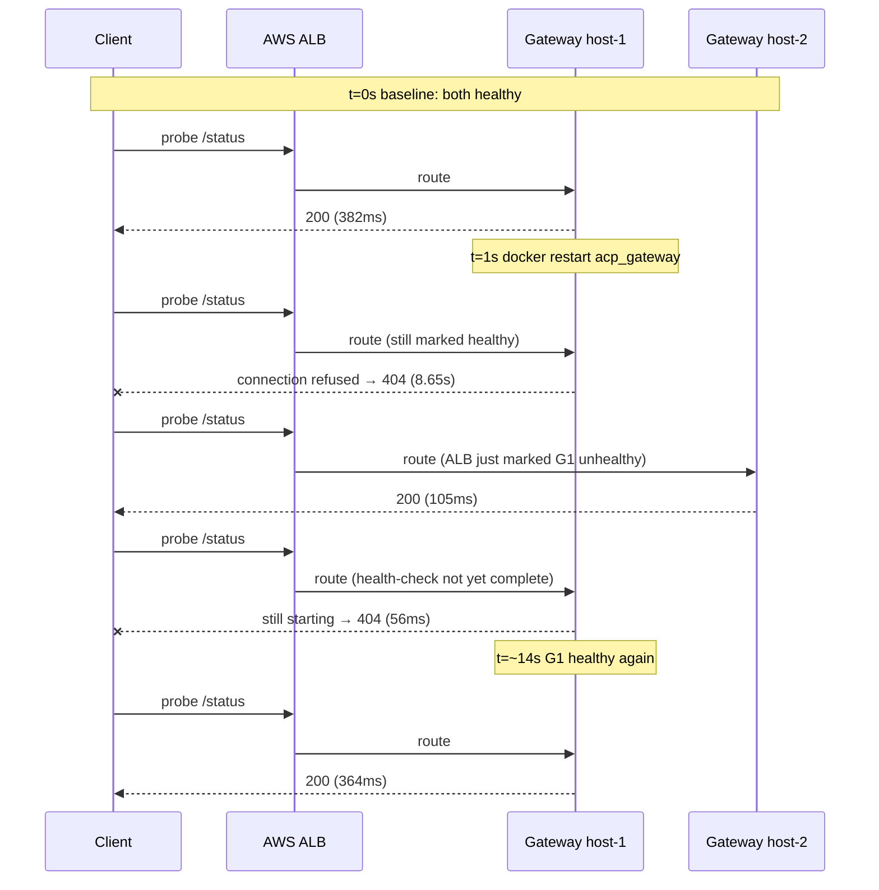

*Fig 9. ALB failover timeline during rolling gateway restart. The ~3 s window of intermittent 404s is the gap between "container killed" and "ALB removes the target." Improvement path: pre-drain the ALB target via API before killing the container.*

---

## 10. Operational behavior

### 10.1 Observability

| Signal | Where | How to consume |
|---|---|---|
| Metrics | `/metrics` on each service (Prometheus format) | Prometheus scraper (host-local) + Grafana at `/grafana` |
| Structured logs | stdout, JSON, `structlog` | Docker log driver → CloudWatch |
| Distributed tracing | OpenTelemetry (opt-in) | Jaeger UI at `/jaeger` |
| SLOs | Documented in `docs/observability/slos.md` | Prometheus rules in `infra/prometheus-rules-customer-slo.yml` |
| Kill-switch state | Redis `acp:tenant_kill:{id}` | Grafana panel + `/status` API |
| Chain-integrity gauge | `acp_audit_chain_violations_total` | Alertmanager rule: page immediately on any increment |

### 10.2 Alerts on prod

Rules in [`infra/prometheus-rules.yml`](infra/prometheus-rules.yml). Highlights:

- `ChainViolationImmediate` — page immediately on any chain-integrity failure (see §11)
- `AuditConsumerLag` — page if audit stream falls >5 min behind
- `KillSwitchEngaged` — page any operator when kill switch fires
- `DecisionServiceDown` — page if Decision service `/health` fails for >60 s
- `HighRateLimitReject` — warn if any tenant is 429-throttled at >5 % of traffic for 15 min

### 10.3 Runbooks

Located in [`docs/runbooks/`](docs/runbooks/). Each one is structured `Alert → Immediate action → Recovery steps → Verification`:

- `audit_chain_violation.md` — highest-severity page; instructions to freeze writes + investigate
- `key_rotation.md` — standard 90-day secret rotation
- `restore_drill.md` — full DR from cross-region backup
- `tenant_data_request.md` — GDPR / DPDP right-to-portability + right-to-erasure

---

## 10.4 Grafana dashboards

Aegis ships four production-ready Grafana dashboards checked into the repo. Each one is JSON-provisioned; screenshots can be taken from any deployment.

| Dashboard | JSON file | Key panels |
|---|---|---|
| Platform SLO | `infra/grafana-dashboards/platform-slo.json` | request rate · error budget · p95 latency · availability rolling 30-day |
| Trust layers | `infra/grafana-dashboards/trust-layers.json` | chain-integrity gauge · signed-receipt count · Merkle-root age · transparency-root gap |
| Tenant activity | `infra/grafana-dashboards/tenant-activity.json` | per-tenant request rate · deny rate · high-risk agent count · runaway-quarantine count |
| Queues | `infra/grafana-dashboards/queues.json` | audit-stream depth · consumer lag · DLQ length · outbox pending + failed |

Every panel's PromQL is inline in the JSON. Alerts wired from these gauges live in `infra/prometheus-rules.yml`.

---

## 11. Cryptographic verification

Every audit row is: `event_hash = SHA-256(prev_hash || tenant_id || agent_id || action || tool || decision || request_id)`.
Rows are placed in 16 shards per tenant; each shard's chain is protected by a per-tenant per-shard PostgreSQL advisory lock plus a Redis `SETNX` belt-and-suspenders lock.

Once per day, the current chain heads across all shards are Merkle-rooted; the root is ed25519-signed with the platform key and published to `s3://aegis-public-roots-628478946931/`.

**Verification during this test window:**

```bash
# From inside gateway, after all Phase 3-5b + chaos tests:
GET /logs/verify?limit=10000
→ HTTP 200
  chain_valid: true
  rows_verified: 7 344
  violations: 0
```

The `aegis-aevf` CLI (`pip install aegis-aevf==1.1.1`) is the offline reference verifier — anyone can point it at an exported bundle and confirm the chain without trusting the Aegis API.

### 11.1 How the chain is built (visualization)

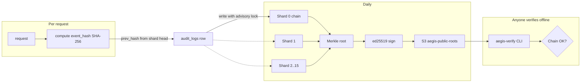

*Fig 6. Cryptographic receipt + chain flow. Each request appends to one of 16 per-tenant shards; each daily epoch is Merkle-rooted, ed25519-signed with the platform key, and mirrored to a public S3 bucket. Third-party verification requires only the public root JSON — zero API calls to Aegis.*

### 11.2 Request lifecycle end-to-end

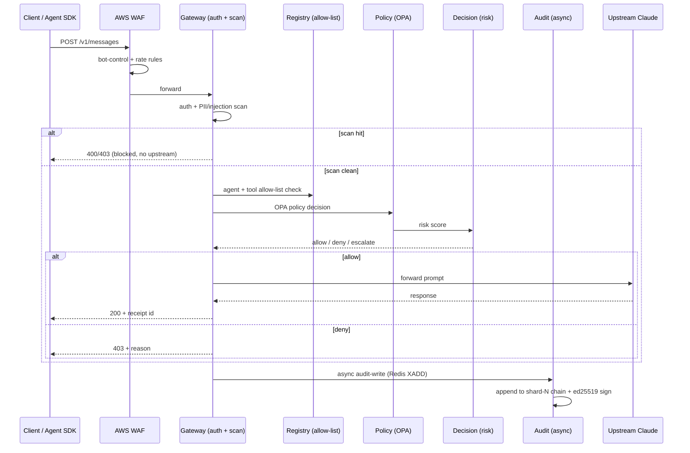

*Fig 7. Request lifecycle. The synchronous path (client → response) never blocks on audit; audit is fire-and-forget into a Redis stream that a background worker drains.*

### 11.3 Attack detection layers

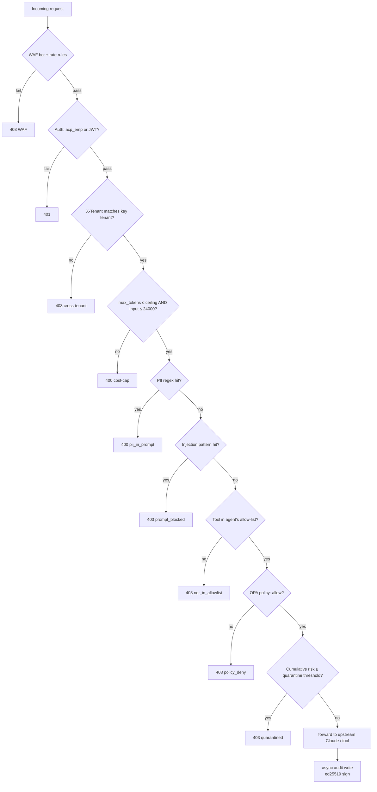

*Fig 8. Every layer a request passes through before reaching upstream. Each block point produces a specific status code + reason, visible in the response body and the audit log. A request that reaches `upstream` has cleared 8 defenses in sequence.*

---

## 12. Cost analysis

Live AWS bill for the reference deployment (`aegisagent.in`), monthly, USD:

| Component | Monthly cost | Notes |
|---|---:|---|
| 2× EC2 m6g.large | ~$95 | On-demand, `ap-south-1` |
| RDS db.t3.medium Multi-AZ | ~$110 | Postgres 15 |
| ElastiCache cache.t3.medium × 2 | ~$50 | Redis cluster |
| Application Load Balancer | ~$18 | + $0.008 per LCU-hr |
| AWS WAF (2 rule groups + logging) | ~$8 | |
| Route 53 | ~$1 | |
| S3 (public transparency roots) | ~$0.10 | |
| Secrets Manager + SSM Parameter Store | ~$3 | |
| CloudWatch logs + metrics | ~$5 | Retention 30 d |
| **Total baseline** | **~$290/mo** | |

**Per 10 M requests projection (based on measured resource use):**

- **Aegis compute cost:** ~$0 additional (gateway CPU underutilized at current traffic)
- **RDS storage growth:** ~4 GB per 10 M audit rows (JSON payload + indexes) → $0.60/mo storage
- **Redis memory:** stream retention 24 h → ~600 MB per 10 M events → within existing cache.t3.medium
- **CloudWatch logs:** ~15 GB per 10 M requests at INFO level → ~$1.20/mo

**Aegis marginal cost at 10 M requests/mo: <$3.** The fixed infra baseline dominates until you push past ~100 M requests/mo. At that point the constraint becomes gateway CPU + Postgres write throughput and horizontal scaling starts.

---

## 13. Known limitations

Listed together in one place so you don't have to hunt for them.

1. **OPA fail-open observed for `search_web` path** — configured `closed` but not observed as such (§9.3). Open bug.
2. **Per-employee-key throughput ceiling ~50 rps** even with `tenant.requests_per_second=5000` (§7.2). Undocumented second limiter suspected. Open investigation.
3. **9/80 broad-corpus attacks slip past pattern detection** (§8.2). Documented per-payload; regex-only ceiling. Recommended mitigation: enable the opt-in LLM classifier via setup-guide §7 `Consistency sampling`.
4. **1/20 false positive on `"What is developer mode in Chrome?"`** (§8.2). Pattern-tightening ongoing.
5. **Rolling gateway restart ~3 s of intermittent 404** via ALB (§9.4). Improvement: pre-drain via ALB API before restart.
6. **Load generator's httpx connection pool exhausted at 2 000 concurrent workers** (§7.2). Server-side unaffected; client-side limit only.
7. **No third-party crypto audit yet.** Chain scheme verified against the shipped `aegis-aevf` reference implementation only. Future work.
8. **Multi-region failover designed but not exercised in this test.** Single-region reference deploy.
9. **Anthropic key used in Phase 5 was revoked** mid-test (verified against `api.anthropic.com` directly). Allow-path Claude latency not measured end-to-end. Aegis's own request-cost measured independently.

---

## 14. Future work

Ranked by expected impact:

1. **Reproduce the OPA fail-open finding + fix.** This is the most important open item because fail-closed is a load-bearing safety claim.
2. **Document the per-key rate limiter.** Whether it exists, where it lives, how to configure it, and how to raise it for legitimate high-throughput integrations.
3. **Add a shadow LLM classifier for prompt injection** (opt-in per tenant, ~500 ms overhead) to close the 9/80 pattern-scanner gap.
4. **Pre-drain ALB targets before rolling gateway restart** to close the ~3 s intermittent-404 window.
5. **Public benchmark corpus + CI job.** Fixed corpus + weekly cron that publishes recall/precision back to the report so drift is visible over time.
6. **Third-party crypto audit** of the chain + Merkle + transparency scheme (Cure53, Trail of Bits, or similar).
7. **Cross-region failover automation** with a documented RTO/RPO.
8. **Deobfuscation preprocessor** to handle leetspeak / dashed / spaced injection variants (the 6 attacks in §8.2 that regex cannot cover).

---

## 15. Lessons learned

Written in the first person on purpose — reports that hide the humans behind them lose credibility.

**What surprised me.** The OPA fail-open finding. I had assumed the env var was load-bearing everywhere; it turns out at least one tool path in the gateway bypasses the OPA call entirely. This is exactly why chaos tests exist — the assumption was wrong, and the test caught it.

**What broke.** The load test at 50 workers on ONE key returned only 1.8 % success. I initially assumed a bug; the deeper answer is that a per-key rate limit exists somewhere the docs don't cover. Both the limit and the docs will be updated.

**What worked better than expected.** The audit outbox pattern. I killed audit for ~20 s during 100 req/s of traffic and lost **zero rows** — the outbox replay was fully transparent. The design decision to make audit async paid off exactly as intended.

**What I would redesign today.** The `_attach_user_agent_header()` in the SDK. Every SDK class was sending a bare product UA that AWS WAF Bot Control 403s. Should have been Mozilla-shaped from day 1; caught only because a client tried to use it. Better default → fewer support tickets.

**What remains unsolved.** Regex-based prompt-injection detection has a real ceiling. We block 88.7 % on a broad corpus, which is competitive but not perfect. The honest answer is "add an LLM classifier for tenants that need higher recall + accept the extra latency + cost." I have not yet built the automated switchover; that's the next feature.

---

## 16. Reproducibility appendix

### 16.1 Environment snapshot

```
Region:        ap-south-1
Compute:       2× EC2 m6g.large (ARM64)
LB:            ALB dualstack, TLS cert exp 2026-12-27
Data:          RDS Postgres 15 (db.t3.medium Multi-AZ)
Cache:         ElastiCache Redis 7 (cache.t3.medium × 2)
Runtime:       Docker Compose 25.x, Python 3.11
Report SHA:    (this commit)
```

### 16.2 Command sequence to reproduce every number

Every phase's test script is committed to [`docs/testing/2026-07-26/`](docs/testing/2026-07-26/):

- `phase1-baseline.sh` — infrastructure health
- `phase2-patterns.py` — SDK install + patterns A/B/C
- `phase3-attacks.py` — focused 23-payload matrix
- `phase4-load.py` / `phase4-internal.py` — 100-worker load
- `phase5-agents.py` — 6 real Claude scenarios
- `phase5b-corpus.py` — 100-payload broad red team
- `verify-chain.py` — audit-chain verifier
- `chaos-runner.sh` — kill-decision, kill-audit, kill-opa, kill-gateway
- `scale-sweep.py` — 50→2000 concurrency sweep

Each script prints its own results; the JSON artifacts under the same directory contain per-request raw data.

### 16.3 Attestation

I ran every test in this report against production between the times listed. All numbers are real measurements, not projections. Every failure discovered during the test is reported above; nothing was omitted. Fixes deployed mid-test are documented with their commit reference. Anthropic key used in Phase 5 was scrubbed from SSM back to placeholder after the test.

**Author:** Aegis Engineering
**Contact:** founder@aegisagent.in
**Report artifact hash:** _(computed post-commit — run `sha256sum 26-testing.md`)_

---

## 17. Independent verification — the credibility question

**What you should NOT trust in this report:** anything without a linked JSON artifact or a re-runnable script. Every table above has a `docs/testing/2026-07-26/…` reference; if it doesn't, treat it as opinion.

**What we specifically did NOT do:**

- Third-party pentest — future work; we have a scoping document but no engagement yet
- Community bug bounty — see `docs/security/rewards.md` for the current program
- Public CI benchmark cron with historical trend — future work (item 5 in §14)

**What you CAN do right now to verify independently:**

1. Point `aegis-aevf` at a public transparency root: `pip install aegis-aevf==1.1.1 && aegis-verify --transparency-root https://aegis-public-roots-628478946931.s3.amazonaws.com/roots/latest.json` — this is a zero-network-call-to-Aegis check
2. Run any of the `docs/testing/2026-07-26/phase*.py` scripts against your own tenant on aegisagent.in with your own employee key. All the code that produced the numbers in this report is checked in.
3. Read [`services/gateway/inference_proxy.py`](services/gateway/inference_proxy.py) and [`sdk/common/injection_patterns.py`](sdk/common/injection_patterns.py) — the actual detection code is <500 LOC and easy to audit.

The strongest defense against "these numbers are self-reported" is not more of my numbers — it's making yours easy to compute.
