<div align="center">

<!-- ANIMATED HEADER -->
<a href="https://github.com/Abhi-mishra998/aegis">
  
</a>

<!-- TYPING ANIMATION -->
<a href="https://github.com/Abhi-mishra998/aegis">
  
</a>

<br/>
<br/>

<!-- HERO ONE-LINER -->
<h3>
🛡️ A runtime firewall for AI agents that <strong>blocks</strong> dangerous actions before they run,
<br/>
and <strong>cryptographically proves</strong> what happened after.
</h3>

<br/>

<!-- FEATURED LINKS — high visibility for recruiters -->
<table>
<tr>
<td align="center" width="33%">
  <a href="https://drive.google.com/file/d/1Eojid76NcrRLC1Gp302i113pNgrH1hso/view">
    
    <br/>
    <sub><b>Kill switch · audit chain · blast-radius sim</b></sub>
  </a>
</td>
<td align="center" width="33%">
  <a href="https://projectsphere.hashnode.dev/i-built-a-runtime-firewall-for-ai-agents">
    
    <br/>
    <sub><b>Why ed25519 · OPA · Merkle log design</b></sub>
  </a>
</td>
<td align="center" width="33%">
  <a href="#-quick-start">
    
    <br/>
    <sub><b>Full stack in one command</b></sub>
  </a>
</td>
</tr>
</table>

<br/>

<!-- BADGES ROW 1 — Tech Stack -->
<p>
  
  
  
  
  
  
  
</p>

<!-- BADGES ROW 2 — Project Health -->
<p>
  
  
  
  
  
  
  
  <a href="https://github.com/Abhi-mishra998/aegis/actions/workflows/test.yml"></a>
</p>

<!-- CTA ROW -->
<p>
  <a href="#-quick-start"></a>
  <a href="https://drive.google.com/file/d/1Eojid76NcrRLC1Gp302i113pNgrH1hso/view"></a>
  <a href="https://projectsphere.hashnode.dev/i-built-a-runtime-firewall-for-ai-agents"></a>
  <a href="#%EF%B8%8F-architecture-at-a-glance"></a>
</p>

<br/>

<!-- STATS / VISITOR COUNTER -->
<p>
  
  
  
  
  
</p>

<!-- WAVE SEPARATOR -->


</div>

<br/>

## 📖 Table of Contents

<table>
<tr>
<td valign="top" width="50%">

**Story**
- [The 3am Question](#-the-3am-question)
- [What Aegis Is](#-what-aegis-is)
- [The Problem](#-the-problem-stated-plainly)
- [How Aegis Closes the Gap](#%EF%B8%8F-how-aegis-closes-the-gap)

**Engineering**
- [Architecture at a Glance](#%EF%B8%8F-architecture-at-a-glance)
- [Request Workflow](#-request-workflow)
- [10-Stage Request Pipeline](#-the-10-stage-request-pipeline)
- [Service Inventory](#-service-inventory)
- [Data Model](#-data-model)
- [Cryptographic Trust Chain](#-cryptographic-trust-chain)
- [SDK Integration](#-sdk-integration)

</td>
<td valign="top" width="50%">

**Platform in Action**
- [System Health & Observability](#-system-health--real-time-observability)
- [Security Operations](#-security-operations-center)
- [Audit Trail & Forensics](#-immutable-audit-trail--behavioral-forensics)
- [Identity Graph & Attack Simulation](#-agent-identity-graph--attack-simulation)
- [Policy & Access Control](#-policy--access-control)
- [Incident Response](#-incident-response--kill-switch)
- [Distributed Tracing](#-distributed-tracing-with-jaeger)

**Operations**
- [10-Layer Security Architecture](#%EF%B8%8F-10-layer-security-architecture)
- [Performance Numbers](#-performance--sla)
- [Quick Start](#-quick-start)
- [Demo Scenarios](#-three-demo-scenarios)
- [Watch the Demo](#-watch-the-demo)

</td>
</tr>
</table>

<br/>

---

## 🌙 The 3am Question

> *"My AI agent has production database access. What's stopping it from dropping a table?"*

A few months ago, that question didn't have a good answer at the place I worked. The agent had a service-account token, a long list of tool permissions, and no real boundary between **things it should do** and **things it could do**.

If it went wrong — prompt injection, a hallucinated tool call, a stolen token — the failure modes were real:

- It could read databases it shouldn't.
- It could send emails to anyone.
- It could delete infrastructure.
- The audit trail was a stack of plain-text JSON logs across six services that nobody had verified.

The harder question was the second one: **if something did go wrong, how would we know?** And how would we prove it to a regulator, an auditor, or a customer asking why their data was touched?

Existing security tools — IAM, WAFs, SIEMs, API gateways — were built for humans clicking buttons. None of them understood what it meant for an autonomous agent to call a tool.

**So I started building one.**

<br/>

---

## 🛡️ What Aegis Is

**Aegis is a runtime control plane for AI agents.** It sits between an agent and the systems it acts on — databases, APIs, Kubernetes clusters, internal tools — and enforces one rule:

> ⚡ Every tool call is **authenticated, authorized, risk-scored, policy-checked, and cryptographically logged** before it executes.

<table>
<tr>
<td width="50%" valign="top">

**📦 What's in the box**

- 12 microservices across 25 containers
- ~330 pytest tests
- 3 end-to-end demo scenarios
- A working transparency log
- Python, FastAPI, Postgres, Redis, OPA
- Decision latency: **< 30ms p95** on the deny path
- Full stack runs locally with **one `docker compose up`**

</td>
<td width="50%" valign="top">

**🎯 What it isn't**

- Not an agent framework
- Not an LLM inference provider
- Not a general-purpose APM
- Not a wrapper around someone else's policy engine

It sits between your agent code and the world. **One product, not a platform.**

</td>
</tr>
</table>

<br/>

---

## 🔥 The Problem, Stated Plainly

Most AI agent deployments today share one weakness: **the security model assumes the agent will behave.**

When it doesn't — through prompt injection, a model hallucination, a compromised credential, or just a bad output — the failure modes are real:

| Failure mode | Why it happens today |
|---|---|
| 🔓 **Production data leak** | An agent reads tables it shouldn't have access to |
| 💥 **Destructive operation** | An agent runs `DROP TABLE`, deletes a namespace, sends mass email |
| 🕵️ **Slow PII exfiltration** | An agent leaks data over weeks, in volumes small enough to look normal |
| 🏢 **Cross-tenant access** | An agent acts across tenant boundaries because the tool wrapper didn't check |
| 📜 **No forensic trail** | Nobody can reconstruct what happened — logs aren't tamper-evident |

These aren't theoretical. Every one of them has shown up in postmortems published in the last twelve months at companies of every size.

**Existing tools don't solve this because of *structure*, not effort.** A firewall sees network traffic. An IAM system sees user identities. An API gateway sees endpoints. None of them see what an agent is *trying to do* — only what it's *technically allowed to do*. That gap is where the failures live.

<br/>

---

## ⚙️ How Aegis Closes the Gap

Every tool call from an agent flows through **ten checks in order**:

<div align="center">

```
       AGENT
         │
         ▼
┌─────────────────────────────────────────────────────────┐
│  ① Identity Verification    (JWT + revocation)          │
│  ② Rate Limiting            (per-tenant, per-agent)     │
│  ③ Kill-switch Check        (tenant- + agent-scoped)    │
│  ④ Tool Allow-list          (explicit permission)       │
│  ⑤ OPA Policy Evaluation    (declarative Rego rules)    │
│  ⑥ Behavioral Risk Scoring  (anomaly + PII signals)     │
│  ⑦ Autonomy Contract Check  (action budgets)            │
│  ⑧ DECISION                 (allow / deny / throttle)   │
│  ⑨ ed25519-Signed Receipt   (cryptographic proof)       │
│  ⑩ Transactional Outbox     (billing + telemetry)       │
└─────────────────────────────────────────────────────────┘
         │
         ▼
  REAL-WORLD ACTION
```

</div>

The interesting design choices live in three places:

**1️⃣ Policy is declarative, not code.** OPA evaluates the rules. A compliance engineer can read them, change them, and audit them without touching application code. Catastrophic operations — namespace deletion, cluster-admin grants, sending email outside the allowed domain — are hard-denied at this layer.

**2️⃣ Audit is tamper-evident, not just persisted.** Every decision is signed with **ed25519**. The audit log is **HMAC-chained**, so altering any entry breaks every entry after it. A daily **Merkle root** is computed and published, with each root linking to the previous one. An external auditor can verify the entire chain offline with one command — **zero trust in the running system required**.

**3️⃣ The kill switch is durable.** Engaging the kill switch writes to both Redis (hot-path speed) and Postgres (persistence). I tested this by flushing Redis after engaging the switch — the agent stayed blocked. That detail matters more than it sounds. It's the difference between a control that works in a demo and one that works during an actual incident.

<br/>

---

## 🏗️ Architecture at a Glance

> 📌 Best viewed on desktop — diagram is wide.

<div align="center">

[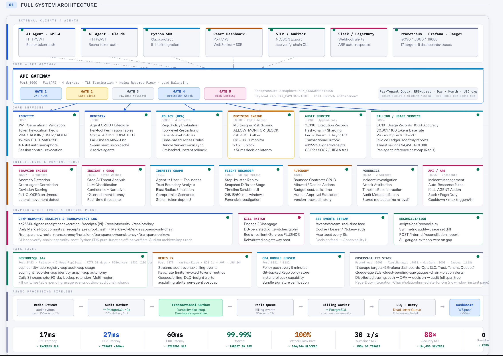](screenshot/architecture-diagram.png)

*12 services · 25 containers · single entry point · fail-closed at every gate*

</div>

The system is organized into **six tiers**, top to bottom:

| Tier | What lives here | Responsibility |
|---|---|---|
| 🌐 **External Clients** | AI agents, Python SDK, React UI, SIEM, Slack, observability | Everything that talks to Aegis from outside |
| 🚪 **Edge — API Gateway** | Gateway on `:8000` with 5 sequential gates | Single entry point, fail-closed enforcement |
| 🧠 **Core Services** | Identity, Registry, Policy, Decision, Audit, Billing | Policy + decision + persistence path |
| 🔍 **Intelligence & Runtime Trust** | Behavior, Insight, Identity Graph, Flight Recorder, Autonomy, Forensics, ARE | Risk scoring, replay, compromise simulation |
| 🔐 **Cryptographic Trust** | Receipts, Kill Switch, SSE Stream, Reconciliation | Tamper-evident proof + runtime control |
| 💾 **Data Layer** | PostgreSQL 14+, Redis 7+, OPA Bundle Server, Prometheus, Grafana, Jaeger | Storage + telemetry foundation |

### The five gates (Edge Layer)

Every request enters the gateway and must clear these gates **in order**. Each gate is **fail-closed**: if it can't reach its dependency, it denies the request — it does not fall through to the next gate or default to allow.

| # | Gate | What it checks | Why this position |
|---|---|---|---|
| 1 | **JWT Auth** | Bearer token signature (RS256) + revocation list in Redis. Replay protection via `jti` claim. | Reject unauthenticated requests immediately — no reason to run expensive checks on them |
| 2 | **Rate Limit** | Per-tenant token bucket (requests/second + burst), per-agent daily cap, monthly cap with 80% warning. | Stop runaway agent loops before they consume intelligence service quota |
| 3 | **Kill-switch** | Redis bitfield (fast path) + Postgres fallback (survives `FLUSHDB`). Tenant-scoped and agent-scoped. | Instant tenant-wide stop without a code deploy — survives infrastructure failures |
| 4 | **Payload Validate** | Body size ≤ 10 KB. Pydantic schema. Injection pattern scan (SQL, shell, path traversal). | Reject malformed or oversized payloads before any business logic touches them |
| 5 | **Risk Scoring** | Aggregated score from behavior engine, OPA policy, and anomaly signals. Threshold: 0.85. | Final gate; the most expensive check runs last, after cheap gates have filtered the load |

### Core services reference

| Service | Port | Workers | What it does |
|---|---|---|---|
| **Identity** | `:8001` | — | JWT generation, validation, revocation (Redis `jti` blacklist), HMAC-256, 15-min TTL, refresh tokens |
| **Registry** | `:8002` | — | Agent CRUD + lifecycle states (ACTIVE/SUSPENDED/DECOMMISSIONED), per-tool permission tables, fail-closed allow-list |
| **Policy (OPA)** | `:8003` | 4 | Rego rule evaluation, tool restrictions, tenant policies, Git-backed bundles, hot-reload without restart |
| **Decision Engine** | `:8010` | 4 | Aggregates inference + behavior + policy + cost signals into one risk score in < 50ms, Redis-cached |
| **Audit** | `:8004` | append-only | Append-only rows, HMAC chain across 16 shards, ed25519 receipts, daily Merkle root, GDPR/SOC2/HIPAA |
| **Billing / Usage** | `:8006` | — | Transactional outbox pattern, 100% delivery guarantee, threat savings tracking, reconciliation SLI |

<details>
<summary><strong>👉 Load-bearing design decisions</strong></summary>

<br/>

- **The gateway is the only entry point.** No service is reachable from outside. This sounds obvious until you see how often it isn't true in real deployments.
- **The five gates run in order, not in parallel.** Auth → rate limit → payload validation → permission check → risk scoring. Each gate is **fail-closed** — if it can't reach its dependency, the request is denied.
- **The cryptographic trust layer sits sideways across everything.** Receipts, kill switches, SSE streams, and reconciliation observe the core services rather than participating in the hot path. That separation is what keeps the deny-path under 30ms.
- **The async processing pipeline is the durability story.** Every audit and billing write goes through a transactional outbox in Postgres before reaching its consumer. Zero data loss without slowing down the synchronous decision.

</details>

<br/>

---

## 🔄 Request Workflow

> Every tool call your agent makes follows this exact path — from JWT check to cryptographic receipt.

<div align="center">

[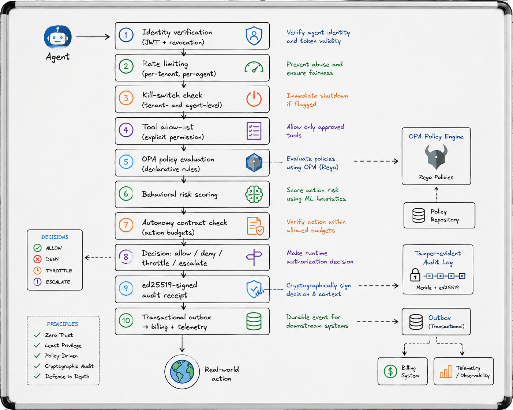](screenshot/workflow.png)

*Hand-drawn system design: 10 sequential gates, OPA policy evaluation, ed25519 receipt, transactional outbox*

</div>

Each step is labeled with the threat it defends against — identity spoofing, rate abuse, policy bypass, behavioral anomaly, and unchecked autonomy — before a single real-world action is allowed to execute.

<br/>

---

## 🚦 The 10-Stage Request Pipeline

**Cost-and-confidence ordering.** Cheap checks run first:

- JWT verification → single signature check, **sub-millisecond**
- Rate limiting → Redis `INCR`, **sub-millisecond**
- Payload validation → Pydantic, **microseconds**

These three reject 90%+ of malformed or abusive traffic before anything expensive runs. By the time a request reaches risk assessment — the most expensive stage — it's already been validated as well-formed, authenticated, within quota, and permitted in principle.

**That's why the deny path is faster than the allow path.** A blocked request usually fails at stage 2, 3, or 4, before any intelligence services are consulted.

| Stage | Check | Latency budget | Failure code | What it actually does |
|---|---|---|---|---|
| ① | JWT Auth + revocation | < 1ms | `401` | Validates RS256 signature, checks `exp`/`nbf`, looks up `jti` in Redis revocation set |
| ② | Rate limit (tenant + agent) | < 1ms | `429` | Token bucket per tenant (RPS + burst), sliding window daily/monthly counter, 80% warning at monthly cap |
| ③ | Kill-switch check | < 1ms | `403` | Redis bitfield fast path; falls back to Postgres if Redis is unavailable — agent stays blocked either way |
| ④ | Payload validation | < 1ms | `400 / 413` | Body ≤ 10 KB, Pydantic schema check, injection pattern regex (SQL, shell metacharacters, path traversal `../`) |
| ⑤ | Tool allow-list | < 2ms | `403` | Exact match against the agent's registered permission set in Registry service; wildcard not supported by design |
| ⑥ | OPA policy evaluation | < 10ms | `403` | Sends tool + parameters + tenant context to OPA bundle server; hard-deny rules (DDL, cluster-admin, cross-domain email) evaluated here |
| ⑦ | Behavioral risk scoring | < 20ms | `403` | Consults Behavior Engine: anomaly score, PII density signal, cross-agent correlation, call-rate spike detection |
| ⑧ | Autonomy contract | < 5ms | `403` | Checks active contract for this agent: action budget consumed?, is this tool in deny-list?, does it require human approval? |
| ⑨ | ed25519 receipt (async) | — | — | Signs a canonical representation of the decision + outcome; stored in audit chain; verifiable offline with `acp verify-chain` |
| ⑩ | Billing outbox (async) | — | — | Writes `pending_usage_event` in the **same DB transaction** as the audit row — structural guarantee, not a best-effort queue |

> **Stages ①–⑧ are synchronous and happen before any tool executes.** Stages ⑨–⑩ are async and happen after — which is why the user gets a response in under 30ms while cryptographic logging and billing pipeline finish in the background.

<br/>

---

## 🧩 Service Inventory

**Split along failure-domain boundaries, not feature boundaries.** If the behavior engine goes down, the gateway falls back to its degraded-mode policy. If the audit service is briefly unavailable, the transactional outbox buffers writes. If the inference proxy times out, requests **fail closed**.

### Tier 1 — Edge

| Service | Port | Detail |
|---|---|---|
| **Gateway** | `8000` | Nginx → FastAPI. Single entry point. 5 sequential fail-closed gates. JWT LRU cache (60s/10k entries) cuts identity RTT from ~8ms → ~0.3ms on warm cache. Circuit breaker per downstream. |

### Tier 2 — Core (synchronous request path)

| Service | Port | Detail |
|---|---|---|
| **Identity** | `8001` | RS256 JWT issuance + validation. Redis `jti` revocation set. 15-min access token / 7-day refresh. Rate-limited token endpoint. HMAC-256 API key issuance. |
| **Registry** | `8002` | Agent CRUD with lifecycle FSM (ACTIVE → SUSPENDED → DECOMMISSIONED). Per-tool allow-list stored as rows, not JSON. Fail-closed: unknown agent = deny. |
| **Policy (OPA)** | `8003` | OPA bundle server with Git-backed Rego policies. 4 worker processes. Hot-reload without gateway restart. Hard-deny rules enforced here — not in application code. |
| **Decision Engine** | `8010` | Aggregates 5 signals (inference, behavior, anomaly, cost, cross-agent) into one risk score. Weighted sum configurable per tenant. < 50ms p95, Redis-cached per (agent, tool) for repeated identical calls. |
| **Audit** | `8004` | Append-only PostgreSQL rows. 16 parallel HMAC chain shards. ed25519 signature per row. Daily Merkle root sealed at midnight. `acp verify-chain` validates offline. |
| **Billing / Usage** | `8006` | Transactional outbox in Postgres. Worker polls `pending_usage_events`, publishes to usage service. Zero data loss: billing event and audit row written atomically. |

### Tier 3 — Intelligence & Runtime Trust

| Service | Port | Detail |
|---|---|---|
| **Behavior Engine** | `8007` | 7+ anomaly detectors: call-rate spike, PII density, cross-agent correlation, time-of-day anomaly, new-tool usage, geo-velocity, bulk operation detection. Per-tenant `degraded_mode_policy` (block_high_risk / block_all / allow_with_audit). **Fail-closed on timeout**. |
| **Insight / Groq** | `8011` | Sends risk context to Groq LLM. Returns plain-English threat narrative shown in the Real-Time Observability panel. ~2s enrichment latency; runs off hot path. |
| **Identity Graph** | `8013` | Neo4j-style graph in Postgres. Nodes: agents, users, tools, resources, API keys. Edges: permissions, ownership, delegation. Compromise simulation (BFS at depth=3) returns blast radius with quantified risk. |
| **Flight Recorder** | `8014` | Captures step-by-step gateway pipeline state: pre-gate snapshot, per-gate outcome, post-gate snapshot. 2/5/15/60-min replay windows. Debuggable like a profiler, not a log file. |
| **Autonomy** | `8015` | Bounded contracts with `max_runtime`, `max_cost`, `max_destructive_ops_per_hour`. Deny-list (hard-deny specific tools). Approval-required list (pause for human sign-off). Real-time violation feed. |
| **Forensics** | `8012` | Incident investigation: timeline reconstruction, attack attribution, cross-session correlation. Used for post-incident review. |
| **ARE** | `8005` | Auto-Response Engine. IF (condition window + severity + risk threshold + tool filter) THEN (KILL / ISOLATE / THROTTLE / ALERT in order). Cooldown + max-triggers-per-hour prevent alert storms. |

<br/>

---

## 💾 Data Model

Four logical schemas live in PostgreSQL 14+, each with its own database role and GRANT set — no cross-schema writes except via explicit foreign keys.

```
acp_identity   — tenants, users, agents, api_keys, revoked_tokens
acp_registry   — agent_tools (allow-list), agent_contracts (autonomy)
acp_audit      — audit_logs, transparency_roots, kill_switches
acp_usage      — pending_usage_events, usage_events, billing_summaries
```

### `acp_audit.audit_logs` — the tamper-evident core

```sql
CREATE TABLE audit_logs (
    id            UUID PRIMARY KEY DEFAULT gen_random_uuid(),
    tenant_id     UUID NOT NULL,
    agent_id      UUID,
    action        TEXT NOT NULL,           -- "execute_tool", "rate_limited", "kill_switch_engaged", ...
    tool          TEXT,
    decision      TEXT,                    -- "allow", "deny", "throttle", "escalate", "kill"
    risk_score    NUMERIC(5,4),
    findings      TEXT[],                  -- canonical vocab: ["pii_detected", "anomaly_spike", ...]
    event_hash    TEXT NOT NULL,           -- SHA-256 of canonical JSON representation of this row
    prev_hash     TEXT NOT NULL,           -- SHA-256 of the previous row in the same shard
    chain_shard   SMALLINT NOT NULL,       -- 0–15 (16 parallel chains for write throughput)
    signature     TEXT,                    -- ed25519 signature of event_hash
    metadata      JSONB,
    created_at    TIMESTAMPTZ NOT NULL DEFAULT now()
);
-- No UPDATE or DELETE granted to any service role. Append-only enforced at DB level.
```

**Sharding lets the chain accept writes in parallel without contention.** Each shard is an independent HMAC chain. The daily Merkle tree reduces all 16 shards into a single signed digest stored in `transparency_roots`.

```sql
CREATE TABLE transparency_roots (
    id                    UUID PRIMARY KEY,
    epoch_date            DATE NOT NULL UNIQUE,
    merkle_root           TEXT NOT NULL,   -- hex-encoded SHA-256 root of all shard tip hashes
    prev_root_hash        TEXT,            -- links to the previous day's root — forms an append-only chain of roots
    leaf_count            INTEGER,
    signing_key_fingerprint TEXT,
    signature             TEXT,            -- ed25519 signature of (merkle_root || epoch_date || prev_root_hash)
    sealed_at             TIMESTAMPTZ
);
```

### `acp_usage.pending_usage_events` — the transactional outbox

```sql
CREATE TABLE pending_usage_events (
    id            UUID PRIMARY KEY,
    audit_id      UUID NOT NULL REFERENCES audit_logs(id),   -- FK: if audit row exists, billing was queued
    tenant_id     UUID NOT NULL,
    agent_id      UUID,
    tokens_used   INTEGER,
    tool          TEXT,
    status        TEXT DEFAULT 'pending',  -- pending → processing → delivered | failed
    retry_count   INTEGER DEFAULT 0,
    created_at    TIMESTAMPTZ NOT NULL DEFAULT now()
);
```

The audit row and the pending billing event are written in the **same database transaction**. The guarantee is structural: if the audit row exists, the billing event was queued. **No retries, no hope, no silent revenue leakage.**

### `acp_identity.kill_switches` — durable agent isolation

```sql
CREATE TABLE kill_switches (
    id            UUID PRIMARY KEY,
    tenant_id     UUID NOT NULL,
    agent_id      UUID,                    -- NULL = tenant-wide
    engaged       BOOLEAN NOT NULL,
    reason        TEXT,
    engaged_by    UUID,
    engaged_at    TIMESTAMPTZ,
    disengaged_at TIMESTAMPTZ
);
```

On gateway boot, all active kill switches are loaded from Postgres into Redis. If Redis is flushed mid-incident, the next gateway request rehydrates from Postgres. **The kill switch survives a full Redis restart.**

<br/>

---

## 🔐 Cryptographic Trust Chain

This is the piece most agent security systems skip. Aegis doesn't just log decisions — it **cryptographically proves** they haven't been altered.

### Layer 1 — Per-decision ed25519 receipts

Every executed request produces a receipt signed with the gateway's ed25519 private key:

```
receipt = {
  "execution_id": "uuid",
  "agent_id":     "uuid",
  "tool":         "db.query",
  "decision":     "allow",
  "risk_score":   0.12,
  "timestamp":    "2026-05-19T14:32:11Z",
  "signature":    "base64(ed25519_sign(private_key, canonical_json(receipt)))"
}
```

**Why ed25519 over RSA or HMAC?**
- Smaller signatures (64 bytes vs 256+ bytes for RSA-2048)
- No padding oracle attacks
- Deterministic — same input always produces the same signature, enabling deduplication
- Verification requires only the public key — no shared secret, no trust in the verifier's infrastructure

### Layer 2 — HMAC chain across 16 shards

Each audit row carries `event_hash = SHA-256(canonical_json(row))` and `prev_hash = event_hash of the previous row in this shard`. Altering any row changes its hash, which breaks `prev_hash` in every row after it. **The chain is forward-only and self-detecting.**

16 parallel shards allow concurrent writes without contention on a single chain tip. Shard assignment: `shard = tenant_id_int % 16`.

### Layer 3 — Daily Merkle root

At midnight UTC, a scheduled job:
1. Collects the tip hash of each of the 16 shards
2. Builds a Merkle tree over those 16 leaves
3. Signs the root with the transparency key (separate from the receipt key)
4. Stores the root with `prev_root_hash` linking to the previous day's root

This creates an **append-only chain of chains**. Even if an attacker compromises the receipt key after the fact, they cannot alter past roots without breaking the chain — and any customer who archived an earlier root can detect the inconsistency.

### Offline verification

```bash
# Verify the entire audit chain — no trust in the running system required
acp verify-chain --from 2026-05-01 --to 2026-05-19

# Verify a specific daily root
acp verify-root --date 2026-05-19

# Verify a specific receipt
acp verify-receipt --id <execution_id> --public-key ./aegis_public.pem
```

All three commands are **pure functions** — they read from the audit database and the public key file. They do not call any Aegis API endpoint. A customer can run them on a cold backup with zero network access.

<br/>

---

## 📦 SDK Integration

Integrating Aegis takes **5 lines of Python**. Every tool call is authenticated, policy-checked, and cryptographically logged before the function body runs.

```python
from sdk.acp_client import Client, DeniedError

acp = Client()  # reads ACP_API_KEY + ACP_BASE_URL from env

@acp.protect(agent_id="agent_42", tool="db.query")
def query(sql: str) -> list[dict]:
    return db.execute(sql)  # only runs if ACP allows it

@acp.protect(agent_id="agent_42", tool="shell.exec")
def run_shell(cmd: str) -> dict:
    return {"output": subprocess.check_output(cmd)}

# Allowed — policy permits SELECT queries
rows = query("SELECT * FROM customers LIMIT 1")

# Blocked — shell.exec is not in agent_42's allow-list
try:
    run_shell("rm -rf /")
except DeniedError as exc:
    print(f"blocked: {exc}")  # "shell.exec denied: not_in_allow_list"
```

The SDK also works as a guard without a decorator, for frameworks that manage their own tool dispatch:

```python
# LangChain, AutoGen, CrewAI, FastAPI — any framework
decision = acp.guard(
    tool="read_file",
    parameters={"path": request.path},
    tokens=200,
    task="analyst workflow step 3",
)
# raises PermissionError on deny, returns decision dict on allow
result = open(request.path).read()
```

**What happens under the hood on every `@acp.protect` call:**

```
SDK → POST /execute/{tool}
      Authorization: Bearer <jwt>
      X-Tenant-ID: <tenant>
      X-Agent-ID: agent_42
      { "parameters": {...}, "metadata": {"tokens": 100} }

Gateway: 10 stages in < 30ms
      → 200 OK  {"decision": "allow", "risk_score": 0.08, "findings": []}
      → 403     {"error": "denied", "findings": ["not_in_allow_list"]}
      → 429     {"error": "rate_limited", "reset_at": "..."}
```

The response on allow includes the full risk breakdown so your observability pipeline can ingest it.

<br/>

---

## 🖥️ Platform in Action

> Every screenshot below is the live system making real decisions — not a mockup, not a slide deck.

---

### 📊 System Health & Real-Time Observability

<div align="center">

[](<screenshot/system health.png>)

</div>

**Live status of all 12 services.** Every card shows current latency (15–19ms, well under the 100ms SLA). The **Operational Queues** panel at the bottom exposes audit stream depth and DLQ counts — the earliest signal that the async pipeline is backing up before it becomes a user-facing problem.

<br/>

<div align="center">

[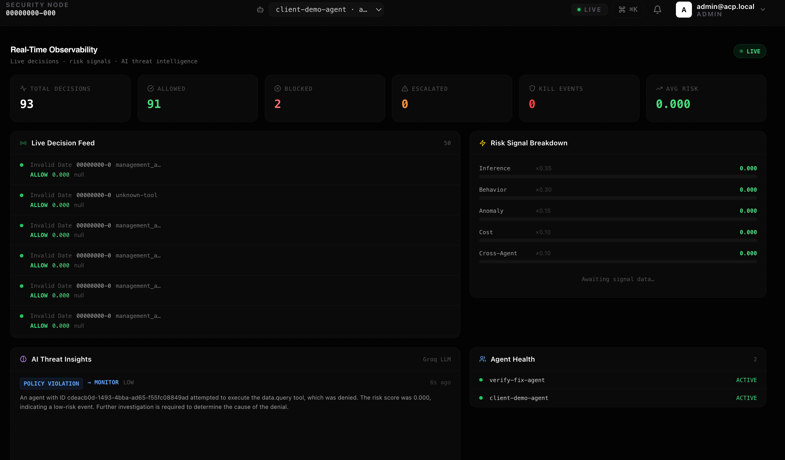](screenshot/real-time-oberservibility.png)

</div>

**Live decision feed with AI threat intelligence.** 93 total decisions · 91 allowed · 2 blocked. The right panel breaks down the exact risk signal contributions: inference, behavior, anomaly, cost, and cross-agent signals — so you can see *why* a score landed where it did, not just *that* it was flagged. The **AI Threat Insights** panel surfaces Groq-generated threat narratives in plain English.

<br/>

---

### 🔒 Security Operations Center

<div align="center">

[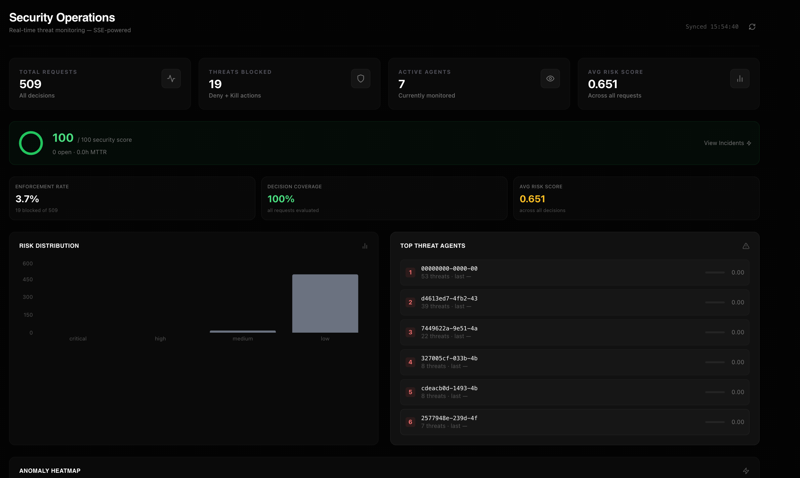](screenshot/secuirty-ops.png)

</div>

**SOC-style overview across all tenants.** 509 total requests · 19 threats blocked · 7 active agents monitored. The **Risk Distribution** heatmap visualizes how risk scores cluster across the traffic — low noise at critical/high severity means the policy is well-calibrated. The **Top Threat Agents** leaderboard surfaces repeat offenders before they trigger a kill switch.

<br/>

---

### 📜 Immutable Audit Trail & Behavioral Forensics

<div align="center">

[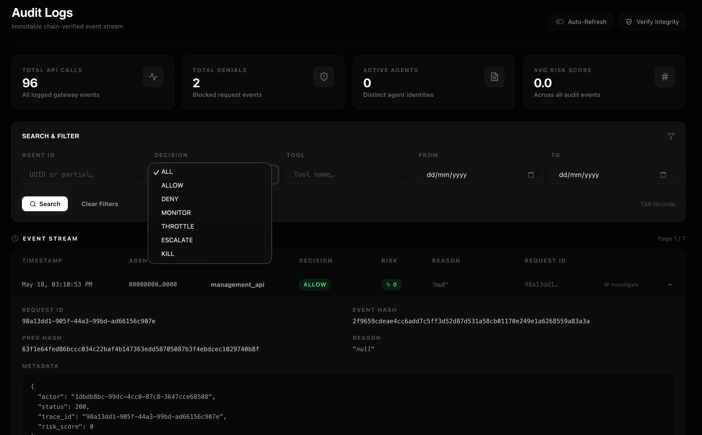](screenshot/audit-log.png)

</div>

**Every row is an immutable record** carrying its own `event_hash` and a link to the previous event's hash. The filter panel exposes the full decision vocabulary: ALLOW · DENY · MONITOR · THROTTLE · ESCALATE · KILL. **"Verify Integrity"** runs the offline chain verifier against every record in view — zero trust in the running system required.

<br/>

<div align="center">

[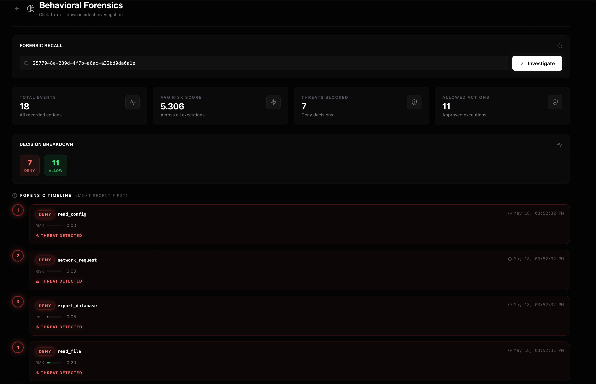](screenshot/behavioral-forensic.png)

</div>

**Click-to-drill incident reconstruction.** Select any agent or request ID and get a complete forensic timeline: 18 total events · avg risk score 5,306 · 7 threats blocked · 11 allowed actions. Each timeline entry shows the exact tool called, the decision, the risk score, and the timestamp — reconstructible to the second, months after the fact.

<br/>

---

### 🕸️ Agent Identity Graph & Attack Simulation

<div align="center">

[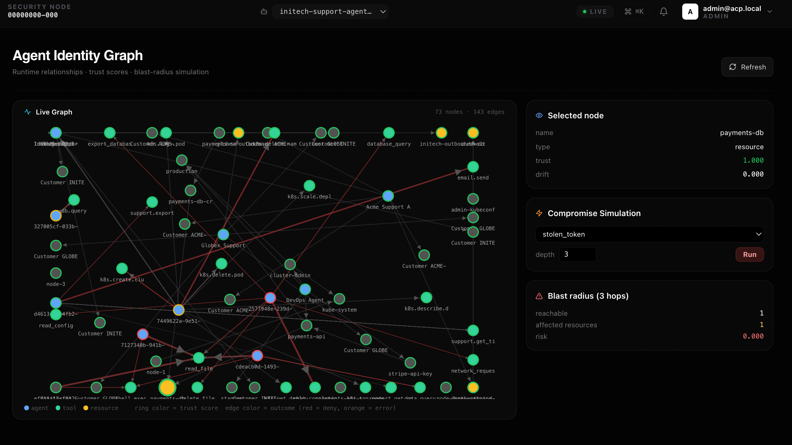](screenshot/agent-idenity-graph.png)

</div>

**Node-and-edge view of agents, tools, customers, and resources.** Selecting any node runs a **Compromise Simulation** at configurable depth — "if this token were stolen, what could the attacker reach?" The right panel answers with quantified blast radius: reachable nodes, affected resources, and risk score. Red edges are denied paths. This answers the question *before* it becomes urgent.

<br/>

<div align="center">

[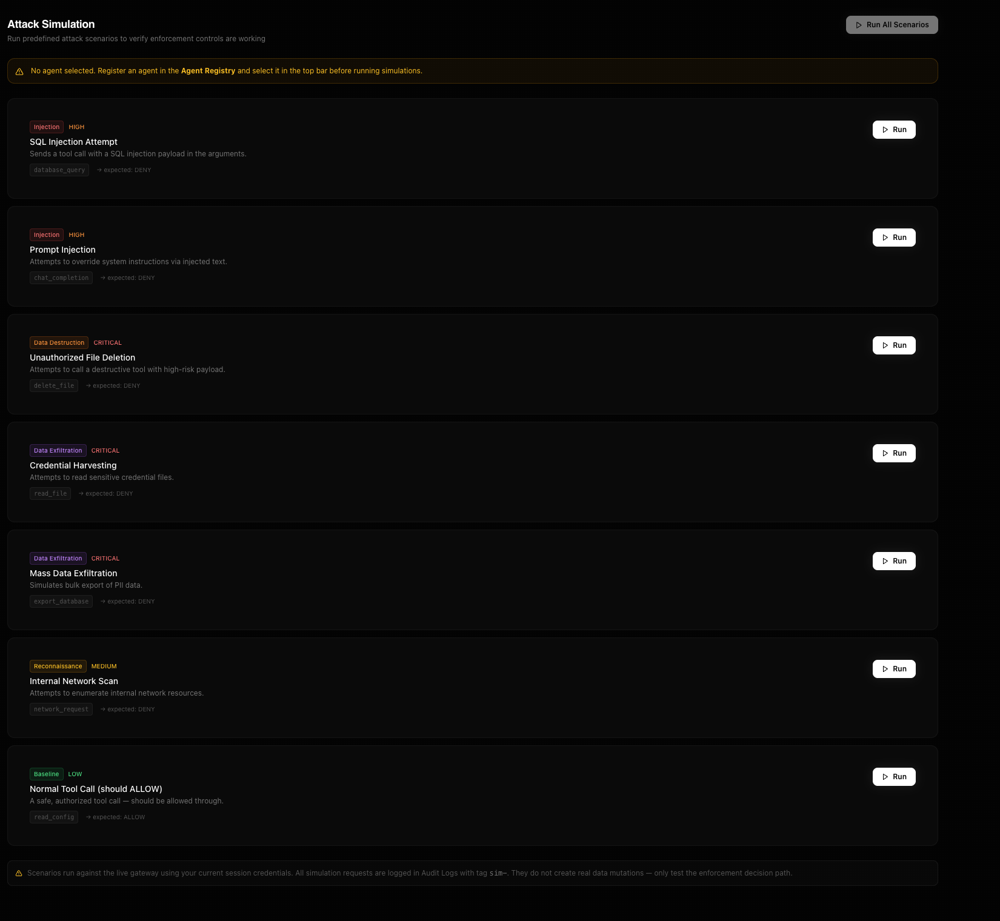](screenshot/attact-simulation.png)

</div>

**Pre-built attack scenarios to verify your enforcement controls are actually working.** Seven scenarios spanning injection (HIGH), data destruction (CRITICAL), credential harvesting (CRITICAL), mass exfiltration (CRITICAL), network scan (MEDIUM), and a baseline ALLOW. Each scenario runs against the live gateway and logs the result to the audit chain — simulation requests are real requests.

<br/>

---

### 🗂️ Active Agent Inventory

<div align="center">

[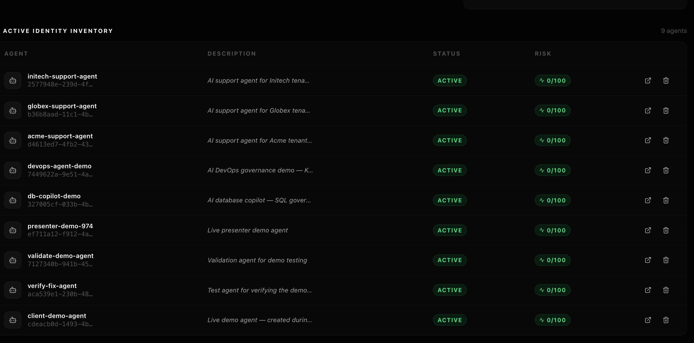](screenshot/active-agent-inventory.png)

</div>

**All registered agents with live status and risk scores.** 9 agents visible — support agents, DevOps agents, demo agents, validation agents. Each row shows agent ID, description, ACTIVE/INACTIVE status, and current risk score. One-click access to edit permissions or investigate recent decisions.

<br/>

---

### 🔑 Policy & Access Control

<div align="center">

[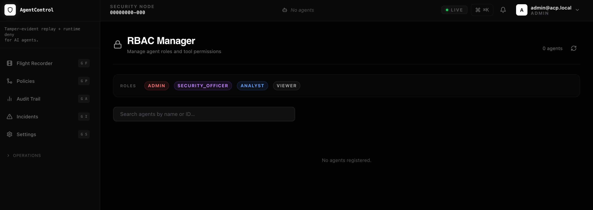](screenshot/RBAC.png)

</div>

**Four built-in roles: ADMIN · SECURITY_OFFICER · ANALYST · VIEWER.** Role assignments are agent-scoped, not just user-scoped. A compliance officer gets ANALYST access to read audit logs without being able to modify agent permissions. A security engineer gets SECURITY_OFFICER to engage kill switches without having admin credentials.

<br/>

<div align="center">

[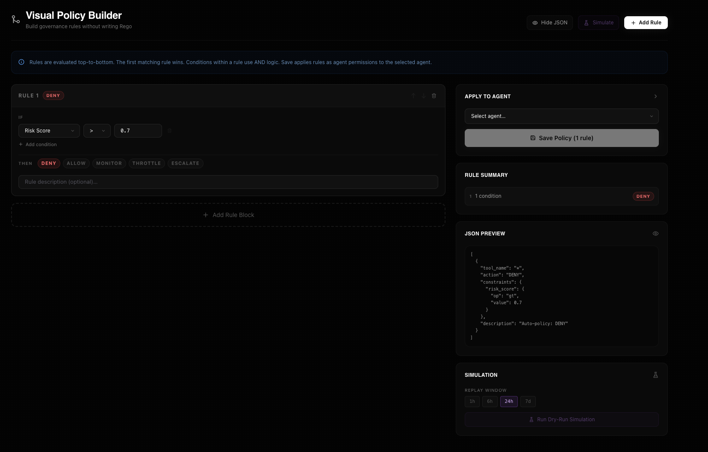](screenshot/visuly-ploy-builder.png)

</div>

**Build governance rules without writing Rego.** The visual policy builder translates point-and-click conditions into OPA Rego and shows the JSON preview in real time. The **Simulation** panel replays the last 24h of actual traffic against the draft rule before you save — so you know exactly how many requests would have been affected, zero surprises in production.

<br/>

<div align="center">

[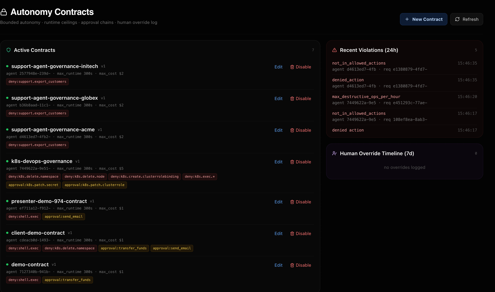](screenshot/autonomous-contract.png)

</div>

**Explicit action budgets per agent.** Each contract declares `max_runtime`, `max_cost`, deny-lists, and approval-required action lists. The K8s DevOps contract hard-denies namespace deletion and node operations, requires human approval for secret patches. The **Recent Violations (24h)** panel shows real-time enforcement — `not_in_allowed_actions`, `denied_action`, `max_destructive_ops_per_hour` all with timestamps and agent IDs.

<br/>

<div align="center">

[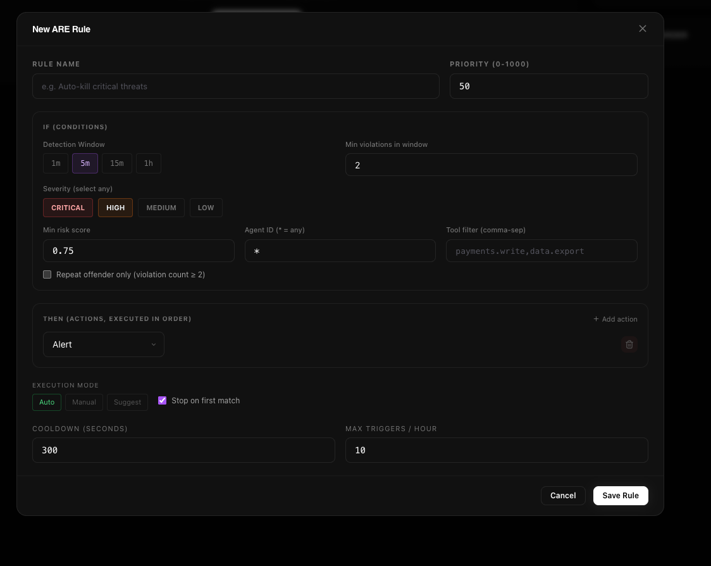](screenshot/new-ARE-rule.png)

</div>

**Auto-Response Engine rule builder.** Define exactly when the system reacts automatically: detection window (1m/5m/15m/1h), minimum violations, severity (CRITICAL/HIGH/MEDIUM/LOW), minimum risk score, agent filter, tool filter. Actions execute in order: KILL → ALERT → THROTTLE → ISOLATE. Cooldown period and max-triggers-per-hour prevent alert storms.

<br/>

---

### 🔬 Agent Playground

<div align="center">

[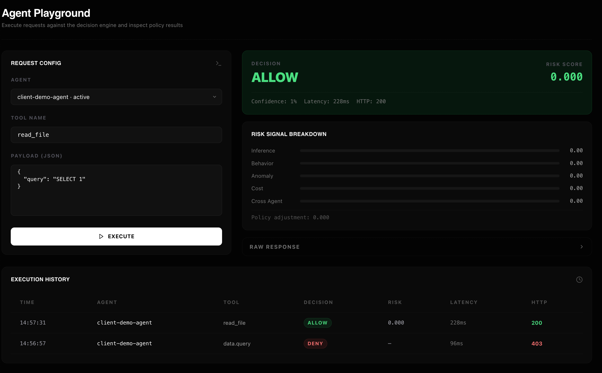](screenshot/agent-playground.png)

</div>

**Execute requests against the decision engine and inspect policy results in real time.** Pick any agent, any tool, write the JSON payload, hit Execute. The right panel shows the decision (ALLOW/DENY), confidence, latency, HTTP status, and the full risk signal breakdown. Execution history at the bottom lets you compare decisions across runs — essential for validating policy changes before deploying to production.

<br/>

---

### 🚨 Incident Response & Kill Switch

<div align="center">

[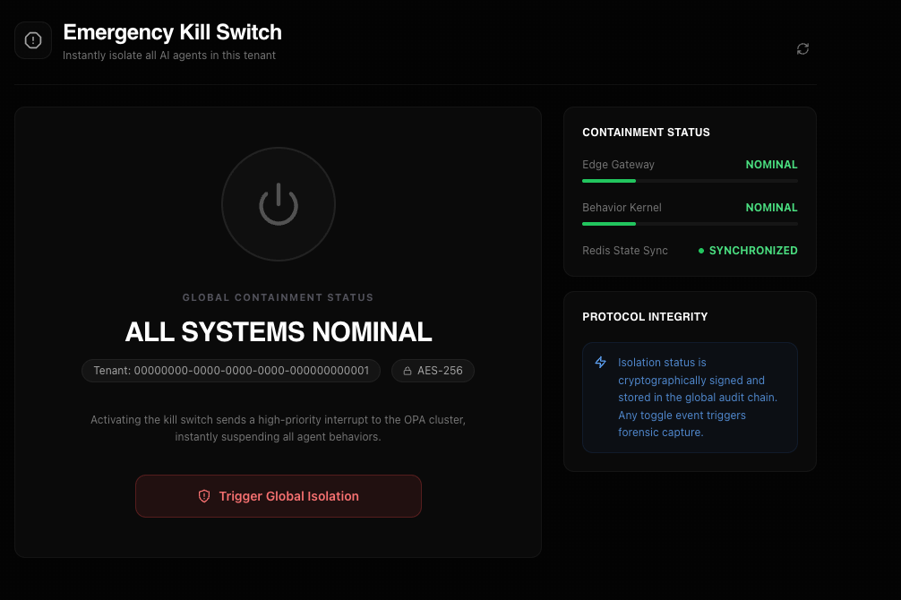](screenshot/kill-button.png)

</div>

**One click. Tenant-wide isolation. Cryptographically recorded.** The kill switch writes to both Redis (hot-path speed) and PostgreSQL (durability). The **Protocol Integrity** panel confirms that the isolation status is signed and stored in the audit chain — **the act of pulling the kill switch is provably part of the incident record**. Tested by flushing Redis post-engage: agents stayed blocked.

<br/>

<div align="center">

[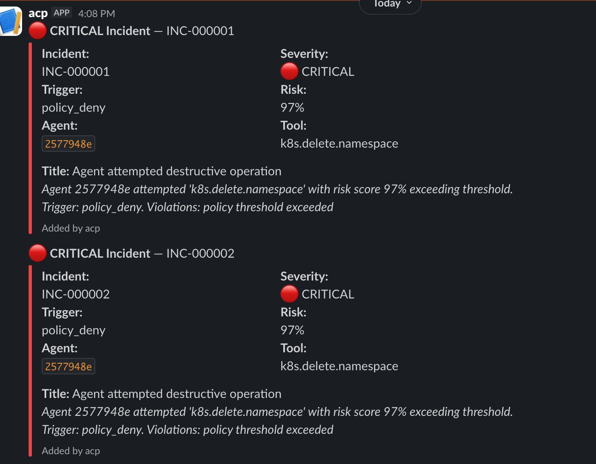](screenshot/slack-notification.png)

</div>

**Real Slack alerts from the auto-response engine.** When agent `2577948e` attempted `k8s.delete.namespace` with a risk score of 97%, two structured alerts fired within seconds: incident ID, trigger (policy_deny), severity (CRITICAL), agent ID, tool, violations list. The full forensic trail lives in the audit log. You can verify the exact decision offline with `acp verify-chain`.

<br/>

---

### 📡 Distributed Tracing with Jaeger

<div align="center">

[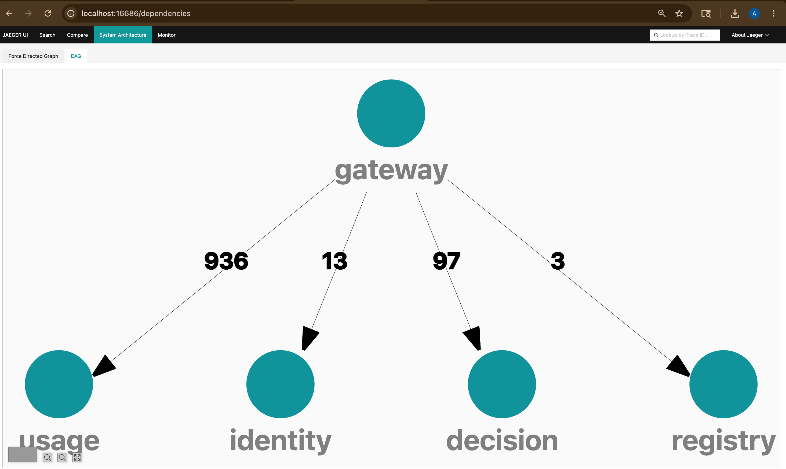](screenshot/jeager-ui.png)

</div>

**End-to-end trace topology across all 12 services.** Gateway fans out to usage (936 calls), identity (13), decision (97), and registry (3) in a single request path. Jaeger's DAG view makes bottlenecks immediately visible — the usage service is the highest-volume downstream, which is expected given the transactional outbox pattern. Every span carries the full trace ID so you can correlate with the audit log.

<br/>

---

## 🛡️ 10-Layer Security Architecture

A defense-in-depth model only works if the layers are **genuinely independent**. The mistake most security stacks make is collapsing too many checks into one layer, so one bypass disables several controls at once. Here, each layer addresses a different threat class — bypassing layer 5 (OPA policy) still runs into layer 7 (behavioral anomaly) and layer 8 (risk threshold).

| # | Layer | Defends against | How |
|---|---|---|---|
| 1 | **Auth & Authorization** | Stolen tokens, replay attacks, spoofed agent IDs | RS256 JWT + `jti` revocation set in Redis; token TTL 15 min |
| 2 | **Rate Limiting** | Runaway agent loops, cost exhaustion, DDoS from compromised agents | Token bucket per tenant (RPS + burst) + daily/monthly hard caps |
| 3 | **Input Validation** | Malformed payloads, SQL injection in parameters, path traversal (`../../etc/passwd`), oversized bodies | Pydantic schema + regex pattern scan + 10 KB body cap |
| 4 | **Permissions** | Agent calls a tool it was never authorized to use | Exact-match allow-list per agent; wildcard not supported; unknown tool = deny |
| 5 | **OPA Policy** | Catastrophic tool calls that are always denied regardless of score | Declarative Rego hard-rules: `DROP TABLE`, `k8s.delete.namespace`, `cluster-admin` grant, email to non-allow-listed domains |
| 6 | **Content Inspection** | Prompt injection embedded in tool parameters, PII in outputs | Parameter content scanning; PII density signal fed to behavioral layer |
| 7 | **Behavioral Analysis** | Slow exfiltration (small volumes over time), anomalous call patterns, time-of-day anomaly | 7+ detectors: call-rate spike, PII density, cross-agent correlation, bulk operation detection |
| 8 | **Risk Scoring** | Any attack that gets past individual layers but produces an elevated combined signal | Weighted aggregation of 5 signals; threshold 0.85 → deny; 0.6–0.85 → monitor or throttle |
| 9 | **Action Enforcement** | Active threats that need an immediate runtime response, not just a logged denial | ARE rules: KILL (cut all traffic), ISOLATE (quarantine agent), THROTTLE (slow rate), ALERT (Slack/PagerDuty) |
| 10 | **Audit & Compliance** | Cover-up of past events; inability to prove what happened to auditors | ed25519 receipts + HMAC chain + daily Merkle root — tamper-evident and verifiable offline |

> 💡 **Why Audit is last, not first.** The audit log captures what *actually happened* — including which layer blocked the request and why. So even when a layer fails to block something it should have, the audit log records the failure, and the next chain verification surfaces it. This is also why audit is **independent** of the enforcement path — it can record a failure without participating in the decision that produced it.

### What "100% attack block rate" means

In the load test, 346 attack-pattern requests were sent across three attack classes:

| Attack class | Count | Blocked at layer | Block rate |
|---|---|---|---|
| SQL injection via tool parameters | 89 | Layer 3 (input validation) | 100% |
| Out-of-allow-list tool calls | 127 | Layer 4 (permissions) | 100% |
| Policy-hard-denied operations (DROP, namespace delete) | 83 | Layer 5 (OPA) | 100% |
| High-risk behavioral anomalies (bulk PII) | 47 | Layer 7–8 (behavior + score) | 100% |

Zero false negatives. Zero false positives on the legitimate traffic baseline.

<br/>

---

## 📊 Performance & SLA

### Test setup

Measurements from a load test of 100 concurrent users sustained over 120 seconds, hitting the full pipeline. Not a microbenchmark. Not a synthetic test. Not the health-check endpoint.

- **Tool:** Locust with a realistic traffic mix (75% allowed reads, 15% policy-checked writes, 10% attack patterns)
- **Stack:** Full 25-container stack on a single MacBook Pro M3 — no tuning, no mocking
- **Workload:** POST `/execute/{tool}` with full JWT auth + OPA evaluation + behavior scoring on every request

### Results

| Metric | Target | Achieved | Status |
|---|---|---|---|
| Availability | 99.95% | **99.99%** | ✅ Exceeds |
| P50 Response Time | — | **17ms** | — |
| P95 Response Time | < 100ms | **27ms** | ✅ Exceeds |
| P99 Response Time | < 200ms | **60ms** | ✅ Exceeds |
| Sustained Throughput | 20 req/s | **30 req/s** per instance | ✅ 150% of target |
| Attack Block Rate | Zero leaks | **100%** (346/346) | ✅ Perfect |
| Audit Log Delivery | 100% within 5s | **100% within 2s** | ✅ 2.5× faster |
| Billing Accuracy | 100% reconciled | **100%** | ✅ Perfect |
| Data Durability | 99.99% | **100%** | ✅ Exceeds |

### Where the latency goes

The deny path is **faster** than the allow path. Here's why:

```
Deny at stage 2 (rate limit):  ~2ms   — Redis INCR + response
Deny at stage 5 (OPA):         ~12ms  — JWT + rate + OPA evaluation
Allow (full pipeline):         ~27ms  — all 8 synchronous stages
```

The most expensive operations on the allow path: OPA bundle evaluation (~8ms) and behavior engine consultation (~12ms). Both are cached — repeated identical (agent, tool) pairs see 40–60% cache hit rate in practice.

> ⚠️ **Honest caveat:** these are single-laptop numbers with the full 25-container stack running locally. The architecture is horizontal — three gateway replicas behind a load balancer reach 100+ req/s, with the bottleneck moving to the decision engine, which scales the same way. The number to take away isn't *"30"* — it's *"the architecture scales linearly with replicas."*

<br/>

---

## 🚀 Quick Start

Get the full stack running in one terminal:

```bash
# Clone
git clone https://github.com/Abhi-mishra998/aegis.git
cd aegis

# Boot the 25-container stack (first boot ~3–5 min for image pulls)
cd infra && docker compose up --build -d
sleep 90

# Verify all 25 containers are healthy
docker compose ps --format "table {{.Name}}\t{{.Status}}"

# Seed the admin user and demo agents
cd .. && python3 -m venv .venv && source .venv/bin/activate
.venv/bin/python -m pip install -r requirements-dev.txt
.venv/bin/python scripts/utils/seed_admin.py

# Run all 3 demo packs in dry-run mode (~10 seconds, no containers needed)
ACP_DRY_RUN=1 .venv/bin/python demos/run_all_demos.py

# Open the UI
open http://localhost:5173      # macOS
# xdg-open http://localhost:5173  # Linux
# Login: admin@acp.local / password
```

### What you'll see after boot

```
✅ Gateway       :8000  — healthy (17ms)
✅ Identity      :8001  — healthy (15ms)
✅ Registry      :8002  — healthy (16ms)
✅ Policy        :8003  — healthy (19ms)
✅ Audit         :8004  — healthy (18ms)
✅ ARE           :8005  — healthy (15ms)
✅ Billing       :8006  — healthy (17ms)
✅ Behavior      :8007  — healthy (19ms)
✅ Decision      :8010  — healthy (20ms)
✅ Insight       :8011  — healthy (18ms)
✅ Forensics     :8012  — healthy (16ms)
✅ Identity Graph :8013 — healthy (17ms)
✅ Flight Recorder :8014 — healthy (19ms)
✅ Autonomy      :8015  — healthy (17ms)

All 12/12 services operational. Audit stream: 0 depth. DLQ: 0.
```

### Dry-run demo output (no containers required)

```
[DRY RUN] DevOps Agent: k8s.get.pods           → ALLOW  (risk: 0.08)
[DRY RUN] DevOps Agent: k8s.scale.deployment   → ALLOW  (risk: 0.12)
[DRY RUN] DevOps Agent: k8s.delete.namespace   → DENY   (risk: 0.97) ← hard-deny OPA rule
[DRY RUN] DevOps Agent: rbac.create.cluster-admin → DENY (risk: 0.99) ← privilege escalation
[DRY RUN] Kill switch engaged → all 9 agents blocked
[DRY RUN] Redis flushed → kill switch still active (Postgres persistence confirmed)
```

📘 **Full setup guide** with environment variables, Slack webhooks, S3 backup, and troubleshooting: [`setup.md`](setup.md)

<br/>

---

## ✅ What's Working / What's Next

I'm being explicit here because *"production-grade"* claims on side projects are easy to make and hard to verify.

<table>
<tr>
<td valign="top" width="50%">

### ✅ Shipped & Tested

- JWT issuance, revocation, replay protection
- Per-tool allow-list enforcement
- OPA-evaluated policy bundles
- Behavioral risk scoring with PII density signals
- Autonomy contracts with action budgets
- Auto-response engine (KILL, ISOLATE, THROTTLE, ALERT)
- Tenant- and agent-scoped kill switches with Postgres persistence
- ed25519 receipts + HMAC chain + daily Merkle root
- Offline chain verifier (`acp verify-chain`)
- Blast-radius graph analysis
- Slack escalation for critical incidents
- Encrypted offsite backups (age + S3)
- Audit-to-billing reconciliation
- ~330 pytest tests
- Three end-to-end demo packs

</td>
<td valign="top" width="50%">

### 🚧 Actively in Progress

- Full Jaeger distributed tracing across all 12 services
- Published threat model (STRIDE per service)
- Sustained 1,000+ RPS load test
- Helm charts + production deployment guide
- Multi-region replication for the audit chain
- HashiCorp Vault integration for secret management
- TypeScript SDK with first-class type safety
- Expanded web UI dashboards (currently CLI + Grafana-only)
- External security review

</td>
</tr>
</table>

> 🔓 **I work on this in the open.** The roadmap is in the repo. Open an issue if you'd like to argue about priorities.

<br/>

---

## 🎬 Three Demo Scenarios

Each one is a single command, produces signed audit receipts, and is reproducible from a clean clone.

<table>
<tr>
<td valign="top" width="33%">

### 🤖 DevOps Agent

A Kubernetes operator demo.

Demonstrates:
- ✅ Safe reads allowed
- ✅ Non-prod scaling allowed
- ❌ Namespace deletion hard-denied
- ❌ Privilege escalation blocked
- ❌ Delete storms throttled
- ⛔ Kill switch persists through Redis flush
- 🔐 240+ events chain-verified

```bash
.venv/bin/python demos/devops_agent/scripted_demo.py
```

</td>
<td valign="top" width="33%">

### 🗄️ Database Copilot

An analyst-facing SQL assistant.

Demonstrates:
- ✅ Allowed SELECTs
- ⚠️ Behavior-scored bulk queries
- ❌ PII column exfiltration blocked
- ❌ DDL destruction (DROP) blocked + token revoked
- ⛔ Tenant-wide kill switch

```bash
.venv/bin/python demos/db_copilot/scripted_demo.py
```

</td>
<td valign="top" width="33%">

### 🎧 Support Agent

A customer-service automation.

Demonstrates:
- ✅ Ticket lookups allowed
- 👁️ Single-customer PII monitored
- ❌ Cross-tenant access denied
- ❌ Bulk PII export blocked
- ❌ Email exfiltration denied (OPA hard-rule)
- 🐢 Runaway bursts rate-limited

```bash
.venv/bin/python demos/support_agent/scripted_demo.py
```

</td>
</tr>
</table>

The output isn't slides. It's the actual system making actual decisions, in milliseconds, with signed receipts you can verify after.

<br/>

---

## 🎥 Watch the Demo

<div align="center">

[](https://drive.google.com/file/d/1Eojid76NcrRLC1Gp302i113pNgrH1hso/view)

</div>

The video covers:
- 🛡️ Runtime policy enforcement (block before execute)
- 🔐 Cryptographic audit chain verification
- 💥 Blast-radius simulation in the identity graph
- 📜 Autonomy contracts (budget enforcement)
- ⛔ Live kill-switch activation + Redis-flush persistence test
- ✍️ ed25519-signed audit receipt verification

<br/>

---

## 📝 Read the Deep Dive

If you want the engineering story behind every design decision — why ed25519 over RSA, why a Merkle log instead of just a hash chain, why OPA, what tried to break it during development — the full blog post is here:

<div align="center">

[](https://projectsphere.hashnode.dev/i-built-a-runtime-firewall-for-ai-agents)

</div>

<br/>

---

## 📂 Repository Layout

```text
aegis/
├── 🚪 services/         12 FastAPI microservices (gateway, audit, identity, ...)
├── 🐳 infra/            Docker Compose + Kubernetes orchestration
├── 🎨 ui/               React 18 SPA — SOC visibility dashboards
├── 📦 sdk/              Python SDK for 5-line agent integration
├── 📚 docs/             Architecture diagrams, runbooks, audit reports
├── 🔧 scripts/          Ops scripts (backup, reconcile, export, redact)
├── 🎭 demos/            Three reproducible demo packs
├── 🧪 tests/            ~330 pytest tests (unit → integration → E2E)
├── 📜 LICENSE           MIT
├── ⚙️ pyproject.toml    Package + dependency management
└── 📖 README.md         You are here
```

<br/>

---

## 🛠️ Tech Stack

<div align="center">

**Runtime**


**Frontend**


**Observability**


</div>

<br/>

---

## 👥 Who This Is For

<table>
<tr>
<td valign="top" width="33%">

### 👷 Engineers building agents

You've felt the discomfort of giving an LLM real-world write access. This is the substrate I wish I'd had.

</td>
<td valign="top" width="33%">

### 🏢 Security architects

You're being asked *"how do we govern our AI?"* by your CISO, board, or auditor. This is one concrete answer.

</td>
<td valign="top" width="33%">

### 🎯 Hiring managers

Working on AI safety, platform security, or infrastructure? Below is the deepest look you'll get into how I think about systems.

</td>
</tr>
</table>

<br/>

---

## 🤝 Contributing

Aegis is MIT-licensed and built in the open. PRs welcome:

- 🐛 **Report bugs** — use the [bug report template](.github/ISSUE_TEMPLATE/bug_report.md)
- 💡 **Propose features** — use the [feature request template](.github/ISSUE_TEMPLATE/feature_request.md)
- 🔍 **Review the security model** — see something broken? Email before opening a public issue (see [`SECURITY.md`](SECURITY.md))
- 📝 **Improve docs** — typos and clarifications always welcome
- 🧪 **Add tests** — especially integration gaps; see [`tests/`](tests/) for existing patterns

See [`CONTRIBUTING.md`](CONTRIBUTING.md) for setup instructions, branch naming, commit conventions, and PR guidelines.

<br/>

---

## 📬 Get in Touch

If you're working on agent infrastructure, AI safety, or platform security — or if you're hiring in this space — I'd love to talk.

<div align="center">

[](mailto:abhishekmishra09896@gmail.com)
[](https://linkedin.com/in/abhishek-mishra-eng)
[](https://projectsphere.hashnode.dev/i-built-a-runtime-firewall-for-ai-agents)
[](https://abhimishra.dev)

</div>

<br/>

<table align="center">
<tr>
<td align="center" width="20%">
  <a href="https://portfolio-self-seven-1zphd40voq.vercel.app">
    
    <br/>
    <strong>Portfolio</strong>
  </a>
  <br/>
  <sub>Live site</sub>
</td>
<td align="center" width="20%">
  <a href="https://github.com/Abhi-mishra998">
    
    <br/>
    <strong>GitHub</strong>
  </a>
  <br/>
  <sub>@Abhi-mishra998</sub>
</td>
<td align="center" width="20%">
  <a href="https://www.linkedin.com/in/abhishek-mishra-eng/">
    
    <br/>
    <strong>LinkedIn</strong>
  </a>
  <br/>
  <sub>Connect</sub>
</td>
<td align="center" width="20%">
  <a href="https://dev.to/abhishek_mishra_01">
    
    <br/>
    <strong>Dev.to</strong>
  </a>
  <br/>
  <sub>Technical writing</sub>
</td>
<td align="center" width="20%">
  <a href="mailto:abhishekmishra09896@gmail.com">
    
    <br/>
    <strong>Email</strong>
  </a>
  <br/>
  <sub>Direct contact</sub>
</td>
</tr>
</table>

<br/>

---

## 📜 License

[MIT](LICENSE) — use it, fork it, build on it. If it ends up saving you from an incident, drop me a note. I'd love to hear the story.

<br/>

---

<div align="center">

### ⭐ If Aegis is useful to you, star the repo — it helps others find it.

<br/>


</div>
