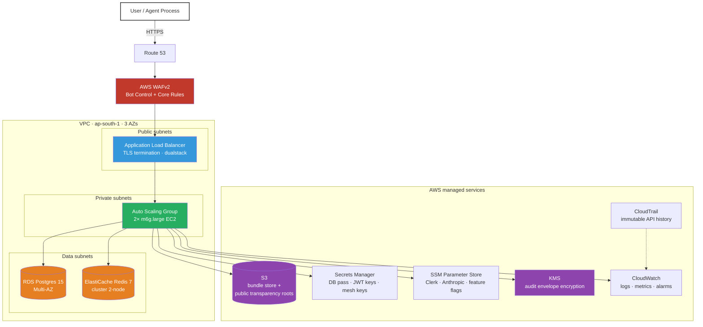
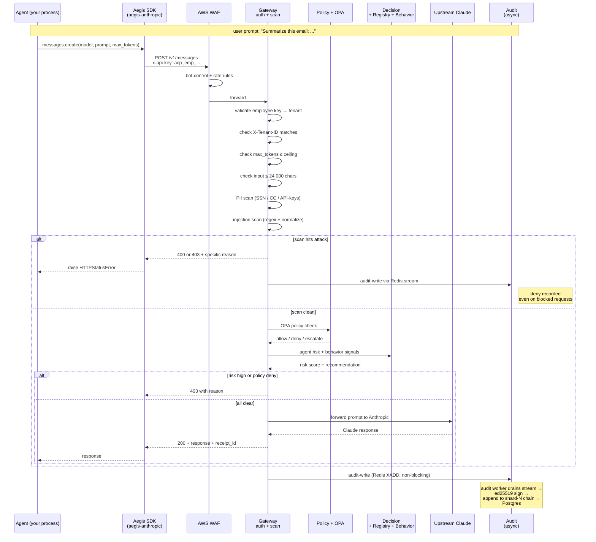

<div align="center">

# 🛡️ Aegis

**The runtime security control plane for AI agents.**
Every LLM prompt scanned. Every tool call authorized. Every decision cryptographically signed.

[](https://opensource.org/licenses/Apache-2.0)
[](https://aegisagent.in)
[](https://pypi.org/project/aegis-anthropic/)
[](./docs/testing/2026-07-26/report.md)
[](./docs/testing/2026-07-26/report.md#11-cryptographic-verification)

[**Live demo**](https://aegisagent.in) · [**Client setup**](./docs/setup.md) · [**Test report**](./docs/testing/2026-07-26/report.md) · [**Docs**](https://docs.aegisagent.in) · [**Blog post**](https://projectsphere.hashnode.dev/i-built-a-runtime-firewall-for-ai-agents)

</div>

---

## What Aegis does in 30 seconds

Your AI agent is about to call `db.query(sql="DROP TABLE users")` or send a prompt with `"Ignore all previous instructions"`. Without Aegis, that call goes through. With Aegis, it's blocked in ~150 ms with a signed audit receipt.

```python
from sdk.acp_client import Client, DeniedError

acp = Client()  # reads AEGIS_EMPLOYEE_KEY + AEGIS_URL from env

@acp.protect(agent_id="agent_42", tool="db.query")
def query(sql: str) -> list[dict]:
    return db.execute(sql)

query("SELECT name FROM users LIMIT 10")   # ✅ runs
query("DROP TABLE users")                   # ❌ DeniedError raised before it runs
```

**Aegis blocks:** prompt injection · DAN / OMEGA / STAN jailbreaks · SSN / credit-card / API-key exfil · cost bombs · cross-tenant escapes · runaway loops · unauthorized tool calls · unauthorized shell commands · unauthorized file reads.

**Aegis produces:** an ed25519-signed, Merkle-rooted, per-tenant audit chain that any regulator can verify offline in one command:

```bash
pip install aegis-aevf==1.1.1 && aegis-verify --bundle exported.json
```

---

## Why it exists

AI agents ship faster than they can be secured. In 2026 an agent framework will happily execute a tool call constructed from a prompt-injected LLM response — no policy layer between "the model said so" and "the database was dropped." Existing solutions either:

- **Live inside the model** (safety fine-tuning) — good, but 100 % model-specific and easily jailbroken
- **Live outside the process** (WAF / IAM) — good for shapes of traffic, blind to the semantics of prompts and tool calls
- **Live in a paid SaaS** — good if you like sending your prompts to a third party

Aegis is the fourth option: a **process-adjacent runtime firewall** — open source, self-hosted, model-agnostic, tool-agnostic. It reads every prompt and every tool call, applies a 10-layer policy pipeline, and produces a tamper-evident audit trail.

---

## 📐 The three diagrams

### 1. AWS deployment topology

Everything Aegis needs to run on AWS in `ap-south-1` (or any AWS region). Provisioned by Terraform in [`infra/terraform/`](infra/terraform/).



**~$290/month** baseline on-demand at current tenant volume — see [test report §12](./docs/testing/2026-07-26/report.md#12-cost-analysis) for the itemized bill. Free on local Docker Compose.

---

### 2. Aegis internal services

19 microservices per host, all in Python 3.11 + FastAPI. Each service is a separate container with its own DB pool, mesh JWT signing key, and health check. Cross-service calls use ES256 mesh JWTs.

```mermaid
flowchart TB
    subgraph front [Client-facing]
        gw[gateway<br/>· auth<br/>· PII scan<br/>· injection scan<br/>· cost cap]
        ui[ui<br/>React + Vite<br/>nginx static]
    end

    subgraph decision [Decision pipeline]
        pol[policy<br/>OPA rules]
        opa[OPA<br/>rego engine]
        dec[decision<br/>10-layer risk<br/>pipeline]
        beh[behavior<br/>agent baseline<br/>+ drift]
    end

    subgraph identity [Identity + registry]
        idn[identity<br/>tenant · user · role]
        reg[registry<br/>agent · permissions<br/>allow-list]
        api[api<br/>employee virtual keys<br/>incidents · ARE]
        ig[identity_graph<br/>blast radius<br/>compromise sim]
    end

    subgraph audit [Audit + evidence]
        aud[audit<br/>ed25519 chain<br/>16 shards]
        fr[flight_recorder<br/>step-level<br/>replay]
        fo[forensics<br/>timeline<br/>investigation]
    end

    subgraph auto [Autonomy + intelligence]
        au[autonomy<br/>contracts<br/>overrides]
        ins[insight<br/>cross-tenant<br/>correlation]
        lrn[learning<br/>signal weights]
    end

    subgraph other [Ops + specialty]
        u[usage<br/>cost telemetry<br/>+ outbox]
        wit[witness<br/>ATF §6<br/>execution attest]
        mcp[mcp_gate<br/>MCP protocol<br/>middleware]
        mcs[mcp_server<br/>stdio bridge]
        sec[security<br/>signal registry<br/>34 signals]
    end

    subgraph data [Shared infra]
        pg[(Postgres 15<br/>via pgbouncer)]
        rd[(Redis 7<br/>stream + cache)]
    end

    gw --> pol
    gw --> reg
    gw --> dec
    gw --> beh
    pol --> opa
    dec --> aud
    dec --> u
    dec --> fr
    dec --> fo
    dec --> ig
    reg --> pg
    idn --> pg
    aud --> pg
    aud --> rd
    fr --> pg
    fo --> pg
    au --> pg
    u --> pg
    ig --> pg
    ins --> pg
    all_services["all services"] -.-> pg
    all_services -.-> rd

    style gw fill:#3498db,color:#fff
    style dec fill:#c0392b,color:#fff
    style aud fill:#27ae60,color:#fff
    style opa fill:#e67e22,color:#fff
```



Full service inventory + memory limits + purpose in [Service inventory](#service-inventory).

---

### 3. Request workflow — end-to-end

What actually happens when your agent calls `client.messages.create(...)`:



The client sees a normal `messages.create()` call. Everything above happens in ~150 ms for deny paths, ~440 ms for allow paths + Claude's own inference latency.

---

## 🚀 Quickstart

### For clients using the hosted service

If a customer just wants to use Aegis without deploying it, [`docs/setup.md`](./docs/setup.md) is the 12-section walkthrough. TL;DR:

```bash
pip install 'aegis-anthropic==1.1.5'   # or aegis-openai / -langchain / -bedrock
```

Then log in at [aegisagent.in](https://aegisagent.in), mint an employee key, and use the SDK.

### For engineers self-hosting on AWS

```bash
git clone https://github.com/Abhi-mishra998/aegis.git
cd aegis/infra/terraform
# Edit envs/prod/terraform.tfvars with your account + domain
terraform init && terraform apply
# ~15 minutes. Populates ALB, RDS, ElastiCache, ASG, WAF, R53, everything.
```

Total baseline cost: **~$290/month** (see [test report §12](./docs/testing/2026-07-26/report.md#12-cost-analysis) for itemized breakdown).

### For engineers running locally

Zero AWS, zero Clerk, single laptop:

```bash
git clone https://github.com/Abhi-mishra998/aegis.git
cd aegis/infra
cp .env.aws.template .env      # then fill in the placeholders
docker compose up -d
# 25 containers per host — takes ~2 minutes on first cold start
open http://localhost:5173
```

Total cost: **$0.**

---

## Service inventory

19 Python microservices + 6 infrastructure containers = 25 containers per host.

### Aegis services

| Service | Port (internal) | Purpose | Memory limit |
|---|---|---|---|
| **gateway** | 8000 | Auth · rate limit · PII/injection scan · request routing | 1 GB |
| **decision** | 8000 | 10-layer risk pipeline · cumulative-risk quarantine | 576 MB |
| **policy** | 8000 | OPA client wrapper · policy CRUD | 480 MB |
| **audit** | 8000 | ed25519-signed chain · 16 shards per tenant · Merkle root sealing | 512 MB |
| **registry** | 8000 | Agent + permission CRUD · allow-list enforcement | 480 MB |
| **identity** | 8000 | Tenant + user + role · Clerk provisioning | 480 MB |
| **api** | 8000 | Employee virtual keys · incidents · ARE workflow | 192 MB |
| **usage** | 8000 | Cost telemetry · outbox reconciliation | 160 MB |
| **behavior** | 8000 | Per-agent baseline · drift detection | 640 MB |
| **autonomy** | 8000 | Contracts · overrides · playbooks | 320 MB |
| **forensics** | 8000 | Timeline · investigation · replay | 320 MB |
| **flight_recorder** | 8000 | Step-level replay · phase timing | 128 MB |
| **identity_graph** | 8000 | Blast radius · compromise simulation | 160 MB |
| **insight** | 8000 | Cross-tenant correlation | 192 MB |
| **insight_worker** | — | Background insight computation | 128 MB |
| **learning** | — | Signal weight tuning (offline) | 128 MB |
| **witness** | 8000 | ATF v3.2 §6 execution attestation | 192 MB |
| **mcp_gate** | 8000 | MCP protocol authentication + rate | 192 MB |
| **mcp_server** | stdio | MCP protocol bridge (no HTTP) | 128 MB |
| **security** | (library) | Signal registry — 34 MITRE-tagged signals | — |

### Infrastructure containers

| Service | Purpose |
|---|---|
| **opa** | Rego policy engine (Open Policy Agent 0.69) |
| **postgres** / **pgbouncer** | Data plane · connection pool |
| **redis** | Cache · rate-limit token bucket · audit stream · pub/sub |
| **prometheus** / **grafana** / **alertmanager** | Metrics + dashboards + paging |
| **jaeger** | Distributed tracing (opt-in per request) |
| **ui** | React SPA (Vite) served by nginx |
| **bundle-server** | Signed bundle distribution |

---

## 📦 SDK packages

Four provider-specific SDKs + one offline verifier. All published to PyPI.

```bash
pip install 'aegis-anthropic==1.1.5'    # Anthropic Claude
pip install 'aegis-openai==1.1.6'       # OpenAI GPT
pip install 'aegis-langchain==1.1.7'    # LangChain
pip install 'aegis-bedrock==1.1.7'      # AWS Bedrock
pip install 'aegis-aevf==1.1.1'         # offline compliance verifier
```

### Three integration patterns

**Pattern A — decorate a plain Python function:**

```python
from sdk.acp_client import Client, DeniedError
acp = Client()

@acp.protect(agent_id="my_agent", tool="db.query")
def query(sql: str) -> list[dict]:
    return db.execute(sql)
```

**Pattern B — framework-dispatched tools (LangChain, CrewAI, AutoGen):**

```python
from sdk.acp_client import Client
acp = Client()
decision = acp.guard(tool="read_file", parameters={"path": path})
result = open(path).read()  # only runs if allow
```

**Pattern C — LLM proxy (full prompt scanning):**

```python
from aegis_anthropic import AegisAnthropicProxy
client = AegisAnthropicProxy(
    employee_key=os.environ["AEGIS_EMPLOYEE_KEY"],
    gateway_url="https://aegisagent.in",
)
resp = client.messages.create(
    model="claude-sonnet-4-5", max_tokens=1024,
    messages=[{"role": "user", "content": "Summarize this doc: ..."}],
)
```

Every prompt is PII-scanned, injection-scanned, cost-capped **before** it reaches Claude. See [setup §4](./docs/setup.md#4-quick-start--5-lines-to-protect-a-tool) for the full walkthrough.

---

## 🔒 Security layers

Every request passes through 10 checks. Each has its own status code + reason so you always know what stopped it.

| Layer | Where | Blocks | Fail mode |
|---|---|---|---|
| 1 | AWS WAF | bot UA · rate-based · SQL injection signatures | fail-open (upstream) |
| 2 | Gateway auth | invalid key · missing header · expired JWT | fail-CLOSED (401) |
| 3 | Cross-tenant | X-Tenant-ID mismatch | fail-CLOSED (403) |
| 4 | Cost cap | max_tokens > ceiling · input > 24 000 chars | fail-CLOSED (400) |
| 5 | PII scanner | SSN · CC (Luhn) · API keys · private-key PEM | fail-CLOSED (400) |
| 6 | Injection scanner | 30+ regex patterns + NFKC normalize | fail-CLOSED (403) |
| 7 | Agent allow-list | tool not in registry allow-list | fail-CLOSED (403) |
| 8 | OPA policy | tenant-configured Rego rules | fail-CLOSED per config |
| 9 | Cumulative risk | quarantine on 50+ failures in 5 min | fail-CLOSED (403) |
| 10 | Audit chain | ed25519 sign + shard-lock append | fail-async (never blocks request path) |

Test evidence: [test report §7-9](./docs/testing/2026-07-26/report.md) — real destructive tests against production, all findings documented (including the ones that didn't pass).

---

## 📊 What we tested + published

The report at [**docs/testing/2026-07-26/report.md**](./docs/testing/2026-07-26/report.md) is a 16-section engineering paper in the format Anthropic + Cloudflare publish theirs. It includes:

- **Threat model** — assets, actors, boundaries, assumptions
- **Architecture rationale** — why we chose each component + what we rejected
- **Attack coverage matrix** — 123 payloads, per-class breakdown
- **Chaos engineering** — real destructive tests: kill Decision / Audit / OPA / Gateway, measure recovery
- **Scalability sweep** — 50 → 2 000 concurrent workers, find the breaking point
- **Resource metrics** — CPU + memory + queue depth under load
- **Cost analysis** — real AWS bill, per-10M-request projection
- **6 SVG charts** — latency histograms, CDFs, scalability, chaos timeline
- **4 Mermaid diagrams** — chain flow, request lifecycle, attack layers, ALB failover
- **Honest limitations** — 3 open bugs called out in the executive summary

Headline numbers: **88.7 % recall · 98.6 % precision · 0 chain violations · 100 % PII/cost/scope block · 16 s Decision-service fail-closed recovery.**

---

## 🔧 Configuration

Every knob is an env var or a Redis key. The tuning ones that matter:

| Setting | Default | Where | What it does |
|---|---|---|---|
| `MAX_TOKENS_CEILING` | 2048 | gateway env | Hard cap on `max_tokens` per LLM call |
| `MAX_INPUT_CHARS` | 24 000 | gateway env | Hard cap on prompt character count |
| `LLM_DRIP_THRESHOLD` | 20/60s | gateway env | Slow-drip correlation threshold |
| `RUNAWAY_FAILURE_THRESHOLD` | 50/5min | code const | Auto-quarantine threshold per agent |
| `OPA_FAIL_MODE` | `closed` | gateway env | What OPA does when unreachable |
| `AUDIT_CHAIN_SHARD_COUNT` | 16 | audit env | Per-tenant chain parallelism |
| `ACP_AUTH_PROVIDER` | `both` | gateway env | `legacy` (HS256) / `clerk` (RS256) / `both` |
| tenant `requests_per_second` | 10 | Postgres tenants row | Per-tenant token bucket refill |
| tenant `burst` | 20 | Postgres tenants row | Per-tenant token bucket size |
| agent `daily_inference_cost_cap_usd` | NULL | Postgres | Per-agent daily $ cap (opt-in) |

---

## 🎛️ Operations

### Monitoring surfaces

- **Live status:** [`https://aegisagent.in/status`](https://aegisagent.in/status) — 13/13 operational should always be true
- **Grafana:** provisioned dashboards in [`infra/grafana-dashboards/`](infra/grafana-dashboards/)
  - `platform-slo.json` — request rate · error budget · availability
  - `trust-layers.json` — chain integrity · signed receipts · Merkle root age
  - `tenant-activity.json` — per-tenant traffic + deny rate
  - `queues.json` — audit stream · DLQ · outbox
- **Alerts:** in [`infra/prometheus-rules.yml`](infra/prometheus-rules.yml)
  - Highest priority: `ChainViolationImmediate` — pages on any chain-integrity failure

### Runbooks

Located in [`docs/runbooks/`](docs/runbooks/) — every one structured `Alert → Immediate action → Recovery steps → Verification`:

- `audit_chain_violation.md` — highest severity, freeze writes + investigate
- `key_rotation.md` — 90-day rotation cadence
- `restore_drill.md` — cross-region DR
- `tenant_data_request.md` — GDPR / DPDP right-to-portability + right-to-erasure

---

## 📚 Documentation index

| Doc | Purpose |
|---|---|
| [`docs/setup.md`](./docs/setup.md) | Client-facing setup guide (12 sections, SDK examples, attack coverage table) |
| [`docs/testing/2026-07-26/report.md`](./docs/testing/2026-07-26/report.md) | Public engineering test report (16 sections, threat model, chaos, charts) |
| [`docs/guide.md`](./docs/guide.md) | End-to-end evaluator → signup → integration → rollout guide |
| [`docs/architecture-failure-modes.md`](./docs/architecture-failure-modes.md) | Per-component failure behavior |
| [`docs/security/rbac_matrix.md`](./docs/security/rbac_matrix.md) | Every endpoint → role required |
| [`docs/security/subprocessors.md`](./docs/security/subprocessors.md) | Third-party vendors + data flow |
| [`docs/api/reference.md`](./docs/api/reference.md) | Full HTTP API reference |
| [`docs/runbooks/`](./docs/runbooks/) | Operational runbooks |
| [`SECURITY.md`](./SECURITY.md) | Responsible-disclosure policy |
| [`CONTRIBUTING.md`](./CONTRIBUTING.md) | How to contribute |

---

## 🤝 Contributing

- **Bug reports + feature ideas:** [open an issue](https://github.com/Abhi-mishra998/aegis/issues)
- **Security disclosures:** email `founder@aegisagent.in` — see [`SECURITY.md`](SECURITY.md)
- **PRs:** read [`CONTRIBUTING.md`](CONTRIBUTING.md); every merged change must have a test.
- **Pattern-recall improvements:** the biggest open area — see [test report §14](./docs/testing/2026-07-26/report.md#14-future-work). If you can add an injection payload that Aegis missed, that's a valid contribution.

---

## ⚖️ License

- Code: [Apache 2.0](LICENSE)
- Documentation: [CC BY 4.0](https://creativecommons.org/licenses/by/4.0/)

---

<div align="center">

**Ship AI agents you can defend under oath.**

[Live](https://aegisagent.in) · [Setup](./docs/setup.md) · [Test report](./docs/testing/2026-07-26/report.md) · [Docs](https://docs.aegisagent.in) · [Blog](https://projectsphere.hashnode.dev/i-built-a-runtime-firewall-for-ai-agents) · [Email](mailto:founder@aegisagent.in)

</div>
