# Aegis

Runtime security control plane for autonomous agents. Sits in front of every
agent tool call, applies a policy pipeline, and produces a cryptographically
verifiable audit trail.

- **License:** Apache 2.0
- **Runtime:** Python 3.11, FastAPI, PostgreSQL 14+, Redis 7+, OPA
- **Deploy target:** AWS (`ap-south-1` reference) / any Linux host with Docker
- **Status:** production (single-tenant prod-ha + multi-tenant ready)
- **Live site:** [aegisagent.in](https://aegisagent.in)
- **Deep dive:** [projectsphere.hashnode.dev — I built a runtime firewall for AI agents](https://projectsphere.hashnode.dev/i-built-a-runtime-firewall-for-ai-agents)

---

## Table of contents

- [Problem](#problem)
- [Request pipeline](#request-pipeline)
- [Architecture](#architecture)
- [Service inventory](#service-inventory)
- [Data model](#data-model)
- [Cryptographic trust chain](#cryptographic-trust-chain)
- [SDK integration](#sdk-integration)
- [Security layers](#security-layers)
- [Performance measurements](#performance-measurements)
- [Screenshots — live decisions](#screenshots--live-decisions)
- [Quick start](#quick-start)
- [Demo scenarios](#demo-scenarios)
- [Video walkthroughs](#video-walkthroughs)
- [Documentation](#documentation)
- [Reference deployment](#reference-deployment)
- [Repository layout](#repository-layout)
- [Scope and non-goals](#scope-and-non-goals)

---

## Problem

Most agent deployments assume the model will behave. When it doesn't — prompt
injection, hallucinated tool call, compromised token, over-broad permission —
the failure modes are structural: production data leak, destructive operation,
slow PII exfiltration, cross-tenant access, unreconstructible incident.

Traditional controls don't cover this cleanly. WAFs see network traffic. IAM
sees user identities. API gateways see endpoints. None of them see the
semantics of a tool call: what the agent is trying to *do*, on behalf of *whom*,
against *which* resource, and whether the pattern of prior calls suggests
compromise.

Aegis is a purpose-built enforcement layer for that gap. Every tool call is
authenticated, authorized, risk-scored, policy-evaluated, and cryptographically
logged before it executes.

---

## Request pipeline

Ten stages, in order. Cheap checks first — auth, rate limit, kill switch —
so 90%+ of malformed or abusive traffic is rejected before any expensive check
runs. Each stage is fail-closed: an unreachable dependency returns 5xx, never
falls through to allow.

```
                                    stage    typical    failure code
client                                       latency
  |
  |  POST /execute/{tool}
  |  Authorization: Bearer <jwt>
  |
  +-> 1. JWT auth + revocation      < 1 ms   401
      2. Rate limit (tenant/agent)   < 1 ms   429
      3. Kill switch (Redis→PG)      < 1 ms   403
      4. Payload validation          < 1 ms   400 / 413
      5. Tool allow-list             < 2 ms   403
      6. OPA policy evaluation       < 10 ms  403
      7. Behavioral risk scoring     < 20 ms  403
      8. Autonomy contract           < 5 ms   403
      -----------------------------  --------
      9. ed25519 receipt (async)     — cryptographic proof of decision
     10. Billing outbox (async)      — audit + billing written in one txn
      |
      v
upstream tool
```

**Deny is faster than allow.** A blocked request usually terminates at stage
2, 3, or 4 — before intelligence services are consulted at all. This is why
p99 is lower than most people expect: the expensive stages don't run on
denied traffic.

**Stages 9 and 10 are async.** The user gets a decision back at stage 8;
cryptographic logging and billing pipeline finish in the background.

---

## Architecture

[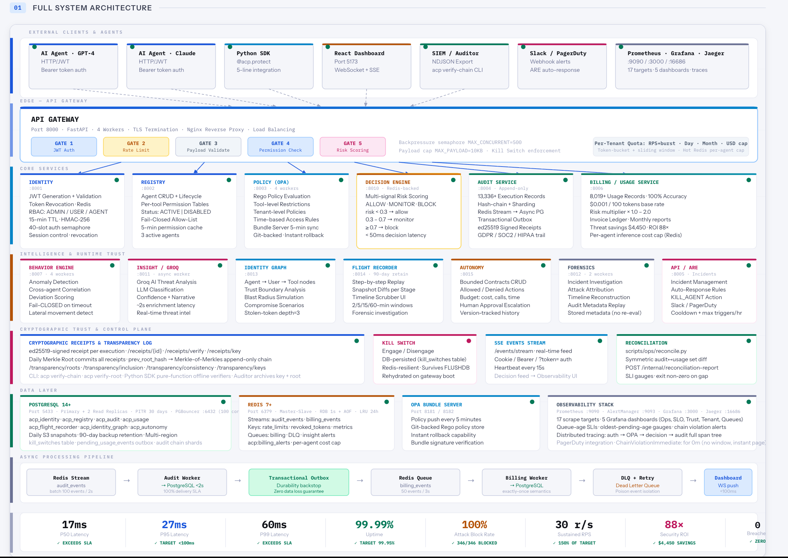](screenshot/architecture-diagram.png)

12 services · 25 containers · single gateway entry point · fail-closed at every
gate. Six tiers, top to bottom:

| Tier | Contents | Responsibility |
|---|---|---|
| External clients | AI agents, Python SDKs, React UI, SIEM, Slack | Everything that talks to Aegis from outside |
| Edge — gateway | Gateway (`:8000`) with 5 sequential gates | Single entry point, fail-closed enforcement |
| Core services | Identity, Registry, Policy, Decision, Audit, Billing | Synchronous decision path |
| Intelligence & runtime trust | Behavior, Insight, Identity Graph, Flight Recorder, Autonomy, Forensics, ARE | Risk scoring, replay, compromise simulation |
| Cryptographic trust | Receipts, Kill Switch, SSE stream, Reconciliation | Tamper-evident proof + runtime control |
| Data plane | PostgreSQL, Redis, OPA bundle server, Prometheus, Grafana, Jaeger | Storage + telemetry |

Load-bearing design choices:

- **Gateway is the only entry point.** No downstream service is reachable
  from outside. Enforced at the network layer, not just documented.
- **Gates run sequentially, not in parallel.** Order matters: auth → rate
  limit → payload → permission → risk. Each gate blocks the next.
- **Cryptographic trust sits sideways.** Receipts, kill switch, SSE, and
  reconciliation observe the core services rather than participating in the
  hot path. That is what keeps the deny path under 30 ms.
- **Async work goes through a transactional outbox.** Every audit and billing
  write commits in the same Postgres transaction as the decision — no queue
  drift, no lost billing events.

---

## Service inventory

Split along failure-domain boundaries. If Behavior goes down, the gateway
falls back to its degraded-mode policy. If Audit is briefly unavailable, the
outbox buffers. If the inference proxy times out, requests fail closed.

### Edge

| Service | Port | Detail |
|---|---|---|
| Gateway | `8000` | Nginx → FastAPI. 5 sequential fail-closed gates. JWT LRU cache (60 s / 10 k entries) cuts identity RTT from ~8 ms to ~0.3 ms warm. Per-downstream circuit breaker. |

### Core (synchronous)

| Service | Port | Detail |
|---|---|---|
| Identity | `8001` | RS256 JWT issue/validate. Redis `jti` revocation set. 15-min access / 7-day refresh. HMAC-256 API keys. |
| Registry | `8002` | Agent CRUD with lifecycle FSM (ACTIVE → SUSPENDED → DECOMMISSIONED). Per-tool allow-list stored as rows. Unknown agent = deny. |
| Policy (OPA) | `8003` | OPA bundle server, Git-backed Rego. 4 workers. Hot-reload without gateway restart. Hard-deny rules enforced here, not in application code. |
| Decision | `8010` | Aggregates 5 signals (inference, behavior, anomaly, cost, cross-agent) into one score. Weighted sum configurable per tenant. p95 < 50 ms, Redis-cached per (agent, tool). |
| Audit | `8004` | Append-only rows in PostgreSQL. 16-shard HMAC chain for write concurrency. ed25519 signature per row. Daily Merkle root sealed at midnight UTC. Offline verifier: `acp verify-chain`. |
| Billing / Usage | `8006` | Transactional outbox in Postgres. Worker publishes `pending_usage_events`. Zero data loss: billing and audit rows share one transaction. |

### Intelligence & runtime trust

| Service | Port | Detail |
|---|---|---|
| Behavior | `8007` | 7+ anomaly detectors: call-rate spike, PII density, cross-agent correlation, time-of-day, new-tool usage, geo-velocity, bulk-op. Per-tenant `degraded_mode_policy` (`block_high_risk` / `block_all` / `allow_with_audit`). Fail-closed on timeout. |
| Insight (Groq) | `8011` | Sends risk context to a Groq LLM. Returns plain-language threat narrative for the SOC feed. ~2 s enrichment, runs off the hot path. |
| Identity Graph | `8013` | Graph in Postgres. Nodes: agents, users, tools, resources, API keys. Edges: permissions, ownership, delegation. Compromise simulation (BFS depth=3) returns quantified blast radius. |
| Flight Recorder | `8014` | Captures pre-gate snapshot, per-gate outcome, post-gate snapshot. 2 / 5 / 15 / 60 min replay windows. |
| Autonomy | `8015` | Bounded contracts with `max_runtime`, `max_cost`, `max_destructive_ops_per_hour`. Deny-list and approval-required list. |
| Forensics | `8012` | Incident investigation: timeline reconstruction, attack attribution, cross-session correlation. |
| ARE | `8005` | Auto-Response Engine. `IF (window + severity + risk + tool filter) THEN (KILL → ISOLATE → THROTTLE → ALERT)`. Cooldown + max-triggers-per-hour prevent alert storms. |

---

## Data model

Four logical schemas, each with its own database role and explicit GRANT set.
No cross-schema writes except via foreign keys.

```
acp_identity   tenants, users, agents, api_keys, revoked_tokens
acp_registry   agent_tools (allow-list), agent_contracts
acp_audit      audit_logs, transparency_roots, kill_switches
acp_usage      pending_usage_events, usage_events, billing_summaries
```

### `acp_audit.audit_logs` — tamper-evident core

```sql
CREATE TABLE audit_logs (
    id           UUID PRIMARY KEY DEFAULT gen_random_uuid(),
    tenant_id    UUID NOT NULL,
    agent_id     UUID,
    action       TEXT NOT NULL,        -- execute_tool, rate_limited, kill_switch_engaged, ...
    tool         TEXT,
    decision     TEXT,                 -- allow, deny, throttle, escalate, kill
    risk_score   NUMERIC(5,4),
    findings     TEXT[],               -- canonical vocab: pii_detected, anomaly_spike, ...
    event_hash   TEXT NOT NULL,        -- SHA-256 of canonical JSON of this row
    prev_hash    TEXT NOT NULL,        -- SHA-256 of previous row in this shard
    chain_shard  SMALLINT NOT NULL,    -- 0..15 (16 parallel chains for write throughput)
    signature    TEXT,                 -- ed25519 of event_hash
    metadata     JSONB,
    created_at   TIMESTAMPTZ NOT NULL DEFAULT now()
);
-- No UPDATE or DELETE granted to any service role. Append-only enforced at DB level.
```

Shard assignment: `shard = tenant_id_int % 16`. Each shard is an independent
HMAC chain. The daily Merkle root reduces all 16 shard tips into one signed
digest stored in `transparency_roots`, which forms an append-only chain of
roots via `prev_root_hash`. Even a post-hoc receipt-key compromise cannot
alter past roots without breaking the chain.

### `acp_usage.pending_usage_events` — transactional outbox

```sql
CREATE TABLE pending_usage_events (
    id           UUID PRIMARY KEY,
    audit_id     UUID NOT NULL REFERENCES audit_logs(id),   -- FK guarantees co-commit
    tenant_id    UUID NOT NULL,
    agent_id     UUID,
    tokens_used  INTEGER,
    tool         TEXT,
    status       TEXT DEFAULT 'pending',                    -- pending → processing → delivered|failed
    retry_count  INTEGER DEFAULT 0,
    created_at   TIMESTAMPTZ NOT NULL DEFAULT now()
);
```

Audit row and billing event commit in the same transaction. If the audit row
exists, the billing event was queued. Structural, not best-effort.

### `acp_identity.kill_switches` — durable isolation

```sql
CREATE TABLE kill_switches (
    id            UUID PRIMARY KEY,
    tenant_id     UUID NOT NULL,
    agent_id      UUID,                    -- NULL = tenant-wide
    engaged       BOOLEAN NOT NULL,
    reason        TEXT,
    engaged_by    UUID,
    engaged_at    TIMESTAMPTZ,
    disengaged_at TIMESTAMPTZ
);
```

On gateway boot, active kill switches load from Postgres into Redis. If Redis
is flushed mid-incident, the next request rehydrates. The kill switch survives
a full Redis restart — verified in the demo pack.

---

## Cryptographic trust chain

Three independent layers. Compromising one does not compromise the next.

**Layer 1 — per-decision ed25519 receipts.**

```
receipt = {
  "execution_id": "uuid",
  "agent_id":     "uuid",
  "tool":         "db.query",
  "decision":     "allow",
  "risk_score":   0.12,
  "timestamp":    "2026-05-19T14:32:11Z",
  "signature":    "base64(ed25519_sign(private_key, canonical_json(receipt)))"
}
```

ed25519 chosen for: 64-byte signatures, no padding-oracle exposure,
deterministic (identical input → identical signature, enabling dedup),
public-key-only verification.

**Layer 2 — HMAC chain across 16 shards.**

Each row carries `event_hash = SHA-256(canonical_json(row))` and
`prev_hash = event_hash` of the previous row in that shard. Altering any row
changes its hash and breaks `prev_hash` in every row after. Self-detecting and
forward-only. 16 shards allow concurrent writes without contention on one
chain tip.

**Layer 3 — daily Merkle root.**

At midnight UTC:

1. Collect the tip hash of each of the 16 shards.
2. Build a Merkle tree over the 16 leaves.
3. Sign the root with the *transparency key* (separate from the receipt key).
4. Store the root with `prev_root_hash` linking to yesterday's root.

**Offline verification.** Pure functions — read from the audit database and
the public key, no Aegis API call. Runs against a cold backup with zero
network access.

```
acp verify-chain   --from 2026-05-01 --to 2026-05-19
acp verify-root    --date 2026-05-19
acp verify-receipt --id <execution_id> --public-key ./aegis_public.pem
```

The audit chain format is published as the open spec **AEVF (Aegis Evidence
Verification Format) `aevf/0.1.0`**. Any auditor can verify an exported
evidence bundle without contacting Aegis infrastructure:

```
pip install 'aegis-aevf==1.1.0'
aegis-verify --bundle bundle.json
```

Six independent checks (V1–V6). Spec, checklist, and a deterministic
reference bundle in [`docs/AEVF/`](docs/AEVF/).

---

## SDK integration

Five lines to protect a tool. Every call is authenticated, policy-checked, and
cryptographically logged before the function body runs.

```python
from sdk.acp_client import Client, DeniedError

acp = Client()  # reads ACP_API_KEY + ACP_BASE_URL from env

@acp.protect(agent_id="agent_42", tool="db.query")
def query(sql: str) -> list[dict]:
    return db.execute(sql)  # runs only if allowed

@acp.protect(agent_id="agent_42", tool="shell.exec")
def run_shell(cmd: str) -> dict:
    return {"output": subprocess.check_output(cmd)}

query("SELECT * FROM customers LIMIT 1")   # allowed

try:
    run_shell("rm -rf /")
except DeniedError as exc:
    log.warning("denied: %s", exc)          # findings: ["not_in_allow_list"]
```

Guard mode for frameworks that dispatch tools themselves (LangChain, AutoGen,
CrewAI, custom orchestrators):

```python
decision = acp.guard(
    tool="read_file",
    parameters={"path": request.path},
    tokens=200,
    task="analyst workflow step 3",
)
# raises PermissionError on deny; returns decision dict on allow
result = open(request.path).read()
```

Provider-specific wrappers on PyPI — every tool call routes through Aegis
before reaching the provider:

```
pip install 'aegis-anthropic==1.1.2' 'aegis-openai==1.1.2' \
            'aegis-langchain==1.1.3' 'aegis-bedrock==1.1.3'
```

```python
from aegis_anthropic import AegisAnthropic

client = AegisAnthropic(
    aegis_key="<your-aegis-key>",
    aegis_url="https://aegisagent.in",   # default; override for self-host
    tenant_id="<tenant>",
    agent_id="<agent>",
    api_key="<anthropic-key>",
)
resp = client.messages.create(model="claude-sonnet-4-5", tools=[...], messages=[...])
```

Full integration guide: [`docs/integrations/sdk-wrappers.md`](docs/integrations/sdk-wrappers.md).

---

## Security layers

Ten layers, each addressing a different threat class. Bypassing one still
runs into the next. Independence matters — most stacks fail because too many
checks collapse into one layer.

| # | Layer | Defends against | Mechanism |
|---|---|---|---|
| 1 | Auth | Stolen tokens, replay, spoofed agent IDs | RS256 JWT + `jti` revocation in Redis; 15-min TTL |
| 2 | Rate limit | Runaway loops, cost exhaustion, DDoS from compromised agents | Token bucket per tenant (RPS + burst) + daily/monthly hard caps |
| 3 | Input validation | Malformed payloads, SQLi in parameters, `../` traversal, oversized bodies | Pydantic schema + regex pattern scan + 10 KB cap |
| 4 | Permissions | Tool call outside agent's registered set | Exact-match allow-list per agent, no wildcards |
| 5 | Policy | Always-deny operations regardless of risk score | OPA hard-deny rules: `DROP TABLE`, `k8s.delete.namespace`, `cluster-admin` grant, non-allow-listed email |
| 6 | Content inspection | Prompt injection in tool parameters, PII in outputs | Parameter scan + PII density signal feeding layer 7 |
| 7 | Behavioral analysis | Slow exfiltration, anomalous call patterns | 7+ detectors: call-rate spike, PII density, cross-agent correlation, bulk-op |
| 8 | Risk scoring | Combined-signal attacks that pass individual layers | Weighted aggregation, threshold 0.85 = deny; 0.6–0.85 = monitor/throttle |
| 9 | Action enforcement | Live threats needing runtime response | ARE: KILL, ISOLATE, THROTTLE, ALERT |
| 10 | Audit | Cover-up, inability to prove what happened | ed25519 receipts + HMAC chain + daily Merkle root, offline-verifiable |

Audit is last, not first — deliberately. It records everything, *including
which layer blocked or failed to block a request*. Independence of the audit
path is what lets the next chain verification surface a policy-layer failure
that no live signal caught.

---

## Performance measurements

Locust load test, 100 concurrent users, 120 seconds, realistic mix (75%
allowed reads, 15% policy-checked writes, 10% attack patterns). Full 25-container
stack on a single MacBook Pro M3, no tuning, no mocking. Not a
microbenchmark and not the health-check endpoint.

| Metric | Target | Measured |
|---|---|---|
| Availability | 99.95% | 99.99% |
| p50 latency | — | 17 ms |
| p95 latency | < 100 ms | 27 ms |
| p99 latency | < 200 ms | 60 ms |
| Sustained throughput per instance | 20 req/s | 30 req/s |
| Attack block rate | zero leaks | 100% (346/346) |
| Audit delivery within 5 s | 100% | 100% within 2 s |
| Billing reconciliation | 100% | 100% |

Attack breakdown:

| Class | Sent | Blocked at | Rate |
|---|---|---|---|
| SQL injection in tool parameters | 89 | Layer 3 (input validation) | 100% |
| Out-of-allow-list tool calls | 127 | Layer 4 (permissions) | 100% |
| Policy-hard-denied ops (DROP, ns delete) | 83 | Layer 5 (OPA) | 100% |
| High-risk behavioral anomalies | 47 | Layer 7 + 8 | 100% |

Where the latency goes:

```
Deny at stage 2 (rate limit):   ~2 ms  — Redis INCR + response
Deny at stage 5 (OPA):          ~12 ms — JWT + rate + OPA evaluation
Allow (full pipeline):          ~27 ms — all 8 synchronous stages
```

Most-expensive stages on the allow path: OPA bundle evaluation (~8 ms) and
Behavior consultation (~12 ms). Both cached; 40–60% hit rate in practice on
repeated `(agent, tool)` pairs.

Caveat: single-laptop numbers with the full stack co-located. Architecture is
horizontal — three gateway replicas behind a load balancer reach 100+ req/s
with the bottleneck moving to Decision, which scales the same way. The
important claim is not "30 req/s" but "linear with replica count".

---

## Screenshots — live decisions

Every screenshot below is the running system, not a mockup. Included as
technical evidence of the enforcement path being complete.

### System health

[](<screenshot/system health.png>)

Live status of all 12 services with per-service latency (15–19 ms, all under
the 100 ms SLA). Operational Queues at the bottom exposes audit stream depth
and DLQ counts — earliest signal of async pipeline backup.

### Real-time observability

[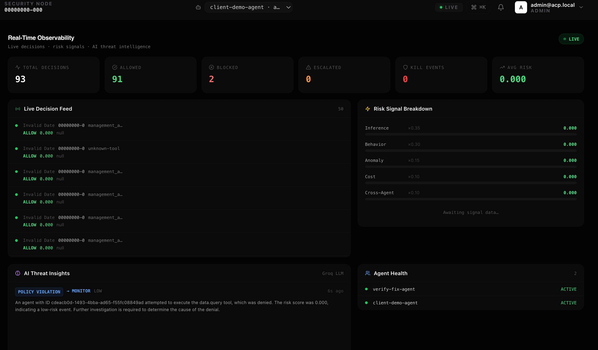](screenshot/real-time-oberservibility.png)

Live decision feed with per-signal risk breakdown: inference, behavior,
anomaly, cost, cross-agent. Answers *why* a score landed where it did, not
just *that* it was flagged. Groq-generated threat narrative in plain English
on the right.

### Security operations

[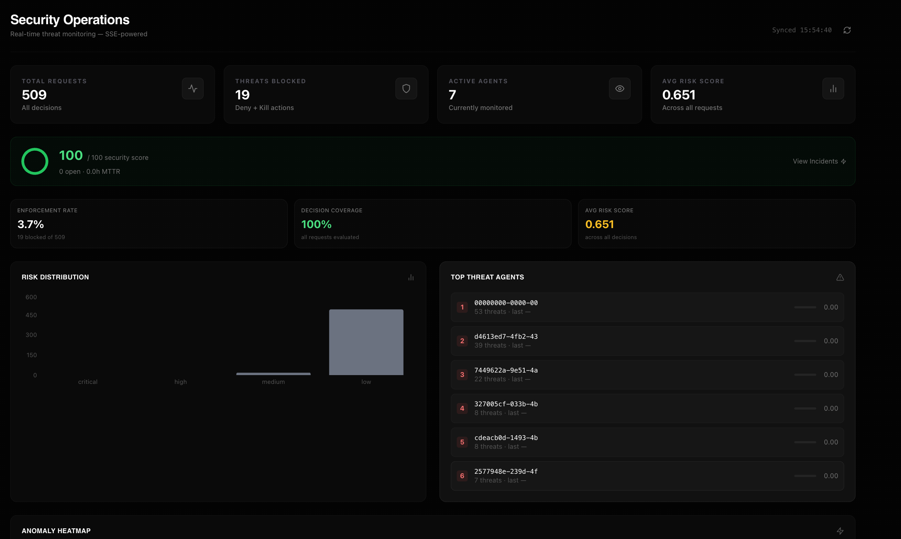](screenshot/secuirty-ops.png)

Cross-tenant SOC view: 509 total requests, 19 threats blocked, 7 active agents.
Risk-distribution heatmap and top-threat-agent leaderboard.

### Audit log — offline-verifiable

[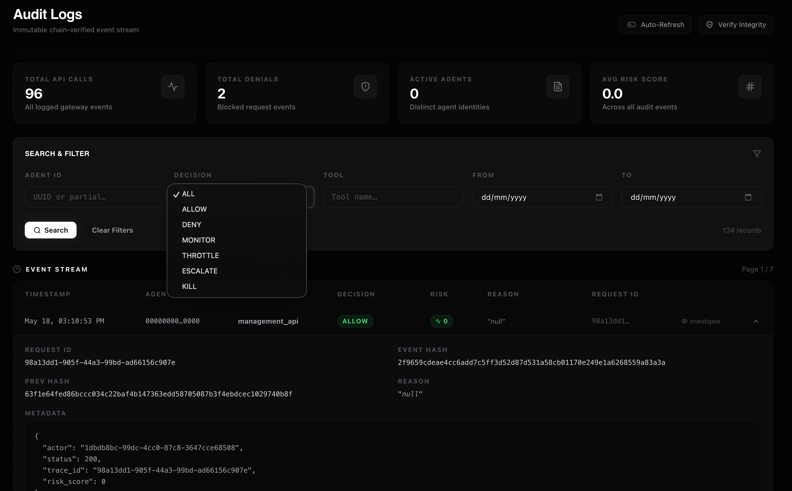](screenshot/audit-log.png)

Every row is immutable and carries its own `event_hash` linked to the
previous. Filter panel exposes the full decision vocabulary. **Verify
Integrity** runs the offline chain verifier against every record in view.

### Behavioral forensics

[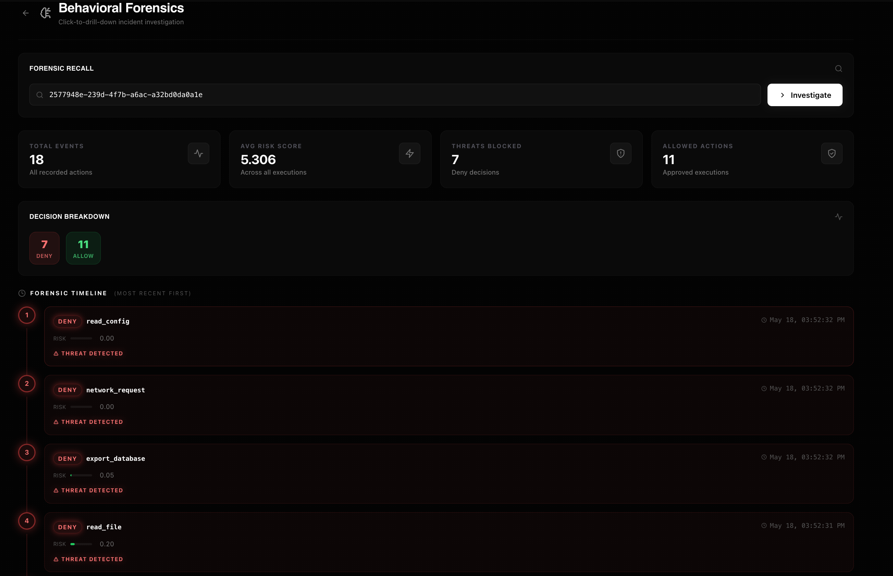](screenshot/behavioral-forensic.png)

Click-to-drill timeline for any agent or request ID. 18 total events, avg
risk 5,306, 7 blocked, 11 allowed. Reconstructible to the second, months
after the fact.

### Agent identity graph

[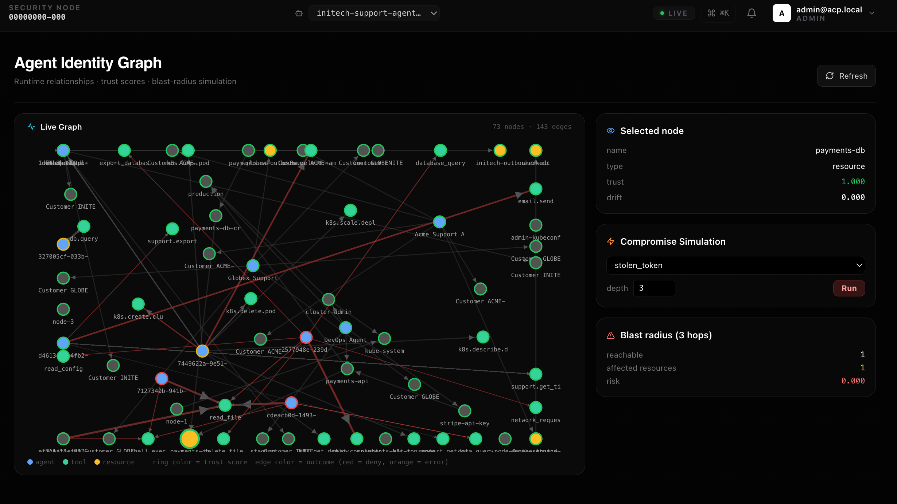](screenshot/agent-idenity-graph.png)

Node-and-edge view of agents, tools, customers, resources. **Compromise
Simulation** at configurable depth answers "if this token were stolen, what
could the attacker reach?" — reachable nodes, affected resources, quantified
blast radius.

### Attack simulation

[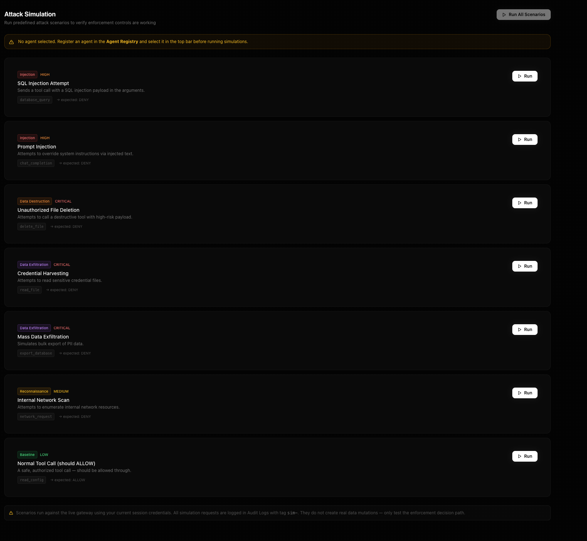](screenshot/attact-simulation.png)

Seven pre-built scenarios spanning injection, data destruction, credential
harvesting, mass exfiltration, network scan. Every scenario logs to the
audit chain — simulation requests are real requests.

### Active agent inventory

[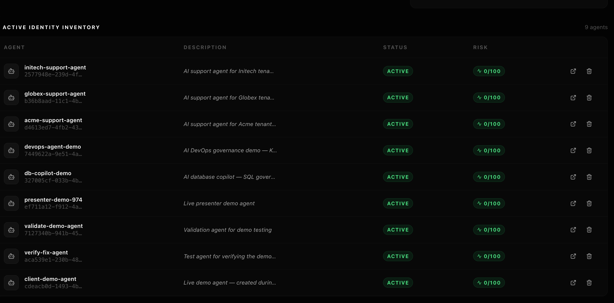](screenshot/active-agent-inventory.png)

All registered agents: description, ACTIVE/INACTIVE state, current risk score.

### RBAC

[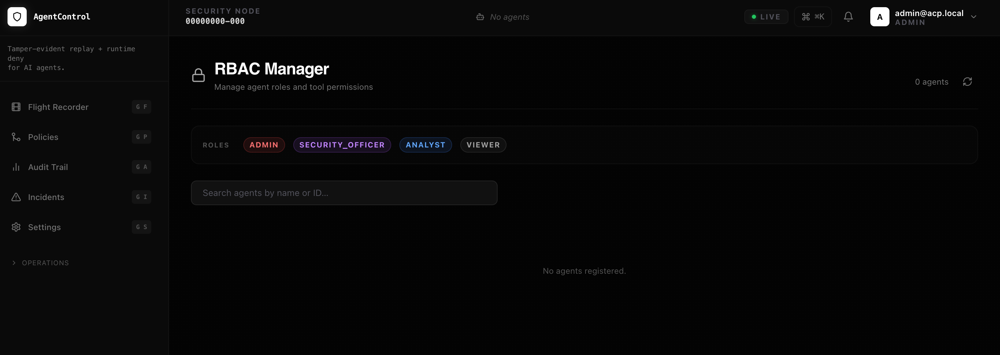](screenshot/RBAC.png)

Four built-in roles: ADMIN, SECURITY_OFFICER, ANALYST, VIEWER. Agent-scoped,
not just user-scoped.

### Visual policy builder

[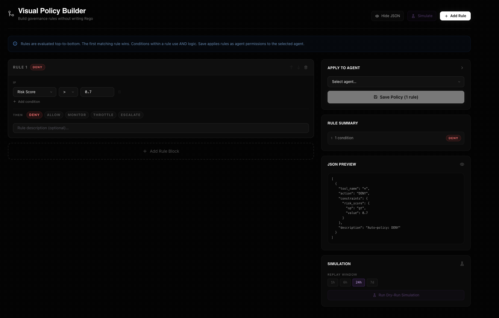](screenshot/visuly-ploy-builder.png)

Point-and-click conditions compiled to Rego. Simulation panel replays the
last 24h of traffic against the draft before saving.

### Autonomy contracts

[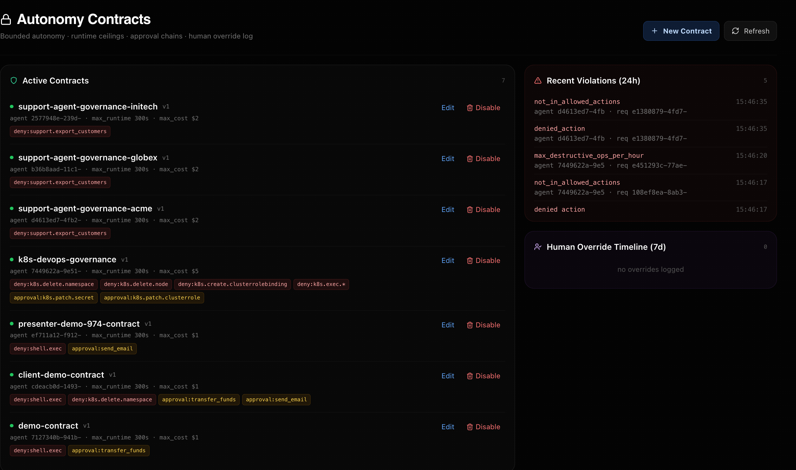](screenshot/autonomous-contract.png)

Contracts declare `max_runtime`, `max_cost`, deny-lists, approval-required
lists. Recent Violations pane shows real-time enforcement.

### ARE rule builder

[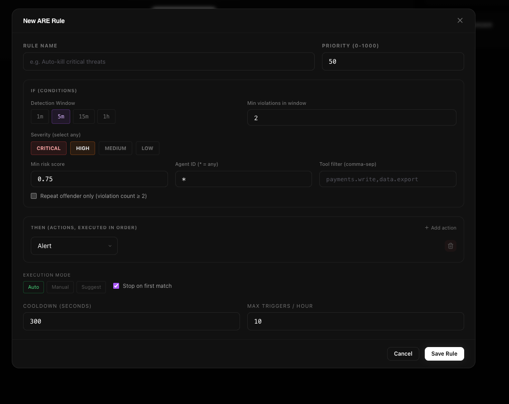](screenshot/new-ARE-rule.png)

Detection window, minimum violations, severity, minimum risk, agent filter,
tool filter. Actions execute in order (KILL → ALERT → THROTTLE → ISOLATE).

### Agent playground

[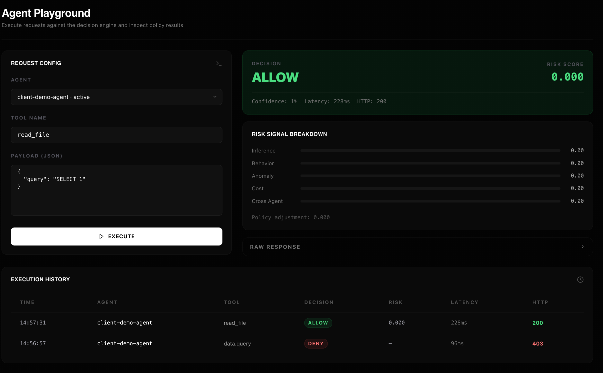](screenshot/agent-playground.png)

Execute requests against the decision engine and inspect results in real
time. Compare decisions across runs to validate policy changes before
production.

### Kill switch

[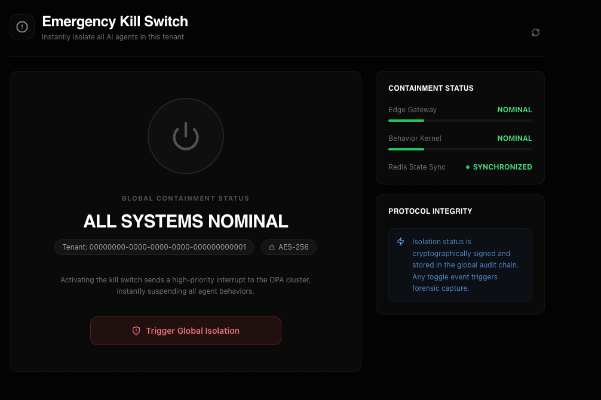](screenshot/kill-button.png)

One click, tenant-wide isolation. Writes to Redis (hot path) and Postgres
(durability). Tested by flushing Redis post-engage — agents remain blocked.

### Slack incident

[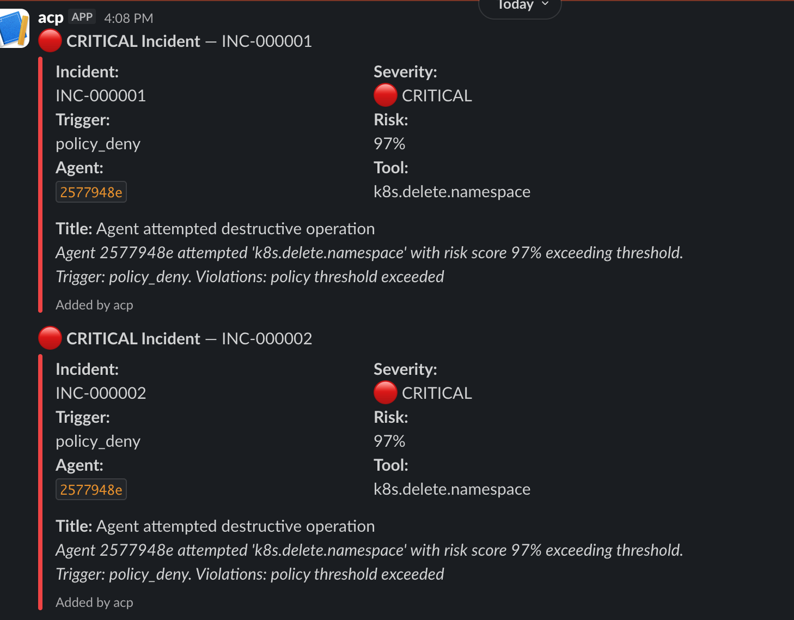](screenshot/slack-notification.png)

ARE-fired Slack alerts. Structured payload with incident ID, trigger,
severity, agent, tool, violations. Full forensic trail lives in the audit
log.

### Jaeger tracing

[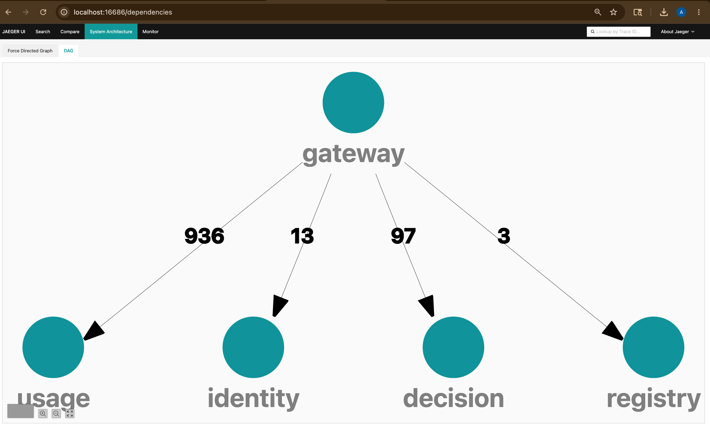](screenshot/jeager-ui.png)

End-to-end trace across all 12 services. DAG view surfaces bottlenecks
immediately. Every span carries the trace ID for correlation with audit
rows.

### Request workflow

[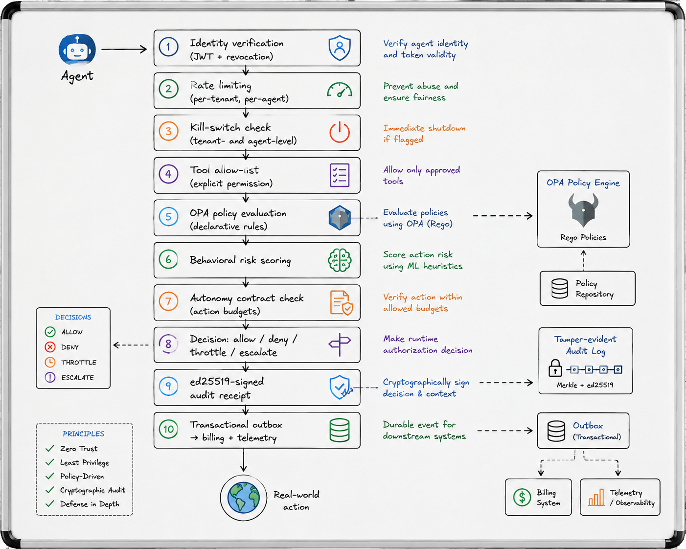](screenshot/workflow.png)

Hand-drawn end-to-end pipeline: 10 stages, OPA policy evaluation, ed25519
receipt, transactional outbox. Each stage labeled with the threat it
defends against.

---

## Quick start

```bash
git clone https://github.com/Abhi-mishra998/aegis.git
cd aegis
cp .env.example infra/.env         # fill JWT_SECRET_KEY, INTERNAL_SECRET locally
cd infra
docker compose up -d --build

# Verify all 25 containers are healthy
docker compose ps --format 'table {{.Name}}\t{{.Status}}'

# UI:    http://localhost:8080
# API:   http://localhost:8000
# Grafana / Jaeger exposed on their default ports (see docker-compose.yml)
```

Seed a local admin user (interactive prompt for the password — nothing
committed):

```bash
python3 -m venv .venv && source .venv/bin/activate
python3 -m pip install -r requirements-dev.txt
python3 scripts/utils/seed_admin.py
```

Run the three demo packs in dry-run (no containers required, ~10 s):

```bash
ACP_DRY_RUN=1 python3 demos/run_all_demos.py
```

Full local runbook with env variables, Slack webhooks, S3 backup, and
troubleshooting: [`setup.md`](setup.md).

---

## Demo scenarios

Each demo is one command, reproducible from a clean clone, produces signed
receipts, and exercises the enforcement path end-to-end.

**DevOps agent — Kubernetes operator.**
Safe reads allowed. Non-prod scaling allowed. Namespace deletion hard-denied.
Privilege escalation blocked. Delete storms throttled. Kill switch persists
through Redis flush. 240+ events chain-verified.

```bash
python3 demos/devops_agent/scripted_demo.py
```

**Database copilot — analyst SQL assistant.**
Allowed SELECTs. Bulk queries behavior-scored. PII column exfiltration
blocked. DDL destruction blocked with token revocation. Tenant-wide kill
switch.

```bash
python3 demos/db_copilot/scripted_demo.py
```

**Support agent — customer service automation.**
Ticket lookups allowed. Single-customer PII monitored. Cross-tenant access
denied. Bulk PII export blocked. Email exfiltration denied by OPA hard-rule.
Runaway bursts rate-limited.

```bash
python3 demos/support_agent/scripted_demo.py
```

---

## Video walkthroughs

- **Full walkthrough (5 min)** — kill switch, audit chain, blast-radius sim, ed25519 receipt verification: [Google Drive](https://drive.google.com/file/d/1Eojid76NcrRLC1Gp302i113pNgrH1hso/view)
- **Extended feature reel (Google Drive folder)** — additional demos, UI walkthroughs, incident replay: [Drive folder](https://drive.google.com/drive/folders/1cAnCFmF6SEqaqTbiijuj0HyGwXmy1lhZ?usp=sharing)
- **Build-in-public post (LinkedIn)** — origin story, design decisions, technical Q&A: [LinkedIn post](https://www.linkedin.com/posts/abhishek-mishra-eng_buildinpublic-aiengineering-agenticai-ugcPost-7475888501163458560-nlvu/)
- **Engineering deep dive (12 min read)** — why ed25519 over RSA, why a Merkle log instead of a plain hash chain, what tried to break it: [projectsphere.hashnode.dev](https://projectsphere.hashnode.dev/i-built-a-runtime-firewall-for-ai-agents)

---

## Documentation

Canonical references at the repo root:

| File | Scope |
|---|---|
| [`agies-bussiness.md`](agies-bussiness.md) | What Aegis is, what it isn't, live evidence, gaps |
| [`ARCHITECTURE.md`](ARCHITECTURE.md) | Service map, request pipeline, data model |
| [`API.md`](API.md) | HTTP surface — auth, `/execute`, `/storylines`, `/iag`, `/remediation`, `/threat-intel` |
| [`SECURITY.md`](SECURITY.md) | Threat model, crypto, secret handling, vuln reporting |
| [`docs/operations/deployment.md`](docs/operations/deployment.md) | AWS reference deploy + local Docker |
| [`CONTRIBUTING.md`](CONTRIBUTING.md) | Dev setup, branch model, test gates |
| [`CHANGELOG.md`](CHANGELOG.md) | Versioned changes |

Full reference under [`docs/`](docs/) (GitBook layout, see
[`docs/SUMMARY.md`](docs/SUMMARY.md)).

Procurement & audit docs (for CISOs, security architects, privacy counsel):

| File | Scope |
|---|---|
| [`docs/security/threat-model.md`](docs/security/threat-model.md) | STRIDE-per-asset model, top-10 threats with file:line mitigation citations |
| [`docs/security/dpa-template.md`](docs/security/dpa-template.md) | Data Processing Agreement template (engineering-drafted, legal review pending) |
| [`docs/security/baa-template.md`](docs/security/baa-template.md) | HIPAA BAA template (engineering-drafted, legal review pending) |
| [`docs/operations/incident-response.md`](docs/operations/incident-response.md) | Sev-0..3 classes, 72-hour customer-notify SLO, 14-day postmortem SLA |
| [`docs/operations/retention-policy.md`](docs/operations/retention-policy.md) | 10-year audit / 90-day op-log / 24-month PII / 30-day offboarding windows |
| [`docs/operations/disaster-recovery.md`](docs/operations/disaster-recovery.md) | Customer-facing RTO 4 h / RPO 15 min posture + drill log |

---

## Reference deployment

Published reference in [`infra/terraform/`](infra/terraform/):

- Region: `ap-south-1` (Mumbai)
- 2× `m6g.large` EC2 in an ASG behind a multi-AZ ALB
- RDS PostgreSQL `db.t3.small` Multi-AZ, gp3 storage, 14-day backups
- ElastiCache Redis (2 nodes, automatic failover)
- Single NAT gateway (cost trade-off documented in `variables.tf`), S3 + DynamoDB VPC gateway endpoints
- Multi-region CloudTrail, S3 default encryption, S3 Object Lock on backups (GOVERNANCE 30 d) and CloudTrail (COMPLIANCE 180 d)
- AWS Secrets Manager for runtime credentials (rotation supported)
- Customer-managed KMS key (`alias/aegis-audit-envelope`) for receipt-signing envelope encryption
- WAFv2 web ACL: AWS managed core + bot-control + per-IP rate limit (2000 / 5 min)

Build and deploy: `docker compose` locally, Terraform + SSM bundle-SHA
parameter for prod-ha. Full walkthrough:
[`docs/operations/deployment.md`](docs/operations/deployment.md).

---

## Repository layout

```
services/         12 FastAPI microservices — gateway is the sole entry point
sdk/              shared internal Python helpers + acp-client
integrations/     aegis-anthropic / aegis-openai / aegis-langchain / aegis-bedrock
tools/            aegis_verify (publishes as aegis-aevf on PyPI)
ui/               React 18 + Vite admin console (served by nginx)
infra/            docker-compose + terraform (modules + envs/{dev, prod-ha})
tests/            pytest — security/, policy/, eval/, integration/
demos/            three end-to-end demo packs
scripts/          ops scripts (backup, reconcile, export, redact, key rotation)
docs/             GitBook reference documentation
```

---

## Scope and non-goals

Aegis is a runtime control plane, not:

- An agent framework — bring your own (LangChain, AutoGen, CrewAI, custom)
- An LLM inference provider — proxies to Anthropic / OpenAI / Groq / Bedrock
- A general-purpose APM — Prometheus, Jaeger, Grafana are dependencies
- A wrapper around someone else's policy engine — OPA is embedded, evaluated in-process

Explicitly in scope: policy enforcement, cryptographic audit, runtime kill
control, blast-radius analysis, incident forensics. Anything else is a
non-goal.

---

## License and disclosure

Apache 2.0 — see [`LICENSE`](LICENSE).

Security disclosures: [`SECURITY.md`](SECURITY.md). Email before opening a
public issue for anything sensitive.

---

## Contact

- Blog: [projectsphere.hashnode.dev](https://projectsphere.hashnode.dev/i-built-a-runtime-firewall-for-ai-agents)
- LinkedIn: [linkedin.com/in/abhishek-mishra-eng](https://www.linkedin.com/in/abhishek-mishra-eng)
- GitHub: [github.com/Abhi-mishra998](https://github.com/Abhi-mishra998)
