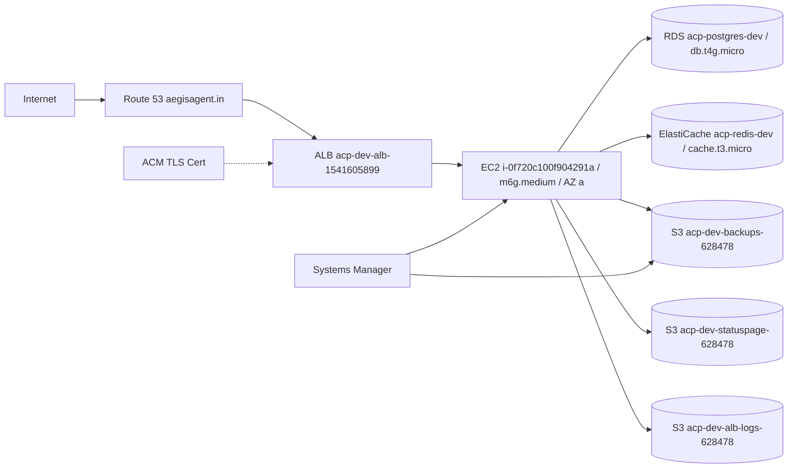
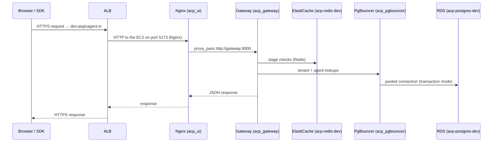
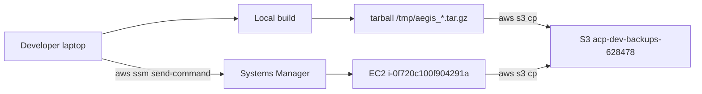

# Deployment Topology

*One EC2 host behind an ALB at `dev.aegisagent.in`. Twenty-two containers. One Single-AZ RDS Postgres, one ElastiCache Redis node, three S3 buckets. Deployed by tarball plus SSM, not by GitHub Actions.*

This page describes the current live deployment. As of 2026-06-01 the historical two-EC2 production stack at `aegisagent.in` was decommissioned (see the prod-cleanup catalogue at `aws-delete.md`); the dev stack documented here is the only live footprint and is sized for ten concurrent reviewers. Self-hosted installs follow the same shape with the AWS-specific pieces swapped for local equivalents.

## The diagram



## Inventory at a glance

| Resource | Instance | Region | AZ |
|---|---|---|---|
| ALB | `acp-dev-alb-1541605899` (ALB type, HTTPS:443 + HTTP:80 → HTTPS redirect) | `ap-south-1` | `a`, `b` (the ALB spans both even though traffic lands on `a`) |
| EC2 | `i-0f720c100f904291a` (`m6g.medium`, 1 vCPU / 4 GB Graviton, 50 GB gp3) | `ap-south-1` | `a` |
| RDS | `acp-postgres-dev` (Postgres 15.18, `db.t4g.micro`, 20 GB, Single-AZ) | `ap-south-1` | `a` |
| ElastiCache | `acp-redis-dev` (Redis 7.1, single `cache.t3.micro`) | `ap-south-1` | `a` |
| S3 — deploys + backups | `acp-dev-backups-628478` (versioned, 30-day expiry) | `ap-south-1` | — |
| S3 — public status page | `acp-dev-statuspage-628478` (public-read, 30-day expiry) | `ap-south-1` | — |
| S3 — ALB logs | `acp-dev-alb-logs-628478` (14-day expiry) | `ap-south-1` | — |
| ACM cert | DNS-validated cert for `dev.aegisagent.in` | `ap-south-1` | — |
| Route 53 | hosted zone `aegisagent.in`; alias record `dev → ALB` | global | — |
| Terraform state | `s3://aegis-terraform-state-628478946931/dev/terraform.tfstate` with DynamoDB lock `aegis-terraform-locks` | `ap-south-1` | — |

Sizing notes:

- **EC2 = `m6g.medium`** because `t4g.small` (2 GB) OOMed during the initial healthcheck race (Postgres-dependent services exit 255 on DNS-then-connect timeouts). `t4g.medium` and `t4g.large` returned `InsufficientInstanceCapacity` in `ap-south-1a` on the resize attempt. `m6g.medium` was immediately available and has run the 22-container stack steadily.
- **RDS = `db.t4g.micro` Single-AZ** for cost. Multi-AZ would double the bill; on a 10-reviewer footprint the dev RDS is fronted by a daily snapshot and 7-day automated backups.
- **No NAT** — the EC2 is in a public subnet so egress to S3 / SSM / RDS / inference providers goes via the IGW. A NAT would cost ~$32/mo for no real security gain at this footprint.

## What runs on the EC2

`docker compose` against `infra/docker-compose.yml` plus the dev override `infra/docker-compose.aws.yml`. The full container set is:

| Container | Image | Internal port | Purpose |
|---|---|---|---|
| `acp_gateway` | `infra-gateway` | 8000 | The 11-stage middleware pipeline |
| `acp_identity` | `infra-identity` | 8000 | JWT, users, SSO, agent creds |
| `acp_registry` | `infra-registry` | 8000 | Agents and permissions |
| `acp_policy` | `infra-policy` | 8000 | OPA bundle host + simulate |
| `acp_decision` | `infra-decision` | 8000 | Risk synthesis + kill switch |
| `acp_behavior` | `infra-behavior` | 8000 | Behavioural firewall |
| `acp_audit` | `infra-audit` | 8000 | Audit chain + transparency roots |
| `acp_usage` | `infra-usage` | 8000 | Billing outbox consumer |
| `acp_api` | `infra-api` | 8000 | Incidents, API keys, webhooks |
| `acp_forensics` | `infra-forensics` | 8000 | Investigation, replay, blast-radius |
| `acp_flight_recorder` | `infra-flight_recorder` | 8000 | Execution timelines |
| `acp_identity_graph` | `infra-identity_graph` | 8000 | Graph nodes and edges |
| `acp_autonomy` | `infra-autonomy` | 8000 | Contracts and playbooks |
| `acp_insight` | `infra-insight` | 8000 | Audit aggregates (HTTP) |
| `acp_ui` | `infra-ui` (nginx 1.30) | 80 | SPA shell + reverse proxy to gateway |
| `acp_pgbouncer` | `edoburu/pgbouncer:latest` | 6432 | Postgres connection pool against dev RDS |
| `acp_opa` | `openpolicyagent/opa:latest-debug` | 8181 | OPA policy engine |
| `acp_bundle_server` | `python:3.11-slim` | 8182 | Serves OPA bundles to OPA |
| `acp_prometheus` | `prom/prometheus:v2.55.1` | 9090 | Metrics scrape |
| `acp_grafana` | `grafana/grafana:11.3.0` | 3000 | Dashboards |
| `acp_jaeger` | `jaegertracing/all-in-one:1.57` | 16686 | OpenTelemetry trace UI |
| `acp_alertmanager` | `prom/alertmanager:v0.27.0` | 9093 | Alert routing |

Total: **22 containers**. The historical `groq_worker` block was removed from `docker-compose.aws.yml` (it referenced a deleted service); `insight_worker` is present in the image but kept stopped (`--restart=no`) on dev because the `GROQ_API_KEY` Secrets Manager entry is deliberately `EMPTY` and the worker hard-fails on a missing key.

Notably **absent** vs the historical prod compose: `acp_postgres`, `acp_postgres_replica`, and `acp_redis` containers. The dev override removes them entirely — every DSN points at RDS / ElastiCache. Local-laptop dev still runs the in-compose Postgres + Redis from the base file.

All inter-service traffic uses Docker network `infra_default`. Both the compose service name (`gateway`) and the container name (`acp_gateway`) resolve to the same IP on this network. The internal port is **always `:8000`** for every application service — only host-side port mappings vary by environment.

## How requests flow



The ALB target group health checks hit `/health` on port 5173 (the Nginx port the ALB targets). When the single target fails 3 consecutive checks the ALB returns 503 — there is no second EC2 to fail over to today. Restoring service means rebooting / recreating the EC2 or re-running the deploy.

## DNS and TLS

- `aegisagent.in` is a Route 53 hosted zone.
- An alias `A` record points `dev.aegisagent.in` at the ALB.
- ACM provides a DNS-validated cert for the `dev` subdomain only — the wildcard cert from the prod environment is gone.
- HTTP is redirected to HTTPS at the ALB listener.

## Networking

- The EC2 is in a public subnet — direct IGW egress, no NAT cost.
- RDS and ElastiCache sit in private DB subnets (`10.10.3.0/24`, `10.10.4.0/24`) restricted to the EC2 security group.
- Egress from the EC2 is open (security-group default) for S3 / SSM / RDS / ElastiCache / inference providers / outbound webhooks.
- VPC CIDR `10.10.0.0/16` (intentionally different from the historical prod `10.0.0.0/16` so the two could peer if needed; with prod gone, the prod VPC was deleted alongside its EC2s).

## Deployment flow

Aegis dev is deployed without GitHub Actions touching the EC2:



- No GitHub credentials on the EC2; the instance role has S3 read for `acp-dev-backups-628478` and SSM agent permissions only.
- A deploy is one S3 upload plus one SSM `send-command`. The SSM script extracts the tarball, runs `docker compose build <service>`, then `up -d --force-recreate --no-deps <service>`.
- Per-service recipes live in [Deployment](../operations/deployment.md) — single-service, UI-only, and multi-service flows are catalogued there, along with eleven non-obvious bugs the 2026-06-01 dev rebuild surfaced (ALB deletion protection, S3 versioned-bucket destroy, macOS AppleDouble null bytes, `.local` TLD validation, etc.).

### Rollback

S3 keeps every deploy bundle under `deployments/`. A rollback is the same SSM command with the previous S3 key. There is no in-place revert mechanism.

## Local development

Developers run the whole stack locally with:

```bash
cd infra
docker compose up -d --build
```

Locally the base `docker-compose.yml` brings up `acp_postgres`, `acp_postgres_replica`, and `acp_redis` containers so the laptop needs no external dependencies. The local UI is at `http://localhost:5173`, the gateway at `http://localhost:8000`. `scripts/utils/seed_admin.py` provisions an `admin@acp.local` user (the gateway's email validator was updated 2026-06-01 to accept `.local` TLDs — see `services/gateway/routers/auth.py`); `demos/*/setup_demo.py` populates agents and demo data.

The SDK at `sdk/` is installable in editable mode (`pip install -e .`) so SDK changes are exercised against the live local stack.

## Observability deployment

Prometheus, Grafana, Jaeger, and Alertmanager run as containers on the EC2. They are accessed via SSM port-forwarding rather than exposed publicly:

```bash
aws ssm start-session --region ap-south-1 \
  --target i-0f720c100f904291a \
  --document-name AWS-StartPortForwardingSession \
  --parameters '{"portNumber":["3000"],"localPortNumber":["3000"]}'
```

Same recipe with `9090` for Prometheus, `16686` for Jaeger, `9093` for Alertmanager. Long-term these would move to a dedicated observability VPC; today they share the application VPC.

## Backup and restore posture

- Daily `pg_dump` of every application database, encrypted with `age`, uploaded to `acp-dev-backups-628478`.
- `transparency_roots` are snapshotted nightly to the same bucket so the cryptographic chain can be recovered even from a full-database loss.
- RDS automated backups: 7-day retention.
- Restore drills run from `scripts/ops/restore_drill.sh` against a separate VPC (skipped in dev — drilled in prod historically; see [Backup & Restore](../operations/backup-restore.md)).

## Cost envelope

The 2026-05 dev rebuild was sized to a $60/month budget alert (the budget threshold is wired in `infra/terraform/environments/dev/main.tf`). Actual on-demand spend at the current footprint:

| Resource | Approx monthly |
|---|---|
| EC2 `m6g.medium` on-demand | ~$28 |
| RDS `db.t4g.micro` Single-AZ + 20 GB gp3 | ~$15 |
| ElastiCache `cache.t3.micro` | ~$9 |
| ALB | ~$18 (mostly hours + LCU) |
| S3 + data transfer | ~$3 |
| **Total** | **~$73** |

Above the $60 alert by design — the alert fires at 80% (~$48 actual) and 100% so operators see the burn rate. Scaling down to a single t3.micro tier across the board would push under $25/mo at the cost of slower starts.

## What this topology does NOT include

- **High availability.** Single EC2, single RDS AZ. A host or AZ failure means downtime until a recreate.
- **CDN for static assets.** The SPA bundle is served by Nginx directly. A CDN can be added without code changes.
- **Service mesh.** Internal traffic is plain HTTP over the Docker network. mTLS is a future hardening.
- **Multi-region.** `ap-south-1` only.

These are intentional at a 10-reviewer footprint. A multi-instance production rollout would step EC2 up to `m6g.large`, RDS to Multi-AZ, add a second EC2 in `ap-south-1b`, and add a NAT for the private-subnet egress story.

## Next

- [System Overview](system-overview.md) — the application services that run on this host
- [Deployment](../operations/deployment.md) — the runbook for the SSM-based deploy flow with the 11 catalogued bugs
- [Backup & Restore](../operations/backup-restore.md) — what RDS does for you and what the operator does on top
- [Observability](../operations/observability.md) — Prometheus, Grafana, Jaeger access and dashboards
