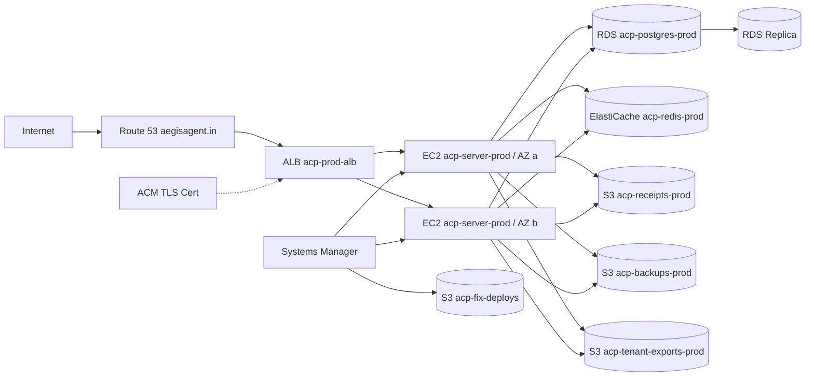
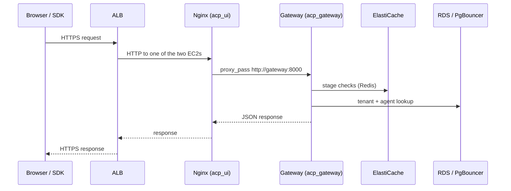
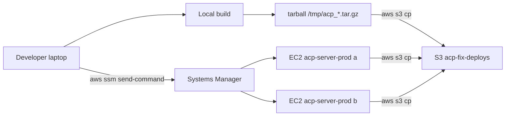

# Deployment Topology

*Two EC2 hosts behind an ALB at `aegisagent.in`. Twenty-seven containers per host. One RDS Postgres, one ElastiCache Redis, three S3 buckets. Deployed by tarball plus SSM, not by GitHub Actions.*

This page describes the production deployment of Aegis as it runs today. It is the topology used at the public demo and is the reference shape for self-hosted installs.

## The diagram



## Inventory at a glance

| Resource | Instance | Region | AZ |
|---|---|---|---|
| ALB | `acp-prod-alb` (ALB type, dualstack) | `ap-south-1` | `a`, `b` |
| EC2 #1 | `acp-server-prod` | `ap-south-1` | `a` |
| EC2 #2 | `acp-server-prod` | `ap-south-1` | `b` |
| RDS primary | `acp-postgres-prod` (Postgres 15) | `ap-south-1` | `a` |
| RDS replica | `acp-postgres-prod-replica` | `ap-south-1` | `b` |
| ElastiCache | `acp-redis-prod` (Redis 7, single node + read replica) | `ap-south-1` | `a`, `b` |
| Target group | `acp-ui-tg` (port 5173 on the EC2s) | `ap-south-1` | — |
| ACM cert | wildcard for `*.aegisagent.in` | `ap-south-1` | — |
| Route 53 | hosted zone `aegisagent.in` | global | — |

Capacity sizing is `t3.xlarge` for the EC2s, `db.t3.medium` for RDS, `cache.t3.micro` for ElastiCache. The platform is deployment-budget conscious for the demo; production for paying customers would step up the EC2 and RDS instance classes.

## What runs on one EC2

Each EC2 runs Docker Compose against `infra/docker-compose.yml`. The full container set is:

| Container | Image | Port (host:container) | Purpose |
|---|---|---|---|
| `acp_gateway` | `infra-gateway` | n/a (proxied via Nginx) | The 11-stage middleware |
| `acp_identity` | `infra-identity` | 8002:8000 | JWT, users, SSO, agent creds |
| `acp_registry` | `infra-registry` | 8001:8000 | Agents and permissions |
| `acp_policy` | `infra-policy` | 8003:8000 | OPA bundle host + simulate |
| `acp_decision` | `infra-decision` | 8004:8000 | Risk synthesis |
| `acp_behavior` | `infra-behavior` | 8005:8000 | Behavioral firewall |
| `acp_audit` | `infra-audit` | 8006:8000 | Audit chain + transparency root |
| `acp_usage` | `infra-usage` | 8007:8000 | Billing outbox consumer |
| `acp_api` | `infra-api` | 8010:8000 | Incidents, API keys, webhooks |
| `acp_forensics` | `infra-forensics` | 8011:8000 | Investigation, replay, blast-radius |
| `acp_flight_recorder` | `infra-flight_recorder` | 8012:8000 | Execution timelines |
| `acp_identity_graph` | `infra-identity_graph` | 8013:8000 | Graph nodes and edges |
| `acp_autonomy` | `infra-autonomy` | 8015:8000 | Contracts and playbooks |
| `acp_insight` | `infra-insight` | n/a | Audit aggregates (HTTP) |
| `acp_insight_worker` | `infra-insight` | n/a | Audit aggregates (worker) |
| `acp_groq_worker` | `infra-groq_worker` | n/a | Inference stream consumer |
| `acp_ui` | `infra-ui` (Nginx 1.30) | 80:80, 5173:80 | SPA shell + reverse proxy to gateway |
| `acp_postgres` | `postgres:15` | 5433:5432 | Local Postgres (production uses RDS) |
| `acp_postgres_replica` | `postgres:15` | n/a | Local replica (production uses RDS replica) |
| `acp_pgbouncer` | `edoburu/pgbouncer:latest` | 6432:6432 | Postgres connection pool |
| `acp_redis` | `redis:7` | 6379:6379 | Local Redis (production uses ElastiCache) |
| `acp_opa` | `openpolicyagent/opa:latest-debug` | 8181:8181 | OPA policy engine |
| `acp_bundle_server` | `python:3.11-slim` | 8182:8182 | Serves OPA bundles to OPA |
| `acp_prometheus` | `prom/prometheus:v2.55.1` | 9090:9090 | Metrics scrape |
| `acp_grafana` | `grafana/grafana:11.3.0` | 3000:3000 | Dashboards |
| `acp_jaeger` | `jaegertracing/all-in-one:1.57` | 16686:16686 | OpenTelemetry trace UI |
| `acp_alertmanager` | `prom/alertmanager:v0.27.0` | 9093:9093 | Alert routing |

Total: 27 containers per host. The `acp_postgres`, `acp_postgres_replica`, and `acp_redis` containers exist for local development; in production they are present but their DSNs in the application services are overridden to point at RDS and ElastiCache via `.env`.

The two EC2s are not actively peered — they both connect independently to the same RDS and ElastiCache. The ALB serves a 50/50 split between them. There is no shared filesystem; receipts and tenant exports go to S3.

## How requests flow



The ALB target group health checks hit `/health` on port 5173 (the Nginx port the ALB targets). When a target fails 3 consecutive checks it is taken out of rotation; ALB returns 503 only if both EC2s are unhealthy.

## DNS and TLS

- `aegisagent.in` is a Route 53 hosted zone.
- An `A` record (alias) points the apex at the ALB.
- ACM provides a wildcard cert for `*.aegisagent.in` attached to the HTTPS listener.
- HTTP is redirected to HTTPS at the ALB.

## Networking

- Both EC2s sit in private subnets with a NAT for outbound (S3, SSM, RDS).
- The ALB sits in public subnets with internet gateway.
- RDS and ElastiCache sit in private DB subnets, restricted to the EC2 security group.
- Egress from the EC2s is restricted to: RDS endpoints, ElastiCache endpoints, S3 (via VPC endpoint), SSM, Anthropic / Groq for inference, and outbound webhook targets.

## Deployment flow

Aegis is deployed without GitHub Actions touching the production hosts. The full path is:



The reasons:

- No GitHub credentials live on the EC2s; the EC2 instance role only has S3 read for the deploy bucket and SSM agent permissions.
- A deploy is one S3 upload plus one SSM `send-command` to both instances. Failures on one instance do not block the other.
- For UI-only changes, only `ui/dist` and `ui/nginx.conf` are tar'd and the deploy script only rebuilds `acp_ui` with `--no-cache` (to bust the Docker COPY layer).
- For backend changes, the affected service folders are tar'd and only those services are rebuilt and recreated with `--no-deps --force-recreate` so the rest of the stack stays up.

The deploy script that the SSM command runs lives at `scripts/ops/deploy_from_s3.sh` (committed). The SSM document is `AWS-RunShellScript` with parameters supplied at send-time.

### Rollback

A rollback is "deploy the previous tarball". S3 keeps every deploy bundle for 7 days. A rollback is the same flow with the previous bundle's S3 key. There is no in-place revert mechanism; the contract is "the active bundle is whatever was last deployed".

## Local development

Developers run the whole stack locally with:

```bash
cd infra
docker compose up -d --build
```

This brings up all 27 containers including `acp_postgres`, `acp_postgres_replica`, and `acp_redis` so no external dependencies are required. The local UI is at `http://localhost:5173`, the gateway at `http://localhost:8000`. The bundled `seed_admin.py` provisions an `admin@acp.local` user; `demos/*/setup_demo.py` populates agents and demo data.

The `pyproject.toml` ships an SDK at `sdk/` that is installable in editable mode (`pip install -e .`) so SDK changes are exercised against the live local stack.

## Observability deployment

Prometheus, Grafana, Jaeger, and Alertmanager run as containers on each EC2. They are accessed via SSH port-forwarding rather than exposed publicly:

```bash
ssh -i <path-to-your-ec2-key.pem> ubuntu@<ec2-ip> \
  -L 3000:localhost:3000 \   # Grafana
  -L 9090:localhost:9090 \   # Prometheus
  -L 16686:localhost:16686   # Jaeger
```

The operator-facing access pattern is documented in `docs/ops_metrics.md`. Long-term, these would move to a dedicated observability VPC; today they share the application VPC.

## Backup and restore posture

- Nightly `pg_dump` of every application database, encrypted with `age`, uploaded to `acp-backups-prod`.
- `transparency_roots` are also snapshotted nightly to the same bucket so the cryptographic chain can be recovered even from a full-database loss.
- Restore drills run from `scripts/ops/restore_drill.sh` against a separate VPC to verify the dumps are usable.
- See [Backup & Restore](../operations/backup-restore.md).

## Self-hosted alternative

The same compose file runs on a single host. The minimum self-hosted footprint is:

- One Linux VM (t3.large or larger)
- 80 GB SSD
- Outbound to S3-equivalent or local disk for receipts
- Outbound to the inference provider (Anthropic, Groq, or self-hosted vLLM)
- Inbound from agents on port 8000 (gateway) and humans on port 5173 (Nginx)

Self-hosted installs lose the ALB-managed cert renewal, the RDS automatic backups, and the cross-AZ failover. The trade is operational simplicity — the demo deployment is what runs at `aegisagent.in`; the single-VM deployment is what most evaluation installs look like.

## What this topology does NOT include

- **Per-tenant database isolation** — see [Multi-Tenancy](multi-tenancy.md). Tenant rows share Postgres tables.
- **Per-region deployment** — the current production is `ap-south-1` only. Multi-region is a customer-funded deployment.
- **CDN for static assets** — the SPA bundle is served by Nginx directly. A CDN can be added without code changes.
- **Service mesh** — internal traffic is plain HTTP over the Docker network. mTLS between services is a future hardening.

## Next

- [System Overview](system-overview.md) — the application services that run on these hosts.
- [Deployment](../operations/deployment.md) — the runbook for the SSM-based deploy flow.
- [Backup & Restore](../operations/backup-restore.md) — what RDS does for you and what the operator does on top.
- [Observability](../operations/observability.md) — Prometheus, Grafana, Jaeger access and dashboards.
