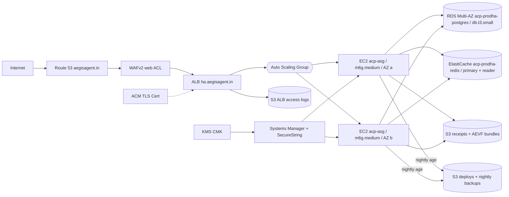
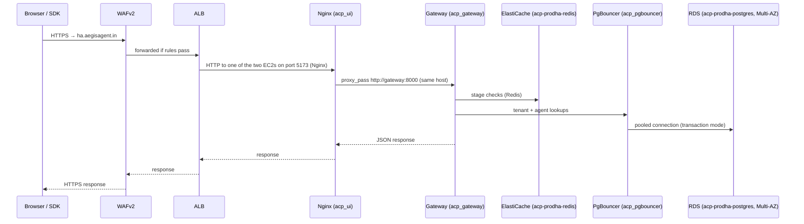
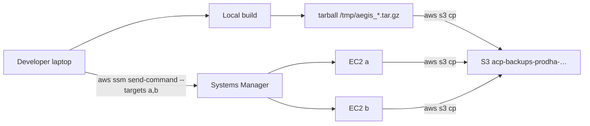

# Deployment Topology

*A 2× EC2 Auto Scaling Group behind an ALB at `ha.aegisagent.in`. Twenty-two containers per host. RDS Multi-AZ Postgres, an ElastiCache replication group (primary + reader), WAFv2 in front, KMS-rooted ed25519 signing keys in SSM SecureString. Deployed by tarball + SSM, not by GitHub Actions.*

This page describes the current live deployment as of 2026-06-13. The earlier
single-EC2 dev (formerly at `dev.aegisagent.in`) and the 2026-06-01
single-EC2 reference have both been folded into one URL —
`ha.aegisagent.in` — and a Multi-AZ HA stack. Self-hosted installs follow
the same shape with the AWS-specific pieces swapped for local equivalents.

## The diagram



## Inventory at a glance

| Resource | Instance | Region | AZ |
|---|---|---|---|
| WAFv2 | `acp-prodha-web-acl` (Common rules + KnownBadInputs + SQLi + per-IP rate limit) | `ap-south-1` | — |
| ALB | `acp-prodha-alb` (HTTPS:443 + HTTP:80 → HTTPS redirect, deletion protection on) | `ap-south-1` | `a`, `b` |
| EC2 (ASG) | 2 × `m6g.medium` Graviton (1 vCPU / 4 GB each, 50 GB gp3) — **min=max=desired=2** (locked 2026-06-14, see "ASG capacity policy" below) | `ap-south-1` | `a`, `b` (one per AZ) |
| RDS | `acp-prodha-postgres` (Postgres 15.18, `db.t3.small`, 20 GB, **Multi-AZ**) | `ap-south-1` | `a` primary + `b` standby |
| ElastiCache | `acp-prodha-redis` (Redis 7.1, replication group: 1 primary + 1 reader, Multi-AZ) | `ap-south-1` | `a` primary + `b` reader |
| S3 — receipts + AEVF bundles | `acp-receipts-ha-…` (versioned, server-side KMS) | `ap-south-1` | — |
| S3 — deploys + backups | `acp-backups-prodha-…` (versioned, 30-day expiry, age-encrypted nightly `pg_dump`) | `ap-south-1` | — |
| S3 — ALB access logs | `acp-alb-logs-prodha-…` (14-day expiry) | `ap-south-1` | — |
| KMS CMK | `alias/aegis-audit-envelope` (annual rotation) | `ap-south-1` | — |
| SSM SecureString | `/aegis-audit/receipt-signing-key`, `/aegis-audit/root-signing-key`, `/aegis-siem/*` | `ap-south-1` | — |
| ACM cert | DNS-validated cert for `ha.aegisagent.in` | `ap-south-1` | — |
| Route 53 | hosted zone `aegisagent.in`; alias record `ha → ALB` | global | — |
| Terraform state | `s3://aegis-terraform-state-…/ha/terraform.tfstate` with DynamoDB lock `aegis-terraform-locks-ha` | `ap-south-1` | — |

Sizing notes:

- **2× `m6g.medium`** because each instance runs the full 22-container stack
  (compose-on-the-host model); 1 vCPU / 4 GB is the smallest size that hosts
  Postgres-dependent boot ordering without OOMing on the cold path. `t4g.*`
  variants hit `InsufficientInstanceCapacity` in `ap-south-1a` and OOM on
  the first health-check race. `m6g.medium` Graviton was the smallest size
  that consistently runs the full image set.
- **RDS = `db.t3.small` Multi-AZ** for the failover path. Standby is in
  `ap-south-1b` and takes over on instance failure within ~60 s. Multi-AZ
  also means automatic backups carry no I/O penalty on the primary.
- **ElastiCache replication group** so a primary failure fails over to the
  reader. Pub/Sub channels (SSE fan-out) are read-only-friendly so the
  reader handles a portion of read traffic.
- **No NAT** — the EC2s are in public subnets so egress to S3 / SSM / RDS /
  inference providers / SIEM endpoints goes via the IGW. A NAT would cost
  ~$32/mo per AZ for no real security gain at this footprint.

## ASG capacity policy (post 2026-06-14 lock)

The ASG ran with `min=1, max=4, desired=2` until 2026-06-14. A CPU
target-tracking policy (`acp-prodha-cpu-target`) attached to that ASG fires
`AlarmLow` whenever CPU drops under its target, which it routinely does during
idle periods (the system is light-load on demos). Each time, ASG terminated
one of the two healthy hosts to satisfy the new lower desired capacity,
leaving Multi-AZ availability paper-only for tens of minutes at a time.

**Today the bounds are locked at `min=max=desired=2`** so the policy can't
shrink below two healthy hosts. New launches still go through the same
launch template (which currently pulls a baseline image rather than the
latest deploy tarball — see "After-ASG-event deploy caveat" below).

```bash
aws autoscaling update-auto-scaling-group --region ap-south-1 \
  --auto-scaling-group-name acp-prodha-asg-… \
  --min-size 2 --max-size 2 --desired-capacity 2
```

### After-ASG-event deploy caveat

When the ASG launches a fresh instance — after a scale-up, a health-check
replacement, or a manual terminate — `user_data` bootstraps the baseline
docker-compose stack but does **not** pull the latest deploy tarball from
`s3://acp-backups-prodha-…/deployments/`. The new instance therefore runs an
older snapshot of every service that's been redeployed since the launch
template was baked.

Operationally: after any event in `aws autoscaling describe-scaling-activities`
that adds an instance, run a single SSM `send-command` (the same shape as
in [Deployment](../operations/deployment.md)) against the new instance id
to pull the current deploys-bucket tarball and recreate the service
containers. The long-term fix is to wire the launch template's
`user_data` to read the current pointer (e.g. an `s3://…/current.tar.gz`
symlink object) at boot.

## What runs on each EC2

`docker compose` against `infra/docker-compose.yml` plus the prod-ha override
`infra/docker-compose.aws.yml`. The full container set on each host is:

| Container | Image | Internal port | Purpose |
|---|---|---|---|
| `acp_gateway` | `infra-gateway` | 8000 | The 11-stage middleware pipeline |
| `acp_identity` | `infra-identity` | 8000 | JWT, users, SSO, agent creds |
| `acp_registry` | `infra-registry` | 8000 | Agents and permissions |
| `acp_policy` | `infra-policy` | 8000 | OPA bundle host + simulate |
| `acp_decision` | `infra-decision` | 8000 | Risk synthesis + kill switch |
| `acp_behavior` | `infra-behavior` | 8000 | Behavioural firewall |
| `acp_audit` | `infra-audit` | 8000 | Audit chain + transparency roots + DPDP + GRC + AEVF static assets |
| `acp_usage` | `infra-usage` | 8000 | Billing outbox consumer |
| `acp_api` | `infra-api` | 8000 | Incidents, API keys, webhooks |
| `acp_forensics` | `infra-forensics` | 8000 | Investigation, replay, blast-radius |
| `acp_flight_recorder` | `infra-flight_recorder` | 8000 | Execution timelines |
| `acp_identity_graph` | `infra-identity_graph` | 8000 | Graph nodes and edges |
| `acp_autonomy` | `infra-autonomy` | 8000 | Contracts and playbooks |
| `acp_insight` | `infra-insight` | 8000 | Audit aggregates (HTTP) |
| `acp_ui` | `infra-ui` (nginx 1.30) | 80 | SPA shell + reverse proxy to gateway |
| `acp_pgbouncer` | `edoburu/pgbouncer:latest` | 6432 | Postgres connection pool against RDS |
| `acp_opa` | `openpolicyagent/opa:latest-debug` | 8181 | OPA policy engine |
| `acp_bundle_server` | `python:3.11-slim` | 8182 | Serves OPA bundles to OPA |
| `acp_prometheus` | `prom/prometheus:v2.55.1` | 9090 | Metrics scrape |
| `acp_grafana` | `grafana/grafana:11.3.0` | 3000 | Dashboards |
| `acp_jaeger` | `jaegertracing/all-in-one:1.57` | 16686 | OpenTelemetry trace UI |
| `acp_alertmanager` | `prom/alertmanager:v0.27.0` | 9093 | Alert routing |

Total: **22 containers per instance × 2 instances = 44 application containers
running across the ASG.**

All inter-service traffic uses Docker network `infra_default` and stays on
the same host — the gateway never talks to a sibling service across hosts.
ALB session affinity is **not** required because the gateway itself is
stateless and each host has its own full service complement; durable state
lives in RDS + ElastiCache, both shared across hosts.

## Edge stack: WAFv2 + ALB

- **WAFv2 web ACL** in front of the ALB carrying:
  - AWS Managed Rules: Common rules (XSS, LFI, generic injection)
  - AWS Managed Rules: KnownBadInputs (CVE-pattern blocklist)
  - AWS Managed Rules: SQLi (intercepts `'; DROP TABLE` and similar before they touch the gateway). This is the rule the 2026-06-13 UI change to `GET /audit/logs` was designed to coexist with — the old POST form's body got false-flagged.
  - Rate-based rule (per-source-IP) at 2000 req / 5 min, returning a 429.
- **ALB** terminates HTTPS via the ACM cert, fans out to the ASG, and writes
  every request to the `acp-alb-logs-prodha-…` bucket for 14 days.
- ALB target group health check: `GET /health` on EC2 port 5173 (the
  `acp_ui` Nginx port). Unhealthy after 3 consecutive failures, healthy
  after 2 consecutive successes.

## Cryptographic key custody (Sprint 1.3)

Signing keys never sit on disk in the EC2 host. They live in SSM Parameter
Store SecureString, encrypted at rest under a customer-managed KMS CMK with
annual rotation:

| Parameter | Purpose |
|---|---|
| `/aegis-audit/receipt-signing-key` | Per-row ed25519 receipt signing |
| `/aegis-audit/root-signing-key` | Daily Merkle root signing (independent key) |
| `/aegis-siem/{target}/...` | SIEM forwarder credentials (Splunk HEC, Datadog, Elastic, Sentinel, Chronicle) |

The audit container calls `ssm:GetParameter(WithDecryption=True)` once at
boot. CloudTrail records every access. The plaintext PEM lives only in
process memory. Key rotation is one `ssm:PutParameter` plus the
historical-key promotion ritual — no application restart required. See
[Key Rotation](../operations/key-rotation.md).

## How requests flow



Measured end-to-end p95: **~34 ms** for the `/system/health` round-trip
(measured by `scripts/qa/test_prodha.py` against the live ALB). The
distribution is dominated by Redis-cached stage checks; cold-cache p95 is
in the 60-80 ms range.

## DNS and TLS

- `aegisagent.in` is a Route 53 hosted zone.
- An alias `A` record points `ha.aegisagent.in` at the ALB.
- ACM provides a DNS-validated cert for the `ha` subdomain. Wildcard certs
  are not used today.
- HTTP is redirected to HTTPS at the ALB listener.

## Networking

- The EC2s are in public subnets `10.10.1.0/24` (AZ a) and `10.10.2.0/24`
  (AZ b) — direct IGW egress, no NAT cost.
- RDS and ElastiCache sit in private DB subnets (`10.10.3.0/24`,
  `10.10.4.0/24`) restricted to the EC2 security group.
- Egress from the EC2s is open (security-group default) for S3 / SSM / RDS /
  ElastiCache / inference providers / SIEM endpoints / outbound webhooks.
- VPC CIDR `10.10.0.0/16`.

## Deployment flow

Aegis prod-ha is deployed without GitHub Actions touching either EC2:



- Neither EC2 has GitHub credentials; the instance role has S3 read for the
  deploys bucket and SSM agent permissions only.
- A deploy is one S3 upload plus one SSM `send-command` targeting both
  hosts. The SSM script extracts the tarball, runs `docker compose build
  <service>`, then `up -d --force-recreate --no-deps <service>` on each
  host. The ALB drains the in-flight host while the other one keeps
  serving traffic.
- Per-service recipes live in [Deployment](../operations/deployment.md) —
  single-service, UI-only, and multi-service flows are catalogued there
  along with the bugs the 2026-06-01 dev rebuild + 2026-06-13 prod-ha
  cutover surfaced (ALB deletion protection, S3 versioned-bucket destroy,
  macOS AppleDouble null bytes, `.local` TLD validation, etc.).

### Rollback

S3 keeps every deploy bundle under `deployments/`. A rollback is the same
SSM command with the previous S3 key. There is no in-place revert
mechanism.

## Local development

Developers run the whole stack locally with:

```bash
cd infra
docker compose up -d --build
```

Locally the base `docker-compose.yml` brings up `acp_postgres`,
`acp_postgres_replica`, and `acp_redis` containers so the laptop needs no
external dependencies. The local UI is at `http://localhost:5173`, the
gateway at `http://localhost:8000`. `scripts/utils/seed_admin.py` provisions
an `admin@acp.local` user (the gateway's email validator accepts `.local`
TLDs — see `services/gateway/routers/auth.py`); `demos/*/setup_demo.py`
populates agents and demo data.

The SDK at `sdk/` is installable in editable mode (`pip install -e .`) so
SDK changes are exercised against the live local stack.

## Observability deployment

Prometheus, Grafana, Jaeger, and Alertmanager run as containers on each EC2.
They are accessed via SSM port-forwarding rather than exposed publicly:

```bash
aws ssm start-session --region ap-south-1 \
  --target <one of the ASG instance ids> \
  --document-name AWS-StartPortForwardingSession \
  --parameters '{"portNumber":["3000"],"localPortNumber":["3000"]}'
```

Same recipe with `9090` for Prometheus, `16686` for Jaeger, `9093` for
Alertmanager. Each EC2 has its own Prometheus and Grafana so dashboards are
host-local; cross-host aggregation is a future hardening.

## Backup and restore posture

- Daily `pg_dump` of every application database, encrypted with `age`,
  uploaded to the deploys bucket.
- `transparency_roots` are snapshotted nightly so the cryptographic chain
  can be recovered even from a full-database loss.
- RDS automated backups: 7-day retention, plus the Multi-AZ standby for
  instance-failure resilience.
- Restore drills run from `scripts/ops/restore_drill.sh` against a separate
  VPC — see [Backup & Restore](../operations/backup-restore.md).

## Cost envelope

Approximate monthly spend at the current footprint:

| Resource | Approx monthly |
|---|---|
| EC2 ASG: 2 × `m6g.medium` on-demand | ~$56 |
| RDS `db.t3.small` Multi-AZ + 20 GB gp3 | ~$50 |
| ElastiCache replication group | ~$25 |
| ALB | ~$22 (hours + LCU) |
| WAFv2 web ACL + managed rule groups | ~$12 |
| KMS CMK + SSM SecureString reads | ~$2 |
| S3 + data transfer | ~$5 |
| **Total** | **~$172** |

A budget alarm fires at the 80% and 100% thresholds.

## What this topology does include

- **Multi-AZ HA** for application, database, and cache tiers.
- **WAFv2** in front of the ALB for managed-rule injection blocking.
- **KMS-rooted ed25519** signing keys in SSM SecureString — the audit chain
  signing keys are not on disk.
- **Per-row signed receipts**, **daily Merkle roots**, and the AEVF static
  assets (`/aevf/spec.md`, `/aevf/reference-bundle-2026-06.json`, etc.)
  served from each gateway so the auditor entry point survives an instance
  failure.

## What this topology does NOT include

- **Multi-region.** `ap-south-1` only.
- **CDN for static assets.** The SPA bundle is served by Nginx directly. A
  CDN can be added without code changes.
- **Service mesh.** Internal traffic is plain HTTP over the Docker network.
  mTLS between services is a future hardening.
- **Active/active multi-host transparency root sealing.** The transparency
  scheduler holds a per-day SETNX lock to keep a single writer per tenant;
  it is not partitioned across hosts.

## Next

- [System Overview](system-overview.md) — the application services that run on each host
- [Deployment](../operations/deployment.md) — the runbook for the SSM-based deploy flow
- [Backup & Restore](../operations/backup-restore.md) — what RDS Multi-AZ does for you and what the operator does on top
- [Observability](../operations/observability.md) — Prometheus, Grafana, Jaeger access and dashboards
- [Cryptographic Audit Chain](../security/crypto-audit-chain.md) — the chain the SSM-stored keys sign
- [AEVF Overview](../AEVF/README.md) — what auditors verify offline against the bundles this host produces
