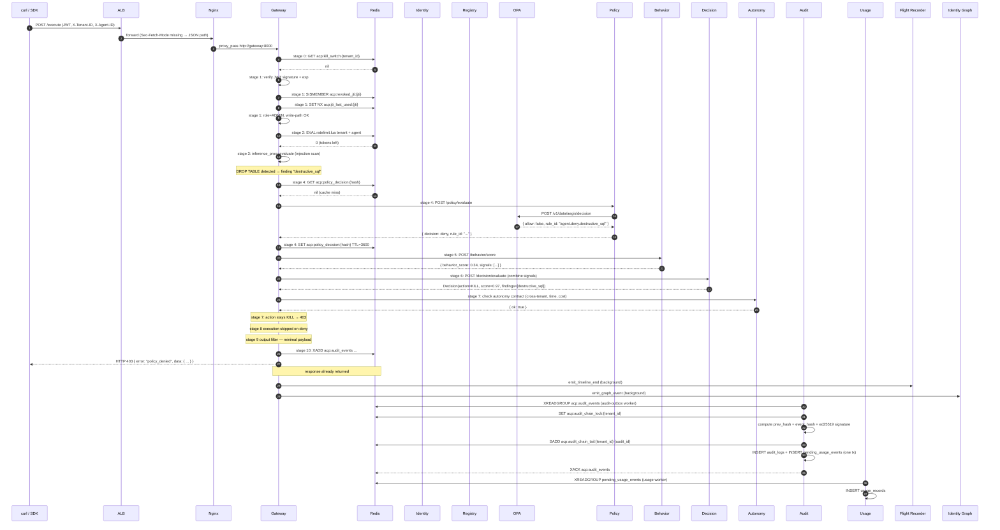

# Flow of a Decision

*One `POST /execute` call, walked end to end. Every hop, every Redis key, every Postgres write, with the file and line that does it.*

This page pairs with [10-Stage Pipeline](10-stage-pipeline.md) — that page describes each stage in isolation; this one shows the stages in sequence on a concrete request. The scenario is the SQL-injection attack from the [Quickstart](../introduction/quickstart.md).

## The scenario

- **Caller**: `admin@acp.local` logged in as `ADMIN`.
- **Tenant**: `00000000-0000-0000-0000-000000000001`.
- **Agent**: `db-copilot-demo` (`risk_level: low` at the moment — the trust-score worker will recompute as decision history accumulates).
- **Request body**:

  ```json
  {
    "tool_name": "db.query",
    "payload": {"query": "SELECT * FROM customers; DROP TABLE customers;"}
  }
  ```

- **Expected outcome**: HTTP 403, `policy_denied`, signed audit row written.

## The sequence



The numbers in the diagram correspond to the eleven middleware stages (0–10) and the post-response background work.

## The steps, with code

### 1. Edge

| # | Component | What happens | Where |
|---|---|---|---|
| 1.1 | ALB | TLS terminated; X-Forwarded-* headers set | AWS ALB rules |
| 1.2 | Nginx | `Accept: */*` and no `Sec-Fetch-Mode: navigate` → forward to gateway | `ui/nginx.conf` |
| 1.3 | Gateway | Request lands in `services/gateway/middleware.py::SecurityMiddleware.dispatch` | `services/gateway/middleware.py` |

### 2. Stage 0 — Kill Switch

- Read `acp:kill_switch:00000000-0000-0000-0000-000000000001` from Redis.
- Key absent → proceed.
- Code: top of the dispatch method.

### 3. Stage 1 — Auth

- Token validator `services/gateway/auth.py::TokenValidator.validate` decodes the JWT, checks `exp`, verifies the signature against `INTERNAL_SECRET`.
- Revocation check: `acp:revoked_jti:{jti}` — absent.
- Replay window: `SETNX acp:jti_last_used:{jti}` succeeded; the JTI has never been seen before.
- Role from the JWT claim: `ADMIN`. The role-to-permissions map gives `["*"]`.
- Write-path check: this is a `POST`, role is `ADMIN`, so it passes. (A `VIEWER` would be denied here with `Write operations require ADMIN or SECURITY role`.)

State on the request after this stage: `request.state.tenant_id`, `request.state.role`, `request.state.permissions`, `request.state.user_id`.

### 4. Stage 2 — Rate Limit

- Lua script in `sdk/common/ratelimit.py::TOKEN_BUCKET_SCRIPT` runs against Redis with arguments `(tenant_id, agent_id, now, rate, burst)`.
- Returns `0` — under cap. (A non-zero return would produce HTTP 429 with `Retry-After`.)
- Per-agent USD cost cap check: `acp:agent_cost_cap:{agent_id}` is absent for `db-copilot-demo`, so this check is a no-op.

### 5. Stage 3 — Inference

- `inference_proxy.evaluate` scans the payload for the regex catalogue: prompt-injection openers, encoded blobs, suspiciously deep JSON.
- The query string contains `DROP TABLE` after a `;` — flagged as `destructive_sql`.
- Tool-name guard: `db.query` is in the registry permission set for `db-copilot-demo`.
- Returns `ProxyDecision(risk_contribution=0.6, findings=["destructive_sql"], signals=[...])`.
- No deny here — the finding is passed forward.

### 6. Stage 4 — Policy

- The middleware computes a deterministic SHA-256 of the canonical request shape and looks up `acp:policy_decision:{hash}`.
- Cache miss on this exact payload shape.
- POST to `services/policy/router.py::evaluate_policy`. That handler in turn POSTs to OPA at `http://opa:8181/v1/data/aegis/decision` with the request as input.
- OPA evaluates `services/policy/policies/agent_policy.rego`. The Rego rule:

  ```rego
  package aegis.decision
  
  deny[rule] {
      input.tool_name == "db.query"
      regex.match(`(?i)\bdrop\s+table\b`, input.payload.query)
      rule := {"id": "agent.deny.destructive_sql", "severity": "critical"}
  }
  ```
- OPA returns `{ allow: false, deny: [{ id: "agent.deny.destructive_sql", severity: "critical" }] }`.
- Policy service wraps it: `{ decision: "deny", rule_id: "agent.deny.destructive_sql" }`.
- Middleware caches the result in Redis with the tenant-tier TTL (enterprise: 24 hours; the tenant in this scenario is enterprise tier).

### 7. Stage 5 — Behavior

- The middleware does NOT short-circuit on the stage 4 deny — it still asks the behavior service to score, so the audit row carries the full picture.
- POST to `services/behavior/router.py::score_behavior`. The behavior service:
  - Loads the agent's rolling baseline from `behavior_profiles` (Redis-cached for the last 60 seconds).
  - Computes sequence, velocity, cost, cross-agent intelligence signals.
  - Returns aggregate `behavior_score: 0.34` with the signal breakdown.
- Degraded-mode policy is `block_high_risk` for this tenant; the behavior service is healthy, so degraded mode is not engaged.

### 8. Stage 6 — Decision

- POST to `services/decision/router.py::evaluate_decision`. Inputs:
  - Inference: `{ risk_contribution: 0.6, findings: ["destructive_sql"] }`
  - Policy: `{ decision: "deny", rule_id: "agent.deny.destructive_sql" }`
  - Behavior: `{ behavior_score: 0.34 }`
  - Agent risk_level: `medium`
  - Tenant signal weights: defaults (none configured)

- `services/decision/engine.py::DecisionEngine.evaluate` runs the formula. Because the policy stage returned `deny`, the engine short-circuits to `action: KILL` with `score: 0.97` and findings `["destructive_sql"]`. The signal evaluation is still recorded for the audit row.

### 9. Stage 7 — Enforcement and Autonomy

- The autonomy contract check runs: cross-tenant access (none on this request), time-window restrictions (call is within the agent's allowed window), delegation depth (zero — this is a direct call), daily cost cap (within budget).
- The autonomy check passes. The KILL action stays KILL.
- The middleware composes the 403 response:

  ```json
  {
    "success": false,
    "error": "policy_denied",
    "data": {
      "action": "deny",
      "rule_id": "agent.deny.destructive_sql",
      "findings": ["destructive_sql"],
      "signals_evaluated": { ... },
      "audit_id": "..."
    }
  }
  ```

### 10. Stage 8 — Execution: skipped

- Because the enforcement decision was KILL, `call_next(request)` is not invoked. The route handler at `/execute` never sees this request.

### 11. Stage 9 — Output Filter

- No secrets to redact on a 403 response. Pass through.

### 12. Stage 10 — Audit

- `services/gateway/_mw_audit.py::_AuditMixin._finalize_request` composes the audit record from `request.state` (decision, findings, signals, role, tenant_id, agent_id, request_id) and pushes it onto the Redis Stream `acp:audit_events` with `XADD`.
- The HTTP response is returned to the client at this point. Everything below this line is post-response.

### 13. Background: timeline + graph emission

- `services/gateway/trust_emitter.py::emit_timeline_end` writes the per-stage execution timeline to the Flight Recorder. Each stage's start, end, decision, and latency are stored.
- `emit_graph_event` emits a typed edge `db-copilot-demo -> rds/acp-postgres-dev` of type `writes` with `outcome: deny` and `risk_score: 0.97` into the Identity Graph.

### 14. Audit worker drains the stream

The audit service's worker process (`services/audit/outbox_worker.py`) is consuming the stream:

- `XREADGROUP` pulls the new entry.
- Acquire `acp:audit_chain_lock:{tenant_id}` (SETNX with 5-second TTL) so concurrent workers in the same tenant serialize their chain writes.
- Read the previous row's `event_hash` from `acp:audit_chain_tail:{tenant_id}` (Redis-cached for speed) or from Postgres if the cache is cold.
- Compute the canonical content hash (SHA-256 over the canonical JSON serialization).
- Compute the chained event hash: `SHA-256(prev_event_hash || canonical_hash)`.
- Sign with ed25519 using today's signing key. The key fingerprint is recorded on the row.
- Atomic transaction in `services/audit/repo.py::insert_audit_row_with_usage`:

  ```sql
  BEGIN;
    INSERT INTO audit_logs (id, tenant_id, agent_id, action, decision, findings,
                            metadata_json, event_hash, prev_hash, signature, key_fingerprint, created_at)
    VALUES (...);
    INSERT INTO pending_usage_events (audit_id, tenant_id, agent_id, amount_usd, ...)
    VALUES (...);
  COMMIT;
  ```

- Update `acp:audit_chain_tail:{tenant_id}` in Redis with the new event_hash.
- `XACK acp:audit_events` to mark the entry processed.

### 15. Usage worker drains pending_usage_events

- The usage service's worker pulls from the outbox table.
- For each entry, INSERT into `usage_records`, then DELETE from `pending_usage_events`. Both in the same transaction so the outbox-to-usage hop is exactly once.

### 16. Daily transparency root (out of band)

- Once per day, `services/audit/transparency.py::seal_daily_root` runs:
  - Collect all `audit_logs.event_hash` for the day, partitioned by tenant.
  - Build a Merkle tree per tenant.
  - Record the root in `transparency_roots` with the date, leaf count, signing key, and a chain link to the previous day's root.
- Customers who archive their daily root can later verify that no row in their tenant was rewritten by recomputing the root from the rows we send them.

## What the caller sees on the wire

A single HTTP exchange:

```
POST /execute HTTP/1.1
Host: dev.aegisagent.in
Authorization: Bearer eyJhbGciOi...
X-Tenant-ID: 00000000-0000-0000-0000-000000000001
X-Agent-ID: b2836c8d-e6e7-4f2e-a382-d862739bd233
Content-Type: application/json

{
  "tool_name": "db.query",
  "payload": {"query": "SELECT * FROM customers; DROP TABLE customers;"}
}
```

```
HTTP/1.1 403 Forbidden
Content-Type: application/json
X-Request-ID: ...
X-Trace-ID: ...

{
  "success": false,
  "error": "policy_denied",
  "data": {
    "action": "deny",
    "rule_id": "agent.deny.destructive_sql",
    "findings": ["destructive_sql"],
    "score": 0.97,
    "signals_evaluated": {
      "inference": {"score": 0.6, "threshold": 0.5, "triggered": true},
      "policy":    {"score": 1.0, "threshold": 1.0, "triggered": true},
      "behavior":  {"score": 0.34, "threshold": 0.7, "triggered": false}
    },
    "audit_id": "...",
    "receipt_url": "/audit/logs/{audit_id}/receipt"
  }
}
```

End-to-end latency target: p95 under 100ms for a denied request (no upstream execution); p95 under 250ms for an allowed request that proxies to a real tool.

## What an allow path changes

If the request had been the safe `SELECT id, email FROM customers LIMIT 5` from the Quickstart:

- Stage 3 finds no injection patterns → `risk_contribution: 0.05`.
- Stage 4 OPA returns `allow: true`.
- Stage 5 behavior score stays under threshold.
- Stage 6 Decision returns `action: ALLOW, score: 0.05`.
- Stage 7 autonomy contract passes; action stays ALLOW.
- Stage 8 calls into `services/policy/router.py::execute_tool`, which forwards to the configured upstream tool (in the demo, an internal `db.query` mock that returns canned rows).
- Stage 9 redacts emails per the tenant's redaction policy (depending on configuration).
- Stage 10 writes the audit row with `decision: allow` and the tool result hash.

The audit chain is built the same way; the `usage_records` row carries a non-zero `amount_usd` reflecting the inference cost.

## Where to look when this breaks

| Symptom | Where to look |
|---|---|
| 504 `decision_timeout` | `services/gateway/middleware.py` deadline config; verify Behavior and Decision services are healthy via `/system/health` |
| Allowed request landed in audit as `deny` | Stage 6 vs stage 10 mismatch — read the Flight Recorder timeline for the request; spans tagged `stage` should show which stage flipped the outcome |
| Audit row missing for a request | `services/audit/outbox_worker.py` stalled — check `acp_audit_outbox_oldest_age_seconds` in Prometheus; replay path in `docs/runbooks/audit_chain_violation.md` |
| Receipt verification fails | Key rotation done without promoting the old key to `transparency_historical_keys` — see [Key Rotation](../operations/key-rotation.md) |

## Next

- [10-Stage Pipeline](10-stage-pipeline.md) — the same stages, one per section, with deny conditions.
- [Cryptographic Audit Chain](../security/crypto-audit-chain.md) — the signing scheme and verification algorithm in detail.
- [Data Model](data-model.md) — every table this flow writes to, and the indexes that make these queries fast.
- [Multi-Tenancy](multi-tenancy.md) — how `X-Tenant-ID` propagates from the JWT all the way to the SQL `WHERE` clause.
