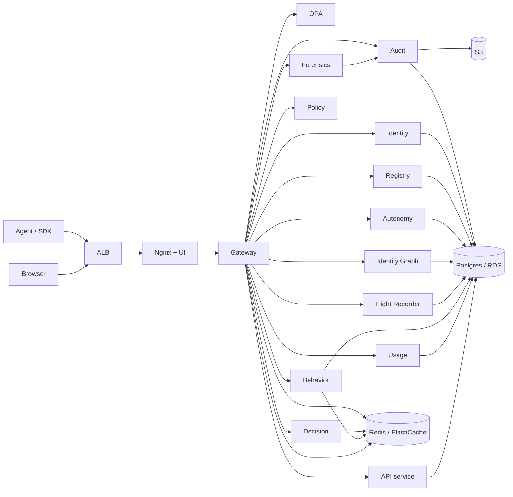

# System Overview

*Aegis is a request-time decision pipeline plus a tamper-evident audit chain, fronted by a thin React UI and sixteen cooperating backend services.*

This page is the architectural map of the platform. Every other architecture page drills into one slice of what you see here.

## The full picture

## The three layers

Aegis is three layers stacked on top of standard infrastructure.

1. **Edge** — Application Load Balancer, Nginx, the React UI. Terminates TLS, serves the SPA shell to browsers, proxies authenticated API calls to the gateway.
2. **Decision** — the Gateway plus the seven services it consults inline on every call: OPA, Policy, Decision, Behavior, Registry, Identity, Autonomy.
3. **Record + replay** — Audit, Flight Recorder, Identity Graph, Forensics, Usage, API. These write the durable state of what happened and let humans investigate it later.

The UI and the SDK both talk to one endpoint, the Gateway, over HTTPS. Everything else is gateway-internal traffic over the Docker network.

## The sixteen application services

| Service | Folder | Purpose | Database | Listens on |
|---|---|---|---|---|
| gateway | `services/gateway/` | Public API surface; runs the 11-stage middleware pipeline on every request | none (Redis only) | 8000 |
| identity | `services/identity/` | JWT issuance, user CRUD, SSO config, agent credentials | `acp_identity` | 8002 |
| registry | `services/registry/` | Agent and tool-permission registry | `acp_registry` | 8001 |
| policy | `services/policy/` | OPA bundle host, Rego policy CRUD and simulation | `acp` (OPA-local) | 8003 |
| decision | `services/decision/` | Five-signal risk synthesis, kill-switch, signal-weight config | none (Redis only) | 8004 |
| behavior | `services/behavior/` | Behavioral firewall, per-agent baselines, degraded-mode policy | `acp_behavior` | 8005 |
| audit | `services/audit/` | Signed audit chain, transparency roots, DPDP + GRC + AEVF static assets, evaluation runner, shadow eval, rego compiler | `acp_audit` | 8006 |
| usage | `services/usage/` | Per-tenant usage records, outbox consumer for billing | `acp_usage` | 8007 |
| api | `services/api/` | Incidents, API keys, webhooks, SIEM, scheduled reports, admin | `acp_api` | 8010 |
| forensics | `services/forensics/` | Investigation listing, replay, blast-radius, PDF export | reads `acp_audit` | 8011 |
| flight_recorder | `services/flight_recorder/` | Per-execution timeline, steps, snapshots, artifacts | `acp_flight_recorder` | 8012 |
| identity_graph | `services/identity_graph/` | Typed-node and typed-edge graph; trust score, drift, compromise sim | `acp_identity_graph` | 8013 |
| insight | `services/insight/` | Audit-derived aggregations exposed to UI dashboards | reads `acp_audit` | 8014 |
| autonomy | `services/autonomy/` | Multi-agent contracts, playbooks, human override events | `acp_autonomy` | 8015 |
| learning | `services/learning/` | Cross-agent behavior intelligence + drift detector | reads `acp_behavior` | 8016 |
| mcp_server | `services/mcp_server/` | MCP stdio surface — 4 governance tools (Sprint 8) for editor + agent integrations | none | stdio |

The total is sixteen application services. `gateway`, `forensics`, `insight`, `learning`, and `mcp_server` don't own their own databases — they read from sibling services under read-only DSNs or speak stdio.

Additional workers run alongside the application services but are not addressable on a port:

- `insight_worker` — consumes audit rows into the `insight` aggregate tables. Stopped on dev (`--restart=no`) when the `GROQ_API_KEY` Secrets Manager entry is intentionally `EMPTY`; the worker hard-fails on a missing key. Re-enable by setting the key and `docker start acp_insight_worker`.

The historical `groq_worker` block was removed during the audit cleanup pass — see `infra/docker-compose.aws.yml` and the audit playbook for context.

## Edge components

| Component | Container | Purpose |
|---|---|---|
| Application Load Balancer | AWS ALB (alias of `ha.aegisagent.in`) | Public HTTPS termination, WAFv2 (Common rules + KnownBadInputs + SQLi + per-IP rate limit), health checks, fan-out to a Multi-AZ Auto Scaling Group across `ap-south-1a + 1b` (2 × `m6g.medium` Graviton). The earlier single-EC2 dev environment (formerly at `dev.aegisagent.in`) and the 2026-06-01 single-EC2 reference both fold into this prod-ha stack as of 2026-06-13. |
| Nginx | `acp_ui` | Serves the React SPA shell and proxies `/auth`, `/agents`, `/audit`, etc. to the gateway; routes that are both SPA and API are disambiguated by `Accept` header and `Sec-Fetch-Mode` |
| UI bundle | `ui/dist/` baked into `acp_ui` image | React + Vite + Tailwind, no client-side router for unknown routes — falls back to `index.html` for SPA navigations |
| Gateway | `acp_gateway` | FastAPI app with the 11-stage middleware, the only service exposed via Nginx |

The Nginx configuration that disambiguates SPA navigation from JSON fetches lives in `ui/nginx.conf`. The rule is: `Accept: text/html` or `Sec-Fetch-Mode: navigate` → serve `index.html`; everything else → forward to the gateway. See [Deployment Topology](deployment-topology.md).

## Data stores

| Store | Container / Service | Used for |
|---|---|---|
| Postgres | RDS `db.t3.small` **Multi-AZ** primary + standby (prod-ha live deployment), `acp_postgres` (compose-local laptop dev) | All application state. One logical database per service (`acp_identity`, `acp_registry`, `acp_audit`, etc.). All connections go through PgBouncer for connection pooling. |
| Postgres replica | RDS Multi-AZ standby (automatic failover, no manual read split today); `acp_postgres_replica` exists in the laptop compose | Production-grade deployments will eventually add a dedicated read replica for forensics replay and heavy aggregator queries |
| Redis | ElastiCache replication group (primary + reader, Multi-AZ) (prod-ha live deployment), `acp_redis` (compose-local laptop dev) | JWT revocation, rate-limit token buckets, OPA decision cache, per-tenant Pub/Sub channels for SSE, decision-signal cache, audit Redis Stream, billing outbox cursor |
| OPA | `acp_opa` | In-process policy engine — the gateway calls it via HTTP on a Docker-network address; bundles are pushed by `bundle_server` from `services/policy/policies/` |
| S3 | Receipts + tenant exports + AEVF bundles + nightly `pg_dump` (encrypted via `age`) + ALB access logs | Receipt durability, encrypted nightly backups, ALB access logs |

## Observability stack

Runs in the same compose file but does not participate in the request path.

| Component | Container | Use |
|---|---|---|
| Prometheus | `acp_prometheus` | Scrapes `/metrics` on every service; alert rules in `infra/prometheus/alert.rules.yml` |
| Alertmanager | `acp_alertmanager` | Routes alerts to Slack and PagerDuty |
| Grafana | `acp_grafana` | Four built-in dashboards under `infra/grafana-dashboards/`: platform-slo, trust-layers, tenant-activity, queues |
| Jaeger | `acp_jaeger` | OpenTelemetry trace collector; every gateway request is a trace with the 11 stages as spans |

## Where the request path is

A single `POST /execute` call traverses, in order:

1. Browser or SDK → ALB
2. ALB → Nginx (`acp_ui` container, port 80)
3. Nginx → Gateway (`acp_gateway` container, port 8000)
4. Gateway middleware: stages 0–10 (see [10-Stage Pipeline](10-stage-pipeline.md))
5. Inline gateway → consults: Identity (1), Registry (4), Policy/OPA (5), Behavior (6), Decision (7), Autonomy (7b)
6. Execution → upstream tool (proxied from `services/policy/router.py::execute_tool` for SDK-style agent calls)
7. Gateway → Audit (10), Usage (10), Flight Recorder (timeline events), Identity Graph (edge emit), SSE (Redis Pub/Sub fanout)

The complete trace with code references is the [Flow of a Decision](flow-of-a-decision.md) page.

## Security surfaces (vNext Sprints 4–8)

The following are NOT separate services — they're modules under
`services/security/` that run inside the gateway process and persist
their state in Redis. Each ships its own HTTP read surface routed
through the gateway.

| Module | Code | HTTP read surface | Storage |
|---|---|---|---|
| Incident Storyline (Sprint 4) | `services/security/incidents/` | `GET /storylines`, `GET /storylines/{incident_id}` | Redis 24 h TTL — `acp:incident:*` |
| Identity & Access Graph + Blast Radius (Sprint 5) | `services/security/iag/` | `GET /iag/agents/{agent_id}`, `GET /iag/incidents/{incident_id}/blast-radius` | Redis 24 h TTL — `acp:iag:*` |
| Auto-Remediation (Sprint 6) | `services/security/remediation/` | `GET/PUT /remediation/policy`, `GET /remediation/incidents/{id}`, `POST /remediation/incidents/{id}/replay`, `POST /remediation/dry-run` | Redis 24 h TTL — `acp:remediation:*` |
| Threat-Intel Provider Layer (Sprint 7) | `services/security/threatintel/` | `GET/POST/DELETE /threat-intel/iocs`, `GET/PUT /threat-intel/feeds/{name}`, `POST /threat-intel/refresh` | Redis 24 h TTL — `acp:ti:*` |
| Pattern catalog + Rego emitter (Sprint 8) | `services/policy/pattern_catalog.py`, `services/policy/rego_emitter.py` | — (build-time gate via `tests/policy/test_rego_drift.py`) | Python tuples + sentinel-delimited Rego blocks |

Sprint 4–7 hooks fire from the gateway middleware: the storyline
recorder appends a step on every KILL / DENY / ESCALATE outcome; the
remediation executor runs on the quarantine status transition.

## Service-to-service contracts

Every internal call uses the same shape:

- HTTP, JSON bodies, response envelope `{success, data, error, meta}`
- `Authorization: Bearer <jwt>` carried forward from the user (for tenant-scoped reads) **OR** `X-Internal-Secret: <shared-secret>` (for trusted server-to-server writes)
- `X-Tenant-ID` always present
- `X-Request-ID` and `X-Trace-ID` carried for correlation
- Timeouts and circuit breakers configured in `services/gateway/client.py::ResilientClient`

This contract is enforced by `services/gateway/main.py::_internal_headers()` and verified on the receiving side by `verify_internal_secret` dependencies on every internal-only route.

## Multi-tenancy model

All durable state is tenant-scoped. Every table has a `tenant_id UUID NOT NULL` column. Every API request carries `X-Tenant-ID`. Every JWT carries `tenant_id` in its claims. The gateway enforces that the header and the claim match before any downstream call is made. Details: [Multi-Tenancy](multi-tenancy.md).

## Failure modes the architecture protects against

| Class | Protected by | Reference |
|---|---|---|
| Compromised JWT | Per-tenant kill switch (stage 0), JTI revocation (`acp:revoked_jti:*` in Redis), replay protection (1ms window per JTI) | `services/gateway/_mw_auth.py:170-200` |
| Compromised single agent | Per-agent quota (`acp:agent_cost_cap:*`), behavioral baseline divergence, policy deny | `services/gateway/middleware.py`, `services/behavior/` |
| Compromised internal secret | Audit chain is signed (ed25519) and chained (prev_hash) — tampering breaks the chain mathematically | `services/audit/integrity.py`, `services/audit/signer.py` |
| Postgres compromise | Daily Merkle transparency roots; any party who archived an earlier root can detect rewrites | `services/audit/transparency.py`, `docs/runbooks/audit_chain_violation.md` |
| Region-wide outage | Encrypted nightly backups to S3 via `scripts/ops/backup.sh` + restore drill in `scripts/ops/restore_drill.sh` | `docs/operations/backup-restore.md` |

## What you should read next

- [10-Stage Pipeline](10-stage-pipeline.md) — every middleware stage with code references.
- [Flow of a Decision](flow-of-a-decision.md) — a single `POST /execute` walked end-to-end across all 12 services.
- [Data Model](data-model.md) — every Postgres table, Redis key pattern, and S3 bucket in one inventory.
- [Multi-Tenancy](multi-tenancy.md) — how `X-Tenant-ID` propagates and what stops cross-tenant access.
- [Deployment Topology](deployment-topology.md) — the AWS account, the 2× EC2 ASG behind ALB + WAFv2, the compose file, the deploy script.
