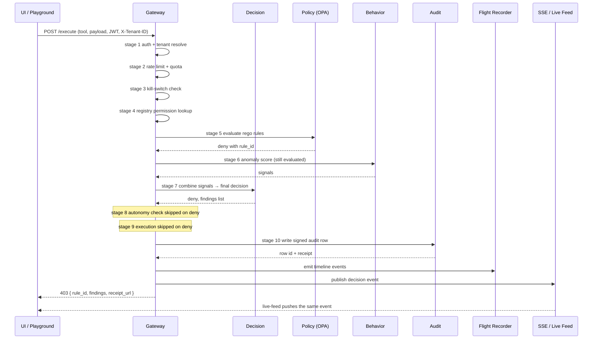

# 60-Second Tour

**A guided walkthrough of the Aegis web UI. Sixty seconds, eight stops, every part of the platform.**

The live deployment is at [aegisagent.in](https://aegisagent.in). For credentials, see [Quickstart](quickstart.md).

## What you'll see

The UI has three navigation groups, in left-to-right order of how often operators use them:

- **Primary nav** (5 items) — the daily-driver pages: Flight Recorder, Policies, Audit Trail, Incidents, Settings.
- **Operations dropdown** (11–12 items) — power-user surfaces: Agents, Identity Graph, Autonomy, Forensics, Playground, Live Feed, Playbooks, Auto Response, Compliance, Open Source, Attack Sim, plus Kill Switch when the user has ADMIN or SECURITY role.
- **Settings hub** — 16 sub-pages reachable from Settings: System Health, Observability, Admin Console, Developer Panel, RBAC, User Management, Risk Engine, Policy Analytics, Policy Sim, Quota Management, Billing, SSO, Webhooks, SIEM, Threat Intel, Scheduled Reports.

Every page calls one or more backend services through the gateway at `/`. Pages are auth-gated client-side; data fetches are auth-gated server-side via JWT plus `X-Tenant-ID`.

## The 60-second walk

Time markers assume you are already logged in and the dashboard has loaded.

### 0:00 — 0:10 · Flight Recorder

The default landing page after login. Each row is one `/execute` call captured end-to-end. Click any row to expand the per-stage timeline: which middleware stage decided what, how long each took, the inputs and outputs at each stage. Backed by the `flight_recorder` service. This page exists so an operator can answer "what exactly happened on that decision" without grepping logs.

### 0:10 — 0:18 · Audit Trail

Sidebar → **Audit Trail**. Every signed audit row, paginated. Each row shows: timestamp, agent, tool, decision, risk score, and a verify button that fetches `/audit/logs/verify` to confirm the prev-hash chain is intact across the visible window. The **Analyst Notes** panel on the right is the place SOC analysts record investigation notes against a specific row. Backed by the `audit` service plus the `identity` service for the note-taker identity.

### 0:18 — 0:25 · Policies

Sidebar → **Policies**. Opens the Policy Builder. This is where OPA Rego rules are authored and uploaded. The sub-pages are:

- **Policy Builder** — author rules, scope them to agents, save and activate.
- **Policy Analytics** (Settings → Policy Analytics) — hit rate, false-positive rate, coverage gap by rule.
- **Policy Sim** (Settings → Policy Sim) — replay historical events against a draft policy without enforcing it.

Backed by the `policy` service.

### 0:25 — 0:32 · Identity Graph

Operations → **Identity Graph**. A force-directed graph of every typed node — `agent`, `tool`, `resource`, `tenant`, `human` — connected by typed edges — `invokes`, `reads`, `writes`, `delegates`, `escalates`. Click a node to compute its blast radius (`/graph/blast-radius/{node_id}`) — the set of resources it can reach transitively. The **compromise simulation** button asks "if this node's token were stolen, where could an attacker pivot." Backed by the `identity_graph` service.

### 0:32 — 0:40 · Agents

Operations → **Agents**. The registry of every agent the tenant has provisioned, with status, risk level, owner, and permission count. Click an agent to open its profile: tool-usage breakdown, risk trend, drift score against its 7-day baseline, peer benchmark against other agents of the same role. Backed by the `registry` service (agent CRUD) and the `audit` aggregator (per-agent rollups).

### 0:40 — 0:48 · Playground

Operations → **Playground**. Pick an agent, pick a tool from its allow-listed set, send a payload. The page submits to `/execute` and shows the full decision: allow or deny, the risk score, the findings, and a link to the signed receipt. Four pre-loaded **attack scenarios** at the top of the page execute known-malicious payloads (PII bulk export, `rm -rf`, `DROP TABLE`, k8s production namespace deletion) so a new evaluator can see Aegis block in real time. Backed by the gateway, decision, policy, and behavior services.

### 0:48 — 0:55 · Live Feed

Operations → **Live Feed**. Server-Sent Events stream of every decision in the tenant, scoped to the agent selected in the sidebar picker. Heartbeats every 15 seconds. Reconnect on token expiry uses the cached query token stored at login. Backed by the gateway's SSE endpoint (`/events/stream`) which fan-outs from a Redis Pub/Sub channel per tenant and per agent.

### 0:55 — 1:00 · Kill Switch

Operations → **Kill Switch** (visible only to ADMIN and SECURITY roles). One toggle, tenant-wide. Once engaged, every gateway worker sees the kill-switch state within 5 seconds (Redis pub-sub fanout). Subsequent `/execute` calls return a structured 403 with `reason: "kill_switch_engaged"`. The state is also written into the audit chain so the kill-switch event itself is signed and replayable.

## What you skipped past

The above is the order a buyer or evaluator should walk in. The remaining surfaces cover deeper workflows:

- **Incidents** — open investigations, status transitions, SOC timeline view.
- **Forensics** — replay any execution, compute its blast radius, export PDF.
- **Autonomy** — multi-agent contracts: cross-tenant rules, time windows, delegation caps.
- **Playbooks** — pre-built remediation workflows; can be auto-triggered by decision events.
- **Auto Response** — rule-based automation with simulate / rollback / approval pipelines.
- **Compliance** — SOC 2, EU AI Act, NIST AI RMF report generation against the audit chain.
- **Attack Sim** — extended catalog of attack payloads beyond the four Playground scenarios.
- **Open Source** — the project's open-source landing page (Apache 2.0, GitHub link, contribution path).

The Settings hub holds platform configuration: tenants (Admin Console), API keys and webhooks (Developer Panel), SSO and SIEM integrations, scheduled reports, threat-intel enrichment, and per-tenant quota tuning.

## One decision, end to end

The sequence below is what happens behind the scenes when you click "Run" on a Playground attack scenario.

## Next

- [Quickstart](quickstart.md) — credentials, your first call from curl, your first receipt.
- [System Overview](../architecture/system-overview.md) — the same sequence with code references and infrastructure topology.
- [UI Map](../ui/_index.md) — index of every page and its backing service.
