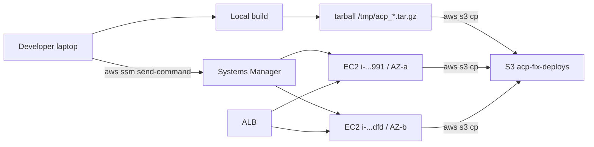

# Deployment

*How code reaches production Aegis. Tarball → S3 → SSM, never GitHub Actions on the EC2.*

## The contract

Three properties the deploy pipeline must guarantee:

1. **No GitHub credentials on the EC2.** The instance role has S3 read for the deploy bucket and SSM agent permissions; nothing else.
2. **One operator step.** From a tarball on the laptop to live on `aegisagent.in` is one `aws ssm send-command` plus one S3 upload.
3. **No coordinated cutover required.** Each EC2 is deployed independently; the ALB removes a host that fails health checks.

The trade-off vs. a GitHub-Actions-driven deploy is that the laptop becomes the deploy origin. The EC2 hosts trust S3 and SSM, not the public internet.

## The path



## Per-deploy-type recipes

The same path serves three deploy shapes — each requires a different rebuild target.

### UI-only deploy

When only `ui/dist` or `ui/nginx.conf` changes:

```bash
# 1. Build locally
cd ui && npm run build

# 2. Tar dist
STAMP=$(date +%s)
tar czf /tmp/acp_ui_${STAMP}.tar.gz -C dist .

# 3. Upload
aws s3 cp /tmp/acp_ui_${STAMP}.tar.gz \
  s3://acp-fix-1779860735/deployments/ --region ap-south-1

# 4. SSM-deploy to both EC2s
cat > /tmp/ssm_deploy_ui.sh <<EOF
#!/bin/bash
set -e
cd /home/ubuntu/aegis
aws s3 cp s3://acp-fix-1779860735/deployments/acp_ui_${STAMP}.tar.gz /tmp/ui.tar.gz --region ap-south-1
sudo rm -rf ui/dist && sudo mkdir -p ui/dist
sudo tar xzf /tmp/ui.tar.gz -C ui/dist
sudo chown -R ubuntu:ubuntu ui/dist
cd infra
sudo docker compose build --no-cache ui
sudo docker compose up -d --no-deps --force-recreate ui
EOF

aws ssm send-command \
  --region ap-south-1 \
  --instance-ids <ec2-instance-id-1> <ec2-instance-id-2> \
  --document-name AWS-RunShellScript \
  --comment "UI deploy ${STAMP}" \
  --parameters "{\"commands\":$(python3 -c 'import json; print(json.dumps([open(\"/tmp/ssm_deploy_ui.sh\").read()]))'),\"executionTimeout\":[\"600\"]}"
```

Critical: `docker compose build --no-cache ui` is required to bust the Docker COPY layer. Without `--no-cache`, the new `ui/dist` is not picked up by the rebuild.

### Single-service backend deploy

When one Python service changes (e.g., `services/audit/aggregator.py`):

```bash
STAMP=$(date +%s)
tar czf /tmp/acp_audit_${STAMP}.tar.gz services/audit/
aws s3 cp /tmp/acp_audit_${STAMP}.tar.gz \
  s3://acp-fix-1779860735/deployments/ --region ap-south-1

# SSM script
cd /home/ubuntu/aegis
aws s3 cp s3://acp-fix-1779860735/deployments/acp_audit_${STAMP}.tar.gz /tmp/svc.tar.gz --region ap-south-1
sudo tar xzf /tmp/svc.tar.gz -C /home/ubuntu/aegis/
sudo chown -R ubuntu:ubuntu services/audit/
cd infra
sudo docker compose build --no-cache audit
sudo docker compose up -d --no-deps --force-recreate audit
```

`--no-deps --force-recreate audit` recreates only the audit container; the rest of the stack stays up.

### Multi-service deploy

When several services change, tar each into the same bundle and rebuild each container:

```bash
tar czf /tmp/acp_multi_${STAMP}.tar.gz services/audit/ services/gateway/ ui/nginx.conf
```

The SSM script extracts the bundle and runs `docker compose build --no-cache <service>` for each affected service. Order doesn't matter; the gateway will reconnect to the audit service on its next call.

## Rollback

A rollback is "deploy the previous tarball". The deploy bucket retains every artifact for 7 days; the operator picks the previous tarball and re-runs the SSM command with that key.

There is no in-place revert mechanism. The contract: the active bundle is whatever was last deployed.

For a rollback during an incident:

1. Identify the previous good bundle: `aws s3 ls s3://acp-fix-1779860735/deployments/`.
2. Re-run the SSM deploy with that tarball key.
3. Verify each rolled-back service is `healthy` via `/system/health`.

## Per-EC2 considerations

The two EC2 hosts are deployed in parallel. Failure modes:

- **One EC2 succeeds, the other fails.** ALB takes the failing host out of rotation within 3 consecutive failed health checks. Traffic flows entirely through the surviving host. Re-run SSM against the failing host.
- **Both EC2s fail.** ALB returns 503. Roll back to the previous tarball on both.
- **DNS poisoning on one EC2** (an earlier production issue): one EC2's Docker DNS got into a state where it could not resolve internal hostnames (`acp_audit`, `acp_postgres`, etc.). Symptom: 50% of requests fail. Fix: `docker compose up -d --force-recreate gateway ui` on the affected host.

## Smoke verification

After every deploy, verify externally:

```bash
# Bundle hash from the served index.html
curl -fsS https://aegisagent.in/ | grep -oE 'index-[A-Za-z0-9_-]+\.js'

# Login probe
curl -sS -X POST https://aegisagent.in/auth/token \
  -H 'Content-Type: application/json' \
  -H 'X-Tenant-ID: 00000000-0000-0000-0000-000000000001' \
  -d '{"email":"admin@acp.local","password":"REDACTED"}' | head -c 100

# System health
TOKEN=...
curl -sS https://aegisagent.in/system/health \
  -H "Authorization: Bearer $TOKEN" \
  -H 'X-Tenant-ID: 00000000-0000-0000-0000-000000000001' | jq '.data.services'

# Audit chain integrity
curl -sS https://aegisagent.in/audit/logs/verify \
  -H "Authorization: Bearer $TOKEN" \
  -H 'X-Tenant-ID: 00000000-0000-0000-0000-000000000001' | jq '.data'
```

All four should return healthy values. A bundle-hash mismatch means the deploy didn't reach one of the EC2s.

## Common deploy gotchas

| Symptom | Cause | Fix |
|---|---|---|
| New code not reflected after deploy | Docker COPY layer cache | Re-run with `--no-cache` |
| 502 from ALB after deploy | One EC2 unhealthy | ALB drains in 3 health-checks; wait or roll back |
| Per-EC2 flap | Docker DNS poisoning | `docker compose up -d --force-recreate gateway ui` on affected host |
| `acp_registry` reports unhealthy preventing dependent recreate | depends_on guard | `--no-deps --force-recreate <service>` instead |
| Wrong path in compose | Repo at `/home/ubuntu/aegis`, not `/home/ubuntu/acp` | Fix the SSM script path |
| Pre-existing /tmp file conflicts | `docker exec` cannot overwrite | Pre-`rm -f /tmp/<file>` before extracting |

## What the deploy pipeline does NOT do

- **No automated tests gate the deploy.** Test runs happen on the laptop before the operator decides to deploy. CI signals are informational, not blocking.
- **No staged rollout (canary).** Both EC2s receive the deploy at the same time. Risk-aversion is operator-managed.
- **No blue-green.** The compose recreate is in-place. Brief downtime per service is accepted.
- **No automated rollback on health-check failure.** ALB removes unhealthy hosts but does not revert the deploy; the operator decides.

These omissions are intentional for a single-tenant-class deployment. A larger production rollout would add staging, canary, and blue-green.

## Next

- [Deployment Topology](../architecture/deployment-topology.md) — what the two EC2s look like
- [Backup & Restore](backup-restore.md) — pre-deploy backup strategy
- [Observability](observability.md) — what to watch during a deploy
