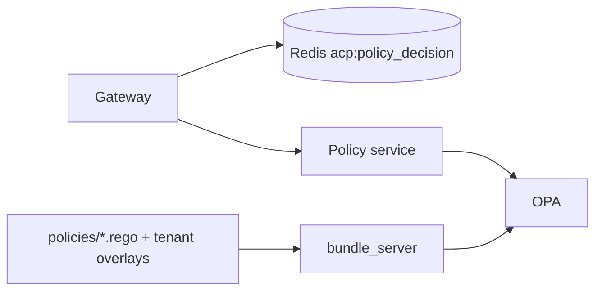

# OPA Policies

*The Rego files shipping with Aegis. What each rule does, where it lives, when it fires, and how customers extend it.*

## The five files

Source: `services/policy/policies/`.

| File | Package | Scope |
|---|---|---|
| `default.rego` | `acp.v1.default` | Defaults and the platform's hard-deny baseline |
| `agent_policy.rego` | `acp.v1.agent` | Per-agent ALLOW logic with risk-score gating |
| **`action_semantics_deny.rego`** | `acp.v1.agent` | **R0 + v3-deep — action-content denials, risk-tunable PII threshold, K8s prod-namespace awareness, external-domain PII exfil** |
| `k8s_policy.rego` | `acp.v1.k8s` | Kubernetes operation governance (legacy file; superseded for destruction patterns by `action_semantics_deny.rego`) |
| `rate_policy.rego` | `acp.v1.rate` | Risk-level and tool-class denials |

All four are bundled by the bundle server (`acp_bundle_server`) and pushed to OPA on a 60-second poll. Customers can add tenant-specific overlays via `POST /policy/upload`; the platform-shipped files cannot be replaced by tenant overlays (they encode the platform's safety baseline).

## `agent_policy.rego` — the per-agent ALLOW path

Source: `services/policy/policies/agent_policy.rego`.

```rego
package acp.v1.agent

import rego.v1

default allow := false
default reason := "no match found"

main := {
    "allow": allowed,
    "reason": msg,
    "risk_adjustment": adjustment + risk_adjustment,
}

allowed if {
    # 1. Agent must be active
    lower(input.agent.status) == "active"

    # 2. Agent must not be quarantined or terminated
    not agent_suspended

    # 3. Find a matching allow permission for the requested tool
    some perm in input.agent.permissions
    perm.tool_name == input.tool
    lower(perm.action) == "allow"

    # 4. No deny override for this tool
    not has_deny_permission

    # 5. Risk score must be below critical threshold
    not input.risk_score >= 0.95

    # 6. K8s governance hard-deny must not apply
    not k8s_hard_deny
}
```

The rule is the AND of six conditions. Failure of any one denies.

### What each condition does

- **Active agent**: a quarantined agent's calls always deny.
- **Not suspended**: separate from quarantine; suspension is a softer state set by autonomy contracts.
- **Matching ALLOW permission**: the agent must have an explicit grant for the requested tool.
- **No DENY override**: an explicit `DENY` row on the same tool beats an `ALLOW`.
- **Risk score below 0.95**: a request with composite risk ≥ 0.95 denies regardless of permissions. This is the "absolute ceiling" that prevents a poorly-tuned policy from allowing critical-risk traffic.
- **K8s hard-deny not applicable**: if the tool matches the K8s governance hard-deny pattern, this allow path declines.

### Wildcard permission

A second `allowed` rule covers wildcard grants (`tool_name == "*"`) used by management or system agents. Same conditions otherwise.

## `k8s_policy.rego` — Kubernetes governance

Source: `services/policy/policies/k8s_policy.rego`.

```rego
package acp.v1.k8s

main := {
    "allow":             allow,
    "reason":            reason,
    "risk_adjustment":   risk_adjustment,
    "requires_approval": requires_approval,
}

# Read-only operations: always allowed
allow if {
    _is_readonly_verb
    not _is_high_risk_secret_read
}
```

The package handles the `k8s.*` tool family. Read-only verbs (`get`, `list`, `describe`, `logs`, `top`) are allowed by default unless the read targets a high-risk resource (secrets, cluster-roles in production namespaces). Writes (`create`, `apply`, `delete`, `scale`, `exec`) go through tighter checks.

The exact list of hard-deny patterns includes:

- `k8s.delete.namespace` on namespaces matching `^prod` or `^production`.
- `k8s.delete.node`.
- `k8s.create.clusterrolebinding` (privilege escalation).
- `k8s.exec.pod` on production-namespace pods without an active break-glass session.

The output also surfaces `requires_approval: true` for borderline operations, which the gateway maps to ESCALATE at stage 7.

## `rate_policy.rego` — risk and tool-class denials

Source: `services/policy/policies/rate_policy.rego`.

```rego
package acp.v1.rate

default allow := true
default reason := "within rate limits"

# Block agents with critical risk level from sensitive destructive tools
allow := false if {
    lower(input.agent.risk_level) == "critical"
    sensitive_tool
}

# Block if risk score is above absolute ceiling (defense-in-depth with decision engine)
allow := false if {
    input.risk_score >= 1.0
}

sensitive_tool if {
    destructive_tools := {"delete", "drop", "truncate", "exec", "shell", "sudo", "rm"}
    some t in destructive_tools
    ...
}
```

The rule denies in two cases:

- A `critical` risk-level agent invoking a destructive-class tool. Agents tagged `critical` are kept on the read side until their tagging is reviewed.
- A request with `risk_score >= 1.0`. Defense in depth against the Decision Engine — if the engine ever returns a score above 1.0 due to a bug, the policy stage catches it.

## `default.rego` — platform defaults

Source: `services/policy/policies/default.rego`.

Three responsibilities:

- **Default decision values** that apply when no other rule fires.
- **Cross-package hard-deny patterns** that should hold regardless of agent permissions:
  - Path traversal in any tool input (`../`, `..\`).
  - `DROP TABLE` outside known reporting tables.
  - Shell metacharacters in tool names.
- **Default risk adjustments** for common low-risk tool classes.

These cannot be overridden by tenant overlays.

## The platform-shipped vs tenant-overlay split

`services/policy/policies/` files ship with each platform release. Customers do not edit them in production deployments.

Tenant-specific Rego is uploaded via `POST /policy/upload` and is stored in `tenants.custom_policy` (Postgres). At bundle-build time, the bundle server concatenates the platform-shipped rules with the tenant overlay, with the platform rules taking precedence on conflict.

The rule: tenant overlays can ADD denies and can ADD allow conditions. They cannot REMOVE platform-shipped denies. The hard-deny patterns are non-overridable on purpose.

## `action_semantics_deny.rego` — R0 + v3-deep

Source: `services/policy/policies/action_semantics_deny.rego`.

The defining rule of v3 — denial keys off the **content of the action**, not off the agent's `risk_level` or the tool's name. A `medium`-risk agent attempting `DROP TABLE` is denied; a `low`-risk agent attempting `rm -rf` is denied. `risk_level` is a *threshold modifier*, never a binary gate.

### Hard-destructive patterns (fire regardless of risk_level)

| Helper | Triggers on |
|---|---|
| `_shell_destruction` | `rm -rf`, `rm -fr`, `dd of=/dev`, `mkfs`, fork bomb, `chmod -R 777 /`, `chown -R`, `shutdown -h`, `reboot`, `halt`, `init 0`, `find … -delete`, `find … -exec rm`, `xargs rm`, `dropdb`, `pg_drop`, `kubectl drain`, `kubectl scale --replicas=0`, `\| sh`, `\| bash`, `\| zsh` (pipe-to-shell drive-by) |
| `_sql_ddl_destruction` | `DROP TABLE`, `DROP DATABASE`, `DROP SCHEMA`, `TRUNCATE …`, `ALTER TABLE` |
| `_sql_dml_no_predicate` | `DELETE FROM x` (no `WHERE`), `UPDATE x SET …` (no `WHERE`) |
| `_system_path_access` | `path` starts with `/etc/shadow`, `/etc/passwd`, `/root/`, `/proc/`, `/sys/`, `/.ssh/`; OR shell command embeds them; OR `path` contains `../` |

### A1 / v3 — namespace-aware K8s destruction

`_k8s_prod_destruction` replaces the prior blanket `kubectl delete` deny. It fires only when a `kubectl delete`, `helm uninstall`, or `helm delete` targets a **prod-shaped namespace**: name (or label) contains any of `prod`, `production`, `stag`/`staging`, `live`, `main`, `master`, `customer`, `billing`, `payments`, `sales`, `accounts`. `kubectl delete ns dev-test` is **allowed**; `kubectl delete ns prod-cache` is **denied**. The middleware extracts `metadata.arguments.k8s_namespace` from the shell command via regex; the rego has a substring fallback so the command_norm itself is also matched.

### A1 / v3 — risk-tunable bulk-PII threshold

`_pii_row_threshold_breached` fires when a SELECT against a customer-shaped table exceeds the agent's tier:

| Risk level | Threshold (rows) |
|---|---|
| `low` | 10000 |
| `medium` | 1000 |
| `high` | 100 |
| `critical` | 0 |

The middleware parses `LIMIT N` from the SQL into `metadata.arguments.row_limit` (sentinel `-1` for no `LIMIT` clause = unbounded → exceeds any threshold). `SELECT * FROM customers` (no LIMIT) denies on every risk level; `SELECT * FROM customers LIMIT 100` allows on low/medium but denies on critical.

### A5 / v3 — external-domain PII exfil

`_external_exfil` covers three send paths:

1. **Personal-email destinations**: `@gmail.com`, `@yahoo.com`, `@hotmail.com`, `@outlook.com`, `@proton.me`, `@protonmail.com`, `@icloud.com`, and the demo's `@external-vendor.com` / `@external-monitoring.io` — combined with a customer-roster indicator anywhere in the payload.
2. **`sendmail` / `mailx` / `swaks` piping a customer file** to any recipient.
3. **`tool.http_request` to external hosts** (`webhook.site`, `requestbin.com`, `pastebin.com`, `transfer.sh`, `external-vendor.com`, etc.) with a customer-like body.

### Reason strings emitted

| Reason | When |
|---|---|
| `destructive_shell_command` | `_shell_destruction` |
| `destructive_sql_ddl` | `_sql_ddl_destruction` |
| `destructive_sql_dml_no_predicate` | `_sql_dml_no_predicate` |
| `system_path_access` | `_system_path_access` |
| `external_pii_exfil` | `_external_exfil` |
| `bulk_pii_egress_above_threshold` | `_pii_row_threshold_breached` |
| `k8s_prod_namespace_destruction` | `_k8s_prod_destruction` |

All reasons surface in `audit_logs.reason` and in the `mappings.dpdp` (and other framework) entries.

## How OPA reaches the gateway



1. Gateway computes a request hash and looks up `acp:policy_decision:{hash}` in Redis. Hit → return.
2. Miss → POST to Policy service `/policy/evaluate`.
3. Policy service POSTs to OPA at `http://opa:8181/v1/data/aegis/decision`.
4. OPA evaluates the loaded rules and returns `{ allow, deny[], rule_id?, severity? }`.
5. Policy service wraps the response in `APIResponse` and adds metadata.
6. Gateway caches the result with tier-dependent TTL (enterprise 24h, premium 1h, basic 5m).

## Authoring a tenant overlay

The Policy Builder UI is the authoring surface. The flow:

1. Operator opens `/policy-builder`, selects an agent.
2. Drafts a Rego file in the editor.
3. Simulates against historical events (`POST /policy/simulate`) to see which decisions would flip.
4. Runs OPA unit tests (`POST /policy/test`) against the draft.
5. Activates (`POST /policy/upload`). OPA picks up the change within 120 seconds.

## Verification of the bundled rules

For an auditor or a security reviewer wanting to verify the platform's claims:

1. Inspect `services/policy/policies/*.rego` against the contents documented above.
2. Run `opa test services/policy/policies/` to execute the platform-shipped unit tests.
3. Confirm the bundle hash matches the deployed bundle by querying OPA: `GET http://opa:8181/v1/bundles`.

The bundle revision is recorded on every audit row's `metadata_json.bundle_revision`. A row's policy decision is reproducible from the row content plus the historical bundle.

## What OPA does NOT do

- OPA does not see raw payload content. The gateway passes a structured request shape (tenant_id, agent_id, tool_name, payload_fingerprint, derived flags). Free-form payload text is NOT passed.
- OPA does not call out. The Rego files are pure; they reference only `input.*`.
- OPA does not mutate state. Decisions are pure functions of input plus the loaded bundle.

This is intentional: pure evaluation makes the decision reproducible offline given the bundle revision and the input.

## Next

- [Policy service](../services/policy.md) — implementation detail
- [Decision service](../services/decision.md) — the upstream consumer of OPA's output
- [Threat Scenarios](threat-scenarios.md) — which of these rules block which attacks
- [Policy Builder UI](../ui/primary/policies.md) — the authoring surface
