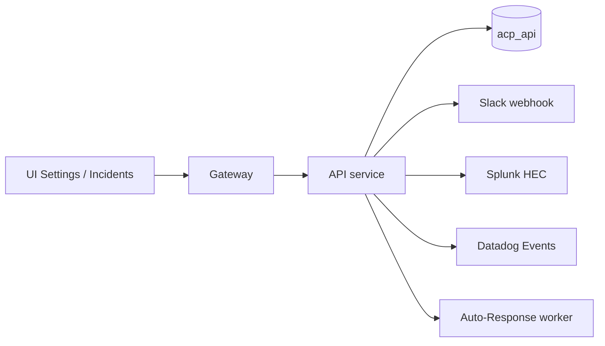

# API service

*The catch-all service for operator-facing CRUD that doesn't belong to another bounded context: API keys, incidents, auto-response rules, webhooks, SIEM connections, scheduled reports, threat-intel enrichment, and the admin console.*

## Business purpose

Aegis has many small operational surfaces that don't justify their own service. Combining them into one service:

- **Shares one database connection pool.** Saves Postgres connections.
- **Shares one auth dependency stack.** No need to wire `verify_internal_secret` plus the RBAC decorators into 7 small services.
- **Keeps deploy simple.** One image, one health check, one set of envs.

The trade-off is that the API service is the bin where "I added a new endpoint and it doesn't fit anywhere else" tends to land. Periodic refactors split out functionality when a logical seam becomes clear.

## Architecture



The service has a synchronous API surface and an embedded worker for auto-response rule execution.

## Request flow

### Incident open

1. Audit detects a chain violation or a threshold breach → POSTs `/incidents` to the api service.
2. Handler inserts into `incidents` with `status="open"`.
3. Webhook fanout: posts to Slack and (if configured) PagerDuty.

### Auto-response rule trigger

1. Audit outbox worker emits an event the auto-response watcher cares about.
2. AR watcher (background process inside `acp_api`) matches the event against active rules.
3. On match, the AR executor (`services/api/are_executor.py`) runs the rule's actions: quarantine agent, engage kill switch, notify, etc.
4. Records the run in `auto_response_runs` with the rule version and outcome.
5. Optional human approval gate: actions tagged `approval_required` create an `ar_pending` row instead of running directly.

### API key creation

1. ADMIN posts `/api-keys` with `{name, scopes}`.
2. Handler generates a random key with `acp_` prefix and stores only the bcrypt hash.
3. Returns the raw key one time; subsequent reads return the hash and metadata only.

### Webhook test

1. Operator posts `/webhooks/test/slack` with the target URL.
2. Handler sends a test payload and returns the HTTP status from Slack.

## Dependencies

**Python libraries:**

- `fastapi`, `sqlalchemy[asyncio]`, `asyncpg`, `pydantic`.
- `httpx` for outbound webhook calls.
- `bcrypt` for API key hashing.
- `redis.asyncio` for the AR replay buffer.
- `structlog`.

**Other Aegis services:**

- Audit — read for incident correlation and AR rule matching.
- Registry — write for quarantine actions.
- Decision — write for kill-switch engagement from AR.
- Identity — write for credential rotation.

**Infrastructure:**

- Postgres `acp_api`.
- Redis for AR replay buffer and DLQ.
- External integrations: Slack, PagerDuty, Splunk, Datadog, Shodan, AbuseIPDB.

## Database tables

| Table | Purpose | Notable columns |
|---|---|---|
| `api_keys` | Tenant API keys | `id`, `tenant_id`, `name`, `key_hash` (bcrypt), `prefix`, `scopes` (JSONB), `created_by`, `created_at`, `revoked_at` |
| `auto_response_rules` | AR rule definitions | `id`, `tenant_id`, `name`, `version`, `match` (JSONB), `actions` (JSONB), `mode` (`active`/`simulate`/`disabled`), `approval_required`, `created_by` |
| `incidents` | SOC incident records | `id`, `tenant_id`, `title`, `severity`, `status`, `assigned_to`, `actions_taken` (JSONB), `created_at`, `resolved_at` |

Many UI surfaces hit additional tables that live in `acp_api` but are managed by submodules:

- `webhooks` — outbound webhook configs (Slack, custom).
- `siem_connections` — Splunk and Datadog endpoint config.
- `scheduled_reports` — cron-style report definitions.
- `threat_intel_cache` — cached enrichment results.
- `dashboard_state` — per-user saved dashboard filters.

**Live state (as of 2026-05-29, public demo at `aegisagent.in`):**

- `api_keys` = 0
- `auto_response_rules` = 0
- `incidents` = 0

The demo deployment has not yet been configured with operational rules, API keys, or open incidents. The 4 demo agents predate any operator setup.

## Redis usage

| Key pattern | Operation | Purpose | TTL |
|---|---|---|---|
| `acp:ar_replay:{rule_id}` (List) | LPUSH | Replay buffer for AR rule changes | 30 days |
| `acp:ar_pending:{approval_key}` | GET / SET | Pending approval state | Until approved or expired |
| `acp:ar_throttle:{rule_id}` | GET / SET | Per-rule throttle | configurable |
| `acp:webhook_dlq:{tenant_id}` (List) | LPUSH | Failed webhook deliveries | Until replayed |
| `acp:incident_summary:{tenant_id}` | GET / SETEX | Incident counts cache | 30 s |

## Security controls

- **Tenant scoping on every query.** Cross-tenant reads are not allowed.
- **API key one-time disclosure.** The raw key is returned exactly once at creation; subsequent reads return only the prefix and hash.
- **Bcrypt-hashed storage.** A leaked database does not expose usable keys.
- **AR rules require ADMIN to create or edit.** Read is AUDITOR+.
- **Webhook URLs are validated at create time.** Localhost and private IP ranges are rejected to prevent SSRF.
- **SIEM connection secrets** are stored encrypted (env-derived key) and never returned in API responses.
- **Audit emission on every create / update / delete.** Every API key creation, every rule change, every incident transition produces an audit row.
- **Threat-intel enrichment is rate-limited per tenant.** External calls cost money and have their own quotas.

## Metrics

| Metric | Type | Labels | Purpose |
|---|---|---|---|
| `acp_api_keys_created_total` | Counter | `tenant_id` | API key issuance |
| `acp_ar_rule_runs_total` | Counter | `tenant_id`, `rule_id`, `result` | Auto-response runs |
| `acp_ar_rule_match_latency_seconds` | Histogram | `tenant_id` | Match evaluation time |
| `acp_ar_pending_approvals_size` | Gauge | `tenant_id` | Outstanding approvals |
| `acp_incidents_open_total` | Gauge | `tenant_id`, `severity` | Open incidents |
| `acp_webhook_delivery_total` | Counter | `tenant_id`, `target`, `result` | Webhook outcomes |
| `acp_siem_push_total` | Counter | `tenant_id`, `target`, `result` | SIEM forwards |
| `acp_threat_intel_lookup_total` | Counter | `tenant_id`, `provider`, `result` | Enrichment outcomes |

## Deployment model

- **Image**: `infra-api` from `services/api/Dockerfile`.
- **Container**: `acp_api`.
- **Port**: 8010.
- **Replicas**: 1.
- **Healthcheck**: `GET /health`.
- **Env vars**: `DATABASE_URL`, `REDIS_URL`, `INTERNAL_SECRET`, `AUDIT_SERVICE_URL`, `REGISTRY_SERVICE_URL`, `IDENTITY_SERVICE_URL`, `DECISION_SERVICE_URL`, `SLACK_DEFAULT_WEBHOOK_URL` (optional), `PAGERDUTY_INTEGRATION_KEY` (optional), `SHODAN_API_KEY` (optional), `ABUSEIPDB_API_KEY` (optional).

## API endpoints

The service exposes the largest route count in the platform. Top tags:

| Tag | Routes | Used by |
|---|---|---|
| `api-keys` | 4 | Developer Panel |
| `incidents` | 6 | Incidents UI |
| `auto-response` | ~14 | Auto Response UI |
| `webhooks` | 4 | Webhook Settings |
| `siem` | 5 | SIEM Settings |
| `scheduled-reports` | 6 | Scheduled Reports UI |
| `threat-intel` | 3 | Threat Intel UI |
| `admin` | 3 | Admin Console |
| `dashboard` | 2 | Various dashboards |

Selected endpoints:

| Method | Path | Auth | Description |
|---|---|---|---|
| POST | `/api-keys` | ADMIN | Create API key |
| GET | `/api-keys` | AUDITOR+ | List keys |
| DELETE | `/api-keys/{id}` | ADMIN | Revoke key |
| POST | `/incidents` | Internal only | Open an incident |
| GET | `/incidents` | AUDITOR+ | List incidents |
| GET | `/incidents/{id}` | AUDITOR+ | Detail |
| PATCH | `/incidents/{id}` | ADMIN / SECURITY | Update status |
| GET | `/incidents/summary` | AUDITOR+ | Counts |
| POST | `/auto-response/rules` | ADMIN | Create AR rule |
| GET | `/auto-response/rules` | AUDITOR+ | List rules |
| POST | `/auto-response/simulate` | ADMIN / SECURITY | Replay events through a rule |
| GET | `/auto-response/pending` | AUDITOR+ | Pending approvals |
| POST | `/auto-response/pending/{key}/approve` | ADMIN | Approve a pending action |
| POST | `/webhooks/config` | ADMIN | Save webhook config |
| POST | `/webhooks/test/slack` | ADMIN | Test Slack |
| POST | `/siem/config` | ADMIN | Save SIEM config |
| POST | `/siem/push` | Internal only | Push events to SIEM |
| GET | `/reports/scheduled` | AUDITOR+ | List scheduled reports |
| POST | `/reports/scheduled` | ADMIN | Create scheduled report |
| GET | `/threat-intel/summary` | AUDITOR+ | Cross-tenant threat summary |
| POST | `/threat-intel/ip` | AUDITOR+ | Enrich IP |
| POST | `/threat-intel/domain` | AUDITOR+ | Enrich domain |
| GET | `/admin/tenants` | ADMIN (platform-admin) | List tenants |

## Example requests

### Create an API key

```bash
curl -sS -X POST https://aegisagent.in/api-keys \
  -H "Authorization: Bearer $TOKEN" \
  -H "X-Tenant-ID: 00000000-0000-0000-0000-000000000001" \
  -H "Content-Type: application/json" \
  -d '{"name":"ci-runner","scopes":["execute","read:audit"]}'
# Returns: { "data": { "key": "acp_...", "id": "..." } } — copy now, won't be shown again
```

### Create an AR rule that quarantines on prompt-injection finding

```bash
curl -sS -X POST https://aegisagent.in/auto-response/rules \
  -H "Authorization: Bearer $TOKEN" \
  -H "X-Tenant-ID: 00000000-0000-0000-0000-000000000001" \
  -H "Content-Type: application/json" \
  -d '{
    "name":"quarantine_on_prompt_injection",
    "match":{"finding":"prompt_injection_detected"},
    "actions":[{"type":"quarantine_agent","target":"{event.agent_id}"}],
    "mode":"active",
    "approval_required":false
  }'
```

### Push a test event to Splunk

```bash
curl -sS -X POST https://aegisagent.in/siem/test/splunk \
  -H "Authorization: Bearer $TOKEN" \
  -H "X-Tenant-ID: 00000000-0000-0000-0000-000000000001"
```

## Troubleshooting

| Symptom | Likely cause | Where to look |
|---|---|---|
| API key creation 500 | bcrypt thread pool contention | Inspect `acp_api` CPU usage during peak |
| AR rule not firing | `mode="simulate"` instead of `"active"` | Inspect rule definition |
| Pending approval never expires | TTL not set on `acp:ar_pending:{key}` | Audit pending rows older than 24h |
| Webhook delivery failures | URL blocked by SSRF guard | Whitelist via env or fix the URL |
| SIEM push silently failing | Auth token in config invalid | Inspect SIEM provider's audit log |
| Threat-intel cache stale | TTL expired but enrichment provider returning the same data | Force a re-lookup |
| Admin console returns 403 | User is ADMIN but not platform-admin | Set `users.is_platform_admin=true` for cross-tenant view |

## Production considerations

- **API service is the most-changed service in the platform.** Every new operational feature lands here first. Test coverage is the budget.
- **Auto-response is the operational power tool.** Misconfigured rules can quarantine all agents in seconds. Simulation mode and approval gates exist for this reason.
- **API keys never expire automatically.** Rotation is operator responsibility. Long-lived keys are an operational risk if not paired with scoped permissions.
- **Webhook deliveries retry.** Failed deliveries land in `acp:webhook_dlq:{tenant_id}` for inspection and manual replay.
- **SIEM forwarders are eventual.** A push failure does not block the originating event; the audit chain still records.
- **Threat-intel cache TTLs scale with the provider.** Shodan results cache 24h; AbuseIPDB caches 1h.

## Next

- [Auto Response UI](../ui/operations/auto-response.md)
- [Incidents UI](../ui/primary/incidents.md)
- [Developer Panel UI](../ui/settings/developer-panel.md)
- [SIEM Settings UI](../ui/settings/siem-settings.md)
- [Webhook Settings UI](../ui/settings/webhook-settings.md)
- [Audit](audit.md) — the source of events for AR matching
