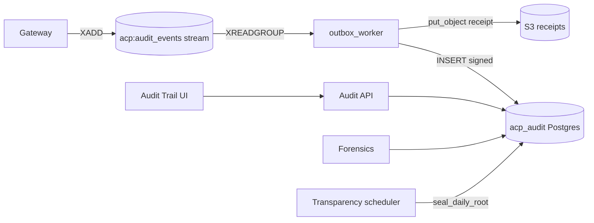

# Audit

*The cryptographic memory of Aegis. Every decision — allowed or denied — lands here as a signed, hash-chained row that nobody can silently modify. Also serves dozens of aggregator endpoints that power the dashboards, plus the analyst-notes and incident workflow.*

## Business purpose

Three things hinge on the Audit service:

- **Compliance.** SOC 2, EU AI Act, NIST AI RMF, and most internal SOC playbooks require a verifiable record of every automated decision. If the audit log can be silently rewritten, the compliance claim is unsupportable.
- **Forensics.** When something goes wrong — an agent misbehaves, a customer asks "why was this blocked", an auditor asks "did this PII ever leave the perimeter" — Audit is the answer. The Forensics service reads directly from the audit chain because the chain is the truth.
- **Billing.** Every `usage_records` row corresponds to exactly one `audit_logs` row via the outbox pattern. If the audit chain has a gap, billing has a gap. The reconciler at `scripts/ops/reconcile.py` enforces the invariant nightly.

The service exists as its own service because the integrity properties — ed25519 signing, prev_hash chaining, daily Merkle root — are too important to share a process with anything that could crash and corrupt a write.

## Architecture



Two execution surfaces: an **API service** (FastAPI app on port 8006) and a **worker** that drains the Redis stream and writes signed rows. They run in the same container with different process roles.

## Request flow

### Inbound: audit emission

1. Gateway pushes `XADD acp:audit_events` with the canonical record. Returns immediately to the caller.
2. `services/audit/outbox_worker.py` `XREADGROUP` consumes the entry.
3. Worker acquires `acp:audit_chain_lock:{tenant_id}` via SETNX (5s TTL) — serializes chain writes per tenant.
4. Reads previous `event_hash` from `acp:audit_chain_tail:{tenant_id}` (Redis) or from Postgres if cache cold.
5. Computes canonical content hash: SHA-256 over the canonical-JSON of the record.
6. Computes chained `event_hash`: `SHA-256(prev_event_hash || canonical_hash)`.
7. Signs the event_hash with ed25519 using today's key. `services/audit/signer.py::sign`.
8. Atomic transaction (`services/audit/writer.py::write_signed_row`):
   - `INSERT audit_logs (...)` with all fields.
   - `INSERT pending_usage_events (...)` for billing.
9. Updates `acp:audit_chain_tail:{tenant_id}` with the new event_hash.
10. `XACK` the stream entry.
11. Best-effort `put_object` of the canonical receipt to `s3://acp-receipts-prod/{tenant_id}/{audit_id}.json`.

### Outbound: read

- Aggregator endpoints (`/summary`, `/decision-trend`, `/deny-reasons`, etc.) run SQL aggregations on `audit_logs` with `tenant_id` and a date range. Many results are cached for 30 seconds in Redis.
- Receipt retrieval (`GET /audit/logs/{id}/receipt`) reconstructs the canonical record, attaches the signature and chain links, and computes the Merkle inclusion proof.
- Chain verification (`GET /audit/logs/verify`) recomputes `event_hash` for every row in a window, validates the signature against current and historical keys, and checks the prev_hash linkage.

### Daily transparency root

- `services/audit/transparency_scheduler.py` runs at midnight UTC.
- Collects every `event_hash` for the previous day per tenant.
- Builds a Merkle tree (`services/audit/merkle.py`).
- Records the root in `transparency_roots` with a chain link to the previous day's root.
- Signs the root with the day's signing key.

## Dependencies

**Python libraries:**

- `fastapi`, `sqlalchemy[asyncio]`, `asyncpg`, `pydantic` — standard.
- `cryptography` — ed25519 signing and verification (`services/audit/crypto.py`).
- `boto3` — S3 receipt uploads.
- `redis.asyncio` — stream consumer and per-tenant cache.
- `reportlab` — PDF export for SOC 2 / EU AI Act / NIST evidence (`services/audit/pdf_export.py`, `incident_pdf.py`).

**Other Aegis services it calls:**

- Notifications API (`services/api/`) — webhooks on chain-violation alerts.
- SIEM forwarder (`services/audit/siem.py`) — pushes audit rows to Splunk/Datadog when configured.

**Infrastructure:**

- Postgres database `acp_audit`.
- Redis stream `acp:audit_events`, plus per-tenant cache keys.
- S3 bucket `acp-receipts-prod`.
- Ed25519 private key file mounted as a secret; public key fingerprint stored on every row.

## Database tables

| Table | Purpose | Notable columns |
|---|---|---|
| `audit_logs` | The signed chain | `id`, `tenant_id`, `agent_id`, `action`, `decision`, `findings` (JSONB), `metadata_json`, `event_hash`, `prev_hash`, `signature`, `key_fingerprint`, `created_at`, `shard` |
| `transparency_roots` | Daily Merkle roots | `tenant_id`, `date`, `merkle_root`, `prev_root_hash`, `leaf_count`, `leaf_range`, `signing_key_fingerprint`, `signature`, `sealed_at`, UNIQUE (`tenant_id`, `date`) |
| `transparency_historical_keys` | Retired signing keys | `key_fingerprint`, `public_key_pem`, `rotated_at`, `tenant_id` |
| `audit_notes` | Analyst notes attached to a row | `id`, `audit_id`, `tenant_id`, `created_by`, `note_type` (`analysis` / `false_positive` / `confirmed_threat` / `escalated`), `body`, `created_at` |
| `pending_usage_events` | Outbox for billing | `id`, `audit_id` (derived from request_id — UUIDv5), `tenant_id`, `agent_id`, `amount_usd`, `retry_count`, `created_at` |
| `acp_incidents` | SOC incident records | `id`, `tenant_id`, `title`, `severity`, `status` (`open` / `investigating` / `resolved` / `false_positive`), `assigned_to`, `created_at` |
| `acp_incident_comments` | Comments on incidents | `id`, `incident_id`, `tenant_id`, `author`, `body`, `created_at` |

Indexes: `audit_logs` has `(tenant_id, created_at DESC)`, `(tenant_id, agent_id, created_at DESC)`, and `(tenant_id, action, created_at DESC)`. The `created_at DESC` orientation matches the UI's most-common query: "last N events for this tenant".

Production deployments partition `audit_logs` by month on `created_at`. The partitioning is managed by an external tool, not by Alembic.

## Redis usage

| Key pattern | Operation | Purpose | TTL |
|---|---|---|---|
| `acp:audit_events` (Stream) | XADD / XREADGROUP / XACK | Outbox | Untrimmed |
| `acp:audit_chain_lock:{tenant_id}` | SETNX | Serialize chain writes | 5 s |
| `acp:audit_chain_tail:{tenant_id}` | GET / SET | Cached last event_hash | 1 hour |
| `acp:transparency_root_lock:{date}` | SETNX | Single-writer for daily sealing | 1 hour |
| `acp:audit_summary:{tenant_id}:{day}` | GET / SETEX | Cached aggregate | 30 s |
| `acp:audit_reconcile_cursor:{tenant_id}` | GET / SET | Reconciler position | 30 days |
| `acp:billing_alerts` (List) | LPUSH | 80%-of-cap warnings | None |

## Security controls

- **Append-only by contract.** Application code uses `INSERT` only. There is no `UPDATE` on `audit_logs` in the codebase. Operators with raw Postgres access can technically rewrite rows; the chain detects it.
- **Ed25519 signing.** Each row's `event_hash` is signed with a per-day key. Verification works against the current key plus all rows in `transparency_historical_keys`.
- **Prev-hash chain.** Tampering with row N requires also rewriting rows N+1, N+2, … to maintain the chain. Tampering with the daily root requires the root key. Tampering with all archived daily roots is impossible (customers and external observers hold them).
- **Per-tenant scope.** Every query and every chain check is scoped by `tenant_id`. Cross-tenant reads from this service are not allowed.
- **Notes are append-only.** `audit_notes` rows can be inserted but not updated or deleted via the API. Audit-of-the-audit.
- **PDF exports are signed.** Generated PDFs include the audit-chain hashes for the rows they cover so the recipient can verify the export later.

## Metrics

| Metric | Type | Labels | Purpose |
|---|---|---|---|
| `acp_audit_logs_written_total` | Counter | `tenant_id`, `action` | Throughput |
| `acp_audit_write_latency_seconds` | Histogram | `tenant_id` | Outbox-worker latency |
| `acp_audit_outbox_oldest_age_seconds` | Gauge | `tenant_id` | Backlog SLI |
| `acp_audit_chain_violation_total` | Counter | `tenant_id`, `violation_type` | Verifier-detected gaps |
| `acp_chain_violation_immediate` | Counter | `tenant_id` | Alerts `for: 0m` |
| `acp_audit_verify_duration_seconds` | Histogram | `tenant_id` | Verifier scan time |
| `acp_audit_signing_key_age_days` | Gauge | `tenant_id` | When > 30, schedule key rotation |
| `acp_transparency_roots_sealed_total` | Counter | `tenant_id` | One per day per tenant |
| `acp_audit_dlq_size` | Gauge | none | Dead-lettered outbox events |

## Deployment model

- **Image**: `infra-audit` from `services/audit/Dockerfile`.
- **Container**: `acp_audit`. Runs uvicorn (API) plus N worker processes (`audit-outbox-1`, `audit-outbox-2`, …) inside the same container, started by the entrypoint.
- **Port**: 8006 (API). Workers don't bind ports.
- **Replicas**: 1 per host (the chain lock makes worker scale-out per tenant moot).
- **Healthcheck**: `GET /health`.
- **Env vars**: `DATABASE_URL`, `REDIS_URL`, `INTERNAL_SECRET`, `S3_RECEIPTS_BUCKET`, `ED25519_PRIVATE_KEY_PATH`, `TRANSPARENCY_KEY_PATH`, `AUDIT_OUTBOX_WORKERS` (default 2).
- **Resource footprint**: ~400 MB resident. Worker count scales linearly with sustained throughput.

## API endpoints

This service exposes one of the largest route counts in the platform. The top-level shape:

| Tag / Prefix | Routes | Used by |
|---|---|---|
| Audit log primary | `/audit/logs`, `/audit/logs/summary`, `/audit/logs/search`, `/audit/logs/verify`, `/audit/logs/{id}/receipt`, `/audit/logs/{id}/explain`, `/audit/logs/{id}/notes` (GET, POST) | Audit Trail UI, SDK |
| Risk and trend | `/audit/risk/timeline`, `/audit/risk/top-threats`, `/audit/risk-histogram`, `/audit/risk-trend/{agent_id}`, `/audit/risk-percentile-trend` | Risk Engine, Observability |
| Decision aggregates | `/audit/decision-trend`, `/audit/deny-reasons`, `/audit/escalation-rate-trend`, `/audit/posture-score-trend`, `/audit/top-findings`, `/audit/finding-breakdown` | Observability, Security Dashboard, Policy Analytics |
| Tool aggregates | `/audit/tool-breakdown`, `/audit/tool-risk`, `/audit/tool-usage/{agent_id}` | Policy Analytics, Agent Profile |
| Agent aggregates | `/audit/agent-activity`, `/audit/daily-active-agents`, `/audit/agent-findings/{agent_id}`, `/audit/agent-daily-decisions/{agent_id}`, `/audit/drift/{agent_id}`, `/audit/peer-benchmark/{agent_id}` | Agent Profile, Risk Engine |
| Time-grid aggregates | `/audit/hourly-activity`, `/audit/weekly-heatmap`, `/audit/logs/heatmap` | Observability, Admin Console |
| SOC | `/audit/logs/soc-timeline`, `/audit/high-risk-events` | Incidents, Security Dashboard |
| Export | `/audit/export` (GET CSV / POST PDF) | Compliance |
| Transparency | `/transparency/roots`, `/transparency/roots/{date}`, `/transparency/inclusion/{id}`, `/transparency/consistency`, `/transparency/keys`, `POST /transparency/verify-root` | Receipt verification, third-party auditors |
| Ops / internal | `/audit/outbox-depth`, `/audit/billing-gaps`, `/audit/billing-stats` | Internal monitoring |
| Notes | `/audit/logs/{id}/notes` GET, POST | Analyst Notes panel |
| Incidents | `/incidents`, `/incidents/{id}`, `/incidents/{id}/actions`, `/incidents/{id}/export`, `/incidents/transitions`, `/incidents/summary` | Incidents UI |

The gateway proxies most of these as `/audit/*` paths; some live under different prefixes for the UI's convenience (`/transparency/*`, `/incidents/*`).

## Example requests

### Fetch the last 10 audit rows

```bash
curl -sS https://dev.aegisagent.in/audit/logs?limit=10 \
  -H "Authorization: Bearer $TOKEN" \
  -H "X-Tenant-ID: 00000000-0000-0000-0000-000000000001" | jq '.data.items'
```

### Verify the chain

```bash
curl -sS https://dev.aegisagent.in/audit/logs/verify \
  -H "Authorization: Bearer $TOKEN" \
  -H "X-Tenant-ID: 00000000-0000-0000-0000-000000000001" | jq '{ valid, violations, rows_checked }'
```

### Fetch the receipt for one row

```bash
curl -sS https://dev.aegisagent.in/audit/logs/$AUDIT_ID/receipt \
  -H "Authorization: Bearer $TOKEN" \
  -H "X-Tenant-ID: 00000000-0000-0000-0000-000000000001" | jq
```

### Add an analyst note

```bash
curl -sS -X POST https://dev.aegisagent.in/audit/logs/$AUDIT_ID/notes \
  -H "Authorization: Bearer $TOKEN" \
  -H "X-Tenant-ID: 00000000-0000-0000-0000-000000000001" \
  -H "Content-Type: application/json" \
  -d '{"note_type":"false_positive","body":"This is a legitimate report; the rule is over-broad.","created_by":"analyst@acme.com"}'
```

## Troubleshooting

| Symptom | Likely cause | Where to look |
|---|---|---|
| 500 on POST /audit/logs/{id}/notes | `audit_notes` table missing on RDS | Run `services/audit/models.py::Base.metadata.create_all` for `AuditNote.__table__` |
| `acp_audit_outbox_oldest_age_seconds` rising | Workers stalled or chain lock stuck | Check worker logs; force-clear `acp:audit_chain_lock:{tenant_id}` if older than 60s |
| `/audit/logs/verify` returns violations | Either a real tampering, OR a key rotation didn't promote the old key to `transparency_historical_keys` | See [Key Rotation](../operations/key-rotation.md) |
| Receipt verification fails for old rows | Same — historical key not stored | Same |
| `/decision-trend` returns 500 | The `func.date_trunc("day", AuditLog.timestamp)` parameter-collision pattern; bind to one variable | Memory: `docs_parity_audit_2026_05_15` |
| Receipt missing from S3 | Best-effort S3 upload failed; the row is still in Postgres | Re-run `scripts/maintenance/rebuild_s3_receipts.py` for the missing ID |
| Chain violation alert in Slack | The verifier ran on a cron and found a gap | Open `docs/runbooks/audit_chain_violation.md` |

## Production considerations

- **The outbox worker is the single most important process in Aegis.** If it stops, every audit row stops being written, and every billing event stops draining. The DLQ exists to surface stuck rows.
- **Chain lock TTL is 5 seconds.** Long enough that a normal write completes; short enough that a worker crash unblocks the next worker within a request lifetime.
- **`audit_id` for billing is deterministic.** The gateway derives the `pending_usage_event.audit_id` from the request_id via UUIDv5, so the outbox is naturally idempotent even on retry.
- **Key rotation is supported but bounded.** Rotating the signing key requires promoting the old key to `transparency_historical_keys` BEFORE any new row is written with the new key. The runbook enforces this order.
- **Daily root is the strongest guarantee.** Customers who archive their daily root can detect post-hoc rewrites even if every Aegis-controlled secret is compromised. This is the property the platform is sold on.
- **Reconciler is non-negotiable.** `scripts/ops/reconcile.py` runs nightly and emits `acp_reconcile_audit_without_usage` and `acp_reconcile_usage_without_audit` gauges. Either gauge being nonzero is a paging alert.
- **PDF export size grows with chain length.** Exports for very large windows can be heavy; the API streams the response and caps row count per request.

## Next

- [Cryptographic Audit Chain](../security/crypto-audit-chain.md) — the signing math and verification algorithm
- [Key Rotation](../operations/key-rotation.md) — how to rotate without invalidating receipts
- [Audit Chain Violation runbook](../operations/runbooks/audit-chain-violation.md) — what to do when verify fails
- [Backup & Restore](../operations/backup-restore.md) — recovery posture
- [Gateway](gateway.md) — the upstream caller
