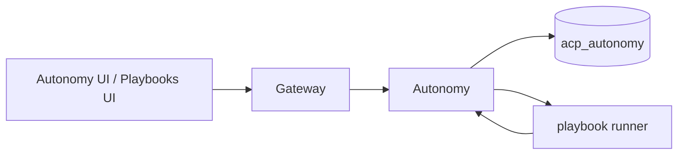

# Autonomy

*Multi-agent contracts, automated remediation playbooks, and human-override events. Where per-agent permissions answer "can this agent call this tool", autonomy contracts answer "can this agent call this tool in this context, given the other agents in the system."*

## Business purpose

Three problems the autonomy service exists to solve:

1. **Multi-agent risk.** When agent A calls agent B which calls agent C, the chain has accumulated authority that no single grant would have permitted. Contracts cap delegation depth, time windows, and cross-tenant access.
2. **Remediation as code.** When something goes wrong, an operator's first action is often "quarantine the agent and notify the team." Codifying these steps as playbooks lets the next incident respond in seconds rather than minutes.
3. **Auditable human overrides.** Sometimes an operator chooses to allow a denied action — for legitimate operational reasons. The override is recorded as a first-class event, not buried in a comment.

## Architecture



The service has two faces: a synchronous API consulted at stage 7 of the gateway pipeline (the contract check) and an asynchronous playbook runner that executes remediation steps when triggered.

## Request flow

### Stage 7 contract check

1. Gateway calls `check_autonomy_contract` from `services/gateway/trust_emitter.py`.
2. The handler loads active contracts for the tenant (cached for 60s).
3. For each active contract whose scope matches the request:
   - Checks the time window (allowed hours, allowed days).
   - Checks the cross-tenant access rule (`source_tenant_id`, `destination_tenant_id`).
   - Checks the delegation depth (how many agents deep is this call chain).
   - Checks the cost cap (cumulative inference cost in the contract's window).
4. If any check fails, returns `{ ok: false, violation: { contract_id, reason } }`.
5. Gateway downgrades the decision from ALLOW/MONITOR to ESCALATE or KILL and records the violation.

### Playbook execution

1. UI calls `POST /playbooks/{id}/trigger` with a context payload.
2. Handler creates a `playbook_runs` row with `status="triggered"` and `triggered_by` (`auto` / `manual` / `api`).
3. The runner (started as a background task) walks the steps:
   - `notify_slack`: posts to the tenant's Slack webhook
   - `quarantine_agent`: PATCH `/agents/{id}` to set status `QUARANTINED`
   - `engage_kill_switch`: POST `/decision/kill-switch/{tenant_id}`
   - `rotate_credentials`: POST `/auth/credentials` with a fresh secret and revoke the old one
   - `freeze_billing`: set the tenant's daily cap to zero
4. After each step, updates the run row. Failed steps can be retried by re-triggering with the same `idempotency_key`.

### Auto-trigger

A subset of audit-row patterns are wired to auto-trigger specific playbooks. `services/autonomy/auto_trigger.py` watches the audit Redis stream and matches rules from `services/autonomy/auto_trigger_rules.yaml`. A match starts the playbook with `triggered_by="auto"`.

## Dependencies

**Python libraries:**

- `fastapi`, `sqlalchemy[asyncio]`, `asyncpg`.
- `httpx` for downstream service calls during playbook execution.
- `apscheduler` for time-window contract enforcement.
- `redis.asyncio` for the audit-stream watcher.

**Other Aegis services:**

- Audit (`services/audit/`) — every contract violation and every playbook run produces an audit row.
- Decision (`services/decision/`) — playbooks may engage the kill switch.
- Registry (`services/registry/`) — playbooks may quarantine an agent.
- Identity (`services/identity/`) — playbooks may rotate credentials.
- API service (`services/api/`) — playbooks may post to webhooks and notify SIEM.

**Infrastructure:**

- Postgres `acp_autonomy`.
- Redis stream consumer for auto-trigger.

## Database tables

| Table | Purpose | Notable columns |
|---|---|---|
| `autonomy_contracts` | Active multi-agent contracts | `id`, `tenant_id`, `name`, `scope_json`, `time_window_json`, `cross_tenant_rules_json`, `delegation_max_depth`, `cost_cap_window_seconds`, `cost_cap_usd`, `is_active`, `created_at` |
| `autonomy_contract_violations` | Recorded violations | `id`, `contract_id`, `tenant_id`, `agent_id`, `audit_id`, `reason`, `detected_at` |
| `human_override_events` | When a human accepted a deny | `id`, `tenant_id`, `audit_id`, `overridden_by`, `reason`, `created_at` |
| `playbooks` | Playbook definitions | `id`, `tenant_id`, `name`, `description`, `trigger_conditions` (JSONB), `steps` (JSONB), `mode` (`manual`/`auto`/`hybrid`), `is_active`, `run_count`, `created_at` |
| `playbook_runs` | Per-run instances | `id`, `playbook_id`, `tenant_id`, `triggered_by`, `idempotency_key`, `context` (JSONB), `status`, `step_results` (JSONB), `started_at`, `completed_at` |

**Live state (as of 2026-05-29, public demo at `aegisagent.in`):**

- `autonomy_contracts` = 0
- `autonomy_contract_violations` = 0
- `human_override_events` = 0
- `playbooks` = 0
- `playbook_runs` = 0

The demo deployment has not yet been seeded with contracts or playbooks; the UI shows empty states. The 4 pre-built playbook templates are surfaced by `GET /playbooks/templates` and can be cloned into runnable playbooks via `POST /playbooks` with the template id.

## Redis usage

| Key pattern | Operation | Purpose | TTL |
|---|---|---|---|
| `acp:autonomy_contracts:{tenant_id}` | GET / SET | Cached active contracts | 60 s |
| `acp:playbook_run:{run_id}` | GET / SET | In-flight run state | 24 h |
| `acp:auto_trigger_cursor` | GET / SET | Audit stream cursor for auto-trigger worker | None |
| `acp:playbook_idempotency:{key}` | SETNX | Dedupes repeated trigger calls | 1 h |

## Security controls

- **Contract scoping by tenant.** Contracts apply only within the issuing tenant; cross-tenant contracts require explicit dest-tenant approval (a separate row in the destination tenant).
- **Playbook execution requires ADMIN or SECURITY.** Manual triggers from the UI are role-gated; auto-triggers are gated by the rule's own author identity.
- **Override accountability.** `human_override_events` is append-only; the override flow requires a non-empty reason and the overrider's user_id is recorded.
- **Step idempotency.** Every playbook step takes an idempotency key; re-running the same step with the same key is a no-op. Critical for safe retries.
- **No arbitrary code execution.** Playbook step types are a fixed enum; there is no `run_shell` step. Adding a step type requires a service release.

## Metrics

| Metric | Type | Labels | Purpose |
|---|---|---|---|
| `acp_autonomy_contract_violations_total` | Counter | `tenant_id`, `reason` | Violations detected |
| `acp_autonomy_contract_consult_latency_seconds` | Histogram | `tenant_id` | Stage 7 latency contribution |
| `acp_autonomy_playbook_runs_total` | Counter | `tenant_id`, `playbook_id`, `triggered_by`, `status` | Run outcomes |
| `acp_autonomy_playbook_step_latency_seconds` | Histogram | `step_type` | Per-step latency |
| `acp_autonomy_human_overrides_total` | Counter | `tenant_id` | Override count |
| `acp_autonomy_auto_trigger_matched_total` | Counter | `tenant_id`, `rule_id` | Auto-trigger matches |

## Deployment model

- **Image**: `infra-autonomy` from `services/autonomy/Dockerfile`.
- **Container**: `acp_autonomy`.
- **Port**: 8015.
- **Replicas**: 1.
- **Healthcheck**: `GET /health`.
- **Env vars**: `DATABASE_URL`, `REDIS_URL`, `INTERNAL_SECRET`, `AUDIT_SERVICE_URL`, `DECISION_SERVICE_URL`, `REGISTRY_SERVICE_URL`, `IDENTITY_SERVICE_URL`, `API_SERVICE_URL`, `CONTRACT_CACHE_TTL_SECONDS` (default 60), `PLAYBOOK_STEP_TIMEOUT_SECONDS` (default 30).

## API endpoints

| Method | Path | Auth | Description |
|---|---|---|---|
| GET | `/autonomy/contracts` | AUDITOR+ | List contracts |
| POST | `/autonomy/contracts` | ADMIN / SECURITY | Create contract |
| GET | `/autonomy/contracts/{id}` | AUDITOR+ | Detail |
| PATCH | `/autonomy/contracts/{id}` | ADMIN / SECURITY | Update |
| DELETE | `/autonomy/contracts/{id}` | ADMIN / SECURITY | Disable |
| GET | `/autonomy/violations` | AUDITOR+ | Recent violations |
| GET | `/autonomy/overrides` | AUDITOR+ | Human-override timeline |
| POST | `/autonomy/check` | Internal only | Stage 7 contract check |
| GET | `/playbooks` | AUDITOR+ | List active playbooks |
| GET | `/playbooks/templates` | AUDITOR+ | 4 built-in templates |
| POST | `/playbooks` | ADMIN / SECURITY | Create or clone a playbook |
| GET | `/playbooks/{id}` | AUDITOR+ | Detail |
| PATCH | `/playbooks/{id}` | ADMIN / SECURITY | Update |
| DELETE | `/playbooks/{id}` | ADMIN / SECURITY | Soft-delete |
| POST | `/playbooks/{id}/trigger` | ADMIN / SECURITY | Manually trigger a run |
| GET | `/playbooks/{id}/runs` | AUDITOR+ | Past runs |
| GET | `/playbooks/stats` | AUDITOR+ | Aggregate per-playbook stats |
| GET | `/playbooks/autotrigger-stats` | AUDITOR+ | Per-playbook auto-trigger counts |

Note: `/playbooks/autotrigger-stats` is declared before `/playbooks/{playbook_id}` in the router so FastAPI matches the static path first. See the `services/autonomy/router.py` ordering note.

## Example requests

### List built-in playbook templates

```bash
curl -sS https://aegisagent.in/playbooks/templates \
  -H "Authorization: Bearer $TOKEN" \
  -H "X-Tenant-ID: 00000000-0000-0000-0000-000000000001" | jq
```

### Create a contract that limits delegation to depth 2

```bash
curl -sS -X POST https://aegisagent.in/autonomy/contracts \
  -H "Authorization: Bearer $TOKEN" \
  -H "X-Tenant-ID: 00000000-0000-0000-0000-000000000001" \
  -H "Content-Type: application/json" \
  -d '{
    "name":"no-deep-delegation",
    "scope_json":{"agent_pattern":"*"},
    "delegation_max_depth":2,
    "cost_cap_usd":50.00,
    "cost_cap_window_seconds":86400
  }'
```

### Trigger an incident-response playbook manually

```bash
curl -sS -X POST https://aegisagent.in/playbooks/$PLAYBOOK_ID/trigger \
  -H "Authorization: Bearer $TOKEN" \
  -H "X-Tenant-ID: 00000000-0000-0000-0000-000000000001" \
  -H "Content-Type: application/json" \
  -d '{
    "idempotency_key":"manual-incident-12345",
    "context":{"agent_id":"...","reason":"suspected prompt injection"}
  }'
```

## Troubleshooting

| Symptom | Likely cause | Where to look |
|---|---|---|
| Contract violations not firing | Contract `is_active=false` or cache stale | Force-reload via `/autonomy/contracts` GET |
| Playbook run stuck `triggered` | A downstream service call in a step timed out | Inspect `playbook_runs.step_results` |
| Auto-trigger not matching | Rule yaml not deployed or stream cursor stuck | Verify `acp:auto_trigger_cursor` is advancing |
| `/playbooks/autotrigger-stats` returns 422 with UUID parse | Route order regression | Confirm `/playbooks/autotrigger-stats` is declared before `/playbooks/{playbook_id}/runs` |
| Human override audit row missing | Override endpoint silently dropped on retry | Check audit Redis stream depth for the event |
| Cost-cap contract under-counts | Cost is read from `acp:agent_cost_today` which resets at UTC midnight | Use a longer `cost_cap_window_seconds` if you need rolling windows |

## Production considerations

- **Stage 7 is the second-cheapest stage to add.** Adding contract types means adding fields to `autonomy_contracts`; the consultation cost is one table lookup. Avoid making it expensive.
- **Playbook steps run sequentially.** A playbook is a directed list, not a graph. This is intentional for predictability.
- **Auto-trigger has a fail-safe.** If a rule matches but the playbook cannot be invoked (e.g., service down), the rule emits a `playbook_invocation_failed` audit row and a Slack notification. It does not silently swallow.
- **Cost-cap window is rolling-ish.** The check sums costs for the trailing window from the request time. Granularity is per-minute aggregate; sub-minute spikes are not blocked at the contract level (rate-limit stage 2 handles that).
- **Templates are platform-shipped.** The 4 built-in templates (`incident_response_basic`, `prompt_injection_response`, `cost_anomaly_response`, `chain_violation_response`) ship with the platform. Customer-authored playbooks live alongside them.
- **No multi-tenant playbook execution.** A playbook in tenant A cannot quarantine an agent in tenant B. Cross-tenant operational actions are out of scope.

## Next

- [Gateway](gateway.md) — the caller at stage 7
- [Decision](decision.md) — the upstream signal that may be overridden by a contract
- [Audit](audit.md) — the source of auto-trigger matches
- [Autonomy UI](../ui/operations/autonomy.md) — the human-facing flows
- [Playbooks UI](../ui/operations/playbooks.md) — the playbook authoring surface
