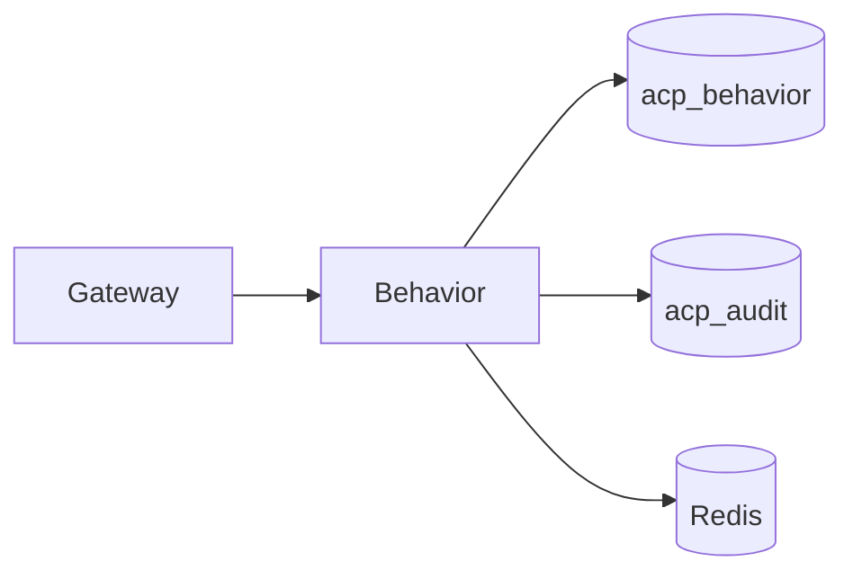

# Behavior

*The behavioral firewall. Every `/execute` request is scored against the agent's rolling baseline at stage 5 of the gateway pipeline. If the request looks like the agent doing what it usually does, the score is low. If it looks like the agent doing something new, expensive, or out-of-character, the score is high and the Decision Engine takes that into account.*

## Business purpose

Static rules — "no DROP TABLE", "no `rm -rf`" — catch the obvious. Behavioral analysis catches the things you didn't think to write a rule for:

- An agent that has read 50 tickets a day for 3 months suddenly reads 5,000 in an hour.
- An agent that has always called `email.send` to corporate domains suddenly calls it to a free webmail address.
- An agent in tenant A starts calling tools in the exact sequence that tenant B's compromised agent did last week.

Behavior runs as a separate service because:

- **It needs its own database.** Baselines are aggregations over months of audit data; mixing those queries into the audit service would degrade audit's write latency.
- **It can be degraded gracefully.** A behavior outage should not block legitimate traffic; the per-tenant `degraded_mode_policy` decides what happens.
- **The scoring math is computationally expensive.** Keeping it out of the gateway's request path means the gateway never blocks waiting for a slow model.

## Architecture



The behavior service has read-only access to `acp_audit` so it can build baselines from the canonical decision history. It owns `acp_behavior` for the derived profiles.

## Request flow

### Stage 5 score

1. Gateway POSTs `/behavior/score` with the request shape `(tenant_id, agent_id, tool_name, payload_fingerprint)`.
2. Behavior:
   - Reads `acp:behavior_score:{agent_id}` from Redis. If a fresh score (under 60s) for this exact shape exists, return it.
   - Otherwise loads the agent's profile from `behavior_profiles`. If missing or older than 24 hours, refresh from audit aggregates.
   - Computes four sub-signals:
     - **Sequence** — does this call appear in the agent's typical sequences of N calls?
     - **Velocity** — what is this hour's call rate vs the agent's hourly baseline?
     - **Cost** — what is this call's estimated cost vs the agent's per-call distribution?
     - **Cross-agent intelligence** — has any other agent in this tenant tripped on a similar request shape?
   - Aggregates the sub-signals into a `behavior_score` in [0, 1] with `confidence`.
3. Returns the score plus a per-signal breakdown.
4. Caches the result in Redis for 60 seconds.

### Degraded mode

If the gateway's call to Behavior times out or returns 5xx:

1. Gateway reads `degraded_mode_policy` from `acp_identity.tenants` (cached for 60s).
2. The policy is one of:
   - `block_high_risk` (default) — the gateway treats the behavior signal as "high" if the policy stage already returned a non-clean decision; otherwise treats as low.
   - `block_all` — every non-trivial decision is denied while Behavior is degraded.
   - `allow_with_audit` — proceed with `behavior_score=0`; the audit row records `behavior_skipped=true` so reviewers can re-grade later.
3. Gateway emits `behavior_firewall_decision` audit row regardless, with `service_status="degraded"`.

## Dependencies

**Python libraries:**

- `fastapi`, `sqlalchemy[asyncio]`, `asyncpg`.
- `redis.asyncio` — score cache, baseline cache.
- `numpy` — statistical operations on baseline distributions.
- `structlog`.

**Other Aegis services:**

- Audit (`services/audit/`) — read-only SELECT for baseline aggregation.
- Decision (`services/decision/`) — the downstream consumer of the behavior score.

**Infrastructure:**

- Postgres `acp_behavior` for derived profiles.
- Postgres `acp_audit` (read-only DSN) for raw audit rows used in baseline computation.
- Redis for score and baseline caches.

## Database tables

| Table | Purpose | Notable columns |
|---|---|---|
| `behavior_profiles` | Per-agent rolling baselines | `agent_id`, `tenant_id`, `window_days`, `call_rate_p50`, `call_rate_p95`, `unique_tools`, `tool_sequence_signatures` (JSONB), `cost_distribution` (JSONB), `last_refreshed_at` |
| `behavior_anomalies` | Tagged anomaly events for replay | `id`, `tenant_id`, `agent_id`, `signal_type`, `severity`, `audit_id`, `detected_at` |

Indexes: `behavior_profiles.agent_id` UNIQUE per tenant, `behavior_anomalies.agent_id`, `behavior_anomalies.detected_at`.

The `learning` service is a planned future home for the profile-generation worker; today the work happens inside the behavior service.

## Redis usage

| Key pattern | Operation | Purpose | TTL |
|---|---|---|---|
| `acp:behavior_score:{agent_id}` | GET / SETEX | Cached per-agent score (most recent shape) | 60 s |
| `acp:behavior_baseline:{agent_id}` | GET / SETEX | Cached baseline tuple | 1 h |
| `acp:behavior_consult:{agent_id}:{hash}` | GET / SETEX | Cached score for an exact request shape | 30 s |
| `acp:behavior_dlq` (List) | LPUSH | Failed baseline refreshes for retry | None |

## Security controls

- **Per-tenant scoping.** Every query carries `WHERE tenant_id = :t`.
- **Read-only audit access.** The DSN to `acp_audit` is granted SELECT only; behavior cannot rewrite audit history.
- **Audit emission on every consult.** `behavior_firewall_decision` is written even when Behavior was skipped — operators always know what state the service was in.
- **Cross-tenant intelligence is anonymized.** When the "cross-agent intelligence" sub-signal pulls patterns from other tenants, it uses a hashed shape, not raw payloads.
- **Cost-cap signal honors per-agent USD caps.** A request that would push an agent over its USD cap is scored as high.

## Metrics

| Metric | Type | Labels | Purpose |
|---|---|---|---|
| `acp_behavior_firewall_consult_total` | Counter | `tenant_id`, `result` | Allow / deny / skipped distribution |
| `acp_behavior_consult_latency_seconds` | Histogram | `tenant_id` | Score computation time |
| `acp_behavior_baseline_refresh_total` | Counter | `tenant_id`, `result` | Baseline-refresh outcomes |
| `acp_behavior_degraded_mode_engaged_total` | Counter | `tenant_id`, `policy` | When degraded-mode fallback fired |
| `acp_behavior_score_distribution` | Histogram | `tenant_id` | Score distribution for tuning |

## Deployment model

- **Image**: `infra-behavior` from `services/behavior/Dockerfile`.
- **Container**: `acp_behavior`.
- **Port**: 8005.
- **Replicas**: 1.
- **Healthcheck**: `GET /health`.
- **Env vars**: `DATABASE_URL` (behavior), `AUDIT_DATABASE_URL` (read-only audit DSN), `REDIS_URL`, `INTERNAL_SECRET`, `BASELINE_WINDOW_DAYS` (default 7), `SCORE_CACHE_TTL_SECONDS` (default 60).

## API endpoints

| Method | Path | Auth | Description |
|---|---|---|---|
| POST | `/behavior/score` | Internal only | Hot-path scoring called by gateway at stage 5 |
| GET | `/behavior/profile/{agent_id}` | AUDITOR+ | Current baseline for an agent |
| POST | `/behavior/profile/{agent_id}/refresh` | ADMIN / SECURITY | Force baseline refresh |
| GET | `/behavior/anomalies` | AUDITOR+ | Recent anomaly events |
| GET | `/behavior/anomalies/{agent_id}` | AUDITOR+ | Per-agent anomalies |

Most endpoints are reached via the gateway as `/audit/*` aggregates (since the UI's "Behavioral Firewall" panel pulls aggregates rather than per-call scores).

## Example requests

### Read an agent's current baseline

```bash
curl -sS https://aegisagent.in/behavior/profile/$AGENT_ID \
  -H "Authorization: Bearer $TOKEN" \
  -H "X-Tenant-ID: 00000000-0000-0000-0000-000000000001" | jq
```

### Force a baseline refresh after a major workload change

```bash
curl -sS -X POST https://aegisagent.in/behavior/profile/$AGENT_ID/refresh \
  -H "Authorization: Bearer $TOKEN" \
  -H "X-Tenant-ID: 00000000-0000-0000-0000-000000000001"
```

## Troubleshooting

| Symptom | Likely cause | Where to look |
|---|---|---|
| Every request scoring 0.0 | Baseline missing or empty | Force-refresh; check `behavior_profiles.last_refreshed_at` |
| Spike in `behavior_firewall_decision` audit rows with `service_status="skipped"` | Behavior service slow or down | Inspect `acp_behavior` container logs; check Postgres slow query log |
| Score lag — old shape returning cached score | Cache TTL (60s) hasn't expired | Acceptable; tune `SCORE_CACHE_TTL_SECONDS` if latency drops |
| `acp_behavior_baseline_refresh_total{result="failed"}` rising | Audit DSN unreachable or schema migration mismatch | Verify the audit DSN works from the behavior container |
| Sequence sub-signal always 0 | No multi-call sequences yet observed | Expected for fresh tenants; sequences accumulate over the baseline window |
| Cross-agent intelligence triggers on legitimate traffic | False positive; pattern is too narrow | Add a tenant-specific allow-list via Decision signal weights |

## Production considerations

- **The 60-second score cache is the difference between adding 5 ms vs 50 ms to stage 5.** It is also a small staleness window for adversarial behavior. The default is a good compromise.
- **Baselines refresh on a 24-hour cadence.** Agents whose workload shape changes radically (e.g., onboarding a new tool) may show false-positive scores for a few hours until the next refresh.
- **Degraded-mode policy is the most important per-tenant configuration.** A new tenant defaults to `block_high_risk`. Customers who prefer availability over isolation can switch to `allow_with_audit`. The audit row makes the choice visible.
- **Cross-tenant intelligence is opt-in.** Each tenant can disable it at `tenants.behavior_cross_tenant_enabled`. By default it's on because shared threat intelligence improves detection.
- **The scoring model is interpretable.** Each sub-signal is a number with a clear computation; there is no black-box neural network behind the behavior score. This matters for auditor explainability.
- **Memory footprint scales with agent count.** Each baseline is small (a few KB) but the cache holds them all. Tenants with thousands of agents may need a larger Redis instance.

## Next

- [Decision](decision.md) — the downstream consumer at stage 6
- [Gateway](gateway.md) — the caller at stage 5
- [Audit](audit.md) — the source of baseline data
- [Behavior firewall degraded mode](../security/threat-scenarios.md#degraded-mode) — what each policy does
