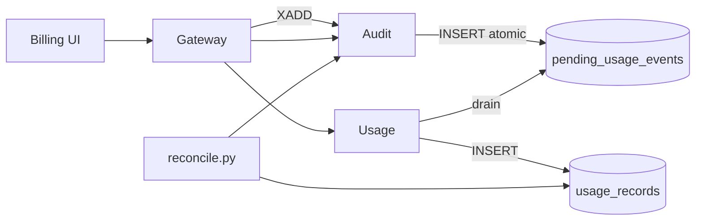

# Billing

*Not a standalone microservice. "Billing" in Aegis is a cross-cutting flow that originates in the audit service, lands in the usage service, and is surfaced to the UI through the gateway's `/billing/*` proxy routes.*

## Business purpose

Every allowed `/execute` call has a cost: the inference dollars spent inside the LLM, plus the platform's per-call governance fee. Aegis bills against both:

- **Cost-attribution** — which agent, tenant, and tool consumed which dollars in which window.
- **Cap enforcement** — per-agent USD caps that hard-block at 100% and warn at 80%.
- **Budget requests** — when a tenant wants more headroom, an authorized admin can request a temporary lift; the request is reviewed and approved or denied with an audit trail.

The reason there is no standalone billing service: billing is a *guarantee* on top of the audit chain, not a new data store. The contract is "every audit row → exactly one usage record" enforced by the outbox pattern. Splitting billing into its own service would introduce a third store and a second outbox to keep in sync; instead, billing reuses the existing audit outbox to land usage records.

## Architecture



Three services participate, no service owns it end-to-end. The gateway is the entry point and the proxy for reads; the audit service is the source of truth for emissions; the usage service is the long-term ledger.

## Request flow

### Emit (allowed `/execute`)

1. Gateway finishes a successful `/execute` decision.
2. Audit outbox worker (`services/audit/outbox_worker.py`) processes the event.
3. Inside one Postgres transaction: `INSERT INTO audit_logs` plus `INSERT INTO pending_usage_events` (with `audit_id` derived deterministically from `request_id` via UUIDv5 — idempotent under retry).
4. Usage worker drains `pending_usage_events`: `INSERT INTO usage_records` plus `DELETE FROM pending_usage_events`, in one transaction. Exactly-once delivery is the invariant.

### Read (UI dashboards)

1. UI calls `/billing/summary?days=30` on the gateway.
2. Gateway proxies to the usage service's `GET /usage/summary` for the recent aggregates, plus the audit service's `/audit/billing-stats` for the chain-level numbers.
3. Returns combined payload: total spend, top-cost agents, top-cost tools, daily breakdown, percent of cap consumed.

### Budget request

1. Admin POSTs `/billing/budget-requests` with `{requested_cap_usd, reason}`.
2. Gateway proxies to usage service `POST /budget-requests`.
3. Row inserted with `status="pending"`.
4. A second admin (separation of duties) POSTs `/billing/budget-requests/{id}/approve` or `/reject`.
5. On approve, the tenant's `daily_inference_cost_cap_usd` on `acp_identity.tenants` is updated by the identity service. The change emits an audit row.

## Dependencies

**Python libraries:** none of its own. Billing reuses the libraries pulled in by audit, usage, and identity.

**Other Aegis services:**

- Audit — source of truth for emission.
- Usage — drains the outbox and serves reads.
- Identity — updates `tenants.daily_inference_cost_cap_usd` on budget approvals.

**Infrastructure:** the audit outbox table, the usage ledger table, no separate store.

## Database tables

Billing reads from two services' tables:

| Owner service | Table | Role in billing |
|---|---|---|
| audit | `pending_usage_events` | Outbox for emissions; one row per allowed decision until drained |
| usage | `usage_records` | The long-term ledger. One row per billable event. |
| usage | `budget_requests` | Tenant requests for cap lifts |
| usage | `pending_billing_events` | Dead-letter for usage drain failures |
| identity | `tenants.daily_inference_cost_cap_usd` | Per-tenant cap surface |
| identity | `tenants.monthly_request_cap` | Per-tenant request count cap |
| registry | (none — agents.metadata.cost_cap_usd if set) | Per-agent cap surface (also lives in Redis as the live counter) |

**Live state (as of 2026-05-29, public demo at `aegisagent.in`):**

- `acp_audit.pending_usage_events` = 922 (drained — usage_records also at 922)
- `acp_usage.usage_records` = **922 rows**, fully synchronized with audit
- `acp_usage.budget_requests` = 0
- `acp_usage.pending_billing_events` = 0 (no dead-letter — healthy outbox)

The 922/922 match across the outbox and the ledger is the "billing is in sync" health signal.

## Redis usage

| Key pattern | Operation | Purpose | TTL |
|---|---|---|---|
| `acp:agent_cost_today:{agent_id}:{YYYYMMDD}` | INCRBY / GET | Per-agent USD cost accumulator | 26 hours |
| `acp:agent_cost_cap:{agent_id}` | GET | Per-agent USD cost cap override | None |
| `acp:tenant_cost_today:{tenant_id}:{YYYYMMDD}` | INCRBY / GET | Tenant-level cost accumulator | 26 hours |
| `acp:billing_alerts` (List) | LPUSH | 80%-of-monthly warnings (one-shot per tenant per month) | None |
| `acp:reconcile_cursor:{tenant_id}` | GET / SET | Nightly reconciler position | 30 days |

## Security controls

- **Exactly-once delivery is enforced by the outbox.** The audit row and the `pending_usage_events` row are inserted in one Postgres transaction; the usage worker drains in another transaction. Restarts cannot double-bill or drop bills.
- **Idempotent audit_id.** `pending_usage_events.audit_id` is UUIDv5 of `request_id`. Retried emissions of the same request collapse to the same row.
- **Tenant scoping.** Every read query filters by `tenant_id`. Cross-tenant billing exposure is not allowed.
- **Audit emission on cap changes.** Every cap change is audited; the operator's user_id is recorded.
- **Separation of duties on budget approvals.** The system optionally enforces "a different admin must approve a budget request" — toggled via tenant config.
- **No raw cost data in receipts.** Receipts include the audit row content; the per-call USD figure is in `metadata_json` but not signed independently. The aggregate is reconciled from the database, not from the receipt.

## Metrics

| Metric | Type | Labels | Purpose |
|---|---|---|---|
| `acp_billing_events_total` | Counter | none | Throughput of emitted billable events |
| `acp_billing_events_failed_total` | Counter | none | Failed emissions (would go to DLQ) |
| `acp_billing_zero_token_corrected_total` | Counter | none | Zero-cost events corrected at the writer |
| `acp_reconcile_audit_without_usage` | Gauge | `tenant_id` | Gaps: audit row exists, usage row missing |
| `acp_reconcile_usage_without_audit` | Gauge | `tenant_id` | Gaps: usage row exists, no audit row (should be zero) |
| `acp_billing_outbox_oldest_age_seconds` | Gauge | `tenant_id` | SLI: how stale is the outbox |
| `acp_billing_cap_breached_total` | Counter | `tenant_id`, `agent_id`, `cap_type` | Caps that fired |

The live `acp_billing_events_total` metric from the production deployment was 64 in the recent scrape window — the production demo is steadily ticking through the seeded traffic.

## Deployment model

There is no `acp_billing` container. The implementation lives in:

- `services/audit/outbox_worker.py` — emits to `pending_usage_events`.
- `services/usage/repository/usage.py::drain_pending` — drains into `usage_records`.
- `services/usage/router/usage.py` — serves read endpoints.
- `services/usage/router/billing_dlq.py` — DLQ management.
- `services/gateway/main.py` — the `/billing/*` proxy routes.
- `scripts/ops/reconcile.py` — nightly audit↔usage reconciliation.

Configuration lives on the tenant row (caps) plus Redis (live counters).

## API endpoints

The gateway exposes the billing surface; all routes proxy to usage or audit.

| Method | Path | Auth | Backed by | Description |
|---|---|---|---|---|
| GET | `/billing/summary` | AUDITOR+ | usage + audit | Recent spend with breakdown |
| GET | `/billing/invoices` | AUDITOR+ | usage | Past invoice list |
| GET | `/billing/budget-requests` | AUDITOR+ | usage | List requests |
| POST | `/billing/budget-requests` | ADMIN / SECURITY | usage | Create a request |
| POST | `/billing/budget-requests/{id}/approve` | ADMIN | usage + identity | Approve |
| POST | `/billing/budget-requests/{id}/reject` | ADMIN | usage | Reject |
| GET | `/billing/cost-attribution?weeks=4` | AUDITOR+ | usage | Per-agent, per-tool cost breakdown |
| GET | `/usage/dashboard` | AUDITOR+ | usage | Dashboard payload |
| GET | `/usage/anomalies` | AUDITOR+ | usage | Anomaly listing |
| GET | `/audit/billing-gaps` | AUDITOR+ (internal) | audit | Reconciler gap report |
| GET | `/audit/billing-stats` | AUDITOR+ | audit | Chain-level billing stats |

## Example requests

### 30-day spend with per-agent breakdown

```bash
curl -sS "https://aegisagent.in/billing/summary?days=30" \
  -H "Authorization: Bearer $TOKEN" \
  -H "X-Tenant-ID: 00000000-0000-0000-0000-000000000001" \
  | jq '{ total_usd, by_agent: .by_agent[] | { name, usd }, percent_of_cap }'
```

### Create a budget request

```bash
curl -sS -X POST https://aegisagent.in/billing/budget-requests \
  -H "Authorization: Bearer $TOKEN" \
  -H "X-Tenant-ID: 00000000-0000-0000-0000-000000000001" \
  -H "Content-Type: application/json" \
  -d '{"requested_cap_usd":5000.00,"reason":"Onboarding new tenant"}'
```

### Inspect any audit/usage gap

```bash
curl -sS https://aegisagent.in/audit/billing-gaps \
  -H "Authorization: Bearer $TOKEN" \
  -H "X-Tenant-ID: 00000000-0000-0000-0000-000000000001" \
  | jq '{ audit_without_usage: (.audit_without_usage | length), usage_without_audit: (.usage_without_audit | length) }'
```

A healthy response is `{ "audit_without_usage": 0, "usage_without_audit": 0 }`. Anything nonzero is an incident.

## Troubleshooting

| Symptom | Likely cause | Where to look |
|---|---|---|
| Spend reported as zero despite traffic | Usage worker not draining | `acp_billing_outbox_oldest_age_seconds` gauge; restart `acp_usage` |
| `audit_without_usage` > 0 in reconcile | Usage drain failed silently | Inspect `pending_billing_events` (DLQ); replay |
| `usage_without_audit` > 0 | Should be impossible by design — indicates a manual SQL write | Open an incident; chain integrity must be re-verified |
| Cap fires at 99% instead of 100% | Per-day rollover boundary; counters reset at UTC midnight | Expected; document the UTC boundary clearly to tenants |
| Budget request stuck `pending` | No approver workflow wired (Slack notification didn't fire) | Check `webhooks` config; manually approve via the API |
| `acp_billing_events_failed_total` rising | Database connectivity from audit | Check pg_bouncer pool size |

## Production considerations

- **The audit↔usage invariant is non-negotiable.** Every audit row written for a billable action MUST have exactly one usage row. Reconciler runs nightly and pages on any gap.
- **UTC midnight resets are visible.** Per-day cost counters and per-day request counters reset at UTC midnight. Customers in non-UTC time zones see a discontinuity on their local clock; document this.
- **Cap breach behavior is hard-deny.** A breached cap stops all `POST /execute` for the tenant or agent. GETs (audit, verify, etc.) continue to work so operators can investigate.
- **80% warning is one-shot per period.** `acp:billing_alerts` records that the warning fired so customers don't get a stream of repeated warnings as they approach the cap.
- **Budget approvals are audited.** The audit row records both the requester and the approver, plus the previous and new cap values.
- **DLQ inspection is a normal operation.** A small number of `pending_billing_events` is fine if the usage service was briefly slow; persistent growth is an alert.

## Next

- [Usage](usage.md) — the ledger
- [Audit](audit.md) — the source of truth
- [Identity](identity.md) — the cap surface on tenants
- [Billing UI](../ui/settings/billing.md) — the human-facing dashboards
