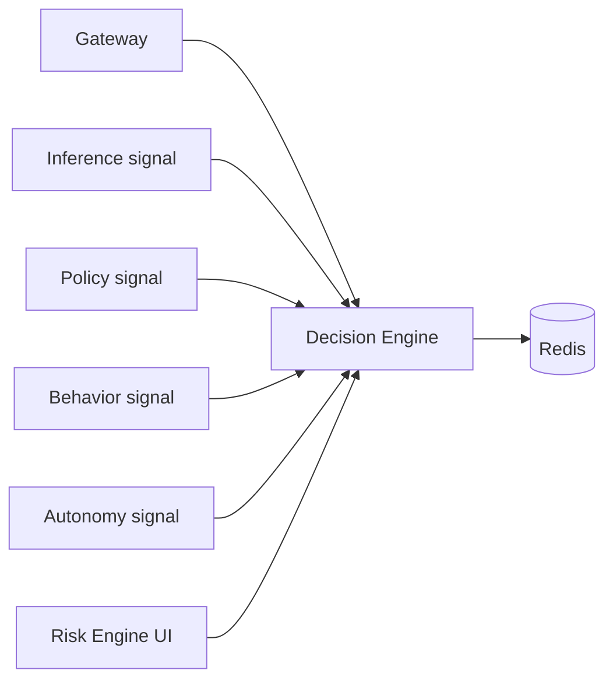

# Decision

*The signal combiner. Every other security stage produces a score or a flag; the Decision service is the one place those signals are combined into a single action — allow, monitor, throttle, escalate, or kill. It also owns the kill switch and the per-tenant signal-weight configuration.*

## Business purpose

Aegis has multiple enforcement stages — inference, policy, behavior, autonomy. Each produces its own signal. If every stage made its own final decision, three problems would arise:

1. **Disagreements would be invisible.** A policy `allow` and a behavior `block_high_risk` would race; whichever ran last would win without recording why.
2. **Per-tenant tuning would be impossible.** Different customers weight inference vs behavior vs policy differently.
3. **The audit row would be incomplete.** Auditors need one canonical `decision` field plus the breakdown of which signals fired.

The Decision service solves these by being the only place a final action is computed. It also owns the kill switch — the most consequential security primitive in the platform — because the kill switch is logically a "force-deny" override of any decision.

## Architecture



The Decision service is small and stateless. It does not own a database. Its persistent state lives in two places: Redis for runtime tuning (kill switch, signal weights, recent decisions) and the audit chain for the historical record of every decision it ever computed.

## Request flow

For `POST /decision/evaluate` (the internal call the gateway makes at stage 6):

1. Gateway calls `services/decision/router.py::evaluate_decision` with the bundle of signals.
2. Handler loads `acp:signal_weights:{tenant_id}` from Redis (falling back to `DEFAULT_WEIGHTS` if unset).
3. Passes signals + weights to `services/decision/engine.py::DecisionEngine.evaluate`.
4. Engine maps signals to a unified `Decision` with `action`, `score`, `findings`, `signals_evaluated`, `confidence`.
5. Engine writes a per-tenant rolling history into Redis stream `acp:decision_history:{tenant_id}` (capped at 10,000 entries).
6. Returns the `Decision` object as JSON.

The 2026-05 audit pass (commits `f6b2ce6` through `51dda47`) extracted four helpers out of the monolithic `evaluate_decision`. The hot path is unchanged; the call graph is just easier to test in isolation:

| Helper | Source | What it owns |
|---|---|---|
| `_resolve_agent_meta` | `services/decision/router.py` | Loads agent risk level, status, and cap; shared by `/evaluate` and the trust-score worker |
| `_fan_out_policy_and_behavior` | `services/decision/router.py` | Parallel httpx calls to Policy + Behavior with shared timeout budget |
| `_emit_behavior_firewall_audit` | `services/decision/router.py` | Always-on `behavior_firewall_decision` audit row with `service_status` / `latency_ms` / `policy_applied` |
| `_compute_inference_signals` | `services/decision/router.py` | PII / DDL / path-traversal classifier with rule tables hoisted to module scope so they don't reallocate per call |

For `POST /decision/kill-switch/{tenant_id}`:

1. RBAC gate: `ADMIN` or `SECURITY` role only (enforced at the gateway and re-checked here).
2. `redis.set(f"acp:kill_switch:{tenant_id}", json_blob)` — no TTL.
3. Emit audit row `action="kill_switch_engaged"` with the operator's user_id and reason.
4. Publish to `acp:sse:tenant:{tenant_id}` so any UI session listening sees the state flip immediately.

## Dependencies

**Python libraries:**

- `fastapi` — the framework.
- `redis.asyncio` — kill switch, signal weights, decision history, behavior consult cache.
- `pydantic` — the `Decision`, `Signal`, `KillSwitchRequest` schemas.
- `structlog` — emission of every decision as a JSON log line.

**Other Aegis services it calls:**

- Behavior (`services/behavior/`) — `services/decision/behavior_consult.py` calls Behavior for an optional last-mile consult on borderline scores.
- Audit (`services/audit/`) — kill-switch toggles emit an audit row directly.

**Infrastructure:**

- Redis (db 0) — all state.
- No Postgres.

## Database tables

*The decision service does not own any tables.*

Recent decisions are stored as a capped Redis stream so the `/decision/history` and `/decision/summary` endpoints can answer "what happened in the last hour" without a database round-trip.

## Redis usage

| Key pattern | Operation | Purpose | TTL |
|---|---|---|---|
| `acp:kill_switch:{tenant_id}` | GET / SET / DEL | Tenant-wide halt flag | None |
| `acp:signal_weights:{tenant_id}` (Hash) | HGETALL / HSET | Per-tenant Decision Engine weights | None |
| `acp:decision_history:{tenant_id}` (Stream) | XADD / XREVRANGE | Last 10,000 decisions per tenant for UI | None (XADD with MAXLEN) |
| `acp:behavior_consult:{agent_id}:{hash}` | GET / SET | Cached behavior consult result | 30s |
| `acp:decision_summary:{tenant_id}:{day}` | GET / SET | Cached aggregate for `/decision/summary` | 60s |

## Security controls

- **RBAC on kill switch** — `POST /decision/kill-switch/{tenant_id}`, the DELETE variant, and the GET all require `ADMIN` or `SECURITY`. Source: `services/decision/router.py:101-176`.
- **RBAC on signal weights** — `PUT /decision/signal-weights` requires `ADMIN` or `SECURITY`. Read is `AUDITOR`+.
- **Tenant-id binding** — All three kill-switch routes take `tenant_id` as a path param; the `_assert_authenticated_tenant_matches` dependency rejects mismatches with HTTP 403. Until 2026-06-01 the dependency arg was unannotated and FastAPI treated it as a missing query param, so every request returned 422 "Validation failed" — fixed by declaring `tenant_id: str = Path(...)`.
- **Audit emission** — Every kill-switch change is an audit row. No silent toggles.
- **No raw query input** — The Decision service consumes signal objects, not user-supplied text. Prompt injection on the signal API surface is not applicable.

## Metrics

| Metric | Type | Labels | Purpose |
|---|---|---|---|
| `acp_decision_evaluate_total` | Counter | `tenant_id`, `action` | Outcomes distribution |
| `acp_decision_evaluate_latency_seconds` | Histogram | `tenant_id` | Engine computation latency |
| `acp_decision_kill_switch_engaged_total` | Counter | `tenant_id` | Kill-switch toggle counter |
| `acp_decision_signal_weights_overridden_total` | Counter | `tenant_id` | When tenant overrides defaults |
| `acp_decision_history_stream_length` | Gauge | `tenant_id` | Backlog of the per-tenant stream |
| `acp_decision_behavior_consult_skipped_total` | Counter | `reason` | When Behavior wasn't consulted (degraded mode) |

## Deployment model

- **Image**: `infra-decision` from `services/decision/Dockerfile`.
- **Container**: `acp_decision`.
- **Port**: 8004 inside the Docker network.
- **Replicas**: 1 (stateless; can scale horizontally if needed).
- **Healthcheck**: `GET /health`.
- **Env vars**: `REDIS_URL`, `INTERNAL_SECRET`, `BEHAVIOR_SERVICE_URL`, `AUDIT_SERVICE_URL`, `DECISION_GATHER_TOTAL_TIMEOUT` (default 1.5s).
- **Resource footprint**: ~150 MB resident; no Postgres pool.

## API endpoints

All routes have prefix `/decision` and require a valid internal secret plus a JWT.

| Method | Path | Auth | Description |
|---|---|---|---|
| POST | `/decision/kill-switch/{tenant_id}` | ADMIN / SECURITY | Engage the kill switch for a tenant |
| DELETE | `/decision/kill-switch/{tenant_id}` | ADMIN / SECURITY | Disengage the kill switch |
| GET | `/decision/kill-switch/{tenant_id}` | AUDITOR+ | Current kill-switch state |
| GET | `/decision/summary` | AUDITOR+ | Aggregate counts of allow / deny / escalate over a window |
| GET | `/decision/history` | AUDITOR+ | Recent decisions from `acp:decision_history:{tenant_id}` |
| GET | `/decision/signal-weights` | AUDITOR+ | Current weight configuration |
| PUT | `/decision/signal-weights` | ADMIN / SECURITY | Override weights per tenant |
| POST | `/decision/evaluate` | Internal only | The hot-path call from the gateway at stage 6 |

The signal weights object:

```json
{
  "inference": 0.20,
  "policy":    0.40,
  "behavior":  0.25,
  "autonomy":  0.10,
  "agent_risk_level": 0.05
}
```

Weights sum to 1.0; the handler rejects updates that don't.

## Example requests

### Engage the kill switch

```bash
curl -sS -X POST https://ha.aegisagent.in/decision/kill-switch/00000000-0000-0000-0000-000000000001 \
  -H "Authorization: Bearer $TOKEN" \
  -H "X-Tenant-ID: 00000000-0000-0000-0000-000000000001" \
  -H "Content-Type: application/json" \
  -d '{"action":"engage"}'
```

The reason is recorded server-side as `manual_admin_lockdown`. The response body shape is `{"success": true, "data": {"status": "engaged", "tenant_id": "..."}}`.

### Read the current weights

```bash
curl -sS https://ha.aegisagent.in/decision/signal-weights \
  -H "Authorization: Bearer $TOKEN" \
  -H "X-Tenant-ID: 00000000-0000-0000-0000-000000000001" | jq
```

### Override weights — emphasize policy more

```bash
curl -sS -X PUT https://ha.aegisagent.in/decision/signal-weights \
  -H "Authorization: Bearer $TOKEN" \
  -H "X-Tenant-ID: 00000000-0000-0000-0000-000000000001" \
  -H "Content-Type: application/json" \
  -d '{"inference":0.10,"policy":0.55,"behavior":0.20,"autonomy":0.10,"agent_risk_level":0.05}'
```

## Troubleshooting

| Symptom | Likely cause | Where to look |
|---|---|---|
| Kill switch engaged but agents still executing | Gateway worker hasn't seen the Redis change yet; the worker polls every 1 second | Wait 1–5 seconds; check `acp_kill_switch_propagation_lag_seconds` |
| `/decision/summary` returns mostly zeros | The synthetic-data variance bug from 2026-05-15; should be fixed | Inspect `services/decision/router.py::summary` — it calls audit `/logs/risk/timeline` for the variance |
| `PUT /decision/signal-weights` returns 400 | Weights don't sum to 1.0 | Re-normalize and retry |
| `acp_decision_evaluate_latency_seconds` > 1s | Behavior consult is timing out | Inspect Behavior; consider raising `behavior_consult_timeout` |
| Decision history empty in UI | `acp:decision_history:{tenant_id}` stream is empty | Likely no decisions yet for this tenant — confirm Audit is receiving rows |

## Production considerations

- **Kill switch is the single most consequential primitive.** A misclick stops every agent in a tenant. The UI requires a confirmation modal; the API requires a non-empty `reason`. The audit row makes the toggle non-repudiable.
- **Default fail-closed on Redis unreachable.** If the kill-switch lookup fails, the gateway treats it as "engaged" and denies the request. This is enforced at the gateway, not here, but it shapes the Decision service's contract: if you can't read Redis, deny.
- **Decision history stream is capped.** `XADD` uses `MAXLEN ~ 10000` per tenant; the cap exists to keep Redis memory bounded. Long-term decision history belongs in the audit chain, not here.
- **Signal weights are hot-reloaded.** No restart required to apply a new weight set; the next `/decision/evaluate` call reads the updated values.
- **Behavior consult is best-effort.** If Behavior is slow, the Decision Engine skips the consult and records `behavior_consult_skipped` in the audit row. Avoids cascading failure when Behavior degrades.
- **Findings vocabulary is finite.** The `findings` field uses a 13-string canonical vocabulary defined in `services/decision/findings.py`. The SDK mirrors via `acp_client.FINDINGS`. Adding a new finding requires updating both ends in the same release.

## Next

- [Gateway](gateway.md) — the caller at stage 6
- [Audit](audit.md) — where every decision is recorded
- [Policy](policy.md) — the upstream signal at stage 4
- [Behavior](../services/behavior.md) — the upstream signal at stage 5
