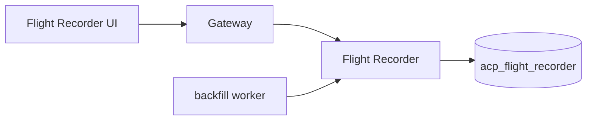

# Flight Recorder

*Per-execution timelines for every `/execute` request. Captures which gateway stage decided what, how long each took, and the inputs and outputs at each stage. Provides the data behind the Flight Recorder UI page and the per-execution receipts.*

## Business purpose

When something goes wrong in a production AI system, the question is rarely "did it happen" but "where did it happen." Logs are too fragmented. The audit chain is too coarse — one row per request. What an operator needs is the full per-request timeline: which stage made the call, what state was the request in at each stage, why did the decision flip from allow to deny.

The Flight Recorder is that timeline. It exists as its own service because:

- **Write-heavy, read-light.** Every request produces 5–10 step events; the data store needs to handle the write burst but doesn't need read scale.
- **Bounded retention.** Timelines older than 30 days are pruned; the audit chain is the long-term record.
- **Forensic-grade detail.** Pre-decision and post-decision snapshots of `request.state` need to survive even if the request itself crashed mid-pipeline.

## Architecture



Gateway emission is fire-and-forget: a slow Flight Recorder must not slow down `/execute`. The trade-off is that events for a crashed request may be missing — the backfill worker reconciles incomplete timelines on a periodic sweep.

## Request flow

### Emission from the gateway

1. At stage 0, gateway calls `emit_timeline_start(tenant_id, agent_id, request_id, tool_name)`. Returns the timeline_id.
2. After each subsequent stage, gateway calls `emit_step(timeline_id, stage_name, decision, latency_ms, attributes)`.
3. Before stage 6 and after stage 10, gateway calls `emit_snapshot(timeline_id, phase, request_state_snapshot)`.
4. At the end, gateway calls `emit_timeline_end(timeline_id, final_status, final_decision, total_latency_ms)`.
5. All emits are wrapped in `try/finally` to guarantee `emit_timeline_end` runs even on exception.

### Read from the UI

1. UI calls `GET /flight/timelines?limit=20`.
2. Returns recent timelines for the tenant, ordered by `started_at DESC`.
3. Click on a timeline → `GET /flight/timeline/{id}` returns the full event list plus snapshots.
4. Cross-reference with `GET /flight/timeline/by-request/{request_id}` to find a timeline when only the request_id is known.

### Backfill worker

A periodic process (`scripts/maintenance/backfill_flight_timelines.py`) sweeps audit rows that don't have a matching timeline and creates them with `status="recovered_backfill"`. This closes the loop for requests whose emit_timeline_start succeeded but whose subsequent emits were lost (e.g., gateway crash mid-pipeline).

## Dependencies

**Python libraries:**

- `fastapi`, `sqlalchemy[asyncio]`, `asyncpg`.
- `pydantic` for `TimelineCreate`, `StepCreate`, `SnapshotCreate`.
- `structlog`.

**Other Aegis services:**

- Audit (`services/audit/`) — referenced by `request_id` for cross-lookup; not a hot-path dependency.

**Infrastructure:**

- Postgres `acp_flight_recorder`.
- No Redis dependency.

## Database tables

| Table | Purpose | Notable columns |
|---|---|---|
| `execution_timelines` | One row per `/execute` request | `id`, `tenant_id`, `agent_id`, `request_id`, `tool_name`, `status` (`in_progress`/`completed`/`failed`/`recovered_backfill`), `final_decision`, `started_at`, `completed_at`, `total_latency_ms` |
| `execution_steps` | Per-stage events | `id`, `timeline_id`, `stage_name`, `decision`, `latency_ms`, `attributes` (JSONB), `occurred_at` |
| `execution_snapshots` | Pre- and post-decision request-state captures | `id`, `timeline_id`, `phase` (`pre_decision`/`post_decision`), `snapshot_json`, `captured_at` |
| `execution_artifacts` | Optional attachments (tool outputs, JSON dumps) | `id`, `timeline_id`, `artifact_type`, `content_url` or `inline_content`, `captured_at` |

Indexes: `execution_timelines.tenant_id, started_at DESC`, `execution_timelines.request_id`, `execution_steps.timeline_id`.

**Live state (as of 2026-05-29, public demo at `aegisagent.in`):**

- All four tables are empty (0 rows).
- The infrastructure is healthy; the seeded audit traffic in the current production deployment predates the Flight Recorder migration that the demo runs against, so no timelines have been recorded yet for the seed data. The next live `/execute` call from the Playground will create the first row.

## Redis usage

*The flight recorder does not use Redis.* All writes go directly to Postgres. The hot-path emits are batched in-process by the FastAPI worker (a 1-second flush window) so the gateway sees one POST per stage at most.

## Security controls

- **Tenant scoping on every query.**
- **No raw payload storage by default.** Snapshots redact bytes objects and known-sensitive fields (`Authorization`, `password`, `secret`). Raw payloads can be enabled per-tenant via a config flag, gated for compliance reasons.
- **Internal-secret write requirement.** Only the gateway (or the backfill worker with the internal secret) can POST to flight-recorder endpoints.
- **Snapshot retention.** Snapshots are auto-pruned at 30 days regardless of tenant. The audit chain is the longer-term record.
- **Artifact size cap.** Inline artifacts cap at 256 KB; larger ones must use the content_url path (typically S3).

## Metrics

| Metric | Type | Labels | Purpose |
|---|---|---|---|
| `acp_flight_timeline_open_total` | Counter | `tenant_id` | Started timelines |
| `acp_flight_timeline_closed_total` | Counter | `tenant_id`, `status` | Finished timelines |
| `acp_flight_step_emit_total` | Counter | `tenant_id`, `stage_name` | Step events per stage |
| `acp_flight_snapshot_emit_total` | Counter | `tenant_id`, `phase` | Snapshot events |
| `acp_flight_emit_latency_seconds` | Histogram | `endpoint` | Write latency |
| `acp_flight_backfill_recovered_total` | Counter | `tenant_id` | Backfill worker recoveries |

## Deployment model

- **Image**: `infra-flight_recorder` from `services/flight_recorder/Dockerfile`.
- **Container**: `acp_flight_recorder`.
- **Port**: 8012.
- **Replicas**: 1.
- **Healthcheck**: `GET /health`.
- **Env vars**: `DATABASE_URL`, `INTERNAL_SECRET`, `SNAPSHOT_RETENTION_DAYS` (default 30), `ARTIFACT_INLINE_MAX_BYTES` (default 262144).

## API endpoints

| Method | Path | Auth | Description |
|---|---|---|---|
| GET | `/flight/timelines` | AUDITOR+ | Recent timelines for the tenant |
| GET | `/flight/timeline/{id}` | AUDITOR+ | Full timeline with steps + snapshots |
| GET | `/flight/timeline/by-request/{request_id}` | AUDITOR+ | Lookup by gateway request_id |
| POST | `/flight/timelines` | Internal only | Start a timeline (gateway calls this) |
| POST | `/flight/timelines/{id}/steps` | Internal only | Append a step |
| POST | `/flight/timelines/{id}/snapshots` | Internal only | Capture state |
| PATCH | `/flight/timelines/{id}/end` | Internal only | Close the timeline |

## Example requests

### Recent timelines

```bash
curl -sS https://aegisagent.in/flight/timelines?limit=10 \
  -H "Authorization: Bearer $TOKEN" \
  -H "X-Tenant-ID: 00000000-0000-0000-0000-000000000001" \
  | jq '.data.items[] | {id, tool_name, final_decision, total_latency_ms}'
```

### Full timeline detail

```bash
TID=$(curl -sS https://aegisagent.in/flight/timelines?limit=1 \
  -H "Authorization: Bearer $TOKEN" \
  -H "X-Tenant-ID: 00000000-0000-0000-0000-000000000001" \
  | jq -r '.data.items[0].id')

curl -sS https://aegisagent.in/flight/timeline/$TID \
  -H "Authorization: Bearer $TOKEN" \
  -H "X-Tenant-ID: 00000000-0000-0000-0000-000000000001" \
  | jq '.data | { tool_name, status, steps: (.steps | length), snapshots: (.snapshots | length) }'
```

## Troubleshooting

| Symptom | Likely cause | Where to look |
|---|---|---|
| Timeline status stuck `in_progress` | Worker emitted start but not end (e.g., gateway crash) | Backfill worker will close at next sweep; `status` becomes `recovered_backfill` |
| `steps` field empty for a timeline | Out-of-order event arrival; the worker backfills on subsequent emits | Should self-heal within the request lifetime |
| Snapshot `pre_decision` missing | Stage 5 short-circuited (e.g., kill switch fired at stage 0) | Expected — pre-decision snapshot fires only when stages 4–6 ran |
| `acp_flight_emit_latency_seconds` p99 > 200ms | Postgres write contention | Inspect `acp_flight_recorder` Postgres slow query log |
| UI Flight Recorder page shows empty | No timelines yet OR tenant filter wrong | Run one `/execute` from the Playground to seed a timeline |
| `recovered_backfill` count rising | Gateway crashing mid-request, OR backfill running on legitimate gaps | Inspect gateway logs for tracebacks correlating with backfill events |

## Production considerations

- **The Flight Recorder is the operational diff between "this is the audit row that was written" and "this is what actually happened on the way there."** If a single audit row says "deny" but the operator wants to know which stage flipped the decision, the Flight Recorder answers it.
- **Retention is intentionally short.** 30 days of timelines is enough for live forensics; the audit chain holds the long-term record. Storing snapshots forever would multiply Postgres size by a large constant.
- **Emit is fire-and-forget.** The gateway never blocks on Flight Recorder writes. A Flight Recorder outage produces empty timelines for the outage window; the audit chain stays intact.
- **Snapshot redaction is conservative.** A genuinely sensitive payload is redacted by default; operators who need the full content opt in per-tenant. The opt-in is itself audited.
- **Backfill is best-effort.** It rebuilds the timeline shell from the audit row but cannot recover per-stage decisions that were never emitted. A timeline marked `recovered_backfill` is a flag, not a guarantee.
- **No artifact inlining for large outputs.** Tool outputs that exceed 256 KB must be uploaded to S3 by the gateway and only the URL is stored. The Flight Recorder never stores byte blobs longer than the cap.

## Next

- [Gateway](gateway.md) — the emitter
- [Forensics](forensics.md) — the downstream consumer that replays from Flight Recorder
- [Flight Recorder UI](../ui/primary/flight-recorder.md) — the human-facing surface
- [Audit](audit.md) — the long-term record this service complements
