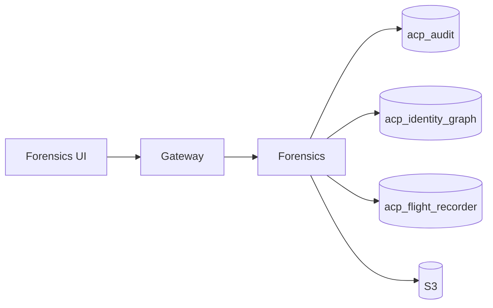

# Forensics

*The investigation service. Reads the audit chain and the identity graph to answer the questions a SOC analyst asks during an incident: "what did this agent do in this window?", "if this agent was compromised at 03:00, what was the blast radius?", "replay this execution step by step."*

## Business purpose

Aegis's value during an incident depends on how fast an investigator can move from "alert fired" to "we know what happened, here's the scope." Forensics reduces that time.

It exists as its own service because:

- **It reads from multiple sources.** The audit chain (for what happened), the identity graph (for who could reach what), the flight recorder (for per-execution detail). Co-locating those reads in one service keeps the cross-source joins out of the request path.
- **It owns no writes.** Forensics is a query layer. Read-only by design.
- **PDF export is heavy.** Investigation export to PDF (for compliance evidence or legal hold) is a separate workload that shouldn't pressure the audit service's write path.

## Architecture



The service holds read-only DSNs to three databases plus an S3 client for exports. It is the only service in the platform with three read-only Postgres connections.

## Request flow

### List investigations

1. UI calls `GET /forensics/investigation?min_risk=0.5&limit=20`.
2. Handler queries `acp_audit.audit_logs` for rows with `metadata_json->>'risk_score'` ≥ threshold in the window, joined with `acp_identity_graph.graph_nodes` to attach agent risk_level.
3. Returns the list, ranked by recency.

### Investigation detail

1. UI calls `GET /forensics/investigation/{audit_id}?window_hours=24`.
2. Handler:
   - Loads the central audit row.
   - Loads the same agent's audit rows in the surrounding window for context.
   - Computes a small per-agent aggregate (tool diversity, deny ratio, peer benchmark).
3. Returns a rich payload for the investigation detail page.

### Replay

1. UI calls `GET /forensics/replay/{agent_id}?limit=50`.
2. Handler loads the most recent 50 audit rows for the agent, ordered by `timestamp`.
3. Each row carries the signed receipt URL.

### Timeline view

1. UI calls `GET /forensics/timeline/{audit_id}`.
2. Handler joins the audit row with the flight recorder timeline by `request_id`.
3. Returns the per-stage breakdown plus the audit chain's recorded findings.

### Blast radius

1. UI calls `GET /forensics/blast-radius/{agent_id}?depth=3`.
2. Handler proxies to identity graph's blast-radius endpoint but caches the result for 60 seconds (operators often re-open the same investigation while triaging).

### PDF export

1. UI clicks "Export PDF" on an investigation.
2. `POST /forensics/export/{audit_id}` queues a render job.
3. Worker assembles the audit row, the timeline, the blast radius, and the agent profile; renders to PDF via `reportlab`; uploads to `s3://acp-tenant-exports-prod/{tenant}/{export_id}.pdf` with a 30-day lifecycle.
4. Returns a signed URL valid for 24 hours.

## Dependencies

**Python libraries:**

- `fastapi`, `sqlalchemy[asyncio]`, `asyncpg`.
- `httpx` for graph proxy calls.
- `boto3` for S3 upload.
- `reportlab` for PDF generation.

**Other Aegis services:**

- Audit (`services/audit/`) — read SELECT on `audit_logs`.
- Identity Graph (`services/identity_graph/`) — blast-radius and trust queries via API.
- Flight Recorder (`services/flight_recorder/`) — timeline replay via API.

**Infrastructure:**

- Three read-only Postgres connections.
- S3 bucket `acp-tenant-exports-prod`.

## Database tables

*The forensics service owns no tables.*

Its persistent footprint is the S3 bucket for exported PDFs. The actual investigation data is the audit chain, the identity graph, and the flight recorder timelines — all owned by other services.

## Redis usage

| Key pattern | Operation | Purpose | TTL |
|---|---|---|---|
| `acp:forensics_blast_radius:{node_id}:{depth}` | GET / SETEX | Cached blast-radius results | 60 s |
| `acp:forensics_export_queue` (List) | LPUSH / RPOP | PDF export job queue | None |
| `acp:forensics_export_status:{export_id}` | GET / SET | Per-job progress | 1 h |

## Security controls

- **Tenant scoping on every query.** Investigation lookups verify the audit row's `tenant_id` matches the request before returning detail.
- **PDF exports are tenant-scoped.** A signed URL works only against the requester's tenant export prefix in S3.
- **No write paths.** Forensics has no INSERT or UPDATE on any application table. The only write is the S3 PDF upload.
- **Audit emission on export.** Every PDF export produces an audit row with `action="forensic_export"` so reviewers can see who pulled which evidence.
- **Read DSNs are restricted.** The Postgres role granted to Forensics has `SELECT` on the three databases and `INSERT` on nothing.

## Metrics

| Metric | Type | Labels | Purpose |
|---|---|---|---|
| `acp_forensics_investigation_list_latency_seconds` | Histogram | `tenant_id` | List query time |
| `acp_forensics_investigation_detail_latency_seconds` | Histogram | `tenant_id` | Detail query time |
| `acp_forensics_replay_latency_seconds` | Histogram | `tenant_id` | Replay query time |
| `acp_forensics_blast_radius_proxy_latency_seconds` | Histogram | `tenant_id`, `depth` | Identity Graph round-trip |
| `acp_forensics_pdf_export_total` | Counter | `tenant_id`, `result` | Export outcomes |
| `acp_forensics_pdf_export_duration_seconds` | Histogram | `tenant_id` | PDF generation time |

## Deployment model

- **Image**: `infra-forensics` from `services/forensics/Dockerfile`.
- **Container**: `acp_forensics`.
- **Port**: 8011.
- **Replicas**: 1.
- **Healthcheck**: `GET /health`.
- **Env vars**: `AUDIT_DATABASE_URL` (read-only DSN), `IDENTITY_GRAPH_DATABASE_URL`, `FLIGHT_RECORDER_DATABASE_URL`, `REDIS_URL`, `INTERNAL_SECRET`, `S3_EXPORTS_BUCKET`, `S3_EXPORT_TTL_DAYS` (default 30).

## API endpoints

All exposed under `/forensics` at the gateway proxy.

| Method | Path | Auth | Description |
|---|---|---|---|
| GET | `/forensics/investigation` | AUDITOR+ | List investigations matching filters |
| GET | `/forensics/investigation/{audit_id}` | AUDITOR+ | Investigation detail |
| GET | `/forensics/replay/{agent_id}` | AUDITOR+ | Replay agent activity |
| GET | `/forensics/timeline/{audit_id}` | AUDITOR+ | Flight Recorder timeline for an audit row |
| GET | `/forensics/blast-radius/{agent_id}` | AUDITOR+ | Reachability for an agent |
| POST | `/forensics/export/{audit_id}` | AUDITOR+ | Queue a PDF export |
| GET | `/forensics/export/{export_id}/status` | AUDITOR+ | Export status |

## Example requests

### List high-risk investigations from the last 24 hours

```bash
curl -sS "https://dev.aegisagent.in/forensics/investigation?min_risk=0.7&limit=20" \
  -H "Authorization: Bearer $TOKEN" \
  -H "X-Tenant-ID: 00000000-0000-0000-0000-000000000001" \
  | jq '.data.items[] | {audit_id, agent_id, tool_name, risk_score, occurred_at}'
```

### Replay the last 20 actions of an agent

```bash
curl -sS "https://dev.aegisagent.in/forensics/replay/$AGENT_ID?limit=20" \
  -H "Authorization: Bearer $TOKEN" \
  -H "X-Tenant-ID: 00000000-0000-0000-0000-000000000001" \
  | jq '.data.events[] | {tool_name, decision, risk_score, timestamp}'
```

### Export a PDF for legal hold

```bash
EXPORT_ID=$(curl -sS -X POST https://dev.aegisagent.in/forensics/export/$AUDIT_ID \
  -H "Authorization: Bearer $TOKEN" \
  -H "X-Tenant-ID: 00000000-0000-0000-0000-000000000001" \
  -H "Content-Type: application/json" \
  -d '{"reason":"customer subpoena 2026-05-29"}' \
  | jq -r '.data.export_id')

# Poll until ready
while [ "$(curl -sS https://dev.aegisagent.in/forensics/export/$EXPORT_ID/status \
  -H "Authorization: Bearer $TOKEN" \
  -H "X-Tenant-ID: 00000000-0000-0000-0000-000000000001" \
  | jq -r '.data.status')" != "ready" ]; do sleep 2; done

curl -sS https://dev.aegisagent.in/forensics/export/$EXPORT_ID/status \
  -H "Authorization: Bearer $TOKEN" \
  -H "X-Tenant-ID: 00000000-0000-0000-0000-000000000001" \
  | jq -r '.data.signed_url'
```

## Troubleshooting

| Symptom | Likely cause | Where to look |
|---|---|---|
| Investigation list empty for a busy tenant | `min_risk` threshold too high | Lower threshold or drop the filter |
| `/forensics/timeline/{id}` returns "No timeline" | Flight Recorder has not yet emitted for the audit_id | Live for new requests; older rows may not have timelines if the request predates Flight Recorder |
| Blast-radius returns "Actor node not found" | Audit's agent_id is the registry UUID; graph uses the graph_nodes.id UUID | Use `GET /graph/agents` to map registry agent → graph node |
| PDF export stuck `queued` | Worker not running or `reportlab` import error | Inspect `acp_forensics` logs; restart container if needed |
| Signed URL returns 403 | URL expired (24h) or cross-tenant access | Re-export — new URL |
| Read DSN errors after RDS failover | Replica DNS not yet flipped | Wait for RDS replica promotion; the read DSN should resolve to the new primary within minutes |

## Production considerations

- **Forensics is read-only and idempotent.** Multiple analysts opening the same investigation simultaneously is fine.
- **PDF exports are expensive.** A single export can take 30 seconds for a 1,000-row investigation. The queue smooths the load; concurrent exports are capped at 4 to prevent CPU saturation.
- **The blast-radius cache TTL is 60 seconds.** Tight enough that operators see fresh data; loose enough that re-opening the same investigation is instant.
- **No write paths means no SQL injection surface.** All filters are typed (UUIDs, integers, ISO dates). Free-form text filters do not exist in the API.
- **Cross-source joins are not transactional.** The audit row may be from 10 minutes ago; the identity graph state may have changed since. Investigations show timestamps to make the disparity visible.
- **Read DSNs to RDS replica.** On multi-AZ deployments, heavy forensic queries route to a read replica to keep the primary's write throughput steady. The current dev deployment is Single-AZ (`acp-postgres-dev` only); reads share the writer until a replica is added.

## Next

- [Audit](audit.md) — the source of investigation data
- [Identity Graph](identity-graph.md) — the source of blast-radius
- [Flight Recorder](flight-recorder.md) — the source of timeline replay
- [Forensics UI](../ui/operations/forensics.md) — the human-facing flows
- [Tenant Data Requests](../operations/tenant-data-requests.md) — the related compliance workflow
