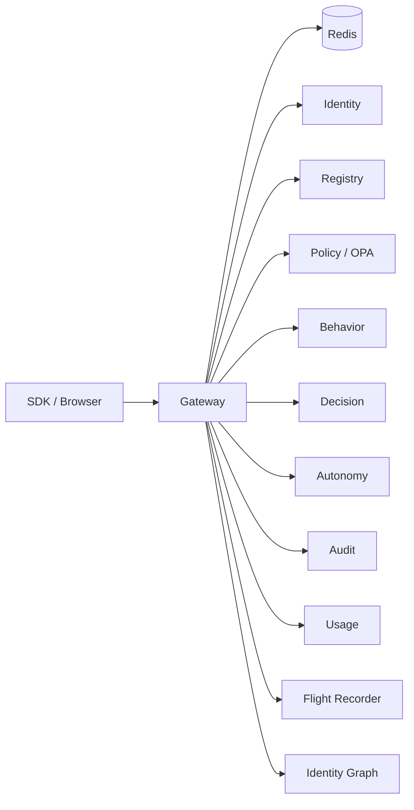

# Gateway

*The single public entry point for Aegis. Every browser, every SDK, every agent talks to this one service. It runs the eleven-stage middleware pipeline that decides which actions are allowed and then proxies to the right downstream service for execution and recording.*

## Business purpose

Without the gateway, the rest of Aegis is a pile of internal microservices with no front door. The gateway is the one place where authentication, authorization, rate limiting, policy, behavioral analysis, decision, autonomy, and audit are stitched into a single request lifecycle. It exists as its own service for three reasons:

- **One auth boundary.** A JWT only needs to be validated once per request; downstream services trust the gateway's `X-Internal-Secret` plus the forwarded tenant context.
- **One enforcement point.** Adding a new check means modifying middleware in one place, not 12 services.
- **One observability seam.** Every request becomes one trace, one span tree, one structured log line, and (if it produces a decision) one audit row.

## Architecture



The gateway is the only service that holds inline references to all the others. It is also the only service that talks to the public internet — every other service binds to the Docker network and is reachable only through the gateway proxy paths.

## Request flow

For a `POST /execute`, the gateway middleware stages are:

1. **Stage 0 — Kill switch** — `services/gateway/middleware.py::dispatch`
2. **Stage 1 — Auth** — `services/gateway/_mw_auth.py::_AuthMixin._authenticate`
3. **Stage 2 — Rate limit** — `services/gateway/_mw_rate_limit.py::_RateLimitMixin`
4. **Stage 3 — Inference proxy** — `services/gateway/inference_proxy.py::inference_proxy.evaluate`
5. **Stage 4 — Policy** — Redis-cached call to Policy via `services/gateway/client.py::ResilientClient`
6. **Stage 5 — Behavior** — same ResilientClient calls Behavior
7. **Stage 6 — Decision** — combines stages 3, 4, 5 via Decision service
8. **Stage 7 — Enforcement + autonomy** — `services/gateway/trust_emitter.py::check_autonomy_contract`
9. **Stage 8 — Execution** — `await call_next(request)` reaches the route handler at `services/gateway/main.py::execute_tool`
10. **Stage 9 — Output filter** — `services/gateway/_mw_response.py::_ResponseMixin`
11. **Stage 10 — Audit** — `services/gateway/_mw_audit.py::_AuditMixin._finalize_request` does `XADD acp:audit_events`

For non-`/execute` paths (management endpoints), stages 3–8 are skipped — see `_MANAGEMENT_PATH_PREFIXES` in `services/gateway/middleware.py`.

## Code structure (post-2026-05 refactor)

The gateway used to live in a 4,000+ line `main.py`. The 2026-05 audit pass (commits `9298e0a` through `6328d6e`) extracted route groups into 22 sub-routers under `services/gateway/routers/` and lifted six middleware phases into their own helpers. `main.py` is now ~1,700 lines of wiring; `middleware.py` is ~1,500 of pipeline orchestration.

| Sub-router | Routes | Public path prefix |
|---|---|---|
| `routers/auth.py` | 9 | `/auth/*` (token, me, introspect, refresh, revoke, tenants) |
| `routers/sso.py` | 3 | `/auth/sso/*` |
| `routers/users.py` | 8 | `/users/*`, `/api-keys/*` |
| `routers/agents.py` | 11 | `/agents`, `/agents/{id}/permissions`, `/registry/tools` |
| `routers/audit.py` | 33 | `/audit/*` |
| `routers/transparency.py` | 5 | `/transparency/*`, `/receipts/*` |
| `routers/decision.py` | 5 | `/decision/*` |
| `routers/incidents.py` | 10 | `/incidents/*` |
| `routers/billing.py` | 13 | `/billing/*`, `/usage/*` |
| `routers/compliance.py` | 18 | `/compliance/*`, `/siem/*`, `/reports/*` |
| `routers/risk.py` | 9 | `/risk/*`, `/threat-intel/*`, `/insights/*` |
| `routers/policy.py` | 4 | `/policy/*` |
| `routers/forensics.py` | 6 | `/forensics/*` |
| `routers/auto_response.py` | 16 | `/auto-response/*` |
| `routers/proxies.py`, `routers/dashboard.py`, `routers/admin.py`, `routers/tenant.py`, `routers/tenant_admin.py`, `routers/stripe_webhook.py` | misc | system + admin paths |

Each sub-router file owns its Pydantic models and any router-local helpers. Shared dependencies (auth dependency, internal-secret guard, ResilientClient injection) come from `services/gateway/_helpers.py` and `services/gateway/main.py` only. Adding a route means modifying one sub-router, not the main.py wiring.

The same pass extracted the middleware phases out of one monolithic `dispatch`:

| Helper | Source | What it does |
|---|---|---|
| `_validate_execute_agent_id` | `services/gateway/_mw_auth.py` | Pre-stage validation that the agent token's `agent_id` claim matches the URL agent (extracted in commit `e5f41c5`) |
| `_check_per_agent_cost_cap` | `services/gateway/_mw_rate_limit.py` | Stage 2 per-agent USD cap check (commit `a9015f8`) |
| PHASE 0 size check | `services/gateway/middleware.py` | Header-channelled early-deny for oversize requests (commit `9891ce8`) |
| PHASE 6.5 bounded-autonomy | `services/gateway/middleware.py` | Autonomy contract check after Decision, before execution (commit `bcefae1`) |
| `_handle_http_exception` finalize | `services/gateway/_mw_audit.py` | HTTPException path: still emits stage-10 audit (commit `585caaa`) |
| `_handle_unhandled_exception` finalize | `services/gateway/_mw_audit.py` | 500 path: still emits stage-10 audit with `error="internal_error"` (commit `0758062`) |

Both extractions preserve the prior semantics — the audit playbook treats this work as code-shape cleanup, not behaviour change.

## Dependencies

**Python libraries:**

- `fastapi` — the framework. The gateway is a single FastAPI app with custom `BaseHTTPMiddleware`.
- `httpx` — async HTTP client used by `services/gateway/client.py::ResilientClient` to call downstream services. Configured with `connect_timeout=0.1s`, `read_timeout=1.0s`, and circuit breakers.
- `redis.asyncio` — for kill-switch, rate-limit, revocation, decision cache, audit stream.
- `structlog` — JSON-structured logging.
- `prometheus-fastapi-instrumentator` — auto-instruments every route with histogram and counter.
- `opentelemetry-instrumentation-fastapi` — emits traces to Jaeger.

**Other Aegis services it calls:**

- Identity (`services/identity/`) — for `/auth/token`, `/auth/me`, `/auth/users`, `/users/*`, `/auth/credentials`, `/auth/tenants/*`, SSO
- Registry (`services/registry/`) — for `/agents`, `/agents/{id}/permissions`, `/registry/tools`
- Policy (`services/policy/`) — stage 4 OPA evaluation, `/policy/simulate`, `/policy/test`, `/policy/upload`
- Behavior (`services/behavior/`) — stage 5 score
- Decision (`services/decision/`) — stage 6 combine, `/decision/kill-switch/*`, `/decision/summary`, `/decision/history`, `/decision/signal-weights`
- Audit (`services/audit/`) — `/audit/logs`, `/audit/logs/verify`, `/audit/logs/{id}/receipt`, `/audit/logs/{id}/notes`, and the aggregator routes under `/audit/*`
- Usage (`services/usage/`) — `/usage/dashboard`, `/usage/anomalies`, `/billing/summary`
- Autonomy (`services/autonomy/`) — `/autonomy/contracts`, `/playbooks`, `/playbooks/autotrigger-stats`
- Flight Recorder (`services/flight_recorder/`) — `/flight/timelines`, per-execution emission
- Identity Graph (`services/identity_graph/`) — `/graph/agents`, `/graph/blast-radius`, `/graph/nodes`, `/graph/edges`
- Forensics (`services/forensics/`) — `/forensics/investigation`, `/forensics/replay/*`
- API service (`services/api/`) — `/incidents/*`, `/api-keys`, `/webhooks/*`, `/siem/*`, `/threat-intel/*`, `/reports/scheduled/*`

**Infrastructure:**

- Redis (db 0) — runtime state. See [Data Model](../architecture/data-model.md) for the full key inventory.
- No direct Postgres connection. All persistent state flows through downstream services.

## Database tables

*The gateway does not own any tables.* It writes to Redis only. Every persistent write is routed to the owning service over HTTP.

This is intentional. The gateway is stateless from Postgres's perspective, so it can be horizontally scaled by adding more workers or more EC2s without coordinating database connections.

## Redis usage

| Key pattern | Operation | Stage | Purpose |
|---|---|---|---|
| `acp:kill_switch:{tenant_id}` | GET | 0 | Tenant-wide halt flag |
| `acp:revoked_tokens:{token_hash}` | SISMEMBER | 1 | Forced token revocation |
| `acp:revoked_jti:{jti}` | GET | 1 | Per-JTI revocation |
| `acp:jti_last_used:{jti}` | SETNX | 1 | 1ms replay window |
| `acp:auth_fail:{ip}` | INCR, EXPIRE | 1 | Per-IP fail counter |
| `acp:ratelimit:{tenant_id}:tokens` | EVAL Lua | 2 | Token bucket |
| `acp:agent_cost_today:{agent_id}:{date}` | INCRBY | 2 | Per-agent USD cap |
| `acp:agent_cost_cap:{agent_id}` | GET | 2 | Per-agent cap value |
| `acp:policy_decision:{hash}` | GET, SETEX | 4 | OPA decision cache |
| `acp:behavior_score:{agent_id}` | GET | 5 | 60s behavior cache |
| `acp:signal_weights:{tenant_id}` | GET | 6 | Per-tenant Decision weights |
| `acp:audit_events` (Stream) | XADD | 10 | Audit outbox |
| `acp:sse:tenant:{tenant_id}` (Pub/Sub) | PUBLISH | post-10 | Live Feed fanout |
| `acp:sse:agent:{agent_id}` (Pub/Sub) | PUBLISH | post-10 | Per-agent SSE |
| `acp:groq_events` (Stream) | XADD | inline | Inference event emit |

## Security controls

- **Authentication** — JWT (HS256) signed with `INTERNAL_SECRET`; validated by `services/gateway/auth.py::TokenValidator`. Tokens are 15-minute TTL. SSO providers issue tokens via OIDC — see `services/identity/oidc.py`.
- **Authorization** — Role enforcement at stage 1: `ADMIN` and `SECURITY` for write paths, `agent` for `/execute` only, `VIEWER` and `AUDITOR` for read paths. Source: `services/gateway/_mw_auth.py:150-168`.
- **Replay protection** — `acp:jti_last_used:{jti}` SETNX with 1-second TTL; reuse within 1 millisecond returns 429.
- **Input validation** — Every body schema is a Pydantic model. Path/query parameters are typed (`uuid.UUID`, `int`, etc.) so FastAPI rejects malformed values with 422 before they reach handlers.
- **CORS** — Tight allow-list in production: only the canonical UI origin. `services/gateway/main.py` `CORSMiddleware`.
- **SQL injection regex** — Stage 3 inference proxy catches `DROP TABLE`, `; DELETE`, etc. before they reach the policy layer.
- **Path-traversal regex** — Hard-deny pattern in `services/policy/policies/agent_policy.rego`.
- **Secret redaction** — Stage 9 redacts Bearer tokens, API keys, and pattern-matched PII from responses.
- **Audit emission** — Every decision (allow or deny) produces a signed audit row. Stage 10 always runs, even on 403 and 504.
- **Internal-secret check** — Downstream services reject any request without `X-Internal-Secret` matching their copy.

## Metrics

| Metric | Type | Labels | What it measures |
|---|---|---|---|
| `acp_gateway_stage_{n}_latency_seconds` | Histogram | `tenant_id`, `outcome` | Per-stage latency 0–10 |
| `acp_gateway_stage_{n}_denied_total` | Counter | `tenant_id`, `reason` | Per-stage denies |
| `acp_gateway_stage_{n}_skipped_total` | Counter | `tenant_id`, `reason` | Per-stage skipped invocations |
| `acp_gateway_request_total` | Counter | `tenant_id`, `method`, `path`, `status` | Top-level request counter |
| `acp_gateway_request_latency_seconds` | Histogram | `tenant_id`, `method`, `path` | End-to-end gateway latency |
| `acp_gateway_decision_total` | Counter | `tenant_id`, `action` | Final action outcomes |
| `acp_jwt_validation_latency_seconds` | Histogram | `cache_hit` | JWT in-process LRU vs Redis |
| `acp_gateway_circuit_breaker_open` | Gauge | `target_service` | Whether a circuit is open |
| `acp_gateway_inflight_requests` | Gauge | none | Concurrent in-flight `/execute` requests |
| `acp_behavior_firewall_consult_total` | Counter | `tenant_id`, `result` | Stage 5 results |
| `acp_chain_violation_immediate` | Counter | `tenant_id` | Stage 10 chain check failure (alerts in 0m) |

All metrics scrape from `/metrics` on the gateway pod and are visualized on `infra/grafana-dashboards/platform_slo.json`.

## Deployment model

- **Image**: `infra-gateway` built from `services/gateway/Dockerfile`.
- **Container**: `acp_gateway`.
- **Port**: 8000 inside the Docker network; not exposed to the host (reached through Nginx).
- **Replicas**: 1 per EC2 host today; uvicorn workers fixed at **`--workers 2`** in `infra/docker-compose.yml` (2026-06-13 — was 4; OOM-killed under load against the 768 MB prod-ha memory cap).
- **Healthcheck**: `GET /health` returns `200 {"status":"ok"}` if the FastAPI app started.
- **Readiness**: `GET /readiness` runs a deep probe of every downstream service plus Redis. Used by deploy scripts before traffic shift.
- **Env vars consumed**: `REDIS_URL`, `INTERNAL_SECRET`, `IDENTITY_SERVICE_URL`, `REGISTRY_SERVICE_URL`, `POLICY_SERVICE_URL`, `DECISION_SERVICE_URL`, `AUDIT_SERVICE_URL`, `BEHAVIOR_SERVICE_URL`, `USAGE_SERVICE_URL`, `AUTONOMY_SERVICE_URL`, `FLIGHT_RECORDER_SERVICE_URL`, `IDENTITY_GRAPH_SERVICE_URL`, `FORENSICS_SERVICE_URL`, `API_SERVICE_URL`, `OPA_URL`, `ENVIRONMENT`, `DECISION_GATHER_TOTAL_TIMEOUT` (default 1.5s), `DATABASE_URL` (must point at `acp_audit`, not the legacy `acp` DB — `shadow_eval_hook.py` is the only consumer and it reads from the `shadow_policies` table that lives in `acp_audit`), `GROQ_API_KEY` (for the `/demo/groq-agent` route — never embedded in the UI bundle).
- **Restart policy**: `unless-stopped` in compose.
- **Resources**: Not constrained today; the gateway's footprint is ~250 MB resident.

## API endpoints

The gateway exposes ~90 routes. The most-trafficked tags:

| Tag | Routes | Used by |
|---|---|---|
| `auth` | 15 | UI login, SDK auth, agent token issuance |
| `agents` | 9 | Agents page, RBAC page, Playground |
| `audit` | 8 top-level + ~30 aggregator | Audit Trail, Observability, Security Dashboard, Policy Analytics |
| `decision` | 5 | Kill Switch UI, Risk Engine, Observability |
| `policy` | 4 | Policy Builder, Policy Sim |
| `billing` | 6 | Billing page, Usage dashboards |
| `usage` | 3 | Usage dashboard, Anomalies |
| `compliance` | 6 | Compliance page exports (GET `/compliance/export/{bundle_type}` added 2026-06-13 for the UI's "Download Bundle" button — was a backend-only POST before) |
| `forensics` | 6 | Forensics page |
| `flight` | 3 | Flight Recorder |
| `autonomy` | 6 | Autonomy Contracts page |
| `graph` | 8 | Identity Graph page |
| `playbooks` | 9 | Playbooks page |
| `auto-response` | ~12 | Auto Response page |
| `system` | 4 | System Health, Status |
| `sso` | 3 | SSO settings |
| `execution` | 2 | `/execute` and `/execute/{tool_name}` |
| `receipts` / `transparency` | 8 | Receipt verification, transparency proofs |
| `demo` | 1 | `POST /demo/groq-agent` — the Live Demo page. Server-side Groq call → loops back to `/execute` for each suggested tool call. See [Live Demo](../ui/primary/live-demo.md). |

For the full list see [API Reference](../api/reference.md) (generated from `/openapi.json`).

## Endpoint reference — 2026-06 deltas

The endpoints below either landed or were materially reshaped in the 2026-06 docs refresh. Body shapes are the ones the SDK (`acp-client==1.1.0`) actually sends; response shapes are what the SDK consumes after the `APIResponse` envelope is unwrapped. Every path here was verified against `services/gateway/routers/`.

### `POST /audit/logs/search` — typed audit search

Source: `services/gateway/routers/audit.py:69`. Upstream handler: `services/audit/router.py:325` (schema `services/audit/schemas.py:27::AuditLogSearch`).

**Body** (all fields optional except `limit` and `offset` defaults):

```json
{
  "agent_id":        "<uuid>",
  "action":          "execute_tool",
  "tool":            "db.query",
  "decision":        "deny",
  "start_date":      "2026-06-01T00:00:00Z",
  "end_date":        "2026-06-17T23:59:59Z",
  "metadata_filter": {"finding": "pii.detected"},
  "limit":           20,
  "offset":          0
}
```

`limit` is bounded by Pydantic `ge=1, le=100`; 422 if violated. `metadata_filter` is a JSONB containment match (`metadata_json @> filter`) against the audit row — keys like `finding`, `risk_score`, or any custom metadata your agent attached.

**Response**:

```json
{
  "success": true,
  "data": {
    "total":  342,
    "limit":  20,
    "offset": 0,
    "items": [
      {
        "id":         "<uuid>",
        "agent_id":   "<uuid>",
        "action":     "execute_tool",
        "tool":       "db.query",
        "decision":   "deny",
        "timestamp":  "2026-06-17T10:14:22.451Z",
        "metadata":   { "...": "..." },
        "prev_hash":  "<64-char hex>"
      }
    ]
  }
}
```

> **WAF gotcha.** AWS WAF has a managed rule that flags JSON bodies containing the literal string `"limit":<n>` as SQL-injection-ish, returning 403 before the request reaches the gateway. The UI's Audit Trail page therefore prefers `GET /audit/logs?limit=N&agent_id=…&action=…` for plain pagination and only falls back to POST `/audit/logs/search` when `metadata_filter` is non-empty (the JSONB filter has no GET equivalent). New SDK integrations should do the same.

### `POST /policy/upload` — persist a named Rego policy

Source: `services/gateway/routers/policy.py:127`. Pure proxy → policy service.

**Body**: opaque to the gateway; forwarded to the policy service as-is. The expected shape upstream:

```json
{
  "name":  "block_external_wire_above_25M",
  "rego":  "package agent_policy\n\ndeny[msg] { ... }",
  "notes": "Sprint-7 enterprise rule"
}
```

Requires `ADMIN` or `SECURITY` role at the gateway auth check; tenant scoping comes from the JWT (`tenant_id` claim).

**Response**: 200 with the upstream `APIResponse` envelope carrying the saved policy row (`id`, `name`, `version`, `created_at`). 403 if the role gate fails before the proxy fires.

The two sibling routes — `POST /policy/simulate` and `POST /policy/test` (both in the same router) — fan out a `policy_decision` SSE event on non-trivial outcomes (deny / escalate / approval_required) via `_maybe_publish_policy_event`. `/policy/upload` itself does not currently emit an event; the UI re-fetches the policy list after the 200. See the [Live Feed page](../ui/operations/live-feed.md) for how SSE events are consumed.

### `DELETE /api-keys/{key_id}` — revoke a programmatic API key

Source: `services/gateway/routers/users.py:139`. Pure proxy → API service.

**Body**: none. The path parameter is the key UUID returned by `POST /api-keys`.

**Response**: 200 with `{ "success": true, "data": { "revoked": true, "id": "<uuid>" } }`. 404 if the key doesn't exist or already belongs to a different tenant.

Forensic-grade revocation (revocation set + SSE event) is in the roadmap but not yet wired here; today the API service marks the key inactive and the next validation call (`POST /api-keys/validate`) returns 401. Clients caching the validation result should respect the 60-second TTL on `acp:apikey:validated:{hash}`.

### `GET /iag/mitre-coverage` — MITRE ATT&CK coverage matrix

Source: `services/gateway/routers/iag.py:111`. No DB call — reads the module-level `services/security/signal_registry.py` (Sprint-1 Security Signal Registry, 34 signals).

**Query params**: none required. The handler enforces a tenant JWT but the response is registry-only (the same matrix for every tenant).

**Response**:

```json
{
  "tactics": [
    {
      "tactic_id":       "TA0001",
      "tactic_name":     "Initial Access",
      "technique_count": 2,
      "signal_count":    3,
      "techniques": [
        {
          "technique_id":   "T1078",
          "technique_name": "Valid Accounts",
          "max_severity":   "high",
          "max_score":      70,
          "signals": [
            {
              "id":               "SEC-AUTH-001",
              "severity":         "high",
              "default_score":    70,
              "default_response": "escalate",
              "description":      "Cross-tenant token reuse detected"
            }
          ]
        }
      ]
    }
  ],
  "signal_total":  34,
  "tactic_total":  12
}
```

The frontend's MitreCoverageGrid renders the result as a 12-tactic heatmap; the cell colour comes from `max_severity` within that technique's signals.

### `GET /iag/agents/{agent_id}` — accessible-resources view for one agent

Source: `services/gateway/routers/iag.py:187`.

**Path param**: `agent_id` — UUID (or string id) of the agent.

**Response**: the canonical `BlastRadius.to_dict()` shape from `services/security/iag/graph.py:79`. Because no incident is associated, every accessible resource lands in `untouched_resources`:

```json
{
  "agent_id":             "<uuid>",
  "incident_id":          "",
  "accessible_resources": ["res-001", "res-014", "..."],
  "touched_resources":    [],
  "untouched_resources":  ["res-001", "res-014", "..."],
  "criticality_score":    420,
  "by_kind":              {"database": 12, "secret": 4, "endpoint": 31},
  "resource_labels":      {"res-001": "patients_pii", "res-014": "billing_db_ro"},
  "last_ingest_ts":       1718587200,
  "dollar_estimate":      1250000,
  "by_kind_dollars":      {"database": 1200000, "secret": 50000},
  "system_values_configured": true
}
```

If IAG ingestion has never run for the tenant, `accessible_resources` will be empty and `last_ingest_ts: 0` — the caller can use that to surface a "graph not ingested yet" empty state.

The companion `GET /iag/incidents/{incident_id}/blast-radius` (line 223) returns the same shape but with `touched_resources` filled from the incident storyline and an extra `participating_agents` list.

### `POST /autonomy/overrides` — human override timeline entry

Routed via the catch-all `/autonomy/{full_path:path}` in `services/gateway/routers/proxies.py:41`. Upstream handler: `services/autonomy/router.py:318` (`add_override`, schema `services/autonomy/schemas.py:78::OverrideIn`).

**Body**:

```json
{
  "actor":       "cfo@example.com",
  "actor_role":  "CFO",
  "event_type":  "approve",
  "target_kind": "incident",
  "target_id":   "INC-2026-06-17-0042",
  "request_id":  "<uuid optional>",
  "reason":      "Verified out-of-band with treasury",
  "metadata":    {"transaction_id": "TX-91A2"}
}
```

`event_type` is open-vocabulary in the schema, but the autonomy enforcement engine recognises `approve`, `reject`, `acknowledge`, `comment`. `target_kind` is typically `incident`, `agent`, or `policy`; `target_id` is the matching primary key.

**Actor attribution.** The gateway's auth middleware injects two headers before the request reaches the autonomy service:

- `X-ACP-Actor` ← the JWT `sub` claim (validated user id / email)
- `X-ACP-Role` ← the JWT `role` claim

The autonomy handler (`router.py:331`) prefers these over the body's `actor` and `actor_role` fields. This means a browser cannot spoof a CFO override — the role on the row is whatever role the JWT carried at the moment the request was authenticated. Body fields remain the fallback for direct service-to-service calls that bypass the gateway (rare).

**Response**: 200 with the persisted `OverrideOut` row (`id`, `tenant_id`, `actor`, `event_type`, `target_kind`, `target_id`, `occurred_at`, etc.). The handler does not currently publish an SSE event — UI surfaces that listen for override resolution re-poll `GET /autonomy/overrides?minutes=…`. The matching `GET /autonomy/overrides` query is the timeline feed (paginated, filterable by `target_kind` / `target_id`).

> **What's documented vs. what's coming.** A few proxy and notification side-effects were mooted during the docs refresh that are not yet in the codebase: `POST /v1/messages` + `POST /v1/chat/completions` model-side proxy routes (only the abstraction layer `services/gateway/llm_router.py` exists; no wiring), `POST /v1/approvals/{id}/status` typed approval poll, `POST /iag/refresh?days=N`, `POST /api-keys/employees`, and SSE events `llm_proxy_call`, `llm_proxy_escalate`, `approval_resolved`, `key_revoked`. They are not currently routable through the gateway; this page is updated only after they ship and `services/gateway/routers/` grows the handlers.

## Example requests

### Mint a token

```bash
curl -sS -X POST https://aegisagent.in/auth/token \
  -H "Content-Type: application/json" \
  -H "X-Tenant-ID: 00000000-0000-0000-0000-000000000001" \
  -d '{"email":"admin@acp.local","password":"REDACTED"}'
```

### List agents

```bash
curl -sS https://aegisagent.in/agents \
  -H "Authorization: Bearer $TOKEN" \
  -H "X-Tenant-ID: 00000000-0000-0000-0000-000000000001" | jq
```

### Execute a tool (the main event)

```bash
curl -sS -X POST https://aegisagent.in/execute \
  -H "Authorization: Bearer $TOKEN" \
  -H "X-Tenant-ID: 00000000-0000-0000-0000-000000000001" \
  -H "X-Agent-ID: $AGENT_ID" \
  -H "Content-Type: application/json" \
  -d '{"tool_name":"db.query","payload":{"query":"SELECT 1"}}'
```

## Troubleshooting

| Symptom | Likely cause | Where to look |
|---|---|---|
| 500 with empty body | An unhandled exception inside middleware; check `acp_gateway` container logs | `docker logs acp_gateway 2>&1 \| grep -i traceback` |
| 401 after a fresh login | Token expiry (15 min) OR `INTERNAL_SECRET` mismatch between gateway and identity | Compare `INTERNAL_SECRET` in both services' envs |
| 403 `Write operations require ADMIN or SECURITY role` on every write | Logged in as VIEWER or AUDITOR | Promote the user role or re-login as admin |
| Slow p99 with no obvious cause | Behavior service degraded; circuit breaker may be open | Grafana platform_slo dashboard; check `acp_gateway_circuit_breaker_open` |
| Audit row missing despite 200 response | Audit Redis stream backed up | Prometheus `acp_audit_outbox_oldest_age_seconds` — should be < 60 |
| 504 `decision_timeout` | `DECISION_GATHER_TOTAL_TIMEOUT` (default 1.5s) exceeded | Inspect Flight Recorder for the slow stage |
| `/events/stream` returns immediately with no events | SSE token expired or Redis pub/sub channel mismatch | UI sends `?token=<query_token>`; the gateway resolves to the per-tenant channel `acp:sse:tenant:{tenant_id}` |
| ALB 502 from one EC2 only | Per-EC2 docker DNS issue | SSH to the unhealthy host, `docker compose restart gateway ui` |

## Production considerations

- **In-process JWT LRU cache** — `services/gateway/auth.py::TokenValidator` keeps the last 10,000 JWTs validated for 60 seconds. This shaves Redis round-trips off hot paths. Cache invalidation on revoke is broadcast via `acp:revoked_jti:{jti}`.
- **Connect timeouts are aggressive** — `ResilientClient` uses `connect_timeout=100ms`. Tune via `services/gateway/client.py` if a downstream is slow to accept connections.
- **Audit XADD timeout is 0.25s** — A blocked Redis primary will not stall the gateway response; the audit emission will retry from `_mw_audit.py`.
- **Behavior service breaker** — On `breaker_open`, stage 5 returns `service_status="skipped"` and the decision is made on the remaining signals. The per-tenant `degraded_mode_policy` decides whether to treat the absence as risky.
- **Idempotency on /execute** — The SDK can send `X-Idempotency-Key`; the gateway dedupes within a 60-second window via `acp:idempotency:{key}`.
- **Forbidden patterns enforced by the audit-chain spec** — Never silently swallow audit emission failures; never use `ON CONFLICT DO NOTHING` on `audit_logs` without recording the conflict.
- **Fail-closed posture** — If Redis is unreachable, stage 0 (kill switch) and stage 1 (revocation) fail closed: requests are denied. This is enforced because a partial-availability Aegis is the same as no Aegis.

## Next

- [Decision](decision.md) — the signal-combiner at stage 6
- [Audit](audit.md) — what stage 10 writes
- [Identity](identity.md) — JWT issuance and SSO
- [Policy](policy.md) — OPA bundle host and Rego rules
- [Flow of a Decision](../architecture/flow-of-a-decision.md) — one request walked through this service end to end
