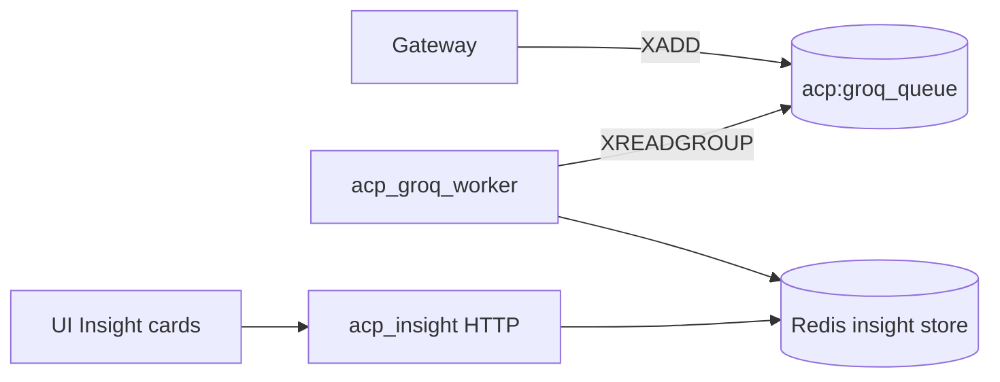

# Groq Worker

*An alternative deployment target for the same Redis-stream contract that the Insight service uses. Identical semantics, deployed as a dedicated worker pod when you want a clean separation between the HTTP-serving Insight API and the LLM-calling enrichment.*

## Business purpose

The Insight service ships with an HTTP API and an embedded worker. For some deployments — where the LLM call budget is high and you want to scale the worker independently — separating the worker into its own pod is operationally cleaner.

The Groq Worker is that alternative. It consumes the same `acp:groq_queue` (or `acp:groq_events`) stream, calls the same Groq model, and writes to the same `acp:groq:insight:{event_id}` keys. The HTTP API stays in `acp_insight`; only the worker moves.

## Architecture



The diagram is identical to Insight's; the only difference is that the worker is a separate container.

## Request flow

### Consume

1. Worker starts an `acp_insights_consumer_group` consumer.
2. `XREADGROUP` reads up to N entries per loop iteration with a 5-second block.
3. For each entry, decodes the event payload (JSON).
4. Builds a prompt via `sdk/common/groq_helpers.py::build_insight_prompt(event)`.
5. Calls Groq with `MODEL_FAST` (small, low-cost) or `MODEL_DEEP` (slower, more thorough) depending on event severity.
6. Writes the response to Redis:
   - `acp:groq:insight:{event_id}` (24-hour TTL) — the per-event detail.
   - `acp:groq:insights:timeline` (ZSET, scored by timestamp) — for recent-first listing.
   - `acp:groq:insights:by_agent:{agent_id}` (List) — for per-agent listing.
7. XACK-s the stream entry.

### Failure handling

- Groq API errors are retried up to 3 times with exponential backoff.
- After 3 failures, the event is XACK-ed (to avoid blocking the stream) and a counter is incremented; the analyst sees the raw audit row but no enrichment.
- A separate dead-letter list `acp:groq:dlq` captures the failed event for retry by `scripts/maintenance/replay_groq_dlq.py`.

## Dependencies

**Python libraries:**

- `groq` — the Groq Python client.
- `redis.asyncio`.
- `structlog`.
- `tenacity` for retry/backoff.

**Other Aegis services:**

- None. The worker is a pure Redis-stream consumer. The audit chain produces events, the Insight HTTP API reads results — nothing else.

**Infrastructure:**

- Redis (the same instance the gateway writes to).
- Groq API.

## Database tables

*No Postgres.*

## Redis usage

| Key pattern | Operation | Purpose | TTL |
|---|---|---|---|
| `acp:groq_queue` (Stream) | XREADGROUP / XACK | Inbound events from gateway | Untrimmed |
| `acp:groq:insight:{event_id}` | SET | Per-event LLM output | 24 hours |
| `acp:groq:insights:timeline` (ZSET) | ZADD / ZREMRANGEBYSCORE | Recent-first listing | Trimmed to 10,000 entries |
| `acp:groq:insights:by_agent:{agent_id}` (List) | LPUSH / LTRIM | Per-agent recent | Trimmed to 100 |
| `acp:groq:dlq` (List) | LPUSH | Dead-letter for failed events | Until replayed |
| `acp:groq:rate_limit:{tenant_id}` | INCR / EXPIRE | Per-tenant budget | 1 hour |

## Security controls

- **No tenant cross-talk.** Each event payload carries `tenant_id`; outputs are written under `tenant_id`-scoped keys.
- **No raw payload to Groq.** Prompts include the agent name, tool name, decision, findings, and metadata flags — never raw user input. The prompt template at `sdk/common/groq_helpers.py::build_insight_prompt` is the contract.
- **Per-tenant rate limit.** Bounded by `acp:groq:rate_limit:{tenant_id}`. A tenant exceeding their budget gets no enrichment for the rest of the hour; the platform still records the audit row.
- **API key in env only.** The Groq API key is provided via env (`GROQ_API_KEY`) and never logged.
- **Output sanitization.** LLM responses are stripped of any field that looks like a credential or pasted-back payload before being written to Redis.

## Metrics

| Metric | Type | Labels | Purpose |
|---|---|---|---|
| `acp_groq_events_consumed_total` | Counter | `result` | Throughput |
| `acp_groq_event_latency_seconds` | Histogram | `model` | Round-trip latency |
| `acp_groq_dlq_size` | Gauge | none | Failed events |
| `acp_groq_rate_limited_total` | Counter | `tenant_id` | Rate-limit hits |
| `acp_groq_api_errors_total` | Counter | `error_type` | Groq API failures |

## Deployment model

- **Image**: `infra-groq_worker` from `services/groq_worker/Dockerfile`.
- **Container**: `acp_groq_worker`.
- **Port**: none (no HTTP).
- **Replicas**: 1 in the current production deployment.
- **Healthcheck**: relies on the Redis consumer group lag metric; no HTTP health endpoint.
- **Env vars**: `REDIS_URL`, `GROQ_API_KEY` (secret), `GROQ_MODEL_FAST` (e.g. `llama-3.1-8b-instant`), `GROQ_MODEL_DEEP` (e.g. `llama-3.3-70b-versatile`), `INSIGHT_BUDGET_PER_HOUR_PER_TENANT` (default 1000).

**Live state (as of 2026-05-29, public demo at `aegisagent.in`):**

- `acp_groq_worker` container is `Up 12 hours (healthy)`.
- The `acp:groq_events` stream depth (`XLEN`) is **0** — the worker has caught up with all incoming events.

## API endpoints

*None.* This service is a pure Redis-stream consumer.

## Example requests

There are no caller-facing endpoints. To inspect the worker's state from inside the cluster:

```bash
docker exec acp_redis redis-cli XLEN acp:groq_events
docker exec acp_redis redis-cli XINFO STREAM acp:groq_events
docker exec acp_redis redis-cli LLEN acp:groq:dlq
```

## Troubleshooting

| Symptom | Likely cause | Where to look |
|---|---|---|
| Stream depth growing | Worker stopped or Groq API outage | `acp_groq_worker` logs; restart container if stuck |
| `acp_groq_api_errors_total{error_type="auth"}` rising | API key rotated | Redeploy with the new key |
| `acp:groq:dlq` growing | Persistent prompt-template errors | Inspect DLQ payloads; fix the template; replay |
| Specific agent's insights missing | Per-tenant rate limit | Lift the budget or wait for the hour to roll over |
| Latency p95 > 3s | Groq under load OR `MODEL_DEEP` chosen too often | Tune the severity threshold to prefer `MODEL_FAST` |
| Worker keeps restarting | Out-of-memory from very long LLM outputs | Cap response size in the worker before writing |

## Production considerations

- **Worker is failure-tolerant by design.** A Groq outage produces empty insight cards in the UI but does not affect security decisions, audit, or billing.
- **Replicas are safe.** The Redis consumer group serializes processing per entry; running two workers helps only at very high decision throughput.
- **The DLQ exists.** Failures are queued, not silently dropped. The replay script is the disaster-recovery path.
- **Cost control.** Each enrichment costs cents; the per-tenant budget bounds the worst-case spend. Operators should size the budget to match their security-team's analyst load (more analysts = more cards = bigger budget).
- **No PII in prompts.** This is a hard contract verified by the prompt template tests under `services/groq_worker/tests/`. Customer data does not leave the platform.
- **The same worker contract is implemented twice** — once embedded in `services/insight/worker.py` and once in `services/groq_worker/service.py`. Choose one deployment shape; the embedded variant is the default.

## Next

- [Insight](insight.md) — the HTTP API for the same enrichments
- [Audit](audit.md) — the source of events
- [Decision](decision.md) — the upstream that produced the audit row
