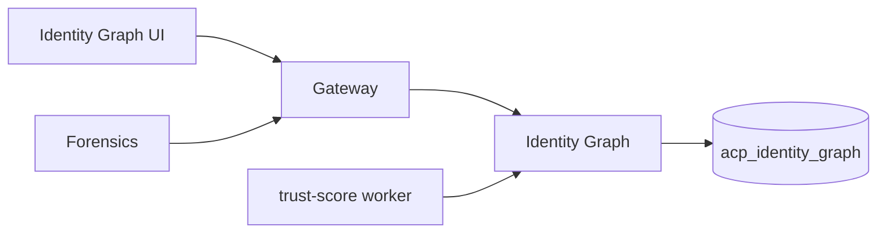

# Identity Graph

*A typed graph of every entity in the platform — agents, tools, resources, tenants, humans — connected by typed edges representing every action that ever happened between them. Powers blast-radius analysis, trust scoring, drift detection, and "what if this token were stolen" compromise simulation.*

## Business purpose

Per-agent and per-tenant controls answer "is this one call allowed?" The graph answers something different and harder: "if this one call is allowed, what is its second-order effect?"

Use cases:

- **Blast radius.** An agent is compromised at 03:00. Which databases, customer records, and downstream agents can it ultimately reach in three hops? The graph answers in one query.
- **Trust scoring.** A score per node, continuously updated based on the outcomes of edges incident to it. An agent that keeps generating deny edges loses trust; a tool that's only ever invoked safely keeps trust at 1.0.
- **Drift detection.** When a node's recent edge pattern diverges from its baseline, that's a drift signal. Stored as a separate row for forensic review.
- **Compromise simulation.** Pick an "actor" node, declare a scenario (`stolen_token`, `insider_threat`), set a depth, and run a what-if traversal. The result is a list of reachable resources plus a risk score.

The graph exists as its own service so the data model — typed nodes with attribute JSON, typed directed edges with action and outcome — can evolve without touching the audit chain.

## Architecture



Edges are written from the gateway via `services/gateway/trust_emitter.py::emit_graph_event` after every `/execute` decision. A separate worker process continuously updates the trust score and detects drift.

## Request flow

### Edge emission (background, post-response)

1. Gateway finishes a `/execute` decision (allow or deny).
2. `emit_graph_event` is called as a fire-and-forget background task.
3. Constructs `EdgeCreate(src_node_id, dst_node_id, edge_type, action, outcome, risk_score, request_id)`.
4. POSTs to `services/identity_graph/router.py::create_edge`.
5. Identity Graph inserts into `graph_edges`. No response is awaited by the gateway.

### Blast radius query

1. UI calls `GET /graph/blast-radius/{node_id}?depth=3`.
2. Handler `get_blast_radius`:
   - Loads the actor node.
   - Does a BFS in Postgres (recursive CTE) up to `depth`.
   - Returns the reachable nodes plus the edges traversed.
   - Computes a risk score: average `(1 - trust_score)` across reachable nodes, floored to 0.4 if any reachable node is marked `attributes.critical: true`.

### Trust score recomputation (worker)

A background process runs every 60 seconds. For each node:

1. Read all edges incident to the node in the last 24 hours.
2. Compute `score = base * (1 - alpha * deny_ratio) * (1 - beta * outlier_velocity)`.
3. Update `graph_nodes.trust_score` and append a row to `trust_score_history`.

### Compromise simulation

1. UI calls `POST /graph/compromise/simulate` with `{actor_node_id, scenario, depth}`.
2. Handler:
   - Picks a scenario-specific edge filter (e.g., `stolen_token` ignores `delegates` edges; `insider_threat` includes them).
   - Runs a depth-bounded traversal.
   - Builds a summary: reachable resource count, affected tenants, blast radius, composite risk score.
3. Records the result in `compromise_simulations` for later replay and audit.

## Dependencies

**Python libraries:**

- `fastapi`, `sqlalchemy[asyncio]`, `asyncpg`.
- `pydantic` for `NodeCreate`, `EdgeCreate`, `BlastRadiusOut`, `CompromiseOut`.
- `structlog`.

**Other Aegis services:**

- Audit (`services/audit/`) — for cross-referencing edges with audit rows during forensic queries.

**Infrastructure:**

- Postgres `acp_identity_graph`.
- No Redis dependency in the hot path.

## Database tables

| Table | Purpose | Notable columns |
|---|---|---|
| `graph_nodes` | Vertices | `id`, `tenant_id`, `node_type` (`agent`/`tool`/`resource`/`tenant`/`human`), `external_id`, `name`, `attributes` (JSONB), `trust_score`, `drift_score`, `last_scored_at`, UNIQUE (`tenant_id`, `node_type`, `external_id`) |
| `graph_edges` | Directed edges | `id`, `tenant_id`, `src_node_id`, `dst_node_id`, `edge_type` (`invokes`/`reads`/`writes`/`delegates`/`escalates`), `action`, `outcome` (`allow`/`deny`/`error`), `risk_score`, `request_id`, `attributes`, `occurred_at` |
| `trust_score_history` | Append-only score timeline | `id`, `tenant_id`, `node_id`, `score`, `components` (JSONB), `reason`, `captured_at` |
| `drift_signals` | Detected behavior drift | `id`, `tenant_id`, `node_id`, `signal_type`, `severity`, `baseline` (JSONB), `observed` (JSONB), `delta`, `detected_at` |
| `compromise_simulations` | Recorded what-if traversals | `id`, `tenant_id`, `actor_node_id`, `scenario`, `depth`, `reachable_nodes` (JSONB), `affected_tenants` (JSONB), `blast_radius`, `risk_score`, `summary`, `completed_at` |

Indexes: `graph_nodes.tenant_id, node_type`, `graph_edges.tenant_id, src_node_id`, `graph_edges.tenant_id, dst_node_id`, `graph_edges.occurred_at`.

**Live state (as of 2026-05-29, public demo at `aegisagent.in`):**

- `graph_nodes` = **10 rows**: 4 agents (`demo-agent`, `db-copilot`, `support-agent`, `devops-agent`), 4 resources (Production Postgres, Postmark email, Slack workspace, Prod k8s cluster), 1 tenant (Default Org), 1 human (Admin).
- `graph_edges` = **13 rows**: 4 `delegates` (Admin→agent ownership), 3 `invokes` (email/slack sends), 3 `writes` (k8s scale, k8s delete-namespace deny, db.execute), 3 `reads` (db.query, k8s list, k8s describe).
- `trust_score_history` = **6,630 rows** — the trust-score worker has been recording scores continuously since the graph was seeded.
- `drift_signals` = 0 (no drift detected yet).
- `compromise_simulations` = 0 (UI sims haven't been run on this tenant yet).

The `devops-agent` node currently has `trust_score=0.49` — depressed because one of its edges is a denied `k8s.delete.namespace` action with `risk_score=1.0`.

## Redis usage

*The identity graph service does not use Redis on the hot path.* All queries hit Postgres directly. Read traffic is low enough — typically one blast-radius query per UI page load — that caching the BFS result would add staleness without measurable latency improvement.

## Security controls

- **Tenant scoping on every query.** Both nodes and edges have `tenant_id` and every handler filters on it.
- **Cross-tenant graph access blocked.** A node from tenant A cannot reach an edge belonging to tenant B even by direct lookup; the handler verifies the row's `tenant_id` matches the request.
- **Edge writes are internal-secret-gated.** Only the gateway can write edges (via `emit_graph_event`); user-facing routes are read-only with the exception of `POST /graph/nodes` and `POST /graph/edges` which require ADMIN+ at the gateway.
- **Compromise simulations are recorded.** Every sim produces an audit row plus a `compromise_simulations` row. There is no anonymous "what if" — operators are accountable for the queries they run.
- **No PII in attributes.** The convention is that `node.attributes` carry kind, sensitivity, risk_level, etc., but never raw user data.

## Metrics

| Metric | Type | Labels | Purpose |
|---|---|---|---|
| `acp_graph_nodes_total` | Gauge | `tenant_id`, `node_type` | Vertex counts |
| `acp_graph_edges_total` | Gauge | `tenant_id`, `edge_type` | Edge counts |
| `acp_graph_blast_radius_latency_seconds` | Histogram | `tenant_id`, `depth` | BFS query time |
| `acp_graph_trust_score_recomputes_total` | Counter | none | Worker iterations |
| `acp_graph_drift_signals_total` | Counter | `tenant_id`, `severity` | Drift detections |
| `acp_graph_compromise_simulations_total` | Counter | `tenant_id`, `scenario` | UI-issued sims |

## Deployment model

- **Image**: `infra-identity_graph` from `services/identity_graph/Dockerfile`.
- **Container**: `acp_identity_graph`.
- **Port**: 8013.
- **Replicas**: 1.
- **Healthcheck**: `GET /health`.
- **Env vars**: `DATABASE_URL`, `INTERNAL_SECRET`, `TRUST_SCORE_RECOMPUTE_INTERVAL_SECONDS` (default 60), `BLAST_RADIUS_MAX_DEPTH` (default 6).

## API endpoints

| Method | Path | Auth | Description |
|---|---|---|---|
| GET | `/graph/agents` | AUDITOR+ | List nodes and edges (the visualization data) |
| POST | `/graph/nodes` | ADMIN / SECURITY | Create a node |
| POST | `/graph/edges` | Internal (gateway) or ADMIN | Create an edge |
| GET | `/graph/agent/{node_id}` | AUDITOR+ | Node detail with immediate neighbors |
| GET | `/graph/blast-radius/{node_id}` | AUDITOR+ | Reachability set |
| GET | `/graph/risky-paths` | AUDITOR+ | Edges by descending `risk_score` |
| GET | `/graph/trust-boundaries` | AUDITOR+ | Tenant-spanning relationships |
| GET | `/graph/runtime-relationships` | AUDITOR+ | Recent edge activity grouped by src |
| GET | `/graph/trust/{node_id}` | AUDITOR+ | Trust score + history |
| GET | `/graph/drift` | AUDITOR+ | Recent drift signals |
| POST | `/graph/compromise/simulate` | AUDITOR+ | Run a what-if compromise sim |
| GET | `/graph/compromise/history` | AUDITOR+ | Recorded sims |

## Example requests

### List the graph

```bash
curl -sS "https://dev.aegisagent.in/graph/agents?limit=200" \
  -H "Authorization: Bearer $TOKEN" \
  -H "X-Tenant-ID: 00000000-0000-0000-0000-000000000001" \
  | jq '{ nodes: .data.nodes | length, edges: .data.edges | length }'
# Live: { "nodes": 10, "edges": 13 }
```

### Blast radius for the devops agent at depth 3

```bash
NID=$(curl -sS "https://dev.aegisagent.in/graph/agents?limit=20" \
  -H "Authorization: Bearer $TOKEN" \
  -H "X-Tenant-ID: 00000000-0000-0000-0000-000000000001" \
  | jq -r '.data.nodes[] | select(.name=="devops-agent") | .id')

curl -sS "https://dev.aegisagent.in/graph/blast-radius/$NID?depth=3" \
  -H "Authorization: Bearer $TOKEN" \
  -H "X-Tenant-ID: 00000000-0000-0000-0000-000000000001" \
  | jq '{ actor: .data.actor.name, affected_resources, risk_score }'
```

### Run a stolen-token compromise sim

```bash
curl -sS -X POST https://dev.aegisagent.in/graph/compromise/simulate \
  -H "Authorization: Bearer $TOKEN" \
  -H "X-Tenant-ID: 00000000-0000-0000-0000-000000000001" \
  -H "Content-Type: application/json" \
  -d "{\"actor_node_id\":\"$NID\",\"scenario\":\"stolen_token\",\"depth\":4}" \
  | jq '{ blast_radius, risk_score, summary }'
```

## Troubleshooting

| Symptom | Likely cause | Where to look |
|---|---|---|
| UI shows "No agents in graph" | No agent nodes seeded for the tenant | Run `POST /graph/nodes` per agent or follow the `demos/*/setup_demo.py` flow |
| `/graph/agent/{id}` returns 404 | Caller used registry agent_id, not graph node_id | Look up the node via `/graph/agents` and use its `id` |
| Blast radius takes > 1 s | Depth too high or too many edges in window | Cap `depth` at 4 for production tenants |
| Trust score stuck at 1.0 | Worker not running | Inspect `acp_identity_graph` logs for the recompute heartbeat |
| Slash in `external_id` causes node-create failure | URL-encoded reserved character | Use a different separator (e.g., `crm.tickets` not `crm/tickets`) |
| Drift signals empty for known anomalous behavior | Drift threshold too high | Lower `DRIFT_DELTA_THRESHOLD` env var; defaults are tuned for production noise floors |

## Production considerations

- **Edge writes are fire-and-forget.** The gateway does not block on graph emission. A graph outage is invisible to caller-facing latency. The trade-off is that some edges may be lost during a graph outage — those request_ids can be rebuilt from the audit chain.
- **The graph is bounded.** A single tenant typically has 10s of agents, 100s of tools, 1000s of resources, growing slowly. Edge growth is bounded by the audit chain's edge fanout (typically 1 edge per audit row).
- **Trust score is interpretable.** Each component contributing to the score is named in `trust_score_history.components`. Operators can answer "why did this agent's trust drop" in one query.
- **BFS uses Postgres recursive CTEs.** No external graph database. Performance is good up to ~1M edges per tenant; very large graphs would warrant migrating to Neo4j or similar.
- **Compromise simulation results expire.** Old sims are pruned at 90 days to keep the table from growing unbounded.
- **No graph isolation across tenants today.** The graph is row-scoped by `tenant_id` like every other table. Multi-tenant graph queries (for platform admin investigations) require the platform-admin flag on the user row.

## Next

- [Gateway](gateway.md) — the source of every edge
- [Forensics](forensics.md) — the downstream consumer of blast-radius
- [Identity Graph UI](../ui/operations/identity-graph.md) — the visual surface
- [Threat Scenarios](../security/threat-scenarios.md) — how blast-radius factors into incident triage
