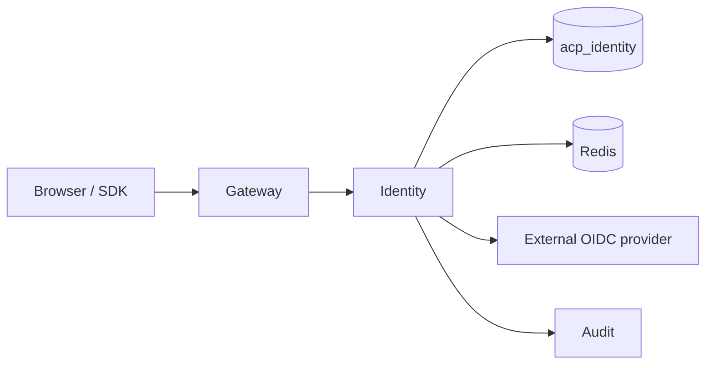

# Identity

*The source of truth for who is calling Aegis. Issues JWTs, manages user accounts, owns SSO, provisions agent credentials, and holds the tenant configuration that every other service reads.*

## Business purpose

Every request that enters Aegis carries a JWT. Every JWT must have been issued by exactly one place. That place is the Identity service. It exists as its own service so:

- **One signing authority.** The HS256 key is held only by Identity; downstream services trust JWTs without holding the signing material.
- **One user store.** Users, organizations, tenants, and agent credentials live in `acp_identity`. Other services hold references (`user_id`, `tenant_id`) but never replicate the user record.
- **One auth audit point.** Every login, refresh, revoke, and SSO event is emitted as an audit row by Identity before the JWT reaches the caller.

## Architecture



Identity is one of the two services that the gateway proxies almost transparently — most `/auth/*` and `/users/*` paths on the gateway are thin pass-throughs to Identity. The other thin-proxy target is the API service.

## Request flow

### Login (`POST /auth/login` via gateway `/auth/token`)

1. Gateway receives `{email, password}` plus `X-Tenant-ID`.
2. Forwards to `services/identity/router.py::login_user`.
3. Identity:
   - Looks up the user row by email.
   - Verifies the password with `bcrypt.checkpw` in a thread executor (CPU-bound).
   - Confirms `user.tenant_id == request_header_tenant_id`. Mismatch returns 401 `tenant_mismatch`.
   - Asserts `org_id == tenant_id` invariant via `sdk/common/invariants.py::assert_org_consistency`. A NULL `org_id` is a 500 — the platform refuses to issue a token for a corrupted account.
   - Issues a JWT via `services/identity/token_service.py::TokenService.issue` with claims `{sub, tenant_id, org_id, role, typ:"ACP_ACCESS", jti, iat, exp}`. Default TTL is 15 minutes.
   - Pushes an audit event `action="user_login"` via `services/identity/database/__init__.py::push_audit_event`.
   - Returns `{access_token, expires_in, tenant_id, role}` wrapped in `APIResponse`.
4. Gateway sets `acp_token` HTTPOnly cookie (for browsers) and also returns the token in the body (for SDKs).

### Agent token (`POST /auth/token` via gateway `/auth/agent/token`)

Agents authenticate with `agent_id` + `secret` (never with email + password). The flow is the same as user login but goes through `services/identity/router.py::login_agent`, looks up `agent_credentials`, and mints a JWT with `role: "agent"`.

### SSO (`/auth/sso/{provider}` and `/auth/sso/{provider}/callback`)

Identity acts as the OIDC relying party. `services/identity/oidc.py` implements the auth-code flow:

1. UI hits `/auth/sso/{provider}` — Identity redirects to the IdP.
2. IdP redirects back to `/auth/sso/{provider}/callback` with a code.
3. Identity exchanges the code for an ID token.
4. Maps the IdP's claims to a tenant + role via `acp:sso_config:{tenant_id}` (Redis hash).
5. Creates or updates the user row.
6. Mints an Aegis JWT and returns it as a cookie + redirect.

## Dependencies

**Python libraries:**

- `fastapi`, `sqlalchemy[asyncio]`, `asyncpg`, `pydantic`.
- `bcrypt` — password hashing.
- `python-jose` — JWT encode/decode.
- `authlib` (OIDC client) — for SSO flows.
- `redis.asyncio` — SSO config, JWT revocation, audit emission queue.

**Other Aegis services it calls:**

- Audit (`services/audit/`) — emits `user_login`, `agent_login`, `user_invite`, `user_disabled`, `sso_callback`, etc. via `push_audit_event` which XADDs to `acp:audit_events`.
- Registry (`services/registry/`) — `services/identity/registry_client.py` reads agent metadata when needed for token claims.

**Infrastructure:**

- Postgres `acp_identity`.
- Redis (db 0) for JWT revocation, SSO config, agent-cred caches.
- External OIDC providers (Google, Microsoft, Okta) when configured per tenant.

## Database tables

| Table | Purpose | Notable columns |
|---|---|---|
| `organizations` | Top-level org grouping | `id`, `name`, `created_at` |
| `tenants` | Tenant config + quotas | `id`, `tenant_id` (UNIQUE), `org_id`, `name`, `tier`, `rpm_limit`, `requests_per_second`, `burst`, `daily_request_cap`, `monthly_request_cap`, `daily_inference_cost_cap_usd`, `degraded_mode_policy`, `is_active` |
| `users` | Human users | `id`, `email` (UNIQUE), `hashed_password`, `role` (`ADMIN`/`SECURITY`/`AUDITOR`/`VIEWER`), `tenant_id`, `org_id`, `full_name`, `is_active`, `last_login`, `created_at`, `updated_at` |
| `agent_credentials` | Provisioned agent secrets | `id`, `agent_id`, `secret_hash`, `tenant_id`, `created_at`, `revoked_at` |

Indexes: `users.email` UNIQUE, `tenants.tenant_id` UNIQUE, `agent_credentials.agent_id` UNIQUE.

The `acp_identity` database is read-only from every other service's perspective. Even read access from Forensics or Compliance goes through the Identity API, not direct SQL.

## Redis usage

| Key pattern | Operation | Purpose | TTL |
|---|---|---|---|
| `acp:revoked_jti:{jti}` | GET / SET | Per-JTI revocation | Until JWT expiry |
| `acp:revoked_tokens:{sha256}` | SISMEMBER / SADD | Bulk revocation by token hash | Until JWT expiry |
| `acp:sso_config:{tenant_id}` (Hash) | HGETALL / HSET | SSO provider config | None |
| `acp:agent_cred_cache:{agent_id}` | GET / SET | Recently-validated agent secrets | 60 s |
| `acp:auth_semaphore` | SETNX | Concurrency limiter on login (bcrypt is CPU-bound) | 5 s |
| `acp:user_invite:{token}` | GET / SET | One-time invite tokens | 24 h |

## Security controls

- **Bcrypt with thread executor.** `bcrypt.checkpw` is CPU-bound and would block the event loop; Identity runs it in `asyncio.run_in_executor` via `partial(bcrypt.checkpw, ...)`. Source: `services/identity/router.py:380-390`.
- **Concurrency limiter on login.** A semaphore caps concurrent password verifications to prevent CPU saturation under a credential-stuffing attack. The same limiter blocks SSO callbacks.
- **Per-IP failed-login counter.** `acp:auth_fail:{ip}` with 5-minute TTL feeds rate-limiting decisions at the gateway.
- **Tenant binding on login.** `X-Tenant-ID` header is required AND must match `user.tenant_id`. Rejecting on mismatch closes a category of impersonation via a stolen password.
- **Invariant assertion on every login.** `assert_org_consistency` rejects accounts where `org_id != tenant_id`. The platform refuses to issue tokens for inconsistent rows.
- **Revoke without the token.** `POST /auth/revoke` accepts either a token or a JTI; either marks the token as revoked in Redis for the rest of its TTL.
- **SSO provider trust.** Each tenant's SSO config includes the IdP's discovery URL; the platform fetches public keys live for ID token verification. Cached for 1 hour.
- **No password storage anywhere else.** No other service holds `hashed_password`. Even the database backup from `acp_identity` is encrypted separately with `age` before leaving the host.

## Metrics

| Metric | Type | Labels | Purpose |
|---|---|---|---|
| `acp_identity_login_total` | Counter | `tenant_id`, `result` | Success / failure counts |
| `acp_identity_login_latency_seconds` | Histogram | `tenant_id` | Bcrypt + DB lookup |
| `acp_identity_token_issued_total` | Counter | `tenant_id`, `typ` | ACCESS / REFRESH issuance |
| `acp_identity_sso_callback_total` | Counter | `tenant_id`, `provider`, `result` | SSO outcomes |
| `acp_identity_user_invite_total` | Counter | `tenant_id`, `result` | Invite operations |
| `acp_identity_password_check_latency_seconds` | Histogram | none | Bcrypt time alone |
| `acp_identity_concurrent_logins` | Gauge | none | Current semaphore holders |

## Deployment model

- **Image**: `infra-identity` from `services/identity/Dockerfile`.
- **Container**: `acp_identity`.
- **Port**: 8002.
- **Replicas**: 1 per host (stateless beyond DB / Redis).
- **Healthcheck**: `GET /health`.
- **Env vars**: `DATABASE_URL`, `REDIS_URL`, `INTERNAL_SECRET`, `JWT_SECRET` (same as `INTERNAL_SECRET` today), `JWT_EXPIRY_SECONDS` (default 900), `AUTH_SEMAPHORE_SIZE` (default 50), `SSO_DISCOVERY_CACHE_TTL` (3600).
- **Resource footprint**: ~250 MB resident.

## API endpoints

| Method | Path | Auth | Description |
|---|---|---|---|
| POST | `/auth/login` | Public + `X-Tenant-ID` | User login (email + password) |
| POST | `/auth/token` | Public + `X-Tenant-ID` + `X-Internal-Secret` | Agent login (agent_id + secret) |
| POST | `/auth/logout` | Bearer | Revoke the current token |
| GET | `/auth/me` | Bearer | Current user |
| POST | `/auth/introspect` | Bearer | Token introspection |
| POST | `/auth/refresh` | Bearer | Refresh token |
| POST | `/auth/revoke` | Bearer + ADMIN/SECURITY | Force-revoke another token / JTI |
| POST | `/auth/users` | Bearer + ADMIN | Create user |
| POST | `/auth/credentials` | Bearer + ADMIN, plus `X-Internal-Secret` | Provision agent credentials |
| POST | `/auth/tenants` | Bearer + ADMIN (platform-admin flag) | Create a new tenant |
| GET | `/auth/tenants/{tenant_id}` | Bearer + same-tenant | Tenant configuration |
| GET | `/users` | Bearer + ADMIN | List users in tenant |
| POST | `/users/invite` | Bearer + ADMIN | Send invite |
| PATCH | `/users/{user_id}` | Bearer + ADMIN | Update user |
| DELETE | `/users/{user_id}` | Bearer + ADMIN | Deactivate user |
| GET | `/auth/sso/providers` | Public | List enabled SSO providers |
| GET | `/auth/sso/{provider}` | Public | Start SSO flow |
| GET | `/auth/sso/{provider}/callback` | Public | OIDC callback |
| GET | `/auth/sso/config` | Bearer + ADMIN | Read SSO config |
| POST | `/auth/sso/config` | Bearer + ADMIN | Save SSO config |
| POST | `/auth/sso/config/test` | Bearer + ADMIN | Test connectivity |

## Example requests

### Log in (the same as Quickstart)

```bash
curl -sS -X POST https://dev.aegisagent.in/auth/token \
  -H "Content-Type: application/json" \
  -H "X-Tenant-ID: 00000000-0000-0000-0000-000000000001" \
  -d '{"email":"admin@acp.local","password":"REDACTED"}'
```

### Create a new user (ADMIN only)

```bash
curl -sS -X POST https://dev.aegisagent.in/auth/users \
  -H "Authorization: Bearer $TOKEN" \
  -H "X-Tenant-ID: 00000000-0000-0000-0000-000000000001" \
  -H "Content-Type: application/json" \
  -d '{
    "email":"alice@example.com",
    "password":"REDACTED",
    "role":"SECURITY",
    "tenant_id":"00000000-0000-0000-0000-000000000001",
    "org_id":"00000000-0000-0000-0000-000000000001"
  }'
```

### Provision an agent credential

```bash
curl -sS -X POST https://dev.aegisagent.in/auth/credentials \
  -H "Authorization: Bearer $TOKEN" \
  -H "X-Tenant-ID: 00000000-0000-0000-0000-000000000001" \
  -H "X-Internal-Secret: $INTERNAL_SECRET" \
  -H "Content-Type: application/json" \
  -d '{"agent_id":"<uuid>","secret":"a-32-char-random-string"}'
```

## Troubleshooting

| Symptom | Likely cause | Where to look |
|---|---|---|
| 401 `Invalid credentials or tenant mismatch` after password reset | Password reset wrote to a different tenant's user row | Verify `tenant_id` of the user vs the X-Tenant-ID header |
| 500 `inconsistent account metadata` | A user row has `org_id IS NULL` | Run a one-off fix: `UPDATE users SET org_id = tenant_id WHERE org_id IS NULL` |
| SSO callback fails silently | IdP discovery URL unreachable from the EC2 | `curl` the discovery URL from inside `acp_identity` |
| Login latency p99 > 1s | Bcrypt thread pool saturated under credential stuffing | Lower `AUTH_SEMAPHORE_SIZE`, raise rate-limit RPS |
| JTI revoke doesn't stop token | Revocation cached in gateway LRU; force-broadcast via `acp:revoked_jti:{jti}` | The gateway clears its in-process cache on the broadcast |
| Forgot password flow missing | Not built — production deployments wire SSO instead | Roadmap item |
| `acp_identity_password_check_latency_seconds` p95 > 200ms | Underprovisioned CPU | Move identity container to a host with more cores |

## Production considerations

- **JWT TTL is short.** 15 minutes is the default. Long-lived tokens accumulate risk; short ones force frequent refresh which is fine for browsers (cookie-based) and SDKs (built into the client).
- **Tenant-binding on the user row.** A user belongs to exactly one tenant today. Multi-tenant users are a future enhancement; the data model would need a `user_tenants` join table.
- **Password policy is per-tenant.** Stored on `tenants.password_policy_json` (planned; today defaults to "at least 8 chars, not in the breach list").
- **SSO is the recommended production path.** Local passwords work for demos and small teams; SSO scales to enterprises.
- **No password reset email today.** Tenants on SSO don't need it; non-SSO tenants need an admin to invoke `PATCH /users/{id}` with `reset=true`.
- **Tenants table is the config seam.** Every quota, every limit, every per-tenant policy lives on the tenant row. Other services read it via Identity; Identity caches in Redis for 60 seconds to keep the row from becoming a hot spot.
- **No multi-region replication today.** RDS handles failover within a region; cross-region is on the roadmap.

## Next

- [Gateway](gateway.md) — the caller for every Identity route
- [Multi-Tenancy](../architecture/multi-tenancy.md) — how the tenant_id from this service propagates everywhere
- [RBAC roles](../security/rbac-roles.md) — the role matrix this service mints into JWTs
- [JWT auth](../security/jwt-auth.md) — the validation contract
- [User Management UI](../ui/settings/user-management.md) — what the human-facing flows look like
