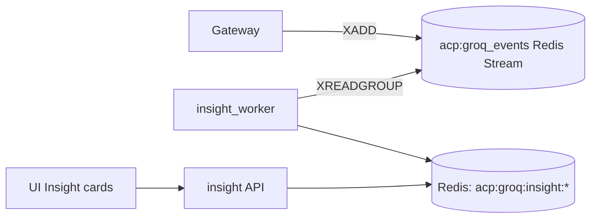

# Insight

*Asynchronous LLM enrichment of decision events. Every decision the platform makes can be optionally fed into a smaller summarizer model that produces a human-readable explanation for SOC analysts, surfaced in the UI as "Insight" cards.*

## Business purpose

A signed audit row is unambiguous but terse: `findings: ["destructive_sql"], decision: "deny"`. An analyst triaging an alert wants more context: "what was the intent of this call, why did it match this finding, is this consistent with the agent's recent pattern."

Insight produces that context. It runs *after* the decision has been recorded, so it never affects whether an action is allowed or denied. It exists as its own service because:

- **LLM calls are slow and expensive.** Keeping them out of the hot path is non-negotiable.
- **Insights are best-effort.** A failure means the UI shows the raw audit row without an explanation. The platform keeps working.
- **The model can be swapped.** Today it uses Groq's smaller LLM; tomorrow it could be a local vLLM. Encapsulating in one service keeps that change local.

## Architecture



Two processes: a worker (`insight_worker`) that drains the Redis stream and an HTTP service (`insight`) that serves the resulting cards back to the UI via the gateway's `/insights/*` proxy.

## Request flow

### Emit (from gateway)

1. After every `/execute` decision, the gateway calls `services/gateway/main.py::_emit_groq_event`.
2. Pushes a record `{event_id, tenant_id, agent_id, tool_name, decision, findings, payload_shape}` onto `acp:groq_events` via XADD.
3. The XADD has a 0.25-second timeout — slow Redis doesn't stall the gateway.

### Enrich (worker)

1. Worker process XREADGROUP-s from `acp:groq_events`.
2. For each event, builds a prompt from a template at `services/insight/main.py`.
3. Calls Groq with the small model (configured by `GROQ_MODEL_FAST`, e.g. `llama-3.1-8b-instant`).
4. Stores the response as `acp:groq:insight:{event_id}` with a 24-hour TTL.
5. Appends to a ZSET `acp:groq:insights:timeline` scored by timestamp, for recent-first listing.
6. XACK-s the stream entry.

### Read (UI)

1. UI calls `GET /insights/recent`.
2. Gateway proxies to `services/insight/main.py::list_recent`.
3. Handler returns the most recent insights from the ZSET, fetching each insight body from its `acp:groq:insight:{event_id}` key.

## Dependencies

**Python libraries:**

- `fastapi`, `pydantic`.
- `redis.asyncio` — the stream + ZSET + per-event store.
- `groq` (Groq Python client).
- `structlog`.

**Other Aegis services:**

- Audit — read-only reference when the insight needs the canonical audit row content.

**Infrastructure:**

- Redis only. No Postgres.
- Groq API (or any OpenAI-compatible endpoint).

## Database tables

*The insight service does not own any tables.*

Insights are ephemeral (24-hour TTL). The audit row is the durable record; the insight is a generated explanation layered on top.

## Redis usage

| Key pattern | Operation | Purpose | TTL |
|---|---|---|---|
| `acp:groq_events` (Stream) | XADD / XREADGROUP / XACK | Inbound event queue | Untrimmed |
| `acp:groq:insight:{event_id}` | SET / GET | Per-event insight JSON | 24 hours |
| `acp:groq:insights:timeline` (ZSET) | ZADD / ZREVRANGEBYSCORE | Recent-first listing | None — pruned to last 10,000 entries by the worker |
| `acp:groq:insights:by_agent:{agent_id}` (List) | LPUSH | Per-agent recent insights | 24 hours |
| `acp:groq:rate_limit:{tenant_id}` | INCR / EXPIRE | Per-tenant Groq budget | 1 hour |

## Security controls

- **Tenant scoping.** Every insight key carries `tenant_id`; ZRANGE-based listings filter by `tenant_id`.
- **PII redaction before prompt.** The prompt template never includes raw payload content. The audit row's `findings` and `metadata.diagnostic_flags` carry the structured signals; the raw payload is hashed.
- **Per-tenant rate limit.** A tenant that generates too many enrichments per hour hits a Redis-backed cap and the worker temporarily skips their events (audit row still written).
- **No model output in the audit chain.** Insights are not signed and never enter the audit chain — they are explanatory, not authoritative.
- **API-key vault.** The Groq API key lives only in environment variables and never in the database or logs.

## Metrics

| Metric | Type | Labels | Purpose |
|---|---|---|---|
| `acp_insight_events_consumed_total` | Counter | `tenant_id`, `result` | Worker throughput |
| `acp_insight_event_latency_seconds` | Histogram | none | LLM round-trip time |
| `acp_insight_stream_depth` | Gauge | none | Backlog size |
| `acp_insight_rate_limited_total` | Counter | `tenant_id` | When a tenant exceeded their Groq budget |
| `acp_insight_dlq_size` | Gauge | none | Failed enrichments |

## Deployment model

- **Image**: `infra-insight` from `services/insight/Dockerfile`. The image embeds both the HTTP server and the worker; entrypoint chooses one or the other.
- **Containers**: `acp_insight` (HTTP) and `acp_insight_worker` (worker).
- **Port**: HTTP serves on internal 8014 (no public port); worker exposes nothing.
- **Replicas**: 1 of each.
- **Healthcheck**: HTTP `GET /health`; worker has no HTTP healthcheck — Prometheus monitors the consumer-group lag.
- **Env vars**: `REDIS_URL`, `INTERNAL_SECRET`, `GROQ_API_KEY`, `GROQ_MODEL_FAST` (default `llama-3.1-8b-instant`), `INSIGHT_RATE_LIMIT_PER_HOUR` (default 1000).

The Groq API key is provided via env; the doc does not state the secret value. Rotate the key via the deploy pipeline.

## API endpoints

| Method | Path | Auth | Description |
|---|---|---|---|
| GET | `/insights/recent` | AUDITOR+ (internal-secret on the service itself) | Recent insights for the tenant |
| GET | `/insights/{event_id}` | AUDITOR+ | Single insight by event id |
| GET | `/insights/by-agent/{agent_id}` | AUDITOR+ | Recent insights for one agent |

## Example requests

### Recent insights

```bash
curl -sS "https://ha.aegisagent.in/insights/recent?limit=10" \
  -H "Authorization: Bearer $TOKEN" \
  -H "X-Tenant-ID: 00000000-0000-0000-0000-000000000001" \
  | jq '.data.items[] | { event_id, agent, finding, summary }'
```

### One insight by event id

```bash
curl -sS https://ha.aegisagent.in/insights/$EVENT_ID \
  -H "Authorization: Bearer $TOKEN" \
  -H "X-Tenant-ID: 00000000-0000-0000-0000-000000000001" \
  | jq '.data.summary'
```

## Troubleshooting

| Symptom | Likely cause | Where to look |
|---|---|---|
| Insights empty in UI | Worker not consuming OR rate-limited | Check `acp_insight_stream_depth` and `acp_insight_rate_limited_total` |
| `acp_insight_stream_depth` rising | Worker slow or Groq API outage | Inspect `acp_insight_worker` logs |
| Insights for a specific event missing | The event hit the rate limit and was skipped | Expected when over budget; tune `INSIGHT_RATE_LIMIT_PER_HOUR` |
| Insight content doesn't match audit row | Stale insight from a previous incarnation of the rule | Invalidate the key for the event; worker re-runs |
| Groq returns error 401 | API key rotated but env not redeployed | Redeploy `acp_insight_worker` with the new key |
| Memory pressure on Redis | ZSET grew unbounded | Worker prunes to last 10,000 entries; verify the prune job ran |

## Production considerations

- **Insight is not in the security path.** A complete Insight outage degrades UI explanations but does not affect decision-making, audit, or billing.
- **Rate limits exist to bound spend.** Groq is fast and cheap but not free. The per-tenant cap is a deliberate control.
- **The 24-hour TTL is intentional.** Insights are aged out because the audit row is the durable record. Long-term archives belong in the audit chain.
- **Multiple workers are safe but not necessary.** Consumer groups serialize per-message processing; adding workers helps only at very high decision throughput.
- **Prompt engineering is platform-managed.** Customers cannot customize prompt templates today. A "custom insights" feature is roadmap.
- **The current production demo has Redis streams empty (XLEN=0) for both `acp:groq_events` and `acp:audit_events`** — workers are fully caught up.

## Next

- [Learning](learning.md) — cross-agent behavior intelligence + drift detector that consumes the same data
- [Decision](decision.md) — the upstream emitter
- [Audit](audit.md) — the durable record this layer explains

The `acp:groq_events` Redis Stream is written by the gateway middleware
(`services/gateway/middleware.py::_emit_groq_event`). The historical
standalone `groq_worker` container was removed in 2026-05-29;
`insight_worker` is the surviving consumer.
