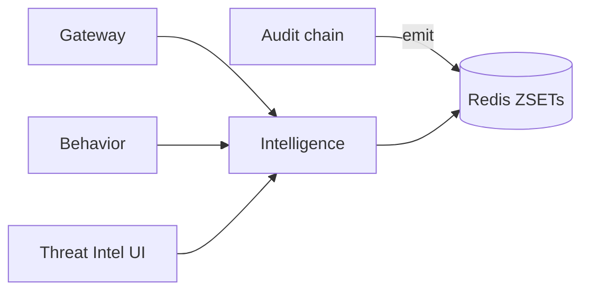

# Intelligence

*Cross-agent and cross-tenant correlation. Looks at the recent behavior of every agent in the platform, finds patterns that span more than one agent, and surfaces "coordinated campaign" alerts to the SOC.*

## Business purpose

Single-agent anomaly detection is a solved problem at this point — that's what the behavior firewall (stage 5) does. The harder question is: when an attacker uses prompt injection on agent A in tenant X, then leverages a stolen API key for agent B in tenant Y, then uses agent C in tenant Z to exfiltrate the result, no single agent looks anomalous in isolation.

The Intelligence service exists to catch that. It maintains running correlation windows across all agents and emits a `coordinated_campaign` signal when multiple agents in the same hour fire similar findings from different tenants or from different request shapes.

Three reasons it's its own service:

- **Cross-tenant computation requires platform-scope authority.** Per-tenant services are deliberately blind to other tenants; Intelligence intentionally is not.
- **The state is small.** The signal store is a handful of Redis ZSETs, not a database. The service has no Postgres.
- **It is read-by-everything.** Decision Engine at stage 6 reads the intelligence signal as one of its five inputs. Keeping it as a tiny Redis-only service keeps that read fast.

## Architecture



Intelligence is consulted by the Behavior service (during sub-signal computation) and by the Decision Engine (as a top-level signal). It writes to Redis windows whenever the audit chain produces a finding.

## Request flow

### Update (post-decision)

1. After every audit row, the audit outbox worker calls `IntelligenceService.record_finding(tenant_id, agent_id, finding, request_hash)`.
2. The service:
   - ZADDs `(timestamp, agent_id)` to `acp:intel:finding:{finding_name}` (a global, cross-tenant ZSET).
   - ZADDs `(timestamp, request_hash)` to `acp:intel:request_shape:{request_hash}` (a global ZSET of similar request shapes).
   - Both ZSETs are scored by timestamp; old entries are trimmed to a one-hour window.

### Query (consulted by Behavior or Decision)

1. Caller asks `IntelligenceService.get_correlation_signal(agent_id, finding, request_hash)`.
2. Service:
   - Counts other agents (in any tenant) that fired the same finding in the last hour.
   - Counts other tenants whose agents matched the same request_hash in the last hour.
   - Returns a structured signal `{coordinated_risk: 0..1, anomaly_frequency: int, peer_count: int}`.

### Public read (Threat Intel UI)

The `/threat-intel/summary` endpoint exposed via the gateway provides:

- A cross-tenant top-finding list for the last hour.
- A coordinated-campaign alert count for the day.
- A per-tenant breakdown of the tenant's own contribution to the cross-tenant view (so tenants see their share of the signal).

## Dependencies

**Python libraries:**

- `fastapi`, `pydantic`.
- `redis.asyncio`.
- `structlog`.

**Other Aegis services:**

- Audit (outbox worker) — caller of `record_finding`.
- Behavior — consumer of the correlation signal.
- Decision — consumer at stage 6.

**Infrastructure:**

- Redis only.

## Database tables

*The intelligence service does not own any tables.*

All state lives in Redis. The reasoning: the data is naturally time-windowed (one-hour rolling), the consumers want sub-millisecond reads, and Postgres adds nothing here.

## Redis usage

| Key pattern | Operation | Purpose | TTL |
|---|---|---|---|
| `acp:intel:finding:{finding_name}` (ZSET) | ZADD / ZREVRANGEBYSCORE / ZREMRANGEBYSCORE | Cross-tenant timeline of which agents fired which finding | None — trimmed by service to last 1 hour |
| `acp:intel:request_shape:{shape_hash}` (ZSET) | ZADD / ZRANGEBYSCORE | Cross-tenant timeline of similar request shapes | Trimmed to last 1 hour |
| `acp:intel:tenant_findings:{tenant_id}` (ZSET) | ZADD | Per-tenant view of own contribution | Trimmed to last 24 hours |
| `acp:intel:campaign:{campaign_id}` (Hash) | HSET / HGETALL | A detected campaign with its constituent agents and findings | 24 hours |
| `acp:intel:rate_limit` | INCR / EXPIRE | Bounds compute under high audit throughput | 1 hour |

## Security controls

- **Cross-tenant reads are aggregated, never raw.** The signal returned to callers contains counts and risk scores, never agent_ids or tenant_ids belonging to other tenants. Source: `services/intelligence/service.py::IntelligenceService.get_correlation_signal`.
- **Opt-out is per-tenant.** A tenant that disables cross-tenant intelligence at `tenants.behavior_cross_tenant_enabled=false` has their findings excluded from the global ZSETs and also receives no signal back.
- **Minimum quorum for correlation.** Default `MIN_AGENTS_FOR_CORRELATION=2`. A single agent firing a finding does not produce a campaign alert; two or more agents in unrelated tenants do.
- **No raw payloads stored.** Findings are platform-canonical strings; request shapes are hashes; nothing user-visible enters the ZSETs.
- **The service has no public write API.** Writes happen only from `record_finding`, called by trusted internal code.

## Metrics

| Metric | Type | Labels | Purpose |
|---|---|---|---|
| `acp_intelligence_findings_recorded_total` | Counter | `finding_name` | Throughput of incoming records |
| `acp_intelligence_correlation_signals_emitted_total` | Counter | `signal_type` | When the cross-tenant view fired a signal |
| `acp_intelligence_query_latency_seconds` | Histogram | none | Read latency |
| `acp_intelligence_campaigns_detected_total` | Counter | `severity` | Campaigns surfaced to SOC |
| `acp_intelligence_redis_zset_size` | Gauge | `zset_key` | Per-ZSET size for capacity planning |

## Deployment model

The intelligence "service" is a small Python module embedded in the audit and gateway containers; it does not run as a standalone container today. The implementation lives in `services/intelligence/service.py` and is imported by:

- `services/audit/outbox_worker.py` — to call `record_finding` after writing each audit row.
- `services/decision/router.py` — to pull the correlation signal during decision synthesis.
- `services/api/router/threat_intel.py` — to power the Threat Intel UI summary.

A future split-out is on the roadmap; the contract is stable today.

## API endpoints

| Method | Path | Auth | Backed by | Description |
|---|---|---|---|---|
| GET | `/threat-intel/summary` | AUDITOR+ | api → intelligence | Aggregate signal counts for the tenant |
| POST | `/threat-intel/ip` | AUDITOR+ | api | Enrich an IP via external threat-intel (separate from Intelligence) |
| POST | `/threat-intel/domain` | AUDITOR+ | api | Enrich a domain |

The `/threat-intel/summary` route returns the platform's own intelligence view; the `/ip` and `/domain` enrichments call external services (Shodan, AbuseIPDB) and are unrelated to the Intelligence module.

## Example requests

### Tenant's cross-tenant signal summary

```bash
curl -sS https://dev.aegisagent.in/threat-intel/summary \
  -H "Authorization: Bearer $TOKEN" \
  -H "X-Tenant-ID: 00000000-0000-0000-0000-000000000001" \
  | jq '{ campaigns: .data.campaigns, top_findings: .data.findings[:5] }'
```

### Enrich a suspicious IP from an audit row's metadata

```bash
curl -sS -X POST https://dev.aegisagent.in/threat-intel/ip \
  -H "Authorization: Bearer $TOKEN" \
  -H "X-Tenant-ID: 00000000-0000-0000-0000-000000000001" \
  -H "Content-Type: application/json" \
  -d '{"ip":"203.0.113.42"}'
```

## Troubleshooting

| Symptom | Likely cause | Where to look |
|---|---|---|
| `/threat-intel/summary` returns zeros for a busy tenant | Cross-tenant opt-out is true | Inspect `tenants.behavior_cross_tenant_enabled` |
| Coordinated-campaign alerts firing constantly | `MIN_AGENTS_FOR_CORRELATION` too low | Tune up in `services/intelligence/service.py` constants |
| Redis memory pressure | ZSETs not trimming | Force a trim via Redis CLI: `ZREMRANGEBYSCORE acp:intel:finding:* -inf <one_hour_ago>` |
| `acp_intelligence_query_latency_seconds` p95 > 50ms | ZSET cardinality very high | Add more aggressive trimming; consider sharding by hash mod N |
| Stale campaign in UI | Campaign hash TTL expired but Redis hash hadn't cleared | Restart `acp_api` to force a cache refresh |

## Production considerations

- **The service is intentionally lossy.** A one-hour rolling window is the trade-off between detection latency and Redis memory. Longer windows would catch slower campaigns but bloat ZSET sizes.
- **The cross-tenant view is the platform's value-add.** A solo deployment with one customer derives no benefit; the value grows with tenant count.
- **Opt-out preserves privacy.** A tenant that disables cross-tenant participation can still detect their own campaigns via the behavior firewall; they just don't see other tenants' contributions.
- **Compute scales with audit throughput.** At ~10,000 decisions/hour platform-wide, the ZSETs hold ~10,000 entries each. At 1M/hour, they hold 1M each. Memory is the binding constraint; the CPU cost of `ZADD` is constant.
- **Campaign detection thresholds are conservative.** Default settings emphasize precision over recall; SOC analysts prefer fewer false positives.
- **No public ML model.** The detection is rule-based: "count of agents firing this finding in this hour from disjoint tenants > threshold." Reproducible, auditable, no model drift.

## Next

- [Behavior](behavior.md) — the per-agent consumer of the correlation signal
- [Decision](decision.md) — the stage 6 consumer
- [Threat Intel UI](../ui/settings/threat-intel.md) — the human surface
- [Audit](audit.md) — the source of findings the intelligence layer watches
