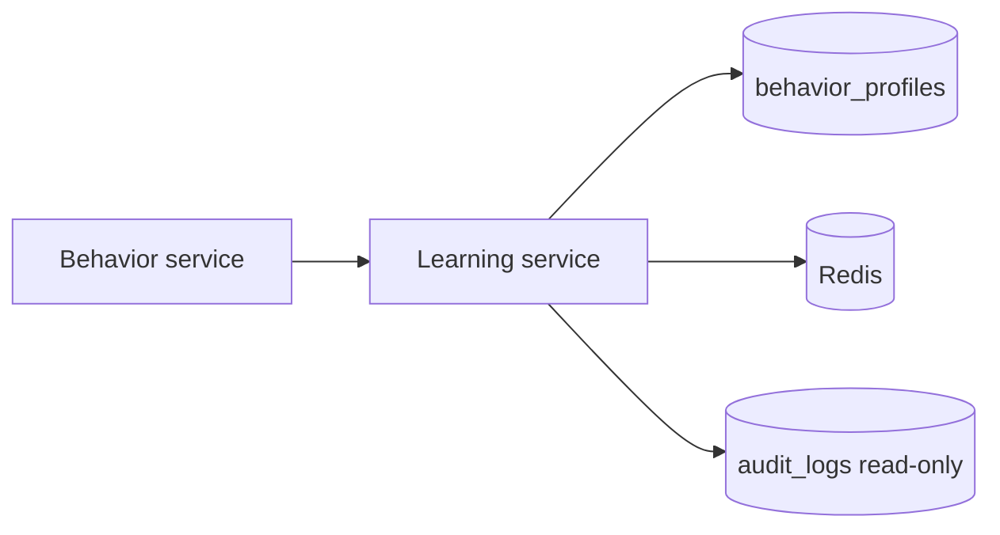

# Learning

*The adaptive behavior firewall engine. Builds probabilistic baselines of every agent's request shape and emits anomaly scores when an incoming call falls outside the expected distribution. The math behind the per-agent baselines that the Behavior service uses at stage 5.*

## Business purpose

The Behavior service exposes the stage-5 scoring API. The Learning service is the math behind it — the part that builds the baseline an agent's behavior is compared against.

Two responsibilities:

- **Baseline construction.** Maintain a probabilistic profile per agent (sequence frequencies, velocity percentiles, cost distribution, peer fingerprint).
- **Adaptive scoring.** When a new event arrives, compute `P(event | baseline)` and emit a finding if the probability is below a threshold.

It exists as its own module because the math evolves independently of the HTTP surface. Today the API is in the Behavior service and the math is in the Learning module; tomorrow they could split, and only the import path would change.

## Architecture



Behavior calls into Learning for scoring; Learning reads audit data to build baselines and writes them back to `behavior_profiles`.

## Request flow

### Score (synchronous)

1. `LearningService.score_event(profile, event)` is called.
2. Computes:
   - **Tool transition probability** — from `profile.tool_sequence_signatures`.
   - **Velocity quantile** — where in the agent's hourly distribution does this hour's call rate fall.
   - **Cost outlier** — z-score of this call's estimated cost vs the agent's distribution.
   - **Peer divergence** — how the event compares to other agents of the same role.
3. Combines via Laplace-smoothed log-likelihood; clamps to [0, 1].
4. Returns `LearningResult(anomaly_score, components, finding_codes)`.

### Baseline refresh (background)

1. Worker iterates over agents whose `last_refreshed_at` is older than 24 hours.
2. For each agent:
   - Reads the last 7 days of audit rows for that agent (`MIN_OBSERVATIONS_FOR_BASELINE=100`; agents below the floor get a "thin" profile).
   - Computes new histograms, transition matrices, peer fingerprint.
   - `UPDATE behavior_profiles SET ...` in one transaction.

## Dependencies

**Python libraries:**

- `numpy` — histograms and percentiles.
- `scipy.stats` — distribution fitting and z-scores.
- `sqlalchemy[asyncio]`, `asyncpg` — for `behavior_profiles` and the audit read.
- `redis.asyncio` — short-term cache of baselines.
- `structlog`.

**Other Aegis services:**

- Audit (read-only DSN) — the source of training data.
- Behavior — the consumer.

**Infrastructure:**

- Postgres `acp_learning` (where the alembic migrations land; in practice `behavior_profiles` is shared with the behavior service).
- Read-only access to `acp_audit`.

## Database tables

| Table | Purpose | Notable columns |
|---|---|---|
| `behavior_profiles` | Per-agent rolling baseline | `agent_id` (UNIQUE per tenant), `tenant_id`, `window_days`, `tool_sequence_signatures` (JSONB), `velocity_percentiles` (JSONB), `cost_distribution` (JSONB), `peer_fingerprint` (JSONB), `observation_count`, `last_refreshed_at` |

Indexes: `(tenant_id, agent_id)` UNIQUE.

A second table `learning_anomaly_history` is reserved for future use but not in the current schema.

## Redis usage

| Key pattern | Operation | Purpose | TTL |
|---|---|---|---|
| `acp:learning_profile:{agent_id}` | GET / SETEX | Cached profile for hot-path score | 1 hour |
| `acp:learning_baseline_refresh_lock:{agent_id}` | SETNX | Single-writer for baseline refresh | 5 minutes |
| `acp:learning_thin_profile:{tenant_id}` | GET / SETEX | Tenant-level default for agents below the observation floor | 24 hours |

## Security controls

- **Tenant scoping.** All profiles are tenant-scoped; learning never trains a baseline across tenants.
- **Minimum observation floor.** Agents with fewer than 100 audit rows in the window get a tenant-level default profile rather than a thin individual baseline. Prevents over-fitting on noise.
- **Read-only audit access.** The learning module has SELECT only on `audit_logs`.
- **Audit emission on threshold changes.** Tuning `ANOMALY_THRESHOLD` or `DRIFT_THRESHOLD` produces an audit row so operators see when sensitivity was changed.

## Metrics

| Metric | Type | Labels | Purpose |
|---|---|---|---|
| `acp_learning_score_latency_seconds` | Histogram | `tenant_id` | Per-event scoring time |
| `acp_learning_baseline_refresh_total` | Counter | `tenant_id`, `result` | Refresh outcomes |
| `acp_learning_baseline_refresh_latency_seconds` | Histogram | `tenant_id` | Refresh time |
| `acp_learning_thin_profile_used_total` | Counter | `tenant_id`, `agent_id` | When the floor fired |
| `acp_learning_anomalies_emitted_total` | Counter | `tenant_id`, `finding` | Anomalies emitted |

## Deployment model

The learning module runs **inside** the Behavior container today. It is not a separate container.

- **Code location**: `services/learning/`.
- **Imported by**: `services/behavior/router.py::score_behavior`.
- **Env vars used (shared with Behavior)**: `DATABASE_URL` (read DSN to `acp_audit`), `BEHAVIOR_DATABASE_URL` (write DSN to `behavior_profiles`), `REDIS_URL`, `ANOMALY_THRESHOLD` (default 0.01 — P < 1% is rare), `DRIFT_THRESHOLD` (default 0.4), `MIN_OBSERVATIONS_FOR_BASELINE` (default 100), `LAPLACE_SMOOTHING` (default 0.1).

A future split-out into a standalone `acp_learning` container is possible without API changes; only the import path moves.

## API endpoints

*No public HTTP endpoints.* The Learning service is consumed as a Python module by Behavior.

For observability, the following metrics endpoints surface its state through the Behavior service:

- `GET /behavior/profile/{agent_id}` returns the underlying learning profile.
- `POST /behavior/profile/{agent_id}/refresh` triggers a manual baseline refresh.

## Example requests

### Read an agent's current baseline

```bash
curl -sS https://dev.aegisagent.in/behavior/profile/$AGENT_ID \
  -H "Authorization: Bearer $TOKEN" \
  -H "X-Tenant-ID: 00000000-0000-0000-0000-000000000001" \
  | jq '{ observation_count, last_refreshed_at, tool_sequence_top: .tool_sequence_signatures | to_entries | sort_by(-.value) | .[:5] }'
```

### Force a refresh after onboarding a new tool

```bash
curl -sS -X POST https://dev.aegisagent.in/behavior/profile/$AGENT_ID/refresh \
  -H "Authorization: Bearer $TOKEN" \
  -H "X-Tenant-ID: 00000000-0000-0000-0000-000000000001"
```

## Troubleshooting

| Symptom | Likely cause | Where to look |
|---|---|---|
| All agents flagged anomalous | Baseline missing or too thin | `acp_learning_thin_profile_used_total` rising |
| Scores stuck at 0 | Cache holding a placeholder profile | Force-refresh the agent |
| Baseline never refreshes | Refresh lock held by a dead worker | Clear `acp:learning_baseline_refresh_lock:{agent_id}` if older than 5 minutes |
| Audit read DSN errors | Read replica unavailable | Failback to primary at the DSN level |
| `MIN_OBSERVATIONS_FOR_BASELINE` always trips for production agents | Tenant has fewer than 100 calls per agent per 7 days | Lower the floor for thin tenants OR aggregate across similar agents |

## Production considerations

- **Math is interpretable.** Each anomaly score decomposes into named components (tool transition, velocity, cost, peer divergence). Operators can answer "why is this score 0.8" in one query.
- **No deep learning model on the hot path.** The scoring is closed-form and runs in well under a millisecond. Adding a neural model would push stage 5 over the platform's latency budget.
- **Baselines are 7-day rolling.** A long-running campaign that drifts the baseline gradually would be missed; the drift_signals table catches the drift itself as a separate signal.
- **Thin profiles are explicit.** When the floor fires, the score is the tenant-level default, not a per-agent computation. The audit row records `thin_profile=true` so operators know.
- **Refresh cadence is 24 hours.** Faster cadences improve drift response at the cost of training noise; slower cadences are more stable but laggy.
- **Single-tenant only.** Learning never trains across tenants. Cross-tenant pattern correlation belongs to the Intelligence module, where the data model is intentionally cross-tenant.

## Next

- [Behavior](behavior.md) — the API that calls this module
- [Intelligence](intelligence.md) — the cross-tenant complement
- [Audit](audit.md) — the training data source
- [Behavioral firewall degraded mode](../security/threat-scenarios.md) — what happens when this is unreachable
