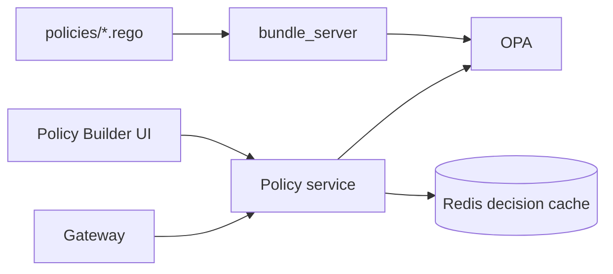

# Policy

*The Rego host. Every policy decision in Aegis runs as a Rego query against OPA. The Policy service is the place those Rego rules live, where they are simulated and tested before activation, and where the OPA bundle they form is built and served.*

## Business purpose

The Decision Engine at stage 6 of the gateway pipeline only combines signals. The actual *rules* — "deny destructive SQL on production", "block emails to unapproved domains", "no path traversal in any tool name" — live in Rego files under `services/policy/policies/`. These files are the customer-facing surface of policy: they can be edited, simulated, tested, and pushed without code deploy.

The Policy service exists to:

- **Wrap OPA with auth, tenant scoping, and audit.** OPA itself is tenant-agnostic; Aegis layers tenant identity onto every Rego query.
- **Maintain a bundle.** OPA loads its policies from an HTTP bundle endpoint at start. The Policy service builds the bundle from the on-disk Rego files plus per-tenant overrides.
- **Cache policy decisions.** OPA evaluation is fast (~1ms) but the gateway caches identical-shape requests in Redis to shave off every millisecond from the hot path.
- **Provide simulate and test endpoints.** Authors need to know what a new rule does before deploying it. Simulate replays historical events; test runs unit tests on the rule itself.

## Architecture



OPA runs in its own container (`acp_opa`). The Policy service is the HTTP frontend that the gateway calls; `services/policy/opa_client.py` is the thin Python client that does the actual OPA HTTP call. The bundle server (`acp_bundle_server`) is a small Python HTTP server that exposes the compiled Rego files for OPA to pull on startup.

## Request flow

### Policy evaluation (the hot path)

1. Gateway computes a canonical request shape `(tenant_id, agent_id, tool_name, payload_fingerprint)`, hashes it.
2. Looks up `acp:policy_decision:{hash}` in Redis. Hit → return.
3. Miss → POST `services/policy/router.py::evaluate_policy` with the input.
4. Policy service POSTs to OPA at `http://opa:8181/v1/data/aegis/decision` with the input.
5. OPA evaluates the Rego rules in the bundle and returns `{ allow, deny[], rule_id?, severity? }`.
6. Policy service wraps the OPA result in `APIResponse` and adds metadata (`evaluated_at`, `bundle_revision`).
7. Gateway caches the response in Redis with TTL determined by the tenant tier (enterprise: 24h, premium: 1h, basic: 5m). The cache key intentionally excludes timestamps so identical requests within the window are answered instantly.

### Policy authoring

1. Author writes Rego in `policies/agent_policy.rego` or a per-tenant overlay.
2. Calls `POST /policy/upload` with the Rego text. Policy service validates syntax via OPA's parser endpoint.
3. Bundle server picks up the new file on its 60-second poll and rebuilds the bundle tarball.
4. OPA pulls the new bundle on its 60-second poll. The new rules are live on the next gateway request.

### Policy simulation

1. Author calls `POST /policy/simulate` with a draft rule plus a time window.
2. Policy service:
   - Fetches a sample of audit rows from the window from the audit service.
   - For each row, runs OPA with the draft policy loaded as an override.
   - Tallies how many would have been allowed vs denied under the draft.
3. Returns a side-by-side breakdown.

### Policy test

1. Author writes Rego unit tests (`*_test.rego`) alongside the policy.
2. Calls `POST /policy/test`.
3. Policy service runs `opa test` against the bundle and returns pass/fail per test.

## Dependencies

**Python libraries:**

- `fastapi`, `pydantic` — framework.
- `httpx` — OPA HTTP client.
- `redis.asyncio` — decision cache invalidation on bundle update.
- `structlog` — emit every policy decision (whether allow or deny) as a JSON log line.

**Other Aegis services:**

- Audit (`services/audit/`) — read for simulation; emit audit rows on policy changes via `push_audit_event`.

**Infrastructure:**

- OPA (`acp_opa` container, image `openpolicyagent/opa:latest-debug`).
- Bundle server (`acp_bundle_server`, plain `python -m http.server`).
- Redis for decision cache (under `acp:policy_decision:*`).

## Database tables

*The policy service does not own application tables.*

The policy files themselves are the durable state. They live in:

- `services/policy/policies/` — base policies shipped with the platform.
- A Postgres column on `tenants` (`tenants.custom_policy`) stores per-tenant Rego overlays. Updates are applied via `POST /policy/upload` and trigger a bundle rebuild.

Policy decisions are recorded in the audit chain, not in a policy-owned table.

## Redis usage

| Key pattern | Operation | Purpose | TTL |
|---|---|---|---|
| `acp:policy_decision:{request_hash}` | GET / SETEX | Decision cache | Tier: enterprise 86400s, premium 3600s, basic 300s |
| `acp:policy_bundle_revision` | GET / SET | Current bundle revision; bump invalidates the decision cache | None |
| `acp:policy_simulate:{job_id}` | GET / SET | In-flight simulation results | 1 h |

## Security controls

- **Tenant scoping inside Rego.** Every Rego rule receives `input.tenant_id`. Rules that reference other tenants are reviewed and rejected.
- **Bundle integrity.** OPA verifies the bundle signature on load (production deployments configure `signing` in OPA's config).
- **RBAC on upload.** `POST /policy/upload` requires `ADMIN` or `SECURITY` role at the gateway, enforced again here.
- **Syntax validation.** Bad Rego is rejected at upload time; OPA's parser is called before persistence.
- **Audit emission.** Every policy upload, every bundle rebuild, every simulation produces an audit row.
- **Hard-deny patterns are not user-editable.** Patterns under `services/policy/policies/default.rego` (path traversal, k8s prod-namespace deletion, etc.) ship with the platform and are not overridable by tenant Rego.
- **Critical-risk destructive-tool deny** (added 2026-06-13, `services/policy/policies/action_semantics_deny.rego`, package `acp.v1.agent`). When `input.agent.risk_level == "critical"` AND the tool name contains one of `{shell, sudo, rm, drop, delete, truncate, exec, sql}`, returns `allow=false`, `reason="Critical-risk agent attempted destructive tool"`, `risk_adjustment=0.85`. This rule is what the Live Demo page (`/live-demo`) relies on to produce its mixed allow/deny trace. The substring set is intentionally aligned with `rate_policy.rego`'s `destructive_tools` set so the two policies tell the same story. Update either and they drift; keep them in sync.
- **Action-content semantic deny** (added 2026-06-14 in the A1/v3-deep sprint, `services/policy/policies/action_semantics_deny.rego`, package `acp.v1.agent`). This is the rule file that turned generalisation from "100% on four scripted demos" into honest coverage. It denies on the *meaning* of the action, not on a substring match:
    - `_shell_destruction` — `rm -rf /`, `mkfs`, `dd if=… of=/dev/...`, fork bombs, in any quoting style
    - `_sql_ddl_destruction` — `DROP TABLE`, `TRUNCATE`, `DELETE FROM ... WHERE 1=1`, predicate-less `DELETE`/`UPDATE`
    - `_system_path_access` — `/etc/passwd`, `/etc/shadow`, `~/.ssh/id_*`, AWS credentials files
    - `_k8s_prod_destruction` (v3-deep) — `kubectl delete ns <prod-marker>` / `helm uninstall` aimed at any namespace name that contains a substring from the production markers list `{prod, production, customer, payments, billing, staging, live, mainnet}`. Dev/test namespaces are explicitly allowed so the rule does not over-deny.
    - `_pii_row_threshold_breached` (v3-deep) — bulk-PII export with a **risk-tunable** row threshold: `critical=0`, `high=100`, `medium=1000`, `low=10000`. Threshold is selected from `input.agent.risk_level`, falling back to `medium` if absent. SQL `LIMIT` is extracted by gateway middleware (`services/gateway/middleware.py`) before the request reaches OPA.
    - `_external_exfil` (v3-deep, A5) — `email.send` / `http.post` / `webhook.send` to any external domain (anything outside the tenant's allowlist) when the payload contains PII markers. The gateway extracts `k8s_namespace`, `row_limit`, and recipient domain ahead of OPA so the Rego stays declarative.

  The full reason-string table — `policy:semantic:shell_destruction`, `policy:semantic:k8s_prod_destruction`, `policy:semantic:pii_bulk_export_<level>`, etc. — is enumerated in [OPA Policies](../security/opa-policies.md#action_semantics_denyrego--r0--v3-deep). Like the other hard-deny patterns, this file is shipping-pinned and not overridable by tenant overlay.

## Metrics

| Metric | Type | Labels | Purpose |
|---|---|---|---|
| `acp_policy_evaluate_total` | Counter | `tenant_id`, `decision` | Allow vs deny throughput |
| `acp_policy_evaluate_latency_seconds` | Histogram | `tenant_id` | OPA query time |
| `acp_policy_cache_hit_total` | Counter | `tenant_id` | Redis cache hits |
| `acp_policy_cache_miss_total` | Counter | `tenant_id` | Cache misses |
| `acp_policy_bundle_rebuilds_total` | Counter | none | Bundle server rebuilds |
| `acp_policy_simulate_runs_total` | Counter | `tenant_id`, `result` | Simulations run |
| `acp_opa_unavailable_total` | Counter | `reason` | OPA HTTP errors |

## Deployment model

- **Policy service image**: `infra-policy` from `services/policy/Dockerfile`. Container: `acp_policy`. Port: 8003.
- **OPA image**: `openpolicyagent/opa:latest-debug`. Container: `acp_opa`. Port: 8181.
- **Bundle server image**: `python:3.11-slim` with `python -m http.server`. Container: `acp_bundle_server`. Port: 8182.
- **Env vars on the Policy service**: `REDIS_URL`, `INTERNAL_SECRET`, `OPA_URL` (`http://opa:8181`), `BUNDLE_SERVER_URL` (`http://bundle_server:8182`), `AUDIT_SERVICE_URL`.
- **OPA config**: mounted at `infra/opa/config.yaml`; pulls bundles from the bundle server on a 60-second poll.
- **Healthcheck**: `GET /policy/health/opa` does an end-to-end check (Policy → OPA `/health`).
- **Replicas**: 1.

## API endpoints

| Method | Path | Auth | Description |
|---|---|---|---|
| POST | `/policy/evaluate` | Internal only (gateway calls this) | Hot-path policy evaluation |
| POST | `/policy/simulate` | ADMIN / SECURITY | Replay a draft policy over historical events |
| POST | `/policy/test` | ADMIN / SECURITY | Run Rego unit tests |
| POST | `/policy/upload` | ADMIN / SECURITY | Persist a new or updated Rego file |
| POST | `/policy/execute` | Internal only | Final-execution proxy used by `/execute` at stage 8 |
| GET | `/policy/health/opa` | Public | Liveness of the OPA backend |

The gateway proxies `/policy/simulate`, `/policy/test`, `/policy/upload` for the UI; `/policy/evaluate` is internal-only (no gateway proxy).

## Example requests

### Simulate a draft rule over the last 24 hours

```bash
curl -sS -X POST https://ha.aegisagent.in/policy/simulate \
  -H "Authorization: Bearer $TOKEN" \
  -H "X-Tenant-ID: 00000000-0000-0000-0000-000000000001" \
  -H "Content-Type: application/json" \
  -d '{
    "policy_text": "package aegis.decision\ndeny[rule] { input.tool_name == \"db.query\"; regex.match(`(?i)\\bdrop\\b`, input.payload.query); rule := {\"id\":\"draft.deny.drop\",\"severity\":\"critical\"} }",
    "window_hours": 24
  }' | jq '{ total, would_allow, would_deny, would_have_blocked }'
```

### Run unit tests on the current bundle

```bash
curl -sS -X POST https://ha.aegisagent.in/policy/test \
  -H "Authorization: Bearer $TOKEN" \
  -H "X-Tenant-ID: 00000000-0000-0000-0000-000000000001" | jq '.data.results'
```

### Upload a new policy

```bash
curl -sS -X POST https://ha.aegisagent.in/policy/upload \
  -H "Authorization: Bearer $TOKEN" \
  -H "X-Tenant-ID: 00000000-0000-0000-0000-000000000001" \
  -H "Content-Type: application/json" \
  -d '{
    "name":"crm_email_domain_allow_list",
    "policy_text":"package aegis.decision\ndeny[rule] { input.tool_name == \"email.send\"; not domain_allowed(input.payload.to); rule := {\"id\":\"crm.deny.email_domain\",\"severity\":\"high\"} }\ndomain_allowed(addr) { ends_with(addr, \"@acme.com\") } domain_allowed(addr) { ends_with(addr, \"@example.com\") }"
  }'
```

### Health-check OPA

```bash
curl -sS https://ha.aegisagent.in/policy/health/opa
```

## Troubleshooting

| Symptom | Likely cause | Where to look |
|---|---|---|
| Stage 4 latency spikes | OPA bundle being rebuilt; cache misses surge | `acp_policy_cache_miss_total` rate; wait for cache warm-up |
| `/policy/upload` returns 400 syntax error | Bad Rego | OPA returns the line and column |
| Policy denies that should allow | OPA bundle is stale | Force-reload: `POST /policy/upload` with the current text bumps the revision |
| `/policy/simulate` times out | Window too large; the audit-row scan is expensive | Reduce window to 1–6 hours and re-run |
| `acp_opa_unavailable_total` rising | OPA container restarting or networking issue | `docker logs acp_opa`; check `/policy/health/opa` |
| Decision cache not invalidating after policy change | Bundle revision didn't bump | Inspect `acp:policy_bundle_revision`; manually bump and retry |
| Hard-deny rule disabled | An overly broad tenant overlay shadowed it | Hard-deny rules in `default.rego` should always be enforced; if shadowed, file an issue |

## Production considerations

- **OPA is a synchronous dependency.** If OPA is down, stage 4 fails. The gateway treats OPA unavailability as a soft signal (records `policy_unavailable`) and lets the Decision Engine decide based on the remaining signals plus the tenant's `degraded_mode_policy`.
- **Cache TTLs scale with tier.** Enterprise customers tolerate 24h cache because their policies change rarely; basic tier uses 5m because they iterate more.
- **Bundle rebuild is 60-second-polled.** A new policy is live within ~120 seconds of upload (60s bundle server + 60s OPA pull) under the default cadence. Both poll periods are tunable in `infra/opa/config.yaml`.
- **Simulation is read-only.** Simulations never persist a decision back to the audit chain; they tell the author what *would* have happened.
- **Hard-deny patterns are shipping-version pinned.** The `default.rego` patterns ship with the platform release; customers cannot override them via overlay. This is intentional — they encode the platform's safety baseline.
- **Rego version pinning.** The Aegis bundle declares an OPA minimum version; deploys check compatibility before rolling.
- **Decision cache size is bounded.** Redis memory budget per tenant is monitored; a tenant whose policies generate too many unique request hashes for cache pressure gets a per-tenant cache eviction policy applied.

## Next

- [Gateway](gateway.md) — the caller at stage 4
- [Decision](decision.md) — what combines policy with other signals
- [OPA Policies](../security/opa-policies.md) — every Rego file shipping with the platform, walked rule by rule
- [Threat Scenarios](../security/threat-scenarios.md) — the shipped attack cases and the Rego rules that block each (including the v3-deep semantic denies)
- [Policy Builder UI](../ui/primary/policies.md) — the human-facing flow
