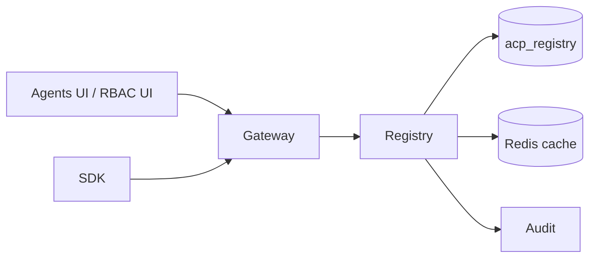

# Registry

*The source of truth for "which agents exist in this tenant, and what tools is each agent allowed to call." Every `/execute` request asks the registry "does this agent own this tool grant" before the policy stage runs.*

## Business purpose

Aegis governs at two levels:

- **Per-tenant** — rate limits, kill switch, autonomy contracts.
- **Per-agent** — which tools this specific agent may invoke.

The Registry is the per-agent control plane. Without it, the platform has no way to express "the support agent can read tickets but not delete them" or "the DevOps agent can scale deployments but not delete namespaces."

It exists as its own service so:

- **One agent identity store.** Other services hold `agent_id`; only the registry holds the agent row.
- **Permission grants are append-only with audit.** Granting or revoking a permission is its own audit row.
- **Hot-path permission lookup is cacheable.** The registry caches permission sets in Redis (60s TTL) so stage 4 of the gateway pipeline doesn't take a database round-trip every call.

## Architecture



The registry is one of the two services (the other is identity) whose endpoints the gateway proxies almost transparently. Most `/agents/*` paths on the gateway are thin pass-throughs to `services/registry/router.py`.

## Request flow

### Hot path: stage 4 permission lookup

1. Gateway middleware needs to check `(agent_id, tool_name) → ALLOW/DENY`.
2. Reads `acp:perms:{agent_id}` from Redis. Hit → return.
3. Miss → calls `GET /agents/{agent_id}/permissions` on registry.
4. Registry selects from `permissions` where `agent_id = :a` and `tenant_id = :t`.
5. Returns the list; gateway caches with 60s TTL.

### Cold path: agent CRUD

1. UI calls `POST /agents` with `{name, description, owner_id, risk_level}`.
2. Gateway proxies to `services/registry/router.py::create_agent`.
3. Handler:
   - Validates the name (regex `^[a-z0-9][a-z0-9_-]{1,98}[a-z0-9]$`).
   - Enforces the `org_id == tenant_id` invariant.
   - Inserts the agent row.
   - Emits an audit event `action="agent_registration"`.
4. Returns the agent payload including the new UUID.

### Permission grants

1. UI calls `POST /agents/{id}/permissions` with `{tool_name, action, granted_by, expires_at?}`.
2. Registry inserts into `permissions` with the unique constraint `(agent_id, tool_name)` — duplicate grants are rejected with 409.
3. Emits an audit event `action="permission_grant"` with the tool name.
4. Invalidates `acp:perms:{agent_id}` in Redis so the next hot-path lookup sees the new grant.

## Dependencies

**Python libraries:**

- `fastapi`, `sqlalchemy[asyncio]`, `asyncpg`, `pydantic`.
- `redis.asyncio` — permission cache.

**Other Aegis services:**

- Audit (`services/audit/`) — every CRUD action is an audit row.
- Identity (`services/identity/`) — read for `owner_id` resolution.

**Infrastructure:**

- Postgres `acp_registry`.
- Redis for the per-agent permission cache.

## Database tables

| Table | Purpose | Notable columns |
|---|---|---|
| `agents` | Registered agents in the tenant | `id`, `name`, `description`, `owner_id`, `status` (`ACTIVE`/`QUARANTINED`), `tenant_id`, `org_id`, `risk_level` (`low`/`medium`/`high`/`critical`), `metadata` (JSONB), `deleted_at`, `created_at`, `updated_at` |
| `permissions` | Tool grants per agent | `id`, `agent_id` (FK → `agents.id`, `ON DELETE CASCADE`), `tool_name`, `action` (`ALLOW`/`DENY`), `granted_by`, `expires_at`, `tenant_id`, `org_id`, UNIQUE (`agent_id`, `tool_name`) |

Indexes: `agents.tenant_id`, `agents.deleted_at`, `permissions.agent_id`.

**Live state (as of 2026-05-29, public demo at `aegisagent.in`):**

- `agents` = 4 rows (`demo-agent`, `db-copilot`, `support-agent`, `devops-agent`)
- `permissions` = 53 rows across the 4 agents, covering the canonical demo tool sets from `demos/{db_copilot,support_agent,devops_agent}/setup_demo.py`

## Redis usage

| Key pattern | Operation | Purpose | TTL |
|---|---|---|---|
| `acp:perms:{agent_id}` | GET / SETEX / DEL | Cached permission list | 60 s |
| `acp:agent:{agent_id}` | GET / SETEX | Cached agent metadata (status, risk_level) | 60 s |
| `acp:registry_tools` | GET / SETEX | The catalog of known tool names | 1 h |

## Security controls

- **Tenant scoping on every query.** `WHERE tenant_id = :t` is unconditional. Source: `services/registry/router.py::list_agents`, `get_agent`, `add_permission`.
- **Org consistency invariant.** Every create/update path calls `assert_org_consistency(response.org_id, tenant_id, "registry agent creation")` and aborts on mismatch with 500.
- **Soft delete on agents.** Deleting an agent sets `deleted_at` and cascades to revoke its permissions; the row stays for forensic replay.
- **Name validation.** The agent name regex prevents shell-meta and HTML-tag characters from ever entering the database; bad names return 422 before reaching SQL.
- **Tool-name validation.** The tool name regex `^[a-z][a-z0-9_\-]*(\.[a-z][a-z0-9_\-]*)*$` allows snake_case, kebab-case, and dot-namespaced tools (e.g. `crm.lookup_ticket`) but rejects whitespace, slashes, and shell metacharacters.
- **RBAC on writes.** Create / update / delete agent and grant / revoke permission require `ADMIN` or `SECURITY` at the gateway. Read is `AUDITOR`+.
- **Audit emission on every change.** `agent_registration`, `agent_updated`, `agent_deleted`, `permission_grant`, `permission_revoke` are all audited.

## Metrics

| Metric | Type | Labels | Purpose |
|---|---|---|---|
| `acp_registry_agents_total` | Gauge | `tenant_id`, `status` | Count of active and quarantined agents |
| `acp_registry_permissions_total` | Gauge | `tenant_id`, `action` | Count of ALLOW vs DENY grants |
| `acp_registry_create_agent_total` | Counter | `tenant_id` | CRUD throughput |
| `acp_registry_permission_cache_hit_total` | Counter | `tenant_id` | Redis hits |
| `acp_registry_permission_cache_miss_total` | Counter | `tenant_id` | Cold reads |

## Deployment model

- **Image**: `infra-registry` from `services/registry/Dockerfile`.
- **Container**: `acp_registry`.
- **Port**: 8001 internally.
- **Replicas**: 1.
- **Healthcheck**: `GET /health`.
- **Env vars**: `DATABASE_URL`, `REDIS_URL`, `INTERNAL_SECRET`, `AUDIT_SERVICE_URL`.
- **Resource footprint**: ~90 MB resident in the current production deployment.

## API endpoints

All under prefix `/agents` (and the catalog endpoint `/registry/tools`).

| Method | Path | Auth | Description |
|---|---|---|---|
| GET | `/agents` | AUDITOR+ | List agents in the tenant; supports pagination |
| GET | `/agents/summary` | AUDITOR+ | Counts grouped by status and risk_level |
| POST | `/agents` | ADMIN / SECURITY | Create an agent |
| GET | `/agents/{id}` | AUDITOR+ | Single-agent detail |
| PATCH | `/agents/{id}` | ADMIN / SECURITY | Update description, status, metadata |
| DELETE | `/agents/{id}` | ADMIN / SECURITY | Soft-delete |
| GET | `/agents/{id}/permissions` | AUDITOR+ | List tool grants |
| POST | `/agents/{id}/permissions` | ADMIN / SECURITY | Grant a tool |
| DELETE | `/agents/{id}/permissions/{perm_id}` | ADMIN / SECURITY | Revoke a tool |
| GET | `/registry/tools` | AUDITOR+ | The platform's catalog of known tool names |
| GET | `/agents/{id}/profile` | AUDITOR+ | Combined detail + audit aggregates (proxied through gateway) |

## Example requests

### List agents

```bash
curl -sS https://dev.aegisagent.in/agents \
  -H "Authorization: Bearer $TOKEN" \
  -H "X-Tenant-ID: 00000000-0000-0000-0000-000000000001" \
  | jq '.data.items[] | {name, risk_level, status}'
```

### Create an agent

```bash
curl -sS -X POST https://dev.aegisagent.in/agents \
  -H "Authorization: Bearer $TOKEN" \
  -H "X-Tenant-ID: 00000000-0000-0000-0000-000000000001" \
  -H "Content-Type: application/json" \
  -d '{
    "name":"crm-support-bot",
    "description":"Customer support agent reading CRM tickets",
    "owner_id":"alice@acme.com",
    "risk_level":"medium"
  }'
```

### Grant a tool permission

```bash
AGENT_ID=$(curl -sS https://dev.aegisagent.in/agents \
  -H "Authorization: Bearer $TOKEN" \
  -H "X-Tenant-ID: 00000000-0000-0000-0000-000000000001" \
  | jq -r '.data.items[] | select(.name=="crm-support-bot") | .id')

curl -sS -X POST https://dev.aegisagent.in/agents/$AGENT_ID/permissions \
  -H "Authorization: Bearer $TOKEN" \
  -H "X-Tenant-ID: 00000000-0000-0000-0000-000000000001" \
  -H "Content-Type: application/json" \
  -d '{"tool_name":"crm.lookup_ticket","action":"ALLOW","granted_by":"alice@acme.com"}'
```

## Troubleshooting

| Symptom | Likely cause | Where to look |
|---|---|---|
| `/agents` returns empty list despite seeded agents | tenant_id mismatch between JWT and rows | Inspect `users.tenant_id` vs `agents.tenant_id` in `acp_registry` |
| 500 on `/agents` list | NULL `metadata` on legacy rows | The `AgentResponse` field validator coerces None → `{}`; verify the fix is deployed |
| 409 on permission grant | Duplicate `(agent_id, tool_name)` | Use PATCH on the existing permission instead |
| 422 on agent create | Invalid name (shell-meta, length, casing) | Regex: `^[a-z0-9][a-z0-9_-]{1,98}[a-z0-9]$` |
| Permission grant not effective for several seconds | Redis cache TTL (60s) | Invalidate `acp:perms:{agent_id}` manually OR wait for natural expiry |
| Soft-deleted agent still showing in UI | UI not filtering on `deleted_at IS NULL` | `services/registry/router.py::list_agents` does filter; check UI cache |

## Production considerations

- **Permission cache is small but consequential.** A stale permission cache can give an agent access it should have lost. The 60-second TTL is the worst-case window; explicit revoke invalidates immediately.
- **Tool catalog is open.** `/registry/tools` is a flat list of known names; there is no central registry of "valid" tools. New tool names are accepted on grant.
- **Soft delete is forensic-friendly.** Hard-deleting agents would lose the forensic trail. The platform never `DELETE FROM agents`.
- **Cascade on permissions.** Deleting an agent revokes its permissions; the audit chain records the cascade.
- **Status transitions.** `ACTIVE → QUARANTINED` is a fast operational lever — quarantined agents are still in the registry but their permissions are treated as DENY for the duration. This is the second-fastest way to stop one agent (the fastest is the kill switch).
- **`risk_level` informs the Decision Engine.** It's a signal at stage 6 with a small weight by default. Setting an agent to `critical` does not block it but does raise its decision-time score baseline.

## Next

- [Gateway](gateway.md) — the caller at stage 4
- [Identity](identity.md) — the source of the agent owner identity
- [Agents UI](../ui/operations/agents.md) — the human-facing CRUD
- [RBAC UI](../ui/settings/rbac.md) — the role-and-tool grid where most permission edits happen
