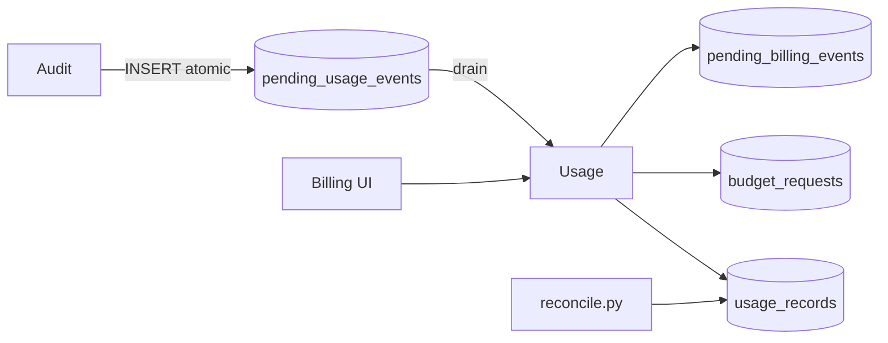

# Usage

*The platform's ledger. Every billable event lands as a `usage_records` row, fed by the audit outbox. Exposes the dashboards, the budget-request workflow, and the DLQ inspection surface that billing operators rely on.*

## Business purpose

Three things hinge on Usage:

- **Cost truth.** The `usage_records` table is the single source for "how much did this tenant cost us this month."
- **Cost attribution.** Per-agent, per-tool, per-day breakdowns power the Billing UI and the cost-attribution exports.
- **Cap enforcement.** Live cost counters in Redis are written by the gateway, but reconciled against `usage_records` nightly to detect drift.

It exists as its own service because the read traffic (dashboards refreshing every 30 seconds) and the write traffic (one row per `/execute`) have different scaling profiles that would conflict if folded into audit.

## Architecture



Usage runs two roles inside one container: an HTTP API (for dashboards and CRUD) and a worker (for draining the outbox).

## Request flow

### Outbox drain

1. Worker process polls `acp_audit.pending_usage_events` with `SELECT ... FOR UPDATE SKIP LOCKED LIMIT 100`.
2. For each row:
   - Compute the cost in USD using `services/usage/cost_engine.py` (model-specific rates).
   - In one transaction: `INSERT INTO usage_records` plus `DELETE FROM pending_usage_events`.
   - Update `acp:tenant_cost_today:{tenant_id}:{YYYYMMDD}` and `acp:agent_cost_today:{agent_id}:{YYYYMMDD}` to match the ledger.
3. On exception, retry up to 3 times; then `INSERT INTO pending_billing_events` (DLQ) and `DELETE` from the outbox to stop blocking.

### Dashboard read

1. UI calls `/usage/dashboard`.
2. Handler aggregates from `usage_records`:
   - Today's spend grouped by agent.
   - 30-day daily trend.
   - Top tools by cost.
   - Anomalies (rows whose cost exceeds the agent's typical p95).
3. Cached for 30 seconds in Redis.

### Budget request

1. POST creates a `budget_requests` row with `status="pending"`.
2. The request is announced via webhook to Slack (if configured).
3. A second admin approves or rejects via PATCH.
4. On approve, the tenant's `daily_inference_cost_cap_usd` is updated in identity; the change emits an audit row.

## Dependencies

**Python libraries:**

- `fastapi`, `sqlalchemy[asyncio]`, `asyncpg`, `pydantic`.
- `redis.asyncio` for live counters and dashboard cache.
- `structlog`.

**Other Aegis services:**

- Audit (`services/audit/`) — read-only on the outbox.
- Identity (`services/identity/`) — update tenant cap on budget approval.

**Infrastructure:**

- Postgres `acp_usage`.
- Redis for counters and cache.
- Access to `acp_audit.pending_usage_events` via a separate DSN.

## Database tables

| Table | Purpose | Notable columns |
|---|---|---|
| `usage_records` | The ledger. One row per billable event. | `id`, `audit_id` (FK reference to audit), `tenant_id`, `agent_id`, `tool_name`, `model_name`, `prompt_tokens`, `completion_tokens`, `amount_usd`, `created_at` |
| `budget_requests` | Tenant requests for cap lifts | `id`, `tenant_id`, `requested_by`, `requested_cap_usd`, `reason`, `status` (`pending`/`approved`/`rejected`), `reviewed_by`, `reviewed_at`, `created_at` |
| `pending_billing_events` | DLQ for usage drain failures | `id`, `audit_id`, `tenant_id`, `error_reason`, `retry_count`, `failed_at` |

Indexes: `usage_records.tenant_id, created_at DESC`, `usage_records.agent_id, created_at DESC`. Production deployments partition `usage_records` by month on `created_at`.

**Live state (as of 2026-05-29, public demo at `aegisagent.in`):**

- `usage_records` = **922 rows** (matches `pending_usage_events` count from audit — clean outbox sync)
- `budget_requests` = 0
- `pending_billing_events` = 0 (no DLQ entries — healthy)

## Redis usage

| Key pattern | Operation | Purpose | TTL |
|---|---|---|---|
| `acp:tenant_cost_today:{tenant_id}:{YYYYMMDD}` | INCRBYFLOAT / GET | Live tenant USD accumulator | 26 hours |
| `acp:agent_cost_today:{agent_id}:{YYYYMMDD}` | INCRBYFLOAT / GET | Live agent USD accumulator | 26 hours |
| `acp:usage_dashboard:{tenant_id}` | GET / SETEX | Dashboard payload cache | 30 s |
| `acp:reconcile_cursor:{tenant_id}` | GET / SET | Reconciler progress per tenant | 30 days |

## Security controls

- **Tenant scoping on every query.** No cross-tenant read paths.
- **Idempotent writes.** `usage_records` has a UNIQUE on `audit_id` so duplicate drains cannot double-bill.
- **No mutation on `usage_records`.** Updates are append-only via inserts to a separate `usage_adjustments` table (not yet implemented but reserved).
- **Audit emission on all CRUD on `budget_requests`.** Create, approve, reject are all audited.
- **DLQ inspection requires AUDITOR+** — operators can see failed events but cannot retry them without ADMIN.

## Metrics

| Metric | Type | Labels | Purpose |
|---|---|---|---|
| `acp_usage_records_written_total` | Counter | `tenant_id` | Throughput |
| `acp_usage_drain_latency_seconds` | Histogram | none | Worker drain latency |
| `acp_usage_dlq_size` | Gauge | none | DLQ depth |
| `acp_usage_dashboard_cache_hit_total` | Counter | `tenant_id` | Cache hits |
| `acp_usage_budget_requests_total` | Counter | `tenant_id`, `status` | Request outcomes |
| `acp_usage_cost_compute_error_total` | Counter | `model_name`, `reason` | Cost engine errors |

## Deployment model

- **Image**: `infra-usage` from `services/usage/Dockerfile`.
- **Container**: `acp_usage`. Runs uvicorn (API) plus the outbox-drain worker in the same container.
- **Port**: 8007.
- **Replicas**: 1.
- **Healthcheck**: `GET /health`.
- **Env vars**: `DATABASE_URL` (usage), `AUDIT_DATABASE_URL` (read-only audit DSN), `REDIS_URL`, `INTERNAL_SECRET`, `USAGE_DRAIN_BATCH_SIZE` (default 100), `USAGE_DRAIN_INTERVAL_SECONDS` (default 1).

## API endpoints

| Method | Path | Auth | Description |
|---|---|---|---|
| POST | `/usage/record` | Internal only (gateway calls) | Record a usage event |
| GET | `/usage/dashboard` | AUDITOR+ | Aggregated dashboard payload |
| GET | `/usage/anomalies` | AUDITOR+ | Cost anomalies |
| GET | `/usage/summary` | AUDITOR+ | Window summary (proxied as `/billing/summary`) |
| GET | `/usage/by-agent` | AUDITOR+ | Per-agent breakdown |
| GET | `/billing/dlq` | AUDITOR+ | DLQ listing |
| POST | `/billing/dlq/{id}/replay` | ADMIN | Replay a stuck event |

## Example requests

### Dashboard payload

```bash
curl -sS https://ha.aegisagent.in/usage/dashboard \
  -H "Authorization: Bearer $TOKEN" \
  -H "X-Tenant-ID: 00000000-0000-0000-0000-000000000001" \
  | jq '{ today_usd, top_agents: .by_agent[:3], anomaly_count: (.anomalies | length) }'
```

### Cost attribution over 4 weeks

```bash
curl -sS "https://ha.aegisagent.in/billing/cost-attribution?weeks=4" \
  -H "Authorization: Bearer $TOKEN" \
  -H "X-Tenant-ID: 00000000-0000-0000-0000-000000000001" \
  | jq
```

### DLQ inspection

```bash
curl -sS https://ha.aegisagent.in/billing/dlq \
  -H "Authorization: Bearer $TOKEN" \
  -H "X-Tenant-ID: 00000000-0000-0000-0000-000000000001" \
  | jq '.data.items[] | { audit_id, error_reason, retry_count, failed_at }'
```

## Troubleshooting

| Symptom | Likely cause | Where to look |
|---|---|---|
| Dashboard shows zero spend | Cache stale OR worker stopped | Invalidate `acp:usage_dashboard:{tenant_id}`; check worker health |
| `acp_usage_dlq_size` rising | Cost engine error or DB constraint violation | Inspect DLQ rows for the common `error_reason` |
| Reconciler reports `audit_without_usage` | Outbox drained but usage insert failed silently | Should be impossible (transaction); check Postgres `commit` errors |
| Per-agent cap fires early | Live counter and ledger diverged | Reconcile counters from `usage_records` of today |
| Cost computed as zero | Unknown model name | Inspect `services/usage/cost_engine.py` rate table; add the model |
| Dashboard slow | Aggregation over many millions of rows | Add a daily summary materialized view; partition pruning |

## Production considerations

- **Drain is single-threaded per tenant.** The `SELECT ... FOR UPDATE SKIP LOCKED` lets multiple workers run, but per-tenant ordering is preserved by the audit chain lock upstream.
- **Cost engine is rate-table-driven.** Adding a new model means adding a row to the rate table, not deploying code.
- **Reconciler is the source of truth on disputes.** Live Redis counters can drift under failure; the ledger does not.
- **Partition pruning matters at scale.** Monthly partitioning on `usage_records.created_at` keeps Postgres' planner fast.
- **No real-time billing API.** Tenants see dashboards updated every 30 seconds; "live" billing is a SLO target, not a hard contract.
- **DLQ retention is bounded.** Failed events older than 30 days are alerted and then archived.

## Next

- [Audit](audit.md) — the source of the outbox
- [Identity](identity.md) — the tenant cap surface
- [Billing UI](../ui/settings/billing.md) — the human-facing surface

There is no separate `billing` service. Billing is a cross-service flow:
`audit` → outbox → `usage` (this service) → optional Stripe webhook in
`api`. The UI page at `/billing` consumes the usage endpoints documented
above.
