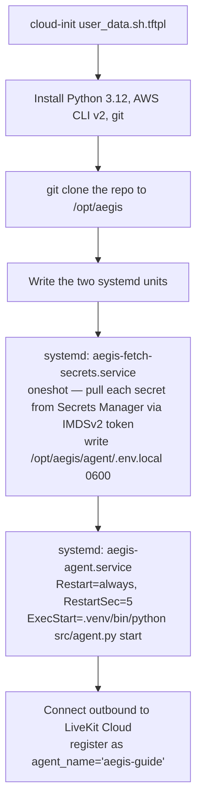

# Deployment and operations

*The Voice Guide is one EC2 instance, ~17 Terraform resources, and a small handful of operational scripts. This page documents what runs, how it boots, how secrets reach the process, how cost is bounded, and what fails when something does fail.*

## AWS topology

Everything in the table below is created by `voice-agent/infrastructure/*.tf`. The deployment uses the default VPC and default subnet in `ap-south-1` — there is no custom networking. For a single-instance demo the default VPC is the right default.

| Resource | Purpose | Source |
|---|---|---|
| EC2 `t3.medium` | The agent worker process | `compute.tf` |
| 30 GB gp3 EBS, encrypted | OS + Python venv + ChromaDB + BM25 + model caches + docs corpus | `compute.tf` |
| Elastic IP | Stable address across stop/start (preserves SSH target) | `compute.tf` |
| Security group | SSH 22 from admin `/32` only; all egress | `network.tf` |
| RSA-4096 key pair | SSH access. Private key written `0400` to `infrastructure/aegis-voice-guide.pem`, gitignored | `keypair.tf` |
| IAM role + instance profile | `secretsmanager:GetSecretValue` on `aegis-voice-guide/*` and CloudWatch log permissions only | `iam.tf` |
| Secrets Manager × 6–7 | One secret per provider key (LiveKit URL / key / secret, Deepgram, Cartesia, Groq, optional Gemini) | `secrets.tf` |
| CloudWatch log group `/aegis/agent` | Journal forwarded; 14-day retention | `monitoring.tf` |
| SNS topic + billing alarm at $200 | Cost-safety net; lives in `us-east-1` where billing metrics are emitted | `monitoring.tf` (with `provider = aws.us_east_1`) |
| EventBridge rule + Lambda `aegis-voice-guide-autostop` | Stops the instance if average CPU has been below 5% for 30 minutes | `autostop.tf` |

The Terraform state is local to the developer machine. A production-grade rollout would move the backend to S3 with DynamoDB locking; the trade-off is documented in `voice-agent/diagram.md` §13.5.

The same set of LiveKit / Deepgram / Cartesia / Groq credentials that the worker uses is also read by the Aegis gateway (for the `/voice/token` endpoint). The two live in different `.env` files on different hosts; the secret values are the same. A future hardening would have the gateway also fetch from Secrets Manager via its container IAM role rather than reading the values from its `.env`.

## How the instance boots



Two units, one edge:

```
aegis-fetch-secrets.service  (oneshot, Type=oneshot, RemainAfterExit=yes)
                                  │
                                  │  Requires + After
                                  ▼
aegis-agent.service              (Type=simple, Restart=always, RestartSec=5)
                                  │
                                  └─► /opt/aegis/agent/.venv/bin/python src/agent.py start
```

The `Requires` edge guarantees the agent never starts without secrets. `RemainAfterExit` keeps the oneshot "satisfied" so systemd doesn't rerun it on every restart of the dependent.

## Why `num_idle_processes=0` and why we added swap

LiveKit Agents defaults to `num_idle_processes=10` in production mode. Each idle Job process is a forked Python interpreter that pre-loads Silero VAD, the turn detector ONNX, MiniLM, and the cross-encoder — roughly 230 MB resident per process. On `t3.medium`'s 4 GB RAM, prewarming 10 idle processes plus the parent plus the OS exceeded available memory and forced Linux into thrashing. Job init exceeded the 10 s timeout and the framework cycled processes endlessly.

The fix in `voice-agent/agent/src/agent.py`:

```python
server = AgentServer(
    num_idle_processes=0,           # Jobs spawn on-demand
    initialize_process_timeout=60.0, # Models take longer than 10 s to load on CPU
    job_memory_warn_mb=2000.0,       # Don't warn on legitimate model-cache size
)
```

The trade-off is a **~5–10 s cold-start** on the first dispatch after a quiet period. For sparse portfolio traffic that is the right call; for sustained traffic it would warrant raising `num_idle_processes` to 2–3 and stepping the instance up.

Beyond `num_idle_processes`, the EC2 was provisioned with **4 GB of swap** (added via user_data) to absorb spikes during cold start and during multi-Job memory pressure. Voice latency is not sensitive to swap-backed memory because the agent process stays in RAM under normal load; swap absorbs the slack from interpreter and model caches. We accept the operational complexity (swap defeats some kernel-OOM behaviours) because the alternative — 4 GB instance with no slack — was unreliable.

## Cost controls and session timeouts

The Voice Guide has six independent cost-control layers. Any one of them failing should not result in runaway quota burn; together they bound the worst case.

| Layer | Cap | Where | Notes |
|---|---|---|---|
| Browser → gateway JWT TTL | **5 min** | `services/gateway/routers/voice.py:TOKEN_TTL_SECONDS=300` | LiveKit Cloud rejects reuse after expiry. The browser cannot extend a session beyond this without re-clicking the button. |
| Agent session hard-timeout | **5 min** | `voice-agent/agent/src/agent.py:SESSION_MAX_SECONDS` (env `AEGIS_SESSION_MAX_SECONDS`) | asyncio guard task; after the timeout the agent says one final line ("time's up — disconnecting…") and calls `session.aclose()` cleanly |
| Agent idle threshold | 120 s | `AEGIS_SESSION_IDLE_SECONDS` | Configured value, not yet enforced as a timer — future enhancement |
| Per-LLM-reply output | **160 tokens** | `voice-agent/agent/persona/Modelfile` `num_predict` | Brevity for voice; also a per-call cost ceiling |
| Chat history per call | **8 items** | `voice-agent/agent/src/agent.py` `on_user_turn_completed` | TPM safety; prevents context unbounded growth |
| Groq TPM (upstream) | 12,000 / min | upstream free tier | Mitigated by the truncation hook and bounded RAG; FallbackAdapter routes to Gemini on 429 |
| Groq RPD (upstream) | 14,400 / day | upstream free tier | A runaway-loop bug would burn this in minutes — the session-timeout layer is the primary defence |
| Gemini fallback RPD | 20 / day | upstream | Emergency fallback only; not a sustained-load substitute |
| EC2 auto-stop | 30 min <5% CPU | Lambda + EventBridge | Cuts the EC2 hourly burn if the operator forgets to call `stop.sh` |
| UI countdown | 5:00 → 0:00 | `ui/src/components/VoiceAgent/VoiceAgentPanel.jsx` | Visible to the user, amber under 60 s, red under 30 s, auto-closes at 0 |

The agent-side timeout uses an asyncio guard:

```python
async def _session_timeout_guard():
    try:
        await asyncio.sleep(SESSION_MAX_SECONDS)
    except asyncio.CancelledError:
        return
    await session.generate_reply(instructions=(
        "Say only: time's up — disconnecting to keep costs bounded. "
        "Reconnect anytime to continue."
    ))
    await asyncio.sleep(3.5)
    await session.aclose()
```

The reviewer simply clicks the **Voice Agent** button again to mint a fresh 5-minute session. This is intentional — the cap caps the *unit of cost*, not the total number of conversations.

## Secrets handling

The chain of custody for every API key the agent uses:

```mermaid
flowchart TD
    Dev[voice-agent/agent/.env.local on dev machine<br>0600, gitignored — source of truth]
    Dev -->|TF_VAR_* exported by scripts/apply.sh| TF[terraform apply on dev machine]
    TF -->|aws_secretsmanager_secret_version × 7| SM[(AWS Secrets Manager<br>aegis-voice-guide/*<br>AWS-managed encryption)]
    SM -->|aegis-fetch-secrets.service via IMDSv2 token| Env[/opt/aegis/agent/.env.local<br>0600 on EBS]
    Env -->|python-dotenv at startup| Proc[Agent process]
    SM -->|same values, separately injected| GW[Aegis gateway /opt/aegis/infra/.env<br>0600 on dev EC2]
    GW -.->|LIVEKIT_API_KEY/SECRET/URL only| TokenRoute[POST /voice/token]
```

What's deliberate here:

- **No long-lived AWS access keys on the instance.** The EC2 uses its IAM role. The role's policy is resource-scoped to `arn:aws:secretsmanager:ap-south-1:<acct>:secret:aegis-voice-guide/*`.
- **IMDSv2 only** (`http_tokens = "required"`). A server-side request forgery from a content-rendering library cannot fetch instance credentials.
- **No secrets in the AMI.** The instance uses the stock Ubuntu 24.04 AMI; the only mutation is what user_data writes at boot.
- **No secrets in Git.** `.gitignore` blocks `.env*`, `*.tfstate*`, `*.pem`, `*.tfvars`. `infrastructure/aegis-voice-guide.pem` exists locally and never reaches a remote.
- **AWS-managed KMS, not CMK.** The marginal cost of a customer-managed key (~$1/mo plus usage per key × 7 secrets) is not justified for free-tier API keys whose blast radius is "someone burns my free quota." Documented inline with a `tfsec:ignore` and discussed in `voice-agent/diagram.md` §13.2. A production deployment with real customer data would use CMKs.

The Aegis gateway needs `LIVEKIT_URL`, `LIVEKIT_API_KEY`, `LIVEKIT_API_SECRET` to sign JWTs. Today those are injected into the gateway's `.env` directly on the dev EC2 (idempotent sed in the deploy script). A future hardening would have the gateway also fetch from Secrets Manager via an extended IAM policy on the gateway container's role.

The AWS access key the developer pasted into chat to bootstrap the build is a single long-lived IAM-user key in `infrastructure/.env.aws.local` (also `0600`, gitignored). It is used only for `terraform apply` and is rotated after the build session. A production setup would use IAM Identity Center with short-lived sessions.

## Cost model

Steady-state monthly spend in `ap-south-1` ⚠️ verify against current pricing:

| Item | Always-on | Stop overnight + weekends (~220 hr/mo) |
|---|---|---|
| `t3.medium` on-demand (~$0.0496/hr) | ~$35.7 | ~$10.9 |
| 30 GB gp3 EBS ($0.0924/GB-mo) | ~$2.8 | ~$2.8 |
| Elastic IP — attached to *running* instance | $0 | — |
| Elastic IP — attached to *stopped* instance ($0.005/hr) | — | ~$3.6 |
| Secrets Manager × 7 ($0.40 each) | ~$2.8 | ~$2.8 |
| Lambda invocations (every 5 min × 730 hr) | < $0.10 | < $0.10 |
| CloudWatch log ingest + storage (small) | ~$1 | ~$1 |
| Data transfer out (demo traffic) | ~$1–2 | ~$1–2 |
| **Total** | **~$43–45/mo** | **~$22–24/mo** |

Free-tier providers contribute $0 as long as monthly usage stays inside their allowances:

- LiveKit Build: 1,000 agent-minutes, 5,000 WebRTC-minutes, 50 GB egress
- Deepgram: $200 credit balance (lasts months at portfolio volume)
- Cartesia: signup credit (varies)
- Groq: unlimited within RPM/TPM/RPD caps
- Gemini: 20 RPD on flash-lite (emergency fallback only)

Hard cost ceiling per `voice-agent/agent/AGENT_V2.md` §0 is **$250/mo**; realistic operating target is **$15–30/mo**. The cost-control layers above keep both ceilings honest.

## Operational scripts

```bash
# Wake the instance (~3 min before a demo)
./voice-agent/infrastructure/scripts/start.sh

# Confirm the worker registered with LiveKit Cloud
./voice-agent/infrastructure/scripts/status.sh

# SSH in (uses the local PEM)
./voice-agent/infrastructure/scripts/ssh.sh

# Push a code change without going through git
./voice-agent/infrastructure/scripts/deploy.sh

# Stop the instance to save cost after the demo
./voice-agent/infrastructure/scripts/stop.sh
```

`deploy.sh` rsyncs `agent/` and `docs/` to `/opt/aegis/`, sets up the venv if absent, fetches secrets, pre-downloads model weights, runs `ingest.py` against the current docs, and restarts the agent service. Re-runnable; idempotent.

Once on the box, the operational entry point is the journal:

```bash
journalctl -u aegis-agent.service -f      # tail live logs
journalctl -u aegis-agent.service --since "5 min ago"
sudo systemctl status aegis-agent.service
```

CloudWatch's `/aegis/agent` log group carries the same content with 14-day retention for incident retrospectives.

## Capacity envelope

A single voice session occupies:

- One Job process (~250 MB RSS)
- ~1 vCPU during STT/LLM/TTS streaming (bursty, not sustained)
- The shared model caches in the parent process (~500 MB)

`t3.medium` has 2 vCPU and 4 GB. Steady state, one concurrent session uses ~1.0–1.5 vCPU and ~1.5 GB. We can realistically host **3 concurrent sessions** before CPU saturates and turn-taking starts to suffer. LiveKit Cloud's Build-tier cap is 5 concurrent sessions anyway, so the box is sized to the upstream constraint.

At 10+ concurrent sessions the design changes:

- Step the instance to `t3.large` (8 GB) or `c7i.large`. Cost roughly doubles.
- Raise `num_idle_processes` to 2–3 once memory headroom exists.
- Optionally move ChromaDB to a managed vector store (pgvector on RDS) if the index outgrows the EBS volume or HA matters.

At 100+ concurrent sessions this is no longer the same system: paid LiveKit tier, multiple agent instances behind LiveKit's load-aware dispatch, the LLM off Groq's free tier, a CDN-fronted frontend with rate limiting at the token endpoint. None of that has been built; it explicitly does not need to be for the current scope.

## Failure modes

| Failure | Symptom | Recovery | Mitigated today |
|---|---|---|---|
| Groq rate-limit (429 TPM) | User hears a slight gap, then voice continues | `FallbackAdapter` routes the same call to Gemini transparently | Yes |
| Gemini also exhausted (20 RPD) | Both providers fail; the turn errors | User retries the turn; logs show `failed to generate LLM completion after N attempts` | Partial — no third fallback. Two simultaneous outages halt the conversation. |
| Deepgram credit exhausted | STT stops; transcripts stop arriving | Replace `DEEPGRAM_API_KEY` in Secrets Manager + restart service | No alarm wired |
| Cartesia credit exhausted | Agent generates tokens but no audio plays | Same as above for `CARTESIA_API_KEY` | No alarm wired |
| EC2 instance stopped | UI orb sits at "Connecting"; no agent joins | `./infrastructure/scripts/start.sh` | This is by design — auto-stop deliberately stops the instance to save money |
| EC2 instance terminated | Same as above, plus all data lost | `terraform apply` recreates; rerun `deploy.sh` to reingest. EBS is `delete_on_termination=true` by design | If preservation matters, flip `delete_on_termination=false` |
| OOM in a Job process | Single voice session dies mid-turn | systemd restarts the parent; LiveKit retries the dispatch | Yes — `Restart=always`, swap as buffer |
| Cold-start latency | First conversation after the box was idle feels sluggish (~10–20 s before greeting) | Pre-warm by hitting the agent once before sharing the demo URL | Documented as part of the demo checklist |
| Tool-call leak to TTS | User would hear `<function=...>` markup spoken aloud | Modelfile rule + streaming regex filter in `tts_node` | Yes — see [RAG and LLM § Defense against tool-call leakage](rag-and-llm.md) |
| Session-timeout runaway | Forgotten tab keeps a session alive for hours, burning Groq quota | Three independent timeouts (JWT TTL + agent guard + UI countdown) | Yes — see Cost controls section above |
| User home IP changes | SSH fails (SG blocks new IP) | Update `var.admin_ip_cidr`, `terraform apply` | Manual — not automated |
| Terraform state lost | Can't manage the deployment | Reimport every resource by ID, or `terraform destroy` from the AWS console and redeploy | Mitigated only by local backup of `terraform.tfstate`. S3 backend would fix this. |
| Pasted AWS keys leaked | Anyone could provision/destroy in this account | Rotate the IAM user's key. Documented as a post-build follow-up. | Manual |

## What good looks like

When the system is healthy, all of the following are true:

1. `./infrastructure/scripts/status.sh` reports `Instance state: running` and the latest agent log line is a per-turn metric or `registered worker`.
2. Opening a Voice Agent session from the Aegis navbar hears a one-sentence greeting within 5 seconds of the orb leaving the `Connecting` state.
3. A doc-grounded question ("what is the kill switch?") produces an answer that uses verbatim Aegis terminology, with a follow-up question that probes a specific dimension — and the function-call markup never appears in the spoken text or the transcript.
4. An off-corpus question ("what is the OWASP LLM Top 10?") produces an answer from the model's pretraining without spuriously calling `search_aegis_docs`.
5. An ambiguous question ("how do I make it more secure?") produces a clarifying question first.
6. p50 end-to-end latency (user-stops → agent-starts) is below 1.5 s; p95 below 3 s.
7. The session countdown ticks down visibly; at 0 the agent says one closing line and the panel auto-closes.
8. CloudWatch shows zero `failed to generate LLM completion after N attempts` errors in the last hour. Sporadic 429s with successful fallback are normal.

When any of these fail, the table in the previous section covers it.

## Known limitations

Documented so a reviewer doesn't have to discover them.

- **No CI/CD.** Changes deploy via `./infrastructure/scripts/deploy.sh` from the developer's machine. No build pipeline, no test gate, no staged rollout, no rollback automation. Acceptable for the scope.
- **Single region, single instance.** No failover, no HA. If `ap-south-1` has an availability event, the agent is down.
- **Voice frames transit third-party providers.** Deepgram, Cartesia, Groq, and (occasionally) Gemini all process user voice and transcripts. If a deployment required prompts to stay in a private cloud, the design would have to be replaced — self-hosted Whisper for STT, self-hosted Piper or Kokoro for TTS, and a self-hosted LLM. That path is documented and was explicitly rejected on cost; see `voice-agent/diagram.md` §13.4.
- **Local Terraform state.** State lives at `infrastructure/terraform.tfstate` on the developer machine. If the machine dies before backup, the running resources are orphaned. S3 backend with DynamoDB locking is the production fix.
- **Modelfile is parsed at startup, not enforced live.** Editing `Modelfile` after the process is running requires a `systemctl restart aegis-agent.service`. A future `SIGHUP` handler would avoid the restart; not built.
- **No transcript persistence.** The Voice Agent panel shows transcripts as the session runs but writes nothing to a queryable store. For audit-grade conversation history, a future enhancement would append finalized segments to a DB row keyed by `room` + `identity`.
- **No worker-registration probe in the UI.** When the EC2 is stopped (auto-stop fired), the user sees the orb sit at `Connecting` with no explicit "warming up" copy. The fix is a lightweight check on click; not built.

## Where to read next

- [Overview](_index.md) — what the Voice Guide is and the locked architectural decisions behind it
- [RAG and LLM strategy](rag-and-llm.md) — how hybrid retrieval and the Groq → Gemini fallback chain actually work
- [UI integration](ui-integration.md) — the navbar button, the animated orb, the panel that hosts a session
- [Aegis deployment](../operations/deployment.md) — the tar-S3-SSM flow used for the Aegis core. The Voice Guide deploys differently because it sits in its own Terraform-managed footprint, but the same "no GitHub creds on the host" rule applies.
