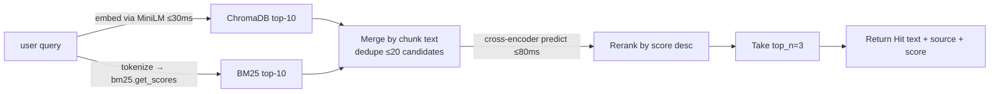

# RAG and LLM strategy

*The two layers that make a voice agent answer something useful instead of something fluent-but-wrong: hybrid retrieval against the Aegis docs, and a token-budgeted prompt with a hosted LLM fallback chain.*

This page documents both. Most of the latency budget and most of the per-turn cost lives here, so the design choices were not casual.

## The retrieval layer

### Why hybrid

Dense (vector) retrieval is great at semantic matches but misses exact-keyword queries: "kill_switch_engaged.md", "CVE-2024-3094", precise jargon like "tamper-evident". BM25 catches those but misses paraphrases — "how do I stop everything quickly" should retrieve the kill-switch docs even though it shares no terms with them.

The standard recipe is to union the top-k from each retriever and rerank the merged candidate set with a cross-encoder. The cross-encoder attends to both query and chunk simultaneously, so it produces materially more accurate top-N than either retriever alone — at a cost we can afford (~120 ms total on `t3.medium`).

This is not a research contribution. It is the two-stage hybrid retrieval recipe documented in the Pyserini and HuggingFace cookbooks. The Voice Guide implements it in ~150 LOC because the codebase is small and we want explicit control over each stage's parameters.

### The indexing pipeline (offline)

`voice-agent/agent/src/ingest.py` walks `docs/**/*.md`, applies a heading-aware chunker (max 1,200 chars, 150-char overlap), and writes the chunks to **two** indexes:

| Index | Storage | Built by |
|---|---|---|
| Dense | `voice-agent/agent/chroma_db/` | `kb.add()` with the `SentenceTransformer` embedding function. ChromaDB invokes `all-MiniLM-L6-v2` to produce 384-dim vectors and stores them under an HNSW index with cosine distance. |
| Sparse | `voice-agent/agent/bm25_index/index.pkl` | `kb.save_bm25()` tokenizes every chunk (lowercase word-character regex) and constructs a `BM25Okapi` over the term-document matrix; the whole object plus the chunks plus metadata is pickled. |

The current corpus is **1,794 chunks from 103 markdown files** (refreshed 2026-06-01 after the GitBook revamp). Reingesting from scratch takes ~25 s on the EC2 instance — most of it in embedding generation. The operator reruns ingest after any doc edit so the agent's grounding stays current.

### The retrieval pipeline (per query)

`voice-agent/agent/src/rag.py::AegisKnowledge.search` runs three stages:



The tool wraps each chunk in a `[source: …]` header and prepends an explicit instruction to the model:

> "Quote specific Aegis terms verbatim rather than paraphrasing. Briefly mention which doc area it came from. Do NOT read file paths or URLs aloud."

That instruction is part of the tool's return value, not the system prompt — it travels with the data so it's harder for the model to ignore on a long conversation.

### Why `top_n=3` and not 4 or 10

This is a token-budget calculation, not an aesthetic choice. The Groq free tier caps at 12,000 tokens per minute. A single call carries:

| Item | Approx tokens |
|---|---|
| System prompt (Modelfile) | ~1,200 |
| Chat history (last 8 items) | ~800 |
| User message | ~50 |
| Tool schemas | ~200 |
| LLM completion (capped at `num_predict=160`) | ~150 |
| **Fixed overhead** | **~2,400** |

That leaves ~9,500 tokens of retrieved context per minute. At 1,200 chars per chunk and an English-text ratio of ~4 chars/token, each chunk is ~300 tokens. Three chunks per call = 900 tokens. We can issue roughly **10 calls/min** before TPM is exhausted — comfortable for a voice conversation pace of one turn every 6 seconds.

`top_n=4` would consume ~1,200 tokens/call and cut us to ~8 calls/min. Acceptable but tighter. `top_n=10` would blow the TPM cap on the first call.

### What the reranker actually does

The cross-encoder takes a `(query, chunk)` pair as a single sequence and computes a relevance score in one forward pass. Unlike bi-encoders — which embed query and chunk independently and compute cosine — the cross-encoder attends to both sides simultaneously. It's slower per-pair but materially more accurate for short query → short passage.

The model is never used for retrieval (that would be `O(N)` per query); only for reranking the union of two cheap retrievers' top-k. At 22 MB and ~80 ms for 20 pairs on `t3.medium`, it earns its keep on every turn.

### Test coverage

`voice-agent/agent/tests/test_rag.py` is a 7-test pytest suite that exercises the wired pipeline on the production index:

- `test_index_is_non_empty` — both ChromaDB and BM25 loaded.
- `test_search_returns_hits_for_kill_switch` — semantic query lands on kill-switch / decision docs.
- `test_search_respects_top_n` — `top_n` argument is honoured.
- `test_search_returns_voice_guide_for_voice_query` — newest section is reachable post-reingest (this test FAILS until ingest runs against fresh docs — the canary for "did the reingest run").
- `test_search_handles_exact_keyword` — BM25 path catches exact tokens like `X-Tenant-ID header` that dense might paraphrase.
- `test_search_empty_query_does_not_crash` — defensive.
- `test_hit_shape` — `Hit.text`, `Hit.source`, `Hit.score` populate correctly on every return.

The suite skips itself if `chroma_db/` or `bm25_index/` don't exist (CI can ingest in a setup step and run tests after).

### Where retrieval shows up in latency

Indexing is offline and doesn't matter to the user. The hot path on `t3.medium`:

| Stage | Time |
|---|---|
| Query embed (`all-MiniLM-L6-v2`) | ~30 ms |
| ChromaDB top-10 lookup | <30 ms |
| BM25 score + sort | ~5 ms |
| Cross-encoder predict (20 pairs) | ~80 ms |
| **RAG total** | **~120 ms** |

Inside a ~1,300 ms end-to-end voice turn budget, that is negligible.

## The LLM layer

### Endpoint shape

Both Groq and Gemini are accessed via their OpenAI-compatible REST APIs:

- Groq: `POST https://api.groq.com/openai/v1/chat/completions`
- Gemini: `POST https://generativelanguage.googleapis.com/v1beta/openai/chat/completions`

Both are wired through `livekit-plugins-openai`'s `LLM` class with `base_url` and `api_key` overridden. This means the framework treats them as interchangeable; switching providers is a single environment-variable change.

### Persona and parameters (the Modelfile)

The system prompt and generation parameters live in `voice-agent/agent/persona/Modelfile` using Ollama Modelfile syntax. At startup `agent.py` parses this file via `voice-agent/agent/src/modelfile.py` and reads:

| Key | Value | Why |
|---|---|---|
| `SYSTEM` | ~5,000-char system prompt | Persona: senior security engineer, contractions, short sentences, mid-thought openings, no nanny disclaimers, 70% questions / 30% observations, mirror user vocabulary |
| `PARAMETER temperature` | 0.5 | Balance of grounded retrieval (low) and natural delivery (mid) |
| `PARAMETER top_p` | 0.9 | Standard nucleus sampling |
| `PARAMETER frequency_penalty` | 0.6 | Mitigates v1's "kill switch is… kill switch is…" loops |
| `PARAMETER presence_penalty` | 0.3 | Encourages topic progression instead of restating the question |
| `PARAMETER num_predict` | 160 | Hard cap on output tokens — enforces brevity for voice |
| `PARAMETER system_greeting` | one-line greeting | What the agent speaks on session start |

The Modelfile is the canonical persona definition. Editing it and restarting the agent service changes the agent's voice without any code change. The file is portable: if the design ever switches to a self-hosted Ollama runtime, the same file works as-is.

### Persona — what changed in the 2026-06-01 humanization pass

The original persona produced replies like *"The kill switch in Aegis is designed to immediately halt agent activity. Is this for an incident response scenario, or a preventative measure?"* — fluent but stiff. Three changes made it sound like a peer engineer:

1. **Mid-thought openings.** Banned: "the X in Aegis is designed to…", "you're asking about X, right?", "good question". Required: start where the answer actually starts.
2. **No filler between tool call and answer.** Banned: "got it", "let me check", "one moment". After the tool returns, the agent answers immediately.
3. **Mixed turn endings.** Banned: every reply ending with an X-or-Y question (gets exhausting on voice). Required: ~70% questions, ~30% sharp observations.

The full persona is in `voice-agent/agent/persona/Modelfile`. Editing it requires `systemctl restart aegis-agent.service` to take effect; a `SIGHUP` reload is a future enhancement.

### Defense against tool-call leakage

Groq's `llama-3.3-70b-versatile` sometimes emits the function call as **visible content** rather than via the structured `tool_calls` channel. The user would then hear `<function=search_aegis_docs>{"query": "kill switch behavior"}</function>` spoken aloud — verbatim, including the angle brackets.

Two layers defend against this:

1. **The Modelfile** explicitly tells the model: *"NEVER write `<function=...>` or `<function_call>` or any tool-call syntax as spoken text. If you find yourself about to type a `<function...` tag, stop — that's the structured tool-call channel, not text."*
2. **A streaming filter in `agent.py`** strips any `<function...>...</function>` block from LLM output before it reaches Cartesia TTS. The filter overrides `Agent.tts_node`:

```python
_FUNCTION_TAG_RE = re.compile(
    r"<function(?:_call)?(?:\s+[^>]*)?>.*?</function(?:_call)?>",
    re.IGNORECASE | re.DOTALL,
)

async def tts_node(self, text, model_settings):
    async def filtered():
        buf = ""
        async for chunk in text:
            buf += chunk
            stripped = _FUNCTION_TAG_RE.sub("", buf)
            tail_idx = stripped.rfind("<")
            if tail_idx >= 0 and tail_idx > len(stripped) - 32:
                # Possibly mid-tag spanning a chunk boundary — hold
                safe = stripped[:tail_idx]
                buf = stripped[tail_idx:]
            else:
                safe = stripped
                buf = ""
            if safe: yield safe
        tail = _FUNCTION_TAG_RE.sub("", buf)
        if tail: yield tail
    async for frame in Agent.default.tts_node(self, filtered(), model_settings):
        yield frame
```

The filter is streaming-aware: it buffers up to ~32 characters at chunk boundaries so a partial `<function...` opening tag never gets released to TTS prematurely. The actual structured tool call (when the model emits one correctly) still fires through the `tool_calls` field — the filter only touches `delta.content`.

### Why Groq primary, Gemini fallback

Free-tier limits ⚠️ June 2026 — verify before relying on these:

| Provider | Free-tier cap | Voice-relevance |
|---|---|---|
| Groq `llama-3.3-70b-versatile` | 30 RPM, **12,000 TPM** (binding), 14,400 RPD | TPM is the only meaningful constraint. Mitigated by chat-history truncation and bounded RAG. Works for a sustained conversation if disciplined. |
| Gemini `gemini-2.5-flash-lite` | **20 RPD** (binding) | Catastrophic for sustained voice — exhausts in ~3 minutes of normal use. Acceptable for emergency fallback covering ~10 calls before the daily limit hits. |

If Gemini were the primary, every conversation past three minutes would die. Using Groq as primary keeps conversations going indefinitely under normal load; Gemini absorbs the spike when Groq returns 429.

### The FallbackAdapter

`livekit.agents.llm.FallbackAdapter([groq_llm, gemini_llm])` wraps both providers. The behaviour:

- On any retryable error from the primary (429, 5xx, timeout > 10 s), the adapter routes the *same* call to the next provider in the list.
- The fallback is transparent to the rest of the pipeline — TTS keeps streaming, the user hears no gap beyond whatever the second provider's TTFT adds.
- Failed-back conversations show characteristic markers in CloudWatch: `failed to generate LLM completion: 429 ... rate_limit_exceeded` followed by a normal stream from the second provider.

In a production session on 2026-06-01, the adapter fired during the fourth turn when Groq TPM saturated and routed 2,036 input / 24 output tokens through Gemini. The user did not detect a switch in the audio.

If `GOOGLE_API_KEY` is not set in the environment, the `FallbackAdapter` is not constructed and the agent runs Groq-only. The agent logs the active configuration at startup so the operator can tell.

### Chat-context truncation

Voice conversations grow context unboundedly. Each turn adds: user transcript, optional tool call, tool result, assistant response. After ~12 turns, the context can exceed the per-call TPM budget on its own. The `AegisGuideAgent.on_user_turn_completed` hook runs before every LLM call:

```python
async def on_user_turn_completed(self, turn_ctx, new_message):
    turn_ctx.truncate(max_items=8)
```

`ChatContext.truncate(max_items=8)` preserves the system message and keeps the last 8 chat items, discarding earlier items and removing any orphaned function-call/function-result pairs. After this hook the call payload stabilizes at ~1,200–1,500 tokens regardless of conversation length.

### What the LLM does not do

These are deliberate choices, enforced by the Modelfile and the `num_predict` cap:

- **No code blocks, no markdown, no special characters.** The response is spoken aloud; markup would be read as gibberish.
- **No "in summary…" tails.** Brevity is enforced by `num_predict=160`.
- **No compliance disclaimers on legitimate security questions.** The persona was an explicit design choice — the agent answers like a senior engineer on a call, not a chatbot. The only boundary is "not a tool for producing live attack tooling."
- **No tool calls outside `search_aegis_docs`.** The agent has one tool. Adding more is a deliberate scope expansion, not an emergent capability.

## Anti-hallucination posture

Hybrid retrieval plus the cross-encoder plus the Modelfile prompt plus the bounded-context discipline give the agent more than one layer of "don't make things up":

1. **Retrieval surfaces grounded text** rather than relying on the model's pretraining for Aegis-specific facts.
2. **The tool result tells the model to quote verbatim**, not paraphrase. Verbatim is checkable against the doc; paraphrase isn't.
3. **The Modelfile prompt says explicitly**: if retrieval doesn't actually answer the question, say so plainly. Don't guess.
4. **`temperature=0.5` and `num_predict=160`** make the output less drifty and shorter — both reduce the chance of an extended fabrication.

What the agent will still get wrong: questions that span multiple unrelated docs, questions where the docs themselves are wrong, and questions where the retrieval correctly returns "no clear section on that" but the LLM tries to be helpful from pretraining anyway. The first two are corpus problems. The third is mitigated by the prompt but not eliminated; it is the standard RAG failure mode that no amount of prompting fully closes.

## Where to read next

- [Overview](_index.md) — the architectural shape this page sits inside
- [UI integration](ui-integration.md) — the navbar button, the animated orb, the panel that wraps this RAG pipeline for the human
- [Deployment and operations](deployment.md) — what the worker process looks like in systemd and on EBS, plus cost and failure modes
