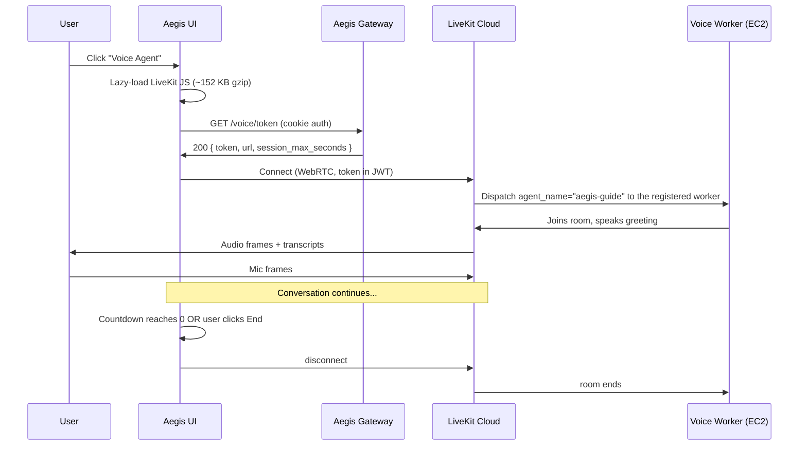

# UI integration

*How the Voice Guide is embedded into the Aegis UI. One navbar button, one full-viewport overlay, one short-lived JWT minted by the gateway. The user clicks once, allows the microphone, and is talking to the worker on the sibling EC2 within seconds.*

This page documents the Aegis-UI-side integration. The agent process itself, the RAG pipeline, the LLM strategy, and the AWS topology live in the other pages of this section.

## Why integrate into the Aegis UI

Earlier drafts targeted a separate domain (`voice.aegisagent.in`) hosted on Vercel with a custom Next.js frontend. That spec still lives in `voice-agent/domain.md` for reference. The Aegis-UI integration is the chosen path because:

- One URL — reviewers don't have to remember a second domain.
- Already authenticated — every logged-in user gets the button; no second login.
- Already HTTPS via the ALB cert — `getUserMedia` works without any extra TLS work.
- One deploy pipeline — UI changes ship via the same tar → S3 → SSM flow as the rest of the Aegis UI.
- The voice agent presents as a *feature of Aegis* rather than a side demo.

The trade-off is that the Voice Guide is gated by the Aegis login. An interviewer needs a credential to try it. For portfolio demos the operator hands out the demo (VIEWER) account; for self-hosted installs the operator decides who is allowed.

## The button

Source: `ui/src/components/VoiceAgent/VoiceAgentButton.jsx`. Wired into `ui/src/components/Layout/Topbar.jsx` as the first item in the right-side cluster, before the SSE indicator.

Visual treatment:

- Lucide `Mic` icon with a soft blue/purple gradient halo (`bg-gradient-to-r from-blue-500/[0.08] to-purple-500/[0.08]`).
- Bold "Voice Agent" label so it reads as a feature, not an icon-only utility.
- Small `LIVE` pill (blue, uppercase, tracked) so the user knows it's a real-time surface.
- Hidden below the `sm` breakpoint — the panel needs the desktop layout to render the orb + transcript side-by-side.

The button itself does almost nothing. It lazy-loads the panel (`React.lazy(() => import('./VoiceAgentPanel'))`) and toggles open state. The full LiveKit JS bundle — ~152 KB gzipped — only downloads when the button is clicked, so the main bundle stays unchanged for users who never touch it.

## The panel

Source: `ui/src/components/VoiceAgent/VoiceAgentPanel.jsx`. Portal-rendered into `document.body`, following the [canonical z-index hierarchy](../architecture/ui-primitives.md): the panel sits at `z-[70]`, above modals (60) and below toasts (80).

Layout:

```
┌──────────────────────────────────────────────────────────────────┐
│                                                            [✕]   │
│                                                                  │
│            ╭───────────────────╮                                 │
│            │                   │     ┌─── Live Transcript ───┐   │
│            │  ANIMATED ORB     │     │ Deepgram · Cartesia   │   │
│            │  (audio-reactive) │     │     [● Recording]     │   │
│            │                   │     ├───────────────────────┤   │
│            ╰───────────────────╯     │                       │   │
│                                      │  ┌─ Aegis Guide ─┐    │   │
│            Aegis Voice Guide         │  │ Hey. Aegis…   │    │   │
│                LISTENING             │  └───────────────┘    │   │
│                                      │              ┌──You──┐│   │
│                                      │              │ kill  ││   │
│       [🎤]  [End conversation]       │              │ switch││   │
│            rtt 42ms   2:14           │              └───────┘│   │
│                                      └───────────────────────┘   │
└──────────────────────────────────────────────────────────────────┘
```

Pieces, left to right:

| Piece | Source | Purpose |
|---|---|---|
| Dim overlay | `VoiceAgentPanel.jsx` root | Radial-gradient backdrop + 8 px backdrop blur; takes the user fully out of the regular UI so the voice surface owns attention |
| Close button | top-right | `Esc` also closes; body scroll locked while open |
| Animated orb | `AnimatedOrb.jsx` | Center stage. State-driven hue, audio-reactive amplitude. Details below. |
| State badge | under the orb | `Idle` → `Connecting` → `Listening` → `Thinking` → `Speaking`, color-matched to orb hue with a glowing text-shadow |
| Mute toggle | bottom-left | `Mic` / `MicOff` icon. Red background when muted. |
| End call | center bottom | Big red button with pulsing dot. Closes the room cleanly. |
| RTT badge | bottom row, mono | Sampled once per second from `room.engine.publisher.getStats()` — the candidate-pair RTT |
| Session countdown | bottom row, mono | 5:00 → 0:00. Green default, amber under 60 s, red under 30 s. Auto-closes at 0. |
| Transcript stream | right panel | User bubbles right-aligned in white, agent bubbles left-aligned in blue. Auto-scrolls. Empty-state hint with example prompts. |

The panel hides the transcript on viewports below the `md` breakpoint so the orb stays usable on tablet-class screens.

## The animated orb

Source: `ui/src/components/VoiceAgent/AnimatedOrb.jsx`. Canvas-based, not React-rendered — the animation runs at 60 fps via `requestAnimationFrame` and never triggers React re-renders. Audio reactivity comes from a `Uint8Array` time-domain sample of the active analyser, smoothed with a single-pole IIR.

Layers, drawn each frame:

1. **Outer halo glow** — radial gradient extending ~60 px past the orb, hue-shifted from the state palette.
2. **Three concentric wobbling rings** — non-circular ellipses driven by a parametric `sin(a * 5 + phase)` wobble, amplitude-respond to the smoothed audio level.
3. **Core orb** — radial gradient from the state palette's saturated mid to a darker edge, with a top-left highlight at ~45% opacity (the ChatGPT pearlescent look).
4. **Audio-reactive shimmer ring** — only drawn when the smoothed audio level exceeds 0.05; sits just outside the core.
5. **Thinking-state particle ring** — six orbiting dots when `state === 'thinking'`.

State palette:

| State | Hue (HSL) | Saturation | Name shown |
|---|---|---|---|
| `idle` | 200° | 30% | Idle |
| `connecting` | 220° | 70% | Connecting |
| `listening` | 200° | 100% | Listening |
| `thinking` | 280° | 80% | Thinking |
| `speaking` | 180° | 100% | Speaking |
| `error` | 0° | 80% | Error |

The audio level fed into the orb is `max(mic_level, agent_level)` — so the orb pulses with whoever is speaking. Both signals are sampled from `MediaStreamTrack` analyser nodes built on the LiveKit participants' audio tracks.

## Backend bridge

The browser cannot reach the voice-agent EC2 directly — the EC2 has no inbound port. Two endpoints on the Aegis gateway broker the handshake:

| Endpoint | Method | What it returns |
|---|---|---|
| `/voice/token` | GET | Signed 5-min LiveKit JWT with `RoomAgentDispatch(agent_name="aegis-guide")`, plus the LiveKit URL, the room name, the caller identity, and `session_max_seconds` for the UI countdown |
| `/voice/status` | GET | `{ configured: bool, agent_name: string }` — used by the UI to decide whether to render the button as live or hide it |

Source: `services/gateway/routers/voice.py`. Routes are added to `_MANAGEMENT_PATH_PREFIXES` in the gateway middleware so the execute-path validation doesn't intercept them. Nginx at `ui/nginx.conf` proxies `/voice/*` to the gateway like every other backend path.

Token shape (response body):

```json
{
  "success": true,
  "data": {
    "token":               "eyJhbGc...",
    "url":                 "wss://testing123-eh0rzn3u.livekit.cloud",
    "room":                "aegis-voice-2eaf7dab8f06",
    "identity":            "user-4ad4f4bc-486d6f",
    "agent_name":          "aegis-guide",
    "expires_in":          300,
    "session_max_seconds": 300
  }
}
```

The identity carries the authenticated user's ID prefix (`actor` from `request.state`) so the agent's per-turn logs can attribute the conversation. The token never exposes the API secret to the browser — the gateway holds `LIVEKIT_API_KEY` and `LIVEKIT_API_SECRET` in its environment (sourced from the same Secrets Manager entries the worker reads).

## Session lifecycle



The first turn after the EC2 was idle is slow — the worker is registered, but the per-Job Python process spawns on-demand (`num_idle_processes=0`), and Silero + turn-detector + MiniLM + cross-encoder all load before the first reply. Expect ~10–20 seconds before the greeting on a cold dispatch. Subsequent dispatches within the same boot reuse a warm process.

If the EC2 is stopped (auto-stop fired) when the user clicks the button, the token endpoint still returns 200 — there is no upstream "is the worker registered" check on every click. The user will see the orb sit at `Connecting` indefinitely. The fix is to start the EC2 via `voice-agent/infrastructure/scripts/start.sh` and retry. A future enhancement is to surface an explicit "warming up — wait ~90 s" state in the UI by adding a worker-registration probe.

## Session timeout — defense in depth

The conversation has a hard 5-minute cap. Three layers enforce it, on the principle that any one of them can fail without runaway cost:

1. **Gateway** — `TOKEN_TTL_SECONDS = 300` in `services/gateway/routers/voice.py`. After 5 minutes the JWT itself is invalid; the LiveKit Cloud reject anything attempting to reuse it.
2. **Agent** — `SESSION_MAX_SECONDS = 300` (env-configurable as `AEGIS_SESSION_MAX_SECONDS`) in `voice-agent/agent/src/agent.py`. An asyncio guard awaits the timeout, then has the agent say *"time's up — disconnecting to keep costs bounded"* and calls `session.aclose()` cleanly.
3. **UI** — a `setInterval`-driven countdown in `VoiceAgentPanel.jsx` ticks 1 s at a time, turns amber at 60 s, red at 30 s, auto-closes at 0. Visible to the user so the cap is not a surprise.

A reviewer who needs more time clicks the button again and gets a fresh 5-minute session. This is intentional — the cap caps the *unit of cost*, not the number of conversations.

## Lazy-loading and bundle impact

The Voice Agent button is the only entry point that requires the LiveKit JS bundle. Loading that bundle eagerly would add ~152 KB gzipped to every UI page load, which is wasteful for the ~60% of sessions that never touch the voice feature.

The implementation:

```jsx
// VoiceAgentButton.jsx
const VoiceAgentPanel = lazy(() => import('./VoiceAgentPanel'))

return open && (
  <Suspense fallback={null}>
    <VoiceAgentPanel open={open} onClose={...} />
  </Suspense>
)
```

Vite splits this into a separate chunk (`VoiceAgentPanel-*.js`, ~568 KB raw / ~152 KB gzipped). The chunk loads on first click; subsequent opens are instant.

For the first-click experience the panel briefly renders its `LoadingState` (the orb in `connecting` palette + the line *"Minting LiveKit token…"*) while the JS chunk downloads and the gateway returns the token. On a typical broadband connection both finish in under 500 ms.

## A11y and keyboard

- The button carries an explicit `aria-label="Open Aegis Voice Guide"` and a tooltip.
- The panel is `role="dialog"` with `aria-modal="true"`. Focus is not trapped today — a planned hardening; the existing modal primitives in `Common/Modal.jsx` show the pattern (focus trap + scroll lock + Escape handler).
- `Escape` closes the panel from any sub-element.
- The animated orb is `aria-hidden="true"` — it's decoration; the textual state badge is the screen-reader signal.

## What it looks like in numbers

After a full session through the navbar integration:

| Metric | Source | Value |
|---|---|---|
| First-click → token issued | Gateway `/voice/token` | ~50–100 ms |
| Token issued → LiveKit room open | LiveKit Cloud | ~200–400 ms |
| Cold dispatch → worker greeting | Voice-agent EC2 | ~10–20 s (model load) |
| Warm dispatch → worker greeting | Voice-agent EC2 | ~1–2 s |
| User-stops → agent-starts | end-to-end | ~1.3 s p50 (in-region) |
| Per-turn LLM TTFT | Groq | ~400–540 ms |
| RAG latency per turn | EC2 (BM25 + dense + rerank) | ~120 ms |
| Session hard cap | enforced at 3 layers | 5:00 minutes |

## Where to read next

- [Overview](_index.md) — the architectural shape this UI sits inside
- [RAG and LLM strategy](rag-and-llm.md) — what the worker does between hearing the question and emitting the answer
- [Deployment and operations](deployment.md) — the AWS topology, secrets, cost model
- [UI Primitives](../architecture/ui-primitives.md) — the canonical z-index hierarchy this panel sits in, the portal/focus-trap pattern, the broader Common/ inventory
