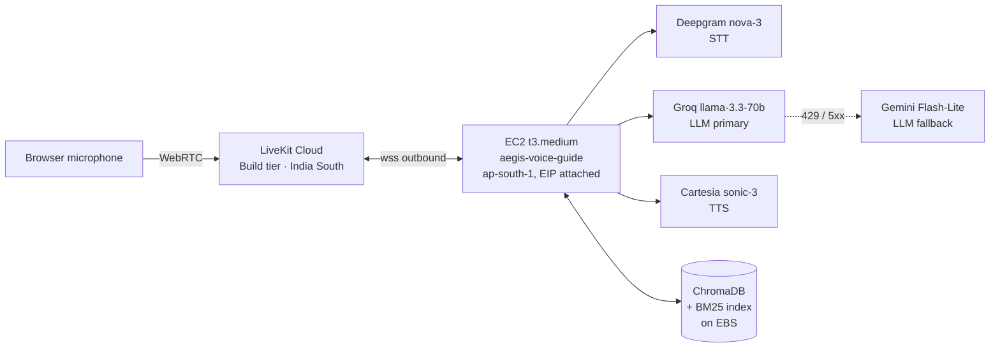

# Voice Guide

*A voice-driven question-answering interface to the Aegis documentation. A user speaks; the agent transcribes, retrieves the most relevant chunks via hybrid RAG, reasons with a hosted LLM, and replies in synthesized speech. Deployed alongside the platform as a first-class feature.*

## Business purpose

The Aegis platform is dense — eleven-stage middleware, an ed25519-signed audit chain, twenty-plus services. Onboarding a new operator, demoing the platform to a stakeholder, or answering a customer's "how does the kill switch work" without context-switching to docs is friction worth removing.

The Voice Guide closes that gap. It is a spoken interface to the same `docs/` tree that powers this GitBook. A reader who would otherwise have to skim three pages can ask the question aloud and get a forty-second answer that quotes the source verbatim and tells them which doc section it came from.

It is **not** an Aegis decision surface. The Voice Guide cannot engage the kill switch, mutate a tenant, or override a policy. It reads the documentation corpus and reasons over it. Every action that mutates platform state still goes through the gateway with a human-issued JWT.

## Locked architectural decisions

The decisions in the table below are LOCKED as of 2026-06-01. Each was made deliberately against alternatives that were considered and rejected; the rationale is preserved in `voice-agent/agent/AGENT_V2.md` §9.

| Decision | Choice | Why |
|---|---|---|
| Pipeline | Chained STT → LLM → TTS | Standard voice-agent shape; RAG needs the text seam between STT and LLM |
| Compute host | AWS EC2 `t3.medium` (Ubuntu 24.04, 2 vCPU, 4 GB) in `ap-south-1` | Sufficient when the LLM is hosted; ~$30/mo if 24/7, ~$15–25/mo with start/stop |
| LLM hosting | Hosted Groq (primary) + Gemini (fallback) | No GPU bill, no model serving operations, free tier covers portfolio volume |
| LLM primary | Groq `llama-3.3-70b-versatile` | ~200 ms TTFT in-region; 12 k TPM cap is the binding constraint, mitigated by chat-history truncation |
| LLM fallback | Gemini 2.5 Flash-Lite | Free emergency fallback when Groq returns 429; routed via LiveKit's `FallbackAdapter` |
| STT | Deepgram `nova-3` with `keyterm` boosting for Aegis vocabulary | Streaming partials, low latency, materially better recognition of "kill switch" and "tamper-evident" |
| TTS | Cartesia `sonic-3` | ~150 ms TTFB observed in-region |
| Turn detection | Silero VAD + LiveKit `MultilingualModel` (ONNX, q8 quantized) | Semantic end-of-utterance prediction; eliminates the v1 turn-taking jitter |
| Retrieval | Hybrid BM25 + dense (`all-MiniLM-L6-v2`) + cross-encoder rerank (`ms-marco-MiniLM-L-6-v2`) | Sparse catches exact-keyword queries; dense catches paraphrases; the cross-encoder rerank gives precision. All CPU. |
| Vector store | ChromaDB persistent on EBS | Embedded, no service to run, ~1700 chunks query in <30 ms |
| Transport | LiveKit Cloud "Build" tier (free) | Global SFU is out of scope. The Build tier has a hard cap (1,000 agent-minutes/mo, 5 concurrent sessions), which is preferable to a metered bill |
| Persona | Senior cybersecurity engineer, no nanny disclaimers, contractions, short sentences | Defined in `voice-agent/agent/persona/Modelfile` (Ollama syntax) |

## Topology at a glance

The Voice Guide is one EC2 instance plus four hosted APIs, fronted by LiveKit Cloud. The browser never talks to the EC2 box directly — there are no inbound HTTP/WebRTC ports open on the worker. Every data path is outbound from the EC2's perspective.



**Worker registration.** The agent process runs as a systemd unit on the EC2, opens a persistent WebSocket to LiveKit Cloud, and registers under `agent_name="aegis-guide"`. When a browser session arrives with a JWT containing `RoomAgentDispatch(agent_name="aegis-guide")`, LiveKit Cloud routes the room to this worker.

**No inbound ports.** The EC2 security group permits SSH from a single `/32` and nothing else. All third-party APIs are reached over outbound HTTPS. This is the same fail-closed posture the Aegis gateway uses for tenant access — the worker has zero public attack surface.

## Component inventory

| Component | Version | Where it runs | Source of truth |
|---|---|---|---|
| LiveKit Agents SDK | `livekit-agents ~=1.5` (1.5.15 in production) | EC2 worker process | `voice-agent/agent/pyproject.toml` |
| Deepgram STT | nova-3, `keyterm` boosting active | hosted, called from EC2 | `voice-agent/agent/src/agent.py:198-201` |
| Cartesia TTS | sonic-3, default voice | hosted, called from EC2 | `voice-agent/agent/src/agent.py:203` |
| Silero VAD | bundled ONNX | EC2 (CPU) | `voice-agent/agent/src/agent.py:204` |
| Turn detector | `livekit/turn-detector` v0.4.1-intl, q8 quantized | EC2 (CPU) | `voice-agent/agent/src/agent.py:205` |
| Groq LLM | `llama-3.3-70b-versatile` via OpenAI-compatible endpoint | hosted | `voice-agent/agent/src/agent.py:134-147` |
| Gemini LLM | `gemini-2.5-flash-lite` via OpenAI-compatible endpoint | hosted, fallback only | `voice-agent/agent/src/agent.py:150-158` |
| Embedding model | `sentence-transformers/all-MiniLM-L6-v2` (384-dim) | EC2 (CPU) | `voice-agent/agent/src/rag.py:26` |
| Cross-encoder reranker | `cross-encoder/ms-marco-MiniLM-L-6-v2` | EC2 (CPU) | `voice-agent/agent/src/rag.py:27` |
| Vector store | ChromaDB ≥0.5 persistent client | EC2 EBS | `voice-agent/agent/src/rag.py:55-63` |
| BM25 | `rank-bm25 0.2.2`, pickled `BM25Okapi` | EC2 EBS | `voice-agent/agent/src/rag.py:87-93` |
| Persona | Ollama Modelfile syntax | `voice-agent/agent/persona/Modelfile` | `voice-agent/agent/src/modelfile.py` parser |
| Infrastructure | Terraform 1.5+, ~17 resources | AWS `ap-south-1`, single instance | `voice-agent/infrastructure/*.tf` |
| Secrets | AWS Secrets Manager, 7 entries under `aegis-voice-guide/*` | hosted | `voice-agent/infrastructure/secrets.tf` |

## One voice turn, end to end

Approximate timings from session `console-54fc835b` on 2026-06-01 (E2E p50 1,308 ms, LLM TTFT 539 ms).

```
t=0 ms     User speaks: "what is the kill switch?"
t=~150     Browser → LiveKit Cloud → worker (DTLS-SRTP over UDP)
t=~200     Silero VAD detects speech start; frames stream to Deepgram
t=~400     Deepgram emits first partial transcript
t=~900     MultilingualModel turn detector sees the pause, closes the turn
t=~1000    Final transcript: "what is the kill switch"
t=~1010    on_user_turn_completed hook truncates history to 8 items (TPM safety)
t=~1015    LLM invoked; system prompt directs `search_aegis_docs(query="kill switch behavior")`
t=~1020    Hybrid RAG runs in-process: BM25 + dense + cross-encoder rerank (~120 ms)
t=~1140    Tool result returned to the LLM
t=~1540    Groq emits first token (TTFT 400–540 ms)
t=~1540    Cartesia begins synthesizing
t=~1690    First audio frame arrives at the browser. User hears the answer.
```

End-to-end (user-stops-talking → agent-starts-talking) sits around **1.3 s p50** in-region. The biggest variable is Groq TTFT, which dominates as the chat context grows — handled by the truncation hook.

If the user begins speaking again while the agent is mid-response, the LiveKit framework applies the interruption rules: `min_interruption_duration=0.6s`, `min_interruption_words=2`, `false_interruption_timeout=1.5s`. A single "yeah" or throat-clear does not interrupt; "stop please" does.

## What lives where

The Voice Guide repo is a sibling of the Aegis core, intentionally separate so its deployment cadence and dependencies do not interact:

```
voice-agent/
├── README.md           Run-locally + run-on-EC2 instructions
├── diagram.md          The exhaustive architecture document; sub-pages here pull from it
├── domain.md           Custom-domain integration spec (Vercel option, AWS option, EC2 option)
├── agent/
│   ├── AGENT_V2.md     The build contract — the locked decisions and the why
│   ├── pyproject.toml
│   ├── src/
│   │   ├── agent.py    The LiveKit Job entrypoint, ~230 LOC
│   │   ├── rag.py      Hybrid retrieval + reranker, ~150 LOC
│   │   ├── ingest.py   Walks docs/**/*.md, chunks, builds both indexes
│   │   └── modelfile.py  Tiny Ollama Modelfile parser
│   └── persona/Modelfile  Single source of truth for system prompt + generation params
└── infrastructure/      Terraform — VPC use, SG, IAM, secrets, EC2, EIP, log group, billing alarm, auto-stop Lambda
    ├── *.tf             ~17 resources
    └── scripts/         start.sh, stop.sh, status.sh, deploy.sh, ssh.sh
```

The doc folder under `voice-agent/docs/` mirrors the Aegis main docs and is used by the Voice Guide as its RAG corpus. The user re-runs `uv run src/ingest.py` after any doc edit to rebuild both indexes.

## Where to read next

- [RAG and LLM strategy](rag-and-llm.md) — how hybrid retrieval and the FallbackAdapter actually work, why `top_n=3`, the TPM-budget math
- [Deployment and operations](deployment.md) — the AWS resources Terraform creates, secrets handling, systemd unit graph, cost model, failure modes
- [Voice Agent build contract](https://github.com/Abhi-mishra998/aegis/blob/main/voice-agent/agent/AGENT_V2.md) — the original locked-decision document in the agent repo
- [Voice Agent architecture diagram](https://github.com/Abhi-mishra998/aegis/blob/main/voice-agent/diagram.md) — the exhaustive 657-line architecture reference these pages summarize

## What this section does NOT cover

- **A custom-domain frontend at `voice.aegisagent.in`.** The spec lives in `voice-agent/domain.md` (Vercel option, AWS-native option, nginx-on-EC2 option). The frontend itself is not yet built; the operator path today is the LiveKit Playground URL or — soon — an embedded mic button in the Aegis UI navbar.
- **Self-hosted LLM / STT / TTS for data sovereignty.** The current design routes voice frames through Deepgram, Cartesia, Groq, and (occasionally) Gemini. For a deployment where prompts cannot leave a private cloud, this is the wrong architecture; see `voice-agent/diagram.md` §13.4 for the self-hosted alternative path that was explored and rejected on cost.
- **Production-grade HA.** Single EC2, single region, no failover. The Voice Guide is sized for a portfolio demo and small-team internal use, not for paying customers. Capacity expectations are documented in [Deployment](deployment.md).
